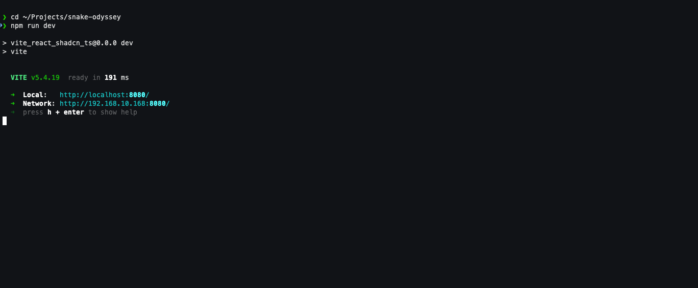
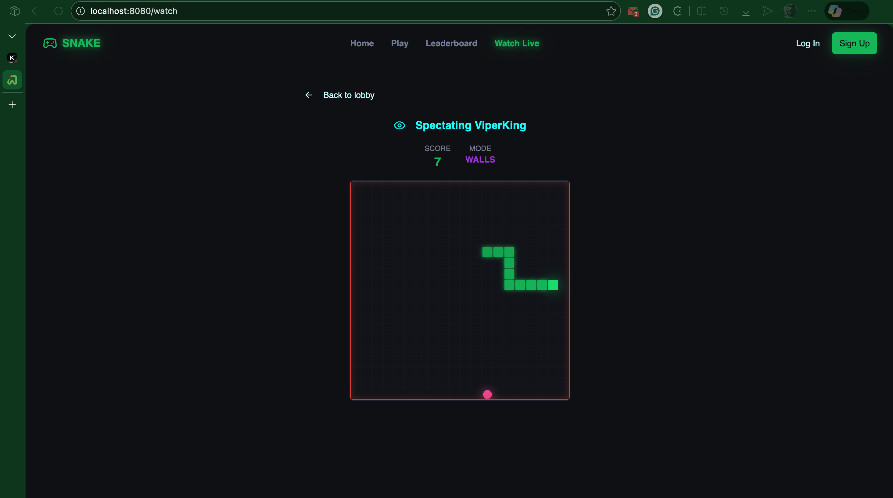
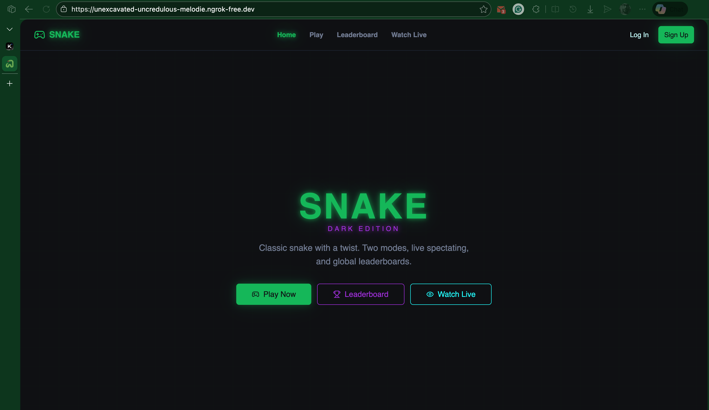
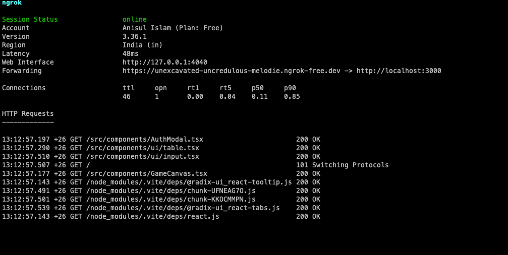

# Assignment - 01
## Part A: Theoretical Questions

>**_1.  Explain what DevOps Engineering is. How does it differ from traditional development and operations roles?_**

**Answer:**  DevOps Engineering bridges software development and IT operations, emphasizing **collaboration, automation, and shared ownership** throughout the application lifecycle. Unlike traditional roles where developers "throw code over the wall" to separate operations teams, DevOps engineers work across the full pipeline—from code commit through build, test, deployment, and monitoring.

**Key differences:**
- **Traditional:** Siloed teams with conflicting goals (speed vs. stability), manual handoffs, and "works on my machine" mentality
- **DevOps:** Cross-functional teams using Infrastructure as Code, CI/CD pipelines, and observability to achieve both rapid delivery *and* reliable systems

DevOps applies systems thinking to organizational workflows, treating infrastructure as code and operations as a software engineering discipline rather than a cost center.

>**_2. Describe how DevOps fits into the Software Development Life Cycle (SDLC). Mention at least three SDLC phases where DevOps adds value._**

**Answer:** DevOps transforms the SDLC from a linear waterfall into a continuous feedback loop. It adds value across all phases:
- **Planning**: DevOps introduces infrastructure cost estimation and feasibility analysis early, preventing "build now, deploy never" scenarios.
- **Development**: Local environment parity with production via containers/IaC eliminates "works on my machine" issues.
- **Testing**: Automated CI pipelines provide immediate feedback, while shift-left security integrates scanning into unit testing.
- **Deployment**: Continuous Delivery automates releases, reducing deployment risk from "big bang" events to routine, reversible operations.
- **Maintenance**: Observability and automated remediation replace reactive firefighting with proactive system management, completing the feedback loop into planning.


>**_3. What values does a DevOps Engineer bring to an organization? Explain any four values with examples._**

**Answer:** DevOps Engineers deliver transformative organizational value through four core contributions:

**1. Accelerated Delivery**
By automating CI/CD pipelines and eliminating manual handoffs, DevOps engineers reduce deployment lead times from weeks to hours. *Example:* Implementing blue-green deployments allows zero-downtime releases, enabling teams to deploy 50x more frequently with 440x faster recovery from failures (DORA metrics).

**2. Enhanced Reliability**
Through Infrastructure as Code and automated testing, systems become predictable and reproducible. *Example:* Terraform-managed infrastructure ensures staging and production environments are identical, eliminating configuration drift that causes 70% of production incidents.

**3. Cost Optimization**
Rightsizing resources, automating scaling, and reducing waste through observability. *Example:* Implementing auto-scaling policies and spot instance usage can reduce AWS compute costs by 60-90% while maintaining performance SLAs.

**4. Security Integration (DevSecOps)**
Embedding security scanning into pipelines prevents vulnerabilities from reaching production. *Example:* Integrating Trivy container scanning into CI blocks deployments with critical CVEs, reducing security incident response time from days to minutes through automated detection and remediation workflows.

>**_4. Why is prior Software Engineering (SWE) experience considered helpful before becoming a DevOps Engineer?_**

**Answer:** Prior Software Engineering experience accelerates DevOps success through four foundational advantages:

**1. Code-Level Thinking**
SWEs understand version control, testing patterns, and refactoring—directly applicable to Infrastructure as Code and pipeline development. Writing maintainable Terraform modules requires the same abstraction skills as designing software libraries.

**2. Debugging Methodology**
Systematic troubleshooting of application bugs translates to diagnosing infrastructure failures, distributed system issues, and pipeline breakages using identical root-cause analysis techniques.

**3. Collaboration Fluency**
Experience working with product managers, designers, and QA enables DevOps engineers to bridge technical and business concerns—critical when negotiating deployment trade-offs or explaining reliability investments to leadership.

**4. Architectural Intuition**
Understanding microservices, APIs, and data flows helps design appropriate deployment strategies, observability schemes, and scaling policies that match application actual needs rather than generic templates.

SWE experience transforms DevOps from infrastructure scripting into genuine systems engineering.

>**_5. Explain why networking knowledge (DNS, ports, protocols, IP addressing) is important for DevOps roles._**

**Answer:** Networking knowledge is essential for DevOps engineers because infrastructure automation and system reliability depend on connectivity architecture. Four critical applications:

**1. Cloud Architecture Design**
Understanding VPCs, subnets, and routing tables enables proper isolation of public/private resources. Misconfigured security groups or NACLs create security vulnerabilities or service outages that automation cannot fix.

**2. Service Discovery & Communication**
Microservices rely on DNS, load balancers, and service meshes. DevOps engineers must configure internal DNS (Route53), manage port allocations, and troubleshoot connection failures between containerized services.

**3. Debugging Connectivity Issues**
When pipelines fail or applications timeout, network-layer diagnosis distinguishes between code bugs, infrastructure misconfiguration, and external dependency failures—reducing mean-time-to-resolution.

**4. Security Implementation**
Knowledge of TLS/SSL, certificate management, and protocol security (HTTPS vs HTTP, SSH key management) ensures encrypted data transit and compliance requirements are met through automated policy enforcement.

Without networking fundamentals, DevOps engineers cannot design resilient, secure, or observable systems regardless of their automation expertise.

>**_6. What soft skills are essential for a DevOps Engineer? Explain how these skills help during incidents or failures._**

**Answer:** Four essential soft skills distinguish effective DevOps engineers during high-pressure incidents:

**1. Communication Clarity**
Translating technical complexity into business impact for stakeholders. *During incidents:* Precise status updates prevent panic, align response teams, and manage customer expectations without technical jargon that delays decisions.

**2. Collaborative Problem-Solving**
Breaking down silos between development, security, and operations. *During incidents:* Facilitating blameless postmortems ensures root-cause analysis focuses on system improvements rather than finger-pointing, preventing recurrence.

**3. Emotional Resilience**
Maintaining composure under production pressure and ambiguous failure modes. *During incidents:* Calm decision-making prevents hasty fixes that worsen outages; steady leadership stabilizes cross-functional response teams.

**4. Systems Thinking**
Viewing incidents as emergent properties of complex interactions rather than isolated failures. *During incidents:* Identifying hidden dependencies and second-order effects prevents "fixing" symptoms while missing underlying architectural fragility.

These skills transform technical capability into organizational reliability when systems fail unpredictably.

>**_7. Explain the importance of patience and troubleshooting mindset in DevOps with a real-life example._**

**Answer:** Patience and systematic troubleshooting distinguish DevOps engineers during complex, ambiguous failures where automation alone cannot resolve issues.

**Real-life example: Intermittent microservices timeout**

A production checkout service sporadically fails with 30-second timeouts, occurring only during peak traffic and never in staging. Initial automated alerts suggest database connection pool exhaustion.

**Without patience:** Engineer immediately increases pool size, deploys fix, observes temporary improvement, then faces cascading memory exhaustion as connections accumulate unclosed.

**With troubleshooting mindset:**
1. **Hypothesis formation:** Correlates timeout timing with downstream payment API latency spikes
2. **Methodical isolation:** Uses distributed tracing (Jaeger) to identify synchronous blocking calls
3. **Root discovery:** Payment service's DNS resolution degrades under load due to misconfigured TTL
4. **Systemic fix:** Implements async circuit breaker pattern and fixes DNS caching

**Outcome:** Resolution addresses actual architectural fragility rather than symptom, preventing future cascading failures. Patience prevented the "fix and forget" cycle that perpetuates technical debt.

This mindset treats incidents as learning opportunities rather than interruptions, building organizational resilience through understanding rather than patching.


***
## Part B: Scenario-Based Questions

>**_1. A new student joins a DevOps course but is unfamiliar with GitHub and cloud platforms. How would you onboard this student efficiently using tools, documentation, and communication channels?_**

**Answer:** Efficient onboarding requires structured progression through three phases:

**Phase 1: Foundational Setup (Week 1)**
- **Tools:** GitHub Learning Lab interactive tutorials for version control basics; AWS Free Tier account with cost alerts
- **Documentation:** Curated path: GitHub Hello World → AWS Console navigation → IAM security best practices
- **Communication:** Dedicated Slack channel with daily check-ins; paired with peer mentor for environment troubleshooting

**Phase 2: Guided Application (Week 2-3)**
- **Tools:** CloudFormation or Terraform tutorials in AWS sandbox; GitHub Actions starter workflows
- **Documentation:** Internal wiki with annotated architecture diagrams; troubleshooting runbook for common errors
- **Communication:** Weekly 1:1s with instructor; async Q&A via Stack Overflow for Teams to build searchable knowledge base

**Phase 3: Independent Practice (Week 4+)**
- **Tools:** Personal project scaffolding with pre-built templates; sandbox environments for safe experimentation
- **Documentation:** Self-service labs with progressive difficulty; "show your work" requirement for complex tasks
- **Communication:** Peer code reviews; incident simulation exercises to practice communication under pressure

**Key principle:** Front-load environment complexity to prevent technical blockers from consuming learning bandwidth later.

>**_2. During a production deployment, an application goes down unexpectedly. As a DevOps Engineer, describe step-by-step how you would troubleshoot and handle the situation._**

**Answer:** Systematic incident response follows five phases:

**1. Detection & Triage (0-5 minutes)**
- Acknowledge alert, verify severity via monitoring dashboards (CloudWatch, Datadog)
- Form #incident-war-room Slack channel, notify on-call rotation
- **Decision:** Rollback or forward-fix? If blast radius expanding → immediate rollback

**2. Stabilization (5-15 minutes)**
- Execute automated rollback via CI/CD pipeline or infrastructure as code revert
- Verify service restoration through synthetic monitoring and error rate dashboards
- **Communication:** Post initial status page update, customer notification if SLA-impacting

**3. Investigation (15-60 minutes)**
- Collect timeline: deployment commit, configuration changes, infrastructure events
- Correlate logs, metrics, traces to identify failure point (e.g., database connection spike post-deployment)
- Preserve evidence: snapshot failed pods, capture thread dumps before cleanup

**4. Resolution & Verification (1-4 hours)**
- Deploy fix to staging, validate through automated test suite
- Gradual production rollout with canary deployment, monitoring golden signals (latency, errors, traffic, saturation)
- Confirm resolution via business metrics (checkout completion, login success rates)

**5. Post-Incident (24-72 hours)**
- Facilitate blameless postmortem with timeline, root cause, and action items
- Update runbooks, add automated detection for similar failure modes
- **Communication:** Publish incident report to stakeholders, schedule follow-up reviews

**Throughout:** Document decisions in real-time, prioritize customer impact over root-cause perfection during active incident.

>**_3. Your team releases features frequently, but system stability is decreasing. How can DevOps practices help balance speed and reliability?_**

**Answer:** DevOps practices restore balance through four integrated strategies:

**1. Progressive Delivery**
Replace big-bang deployments with canary releases, feature flags, and blue-green deployments. *Implementation:* Route 5% traffic to new version, monitor error rates for 30 minutes, then auto-promote or rollback. This contains blast radius while maintaining deployment velocity.

**2. Automated Quality Gates**
Embed SLO-based verification in CI/CD pipelines. *Implementation:* Block deployments if latency p99 exceeds 200ms or error rate >0.1% in staging. Speed becomes safe through automated enforcement, not manual checkpoints.

**3. Error Budgets**
Quantify acceptable risk—if SLO is 99.9% availability, monthly error budget is 43 minutes. *Implementation:* Freeze feature releases when budget depleted, prioritizing reliability work. Product and engineering share accountability through data-driven trade-offs.

**4. Observability-Driven Development**
Instrument code with distributed tracing and custom metrics before deployment. *Implementation:* Compare production behavior against baseline automatically; anomalies trigger immediate rollback without human judgment delays.

**Integration:** These practices transform speed-vs-reliability from competing priorities into complementary feedback loops—frequent small changes enable faster detection and recovery, while automation ensures each change meets reliability standards before reaching users.

>**_4. A team struggles with communication during incidents because members are distributed. How can proper onboarding to communication platforms improve DevOps workflows?_**

**Answer:** Structured onboarding to communication platforms transforms distributed incident response through four capabilities:

**1. Centralized Command**
Standardize on single source of truth (Slack, Microsoft Teams, or Discord) with dedicated incident channels auto-created via PagerDuty/Opsgenie integration. *Onboarding element:* Role-based channel templates—#incident-123-war-room for responders, #incident-123-updates for stakeholders—preventing information overload and cross-talk during critical moments.

**2. Async Context Preservation**
Require threaded discussions with mandatory context headers: **Impact**, **Timeline**, **Current Hypothesis**, **Next Action**. *Onboarding element:* Interactive simulations where new members practice concise status updates; searchable incident history becomes institutional knowledge rather than lost oral tradition.

**3. Integrated Tooling**
Embed monitoring, CI/CD, and collaboration tools directly into chat (Datadog graphs, GitHub deploy buttons, Zoom bridges). *Onboarding element:* Hands-on labs demonstrating single-pane workflow—acknowledging alerts, pulling logs, and escalating—all without context-switching between browser tabs.

**4. Ritual Reinforcement**
Establish communication protocols: 5-minute standups every 30 minutes during SEV-1, explicit handoff procedures for shift changes, post-incident channel archival. *Onboarding element:* Shadowing experienced incident commanders, then role-playing scenarios with feedback on clarity and brevity.

**Outcome:** Distributed teams achieve faster mean-time-to-resolution than co-located teams with poor communication discipline, proving that intentional onboarding outweighs physical proximity.


***

## Part C: Technical / Practical Tasks
### Task 1: Local DevOps Demo Application

>**_1. Run any simple application locally (for example: a basic web server, demo app, or sample project)._**

**Answer**:

**Project Git URL:** [https://github.com/anisul-islam-prog/snake-odyssey](https://github.com/anisul-islam-prog/snake-odyssey)

#### How to run

Follow these steps:

```sh
# Step 1: Clone the repository using the project's Git URL.
git clone https://github.com/anisul-islam-prog/snake-odyssey

# Step 2: Navigate to the project directory.
cd snake-odyssey

# Step 3: Install the necessary dependencies.
npm i

# Step 4: Start the development server with auto-reloading and an instant preview.
npm run dev
```

>**_2. Verify that the application is running successfully on your local machine._**

**Answer**: Verification of running on my local machine


Screenshots:

***



***



***

>**_3. Briefly explain how running applications locally helps in DevOps workflows._**

**Answer**: Local application execution accelerates DevOps workflows through four mechanisms:

**1. Rapid Feedback Loops**
Developers validate changes instantly without waiting for CI pipeline minutes, enabling iterative debugging and faster feature completion.

**2. Environment Parity**
Docker Compose or local Kubernetes (minikube/kind) replicates production topology, catching integration issues—service discovery, networking, configuration—before deployment.

**3. Cost Efficiency**
Eliminates cloud resource consumption during development and testing phases, reducing infrastructure spend significantly.

**4. Offline Productivity**
Enables development during network outages or travel, maintaining velocity independent of cloud connectivity.

**Critical caveat:** Local environments must mirror production through Infrastructure as Code and containerization; otherwise, "works locally" becomes a new category of deployment failures.

### Task 2: Exposing Local Application

>**_1. Use ngrok to expose your local application to the internet._**

**Answer**: Steps to install and use ngrok on macOs:
```sh
# Step-01: Install ngrok using homebrew package manager
brew install --cask ngrok

# Step-02: Connect your ngrok account
ngrok config add-authtoken <YOUR_AUTHTOKEN>

# Step-03: Start an ngrok tunnel to expose a local server, for example, one running on port 80:
ngrok http 80 # You can replace 80 with the port number your local application is using (e.g., 3000 or 8080). 
```

>**_2. Capture the public URL generated by ngrok._**

**Answer**:
URL: https://unexcavated-uncredulous-melodie.ngrok-free.dev

Screenshots:

***



***



***
>**_3. Explain one real-world use case where exposing a local application is useful._**

**Answer**:
            
**Use Case: Webhook Integration Development**

When building a payment processing service that receives asynchronous callbacks from Stripe or PayPal, the application must expose a public HTTPS endpoint that payment providers can reach. Local exposure enables this without deployment.

**Implementation:** Using ngrok or Cloudflare Tunnel, the developer creates a secure public URL (e.g., `https://abc123.ngrok.io/webhooks/stripe`) tunneling to localhost:3000. This allows:

- **Real callback testing:** Stripe sends actual payment confirmation webhooks to the developer's machine, validating signature verification and idempotency logic
- **Rapid iteration:** Modify webhook handler code, restart local server, test immediately—no CI/CD cycle required
- **Debugging visibility:** Full request/response logging, breakpoint debugging, and database inspection during live payment flow simulation

**DevOps integration:** Once validated locally, the identical containerized application deploys to production with confidence that webhook handling works correctly, reducing payment integration defects that historically required hotfixes in production environments.


 