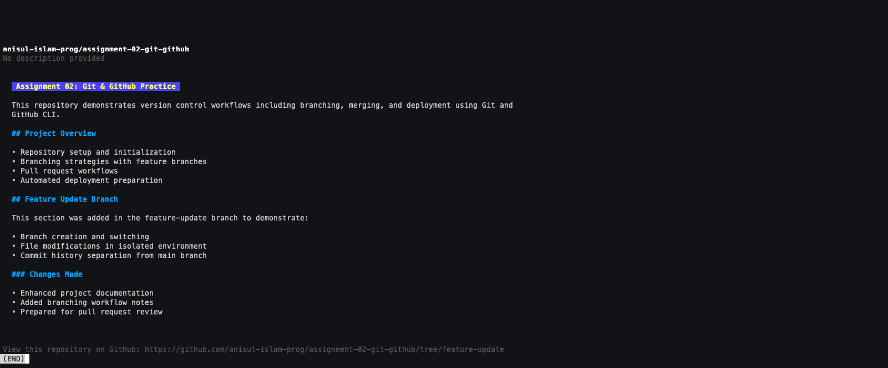
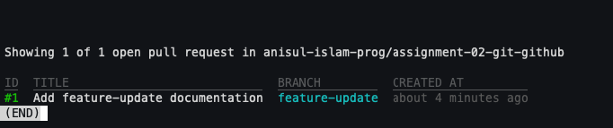
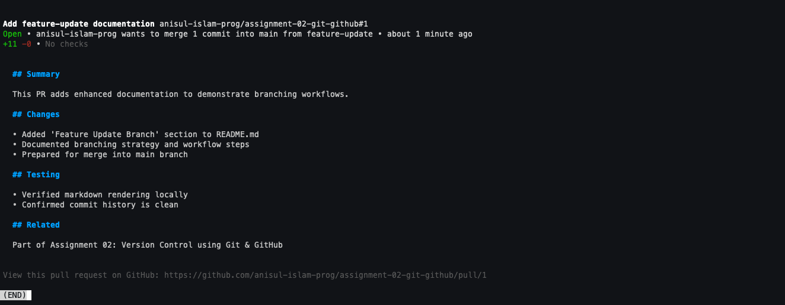
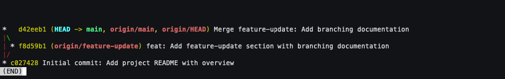
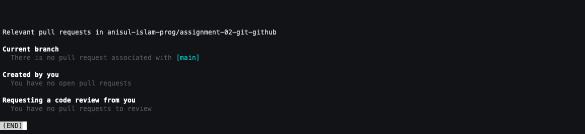
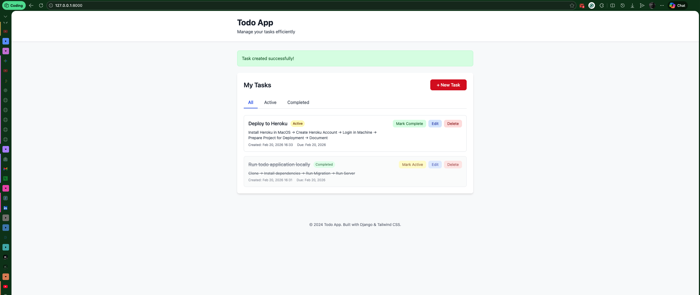
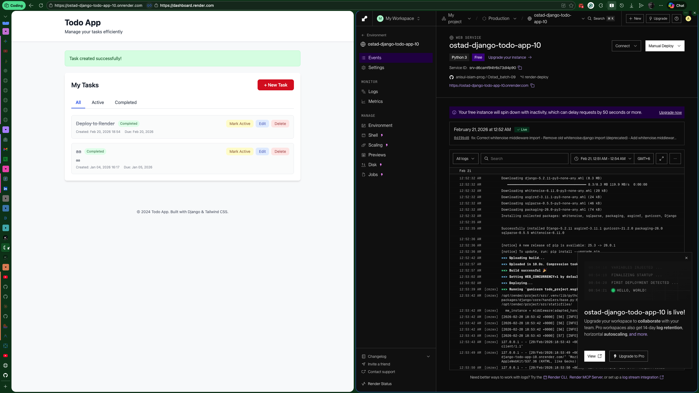

# Assignment - 02

**Topic:** Version Control using Git & GitHub – Repository Setup, Branching, Merging, and Deployment
## Part 1: Set Up a Local Git Repository

1. Create a new folder on your computer for this assignment.

    **Answer**:
```bash
    $ mkdir assignment-02-git-github
    $ cd assignment-02-git-github
```

2. Initialize a new Git repository inside the folder.

    **Answer**:
```bash
    $ git init
    Initialized empty Git repository in /Users/test/Projects/assignment-02-github/.git/
```

3. Create a file named README.md.

    **Answer**:
```bash
    $ touch README.md
```
4. Add a short description of the project in README.md.

    **Answer**:
```bash
    $ echo "# Assignment 02: Git & GitHub Practice

    This repository demonstrates version control workflows including branching, merging, and deployment using Git and GitHub CLI.

    ## Project Overview
    - Repository setup and initialization
    - Branching strategies with feature branches
    - Pull request workflows
    - Automated deployment preparation" > README.md
```

5. Stage the file and commit it with a clear and meaningful commit message.

    **Answer**:
```bash    
    $ git add README.md
    $ git commit -m "Initial commit: Add project README with overview"
    [main (root-commit) c027428] Initial commit: Add project README with overview
    1 file changed, 9 insertions(+)
    create mode 100644 README.md
```    

## Part 2: Create and Connect a GitHub Repository
1. Create a new public repository on GitHub with a suitable name.

    **Answer**:
```bash    
   $ gh repo create assignment-02-git-github --public --source=. --push
    ✓ Created repository anisul-islam-prog/assignment-02-git-github on github.com 
      https://github.com/anisul-islam-prog/assignment-02-git-github
    ✓ Added remote git@github.com:anisul-islam-prog/assignment-02-git-github.git
    Enter passphrase for key '/Users/test/.ssh/id_ed25519':
    Enumerating objects: 3, done.
    Counting objects: 100% (3/3), done.
    Delta compression using up to 8 threads
    Compressing objects: 100% (2/2), done.
    Writing objects: 100% (3/3), 464 bytes | 464.00 KiB/s, done.
    Total 3 (delta 0), reused 0 (delta 0), pack-reused 0 (from 0)
    To github.com:anisul-islam-prog/assignment-02-git-github.git
    * [new branch]      HEAD -> main
    branch 'main' set up to track 'origin/main'.
    ✓ Pushed commits to git@github.com:anisul-islam-prog/assignment-02-git-github.git
```
Alternatively create empty repo first then connect:
```bash
    # Create empty repo on GitHub
    $ gh repo create assignment-02-git-github --public

    # Then manually connect and push
    $ git remote add origin git@github.com:anisul-islam-prog/assignment-02-git-github.git
    $ git push -u origin main
```
2. Connect your local repository to the GitHub repository using:
   
    **Answer**:
```bash
    $ git remote add origin https://github.com/anisul-islam-prog/assignment-02-git-github.git
    $ git remote -v
    origin	git@github.com:anisul-islam-prog/assignment-02-git-github.git (fetch)
    origin	git@github.com:anisul-islam-prog/assignment-02-git-github.git (push)
```

3. Push your local main branch to GitHub.

    **Answer**:
```bash
    $ git push -u origin main
    git push origin -u main
    Enter passphrase for key '/Users/test/.ssh/id_ed25519':
    branch 'main' set up to track 'origin/main'.
    Everything up-to-date
```
## Part 3: Create and Work on a New Branch

1. Create a new branch named feature-update.

    **Answer**:
```bash    
    $ git branch feature-update
```
2. Switch to the feature-update branch.

    **Answer**:
```bash
    $ git switch feature-update
    Switched to branch 'feature-update'
```
Alternative single command:
```bash
    $ git switch -c feature-update
```
3. Do one of the following:

    ○    Edit README.md and add more details

     OR

    ○    Create a new file (e.g., notes.txt) and add some meaningful content.

    **Answer**:
```bash
    echo "
    ## Feature Update Branch
    This section was added in the feature-update branch to demonstrate:
    - Branch creation and switching
    - File modifications in isolated environment
    - Commit history separation from main branch

    ### Changes Made
    - Enhanced project documentation
    - Added branching workflow notes
    - Prepared for pull request review" >> README.md
```

4. Stage and commit the changes on the feature-update branch.

    **Answer**:
```bash
    $ git add README.md
    $ git commit -m "feat: Add feature-update section with branching documentation"
    [feature-update f8d59b1] feat: Add feature-update section with branching documentation
    1 file changed, 11 insertions(+)
```

## Part 4: Push the Branch and Create a Pull Request

1. Push the feature-update branch to GitHub.

    **Answer**:
```bash
    $ git push -u origin feature-update
    Enter passphrase for key '/Users/test/.ssh/id_ed25519':
    Enumerating objects: 5, done.
    Counting objects: 100% (5/5), done.
    Delta compression using up to 8 threads
    Compressing objects: 100% (2/2), done.
    Writing objects: 100% (3/3), 648 bytes | 648.00 KiB/s, done.
    Total 3 (delta 0), reused 0 (delta 0), pack-reused 0 (from 0)
    remote:
    remote: Create a pull request for 'feature-update' on GitHub by visiting:
    remote:      https://github.com/anisul-islam-prog/assignment-02-git-github/pull/new/feature-update
    remote:
    To github.com:anisul-islam-prog/assignment-02-git-github.git
    * [new branch]      feature-update -> feature-update
    branch 'feature-update' set up to track 'origin/feature-update'.
```

2. Open your GitHub repository.

    **Answer**:
```bash
    $ gh repo view --branch feature-update
```


3. Create a Pull Request (PR) from feature-update into main.

    **Answer**:
```bash
    $ gh pr create --title "Add feature-update documentation" --body "## Summary
    This PR adds enhanced documentation to demonstrate branching workflows.

    ## Changes
    - Added 'Feature Update Branch' section to README.md
    - Documented branching strategy and workflow steps
    - Prepared for merge into main branch

    ## Testing
    - Verified markdown rendering locally
    - Confirmed commit history is clean

    ## Related
    Part of Assignment 02: Version Control using Git & GitHub" --base main --head feature-update
    Creating pull request for feature-update into main in anisul-islam-prog/assignment-02-git-github
    https://github.com/anisul-islam-prog/assignment-02-git-github/pull/1
```

4. Write a brief description explaining what changes were made.

    **Answer**:
```bash    
    $ gh pr list
```  

```bash
    $ gh pr view 1
```


## Part 5: Merge and Update Local Repository

1. Merge the Pull Request into the main branch on GitHub.

    **Answer**:
```bash
    $ gh pr merge 1 --merge --delete-branch --subject "Merge feature-update: Add branching documentation"
    ✓ Merged pull request anisul-islam-prog/assignment-02-git-github#1 (Add feature-update documentation)
    Enter passphrase for key '/Users/test/.ssh/id_ed25519':
    remote: Enumerating objects: 1, done.
    remote: Counting objects: 100% (1/1), done.
    remote: Total 1 (delta 0), reused 0 (delta 0), pack-reused 0 (from 0)
    Unpacking objects: 100% (1/1), 900 bytes | 300.00 KiB/s, done.
    From github.com:anisul-islam-prog/assignment-02-git-github
    * branch            main       -> FETCH_HEAD
    c027428..d42eeb1  main       -> origin/main
    Updating c027428..d42eeb1
    Fast-forward
    README.md | 11 +++++++++++
    1 file changed, 11 insertions(+)
    ✓ Deleted local branch feature-update and switched to branch main
    ✓ Deleted remote branch feature-update
```

2. On your local machine:

    ○   Switch back to the main branch.

    ○   Pull the latest changes from GitHub to update your local repository.

    **Answer**:
```bash
    $ git switch main
    Already on 'main'
    Your branch is up to date with 'origin/main'.
    $ git log --oneline --graph
```

```bash
    $ gh pr status
```


> ### Summary
| Step               | Command                                                              |
| ------------------ | -------------------------------------------------------------------- |
| Create folder      | `mkdir assignment-02-git-github && cd assignment-02-git-github`      |
| Init repository    | `git init`                                                           |
| Create file        | `touch README.md`                                                    |
| Add content        | `echo "..." > README.md`                                             |
| Stage & commit     | `git add README.md && git commit -m "..."`                           |
| Create GitHub repo | `gh repo create assignment-02-git-github --public --source=. --push` |
| Add remote         | `git remote add origin <url>`                                        |
| Push to GitHub     | `git push -u origin main`                                            |
| Create branch      | `git branch feature-update`                                          |
| Switch branch      | `git switch feature-update`                                          |
| Edit file          | `echo "..." >> README.md`                                            |
| Commit changes     | `git add README.md && git commit -m "..."`                           |
| Push branch        | `git push -u origin feature-update`                                  |
| Create PR          | `gh pr create --title "..." --body "..."`                            |
| Merge PR           | `gh pr merge 1 --merge --delete-branch`                              |
| Switch to main     | `git switch main`                                                    |
| Pull updates       | `git pull origin main`                                               |


## Part 6: Clone, Run, and Deploy a Todo Application

**Repository to Use**

Students must work with the following existing Todo application repository:

🔗 Repository URL:
https://github.com/latifurrafi/Ostad_batch-09.git

### Step 1: Deploy the Application

Students must deploy the Todo application using any free hosting provider, such as:
   - Render
   - Heroku
   - Vercel (if applicable)
   - Railway
   - Any other free and publicly accessible hosting service

**Answer**:

#### Cloning the repo:

```bash
    # Find SSH link of the repo
    $ gh repo view latifurrafi/Ostad_batch-09 --json sshUrl | grep sshUrl
    {"sshUrl":"git@github.com:latifurrafi/Ostad_batch-09.git"}
    # Fork and clone the repo (Changes can be pushed to forked repo)
    $ gh repo fork git@github.com:latifurrafi/Ostad_batch-09.git --clone=true
    ✓ Created fork anisul-islam-prog/Ostad_batch-09
    Cloning into 'Ostad_batch-09'...
    Enter passphrase for key '/Users/test/.ssh/id_ed25519':
    remote: Enumerating objects: 57, done.
    remote: Counting objects: 100% (24/24), done.
    remote: Compressing objects: 100% (18/18), done.
    remote: Total 57 (delta 6), reused 9 (delta 4), pack-reused 33 (from 1)
    Receiving objects: 100% (57/57), 32.25 KiB | 203.00 KiB/s, done.
    Resolving deltas: 100% (8/8), done.
    Enter passphrase for key '/Users/test/.ssh/id_ed25519':
    From github.com:latifurrafi/Ostad_batch-09
    * [new branch]      main       -> upstream/main
    ✓ Cloned fork
    ! Repository latifurrafi/Ostad_batch-09 set as the default repository. To learn more about the default repository, run: gh repo set-default --help
    # Go into cloned and forked repo 
    $ cd Ostad_batch-09
    # Check Upstream
    $ git remote -v
    origin	git@github.com:anisul-islam-prog/Ostad_batch-09.git (fetch)
    origin	git@github.com:anisul-islam-prog/Ostad_batch-09.git (push)
    upstream	git@github.com:latifurrafi/Ostad_batch-09.git (fetch)
    upstream	git@github.com:latifurrafi/Ostad_batch-09.git (push)
    # Verify contents
    $ ls -la
```

Cloned Repo Link: https://github.com/anisul-islam-prog/Ostad_batch-09

**Running Locally:**

```bash
    $ python3 -m venv venv
    $ source venv/bin/activate
    # Install dependencies
    $ pip install -r requirements.txt
    # Run Migrations (Creating db tables and other stuff)
    $ python manage.py migrate
    # Create Superuser
    $ python manage.py createsuperuser
    # Run Server
    $ python manage.py runserver
    # Go to http://127.0.0.1:8000/ to check the running app

```
**Running in Local complete ✅ :**



Deployment Requirements:
   - The application must be successfully deployed
   - The deployed app must be publicly accessible
   - The application should function correctly after deployment

**Answer**:

#### Configure for Render (heroku card chaye 😤):


```bash
    # Create Procfile
    $ echo "web: gunicorn todo_project.wsgi:application" > Procfile

    # Create runtime.txt
    $ echo "python-3.11.6" > runtime.txt

    # Update requirements.txt
    $ echo "gunicorn==21.2.0\nwhitenoise>=6.0,<7.0" >> requirements.txt
```
**Create Production settings for `sqlite`**

Using `vim lite` in terminal:
- `vi <fileName>` - Open file in terminal 
- Press `I` - Insert text 
- Press `ESC` - Read-only
- Press `Shift+:` - Insert Commands
    Commands
      - `q` - Quit Editor
      - `w` - Write Out
      - `wq` - Write Out and Quit Editor 

```bash
    # Create Production settings for sqlite
    $ vi todo_project/settings_production.py 
```
Add the following to the file: `todo_project/settings_production.py `
```python
import os
from .settings import *

SECRET_KEY = os.environ.get('SECRET_KEY', 'django-insecure-default-key')

DEBUG = os.environ.get('DEBUG', 'False') == 'True'

ALLOWED_HOSTS = ['*']
RENDER_EXTERNAL_HOSTNAME = os.environ.get('RENDER_EXTERNAL_HOSTNAME')
if RENDER_EXTERNAL_HOSTNAME:
    ALLOWED_HOSTS.append(RENDER_EXTERNAL_HOSTNAME)

DATABASES = {
    'default': {
        'ENGINE': 'django.db.backends.sqlite3',
        'NAME': BASE_DIR / 'db.sqlite3',
    }
}

STATIC_ROOT = os.path.join(BASE_DIR, 'staticfiles')
STATIC_URL = '/static/'

# Add whitenoise middleware (correct way for whitenoise 6.x)
MIDDLEWARE = [
    'django.middleware.security.SecurityMiddleware',
    'whitenoise.middleware.WhiteNoiseMiddleware',  # Add here, after SecurityMiddleware
    'django.contrib.sessions.middleware.SessionMiddleware',
    'django.middleware.common.CommonMiddleware',
    'django.middleware.csrf.CsrfViewMiddleware',
    'django.contrib.auth.middleware.AuthenticationMiddleware',
    'django.contrib.messages.middleware.MessageMiddleware',
    'django.middleware.clickjacking.XFrameOptionsMiddleware',
]

STATICFILES_STORAGE = 'whitenoise.storage.CompressedManifestStaticFilesStorage'

SECURE_SSL_REDIRECT = False
SESSION_COOKIE_SECURE = False
CSRF_COOKIE_SECURE = False
```
**Update `wsgi.py` for WhiteNoise**
```bash
    # Update `wsgi.py` for WhiteNoise
    $ vi todo_project/wsgi.py
```

Add the following to the file: `todo_project/wsgi.py`

```python
import os
from django.core.wsgi import get_wsgi_application

os.environ.setdefault('DJANGO_SETTINGS_MODULE', 'todo_project.settings_production')

application = get_wsgi_application()
```

**Create Render Configuration Files**
```bash
    # Create render.yaml for Blueprint deployment
    $ vi render.yaml
```

Add the following to the file: `render.yaml`

```yaml
services:
  - type: web
    name: django-todo-app
    runtime: python
    buildCommand: "./build.sh"
    startCommand: "gunicorn todo_project.wsgi:application"
    envVars:
      - key: PYTHON_VERSION
        value: 3.11.6
      - key: DJANGO_SETTINGS_MODULE
        value: todo_project.settings_production
      - key: SECRET_KEY
        generateValue: true
```

**Create `build.sh` script**
```bash
    # Open build.sh
    $ vi build.sh 
```

Add the following to the file: `build.sh`

```sh
#!/usr/bin/env bash
set -o errexit

pip install -r requirements.txt

python manage.py collectstatic --no-input
python manage.py migrate
```
```sh
    # Give execute permission
    $ chmod +x build.sh
```
   
```bash
    # Commit changes
    $ git switch -c render-deploy
    $ git add Procfile runtime.txt requirements.txt todo_project/settings_production.py todo_project/wsgi.py render.yaml build.sh 
    $ git commit -m "chore: Configure for render deployment with SQLite

    - Add Procfile with gunicorn
    - Add runtime.txt for Python 3.11.6
    - Add whitenoise and gunicorn dependencies
    - Create production settings using SQLite
    - Configure WhiteNoise for static files
    - Note: SQLite data resets on dyno restart (acceptable for demo)
    - Add render.yaml
    - Add build.sh"
    $ git push origin render-deploy
```

**Deploy on Render (Web Dashboard):**

Since Render requires web dashboard for initial setup:
  1. Go to https://dashboard.render.com/
  2. Click "New +" → "Web Service"
  3. Connect your GitHub account and select your forked repo
  4. Configure:
      Name: django-todo-app (or your choice)
      Runtime: Python 3
      Build Command: ./build.sh
      Start Command: gunicorn todo_project.wsgi:application
      Plan: Free
  5. Click "Create Web Service"
> Render auto-deploys on every `git push`.

**Deployment Success ✅ :**




### Step 2: Update README.md

After deployment:

1. Update the README.md file to include:

   ○   A short description of the Todo application

   ○   Instructions to run the project locally

   ○   The live deployed URL of the application
   
    **Answer**:
Open README.md & Add the following(A short description and Instruction to run locally is already there):

```plain
## 🚀 Live Demo

**Deployed on Render:** https://ostad-django-todo-app-10.onrender.com

⚠️ **Note:** Free tier spins down after 15 mins inactivity. First request may take 30 seconds to wake up.

## 🌐 Deployment (Render)

### Configuration Files

   - `render.yaml` - Render Blueprint configuration
   - `build.sh` - Build script for migrations and static files`
   - `Procfile` - Process configuration (compatible with Heroku/Railway)
   - `runtime.txt` - Python version specification
   - `todo_project/settings_production.py` - Production settings

### Deploy Steps
  - Fork and push this repo to GitHub
  - Connect Render to your GitHub account
  - Create new Web Service from dashboard
  - Select this repository
  - Use build command: `./build.sh`
  - Use start command: `gunicorn todo_project.wsgi:application`
  - Select Free tier
> Auto-deploys on every push to main.

### Tech Stack
  - Backend: Django + Python 3.11
  - Frontend: Tailwind CSS (CDN)
  - Database: SQLite (Render free tier)
  - Deployment: Render (Free tier)
```


2. Commit and push the updated README.md to GitHub.

    **Answer**:
```bash
    $ git add README.md
    $ git commit -m "docs: Update README with Render deployment URL"
    $ git push origin render-deploy
```