# Module 3 Assignment
> Project GitHub Repository: https://github.com/latifurrafi/Ostad_batch-09.git

## Tasks
### Step 1: Clone the Repository on Your Local Machine
- Clone the provided GitHub repository to your local system.
- Navigate into the project directory.
- Take a screenshot showing the successful cloning of the repository (terminal output and project folder).

### Step 2: Run and Test the Application Locally
-  Create and activate a Python virtual environment.
-  Install all required dependencies using pip.
-  Run Django database migrations.
-  Start the Django development server.
-  Open a browser and verify that the application works correctly on http://127.0.0.1:8000.
-  Take screenshots showing:
   -  Virtual environment activation and dependency installation
    
        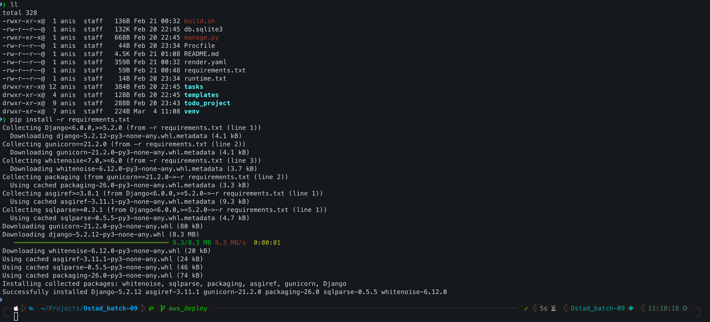

   -  Django server running locally
        
        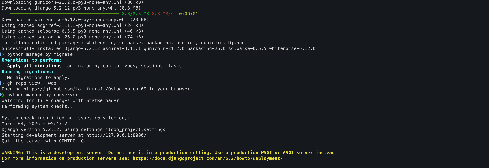

   -  Application opened in the browser
        
        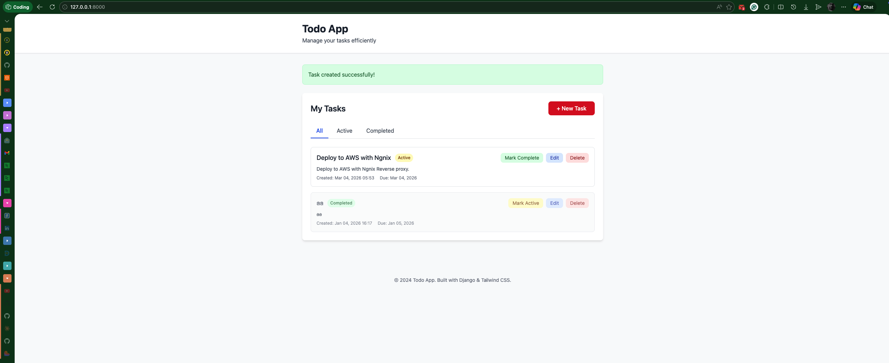


### Step 3: Create an EC2 Instance (t3.medium)
- Log in to the AWS Management Console.
- Create a new EC2 instance.
- Select a Linux-based AMI (Ubuntu recommended).
- Choose t3.medium as the instance type.
  - Choosen Instance Type: `t2.micro` (Free Tier: 750 hours/month)
- Configure the security group to allow:
  - SSH (port 22)
  - Django app port (8000) or HTTP (80) if using NGINX

- Launch the instance.
- Take a screenshot showing the EC2 instance in a running state.
- 
    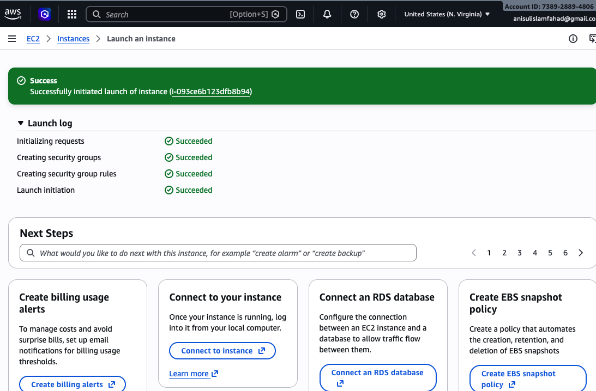

### Step 4: Connect to the EC2 Instance
- Connect to the EC2 instance using SSH, PuTTY, or any preferred method.
- Verify successful login to the server.
- Take a screenshot showing the active terminal session connected to the EC2 instance.
    
    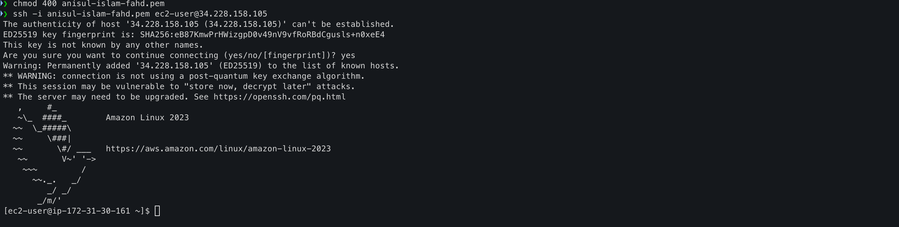


### Step 5: Clone the Repository on the EC2 Instance
- Update the package list on the EC2 instance.

```
sudo dnf update -y
```

- Install Git if it is not already installed.

```
# Install Python 3.11, Git, Nginx
sudo dnf install python3.11 python3.11-pip git nginx -y    
```

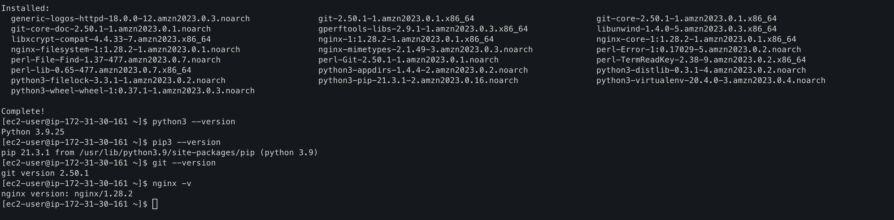

- Clone the same GitHub repository onto the EC2 server.
- Navigate into the project directory.
- Take a screenshot showing the repository successfully cloned on EC2.
    
    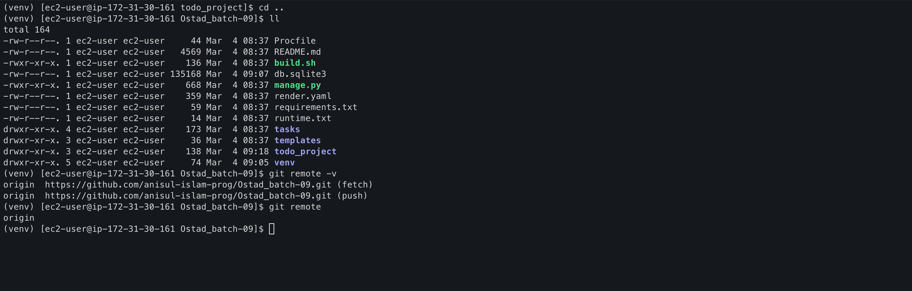


### Step 6: Install Python, Virtual Environment, and Dependencies
- Install Python 3 and pip on the EC2 instance.
- Install virtualenv or python3-venv.
- Create and activate a virtual environment.
- Install all Django project dependencies using pip.
- Run database migrations.
- Take screenshots showing:
  - Python and pip versions
  - Dependency installation completed successfully
    
    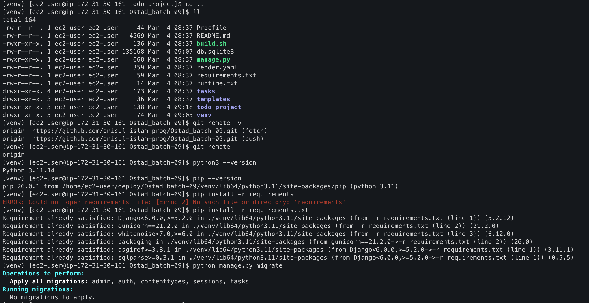


### Step 7: Run the Django Application in the Background
- Use any background process tool such as screen, tmux, nohup, or gunicorn.
```
# Set production settings
export DJANGO_SETTINGS_MODULE=todo_project.settings_production
# Collect static files
python manage.py collectstatic --noinput

# Create systemd gunicorn.service
sudo tee /etc/systemd/system/gunicorn.service << 'EOF'
[Unit]
[Unit]
Description=Django Todo App Gunicorn Service
After=network.target

[Service]
User=ec2-user
Group=nginx
WorkingDirectory=/home/ec2-user/deploy/Ostad_batch-09
Environment="DJANGO_SETTINGS_MODULE=todo_project.settings_production"
Environment="PATH=/home/ec2-user/deploy/Ostad_batch-09/venv/bin"
Environment="SECRET_KEY=your-production-secret-key-change-this"
ExecStart=/home/ec2-user/deploy/Ostad_batch-09/venv/bin/gunicorn \
          --workers 3 \
          --bind unix:/home/ec2-user/deploy/Ostad_batch-09/app.sock \
          --access-logfile /home/ec2-user/deploy/Ostad_batch-09/logs/gunicorn-access.log \
          --error-logfile /home/ec2-user/deploy/Ostad_batch-09/logs/gunicorn-error.log \
          todo_project.wsgi:application

[Install]
WantedBy=multi-user.target
EOF

# Create logs directory
mkdir -p /home/ec2-user/deploy/Ostad_batch-09/logs

# Start Gunicorn
sudo systemctl daemon-reload
sudo systemctl start gunicorn
sudo systemctl enable gunicorn

# Check status
sudo systemctl status gunicorn
```
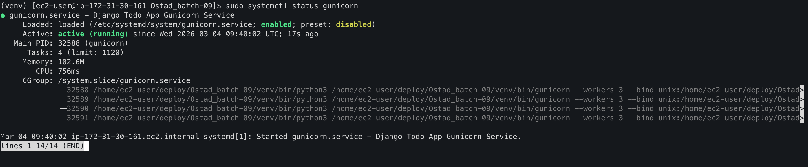

- Start the Django application so it continues running after closing the terminal.
- Verify that the application process is running.
- Take a screenshot showing the background process running.

    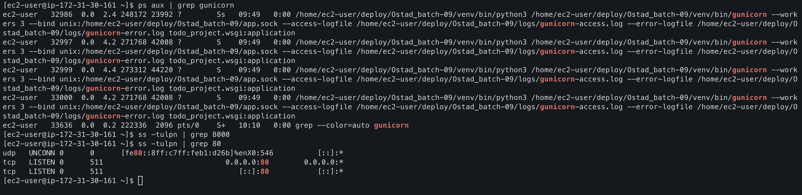


### Step 8: Access the Application from EC2
- Ensure the Django application is running on the EC2 instance.
- Use the EC2 public IP address and port (e.g., http://<EC2_PUBLIC_IP>:80) to access the application
- Confirm that the application loads correctly in the browser.
- Take a screenshot showing the Django app running via the EC2 public IP.

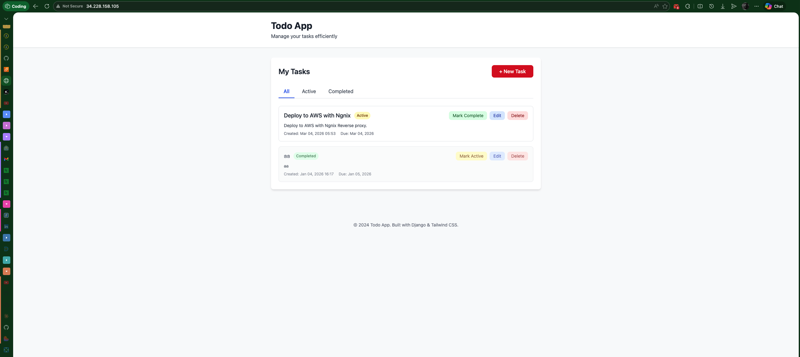


### Step 9 (Optional): Configure NGINX as a Reverse Proxy
- Install NGINX on the EC2 instance.
- Configure NGINX to forward HTTP requests to the Django application.

```
sudo tee /etc/nginx/conf.d/django-todo.conf << 'EOF'
server {
    listen 80;
    server_name _;

    location = /favicon.ico {
        access_log off;
        log_not_found off;
    }

    location /static/ {
        alias /home/ec2-user/deploy/Ostad_batch-09/staticfiles/;
        expires 30d;
        add_header Cache-Control "public, immutable";
    }

    location / {
        proxy_set_header Host $host;
        proxy_set_header X-Real-IP $remote_addr;
        proxy_set_header X-Forwarded-For $proxy_add_x_forwarded_for;
        proxy_set_header X-Forwarded-Proto $scheme;
        proxy_pass http://unix:/home/ec2-user/deploy/Ostad_batch-09/app.sock;
    }
}
EOF

# Test config
sudo nginx -t

# Start Nginx
sudo systemctl start nginx
sudo systemctl enable nginx

# Fix permissions
sudo chown -R ec2-user:nginx /home/ec2-user/deploy/Ostad_batch-09
sudo chmod 755 /home/ec2-user
sudo chmod 755 /home/ec2-user/deploy/Ostad_batch-09
sudo chmod -R 755 /home/ec2-user/deploy/Ostad_batch-09/staticfiles
sudo chmod 660 /home/ec2-user/deploy/Ostad_batch-09/app.sock

# SELinux (Amazon Linux)
sudo setsebool -P httpd_can_network_connect 1
sudo semanage fcontext -a -t httpd_sys_content_t "/home/ec2-user/deploy/Ostad_batch-09/staticfiles(/.*)?" 2>/dev/null || true
sudo restorecon -Rv /home/ec2-user/deploy/Ostad_batch-09/staticfiles 2>/dev/null || true

# Restart services
sudo systemctl restart gunicorn
sudo systemctl restart nginx

# Check services
sudo systemctl is-active gunicorn
sudo systemctl is-active nginx

# Test with curl
curl -I http://localhost

[ec2-user@ip-172-31-30-161 ~]$ curl -I http://localhost
HTTP/1.1 200 OK
Server: nginx/1.28.2
Date: Wed, 04 Mar 2026 10:02:22 GMT
Content-Type: text/html
Content-Length: 615
Last-Modified: Wed, 04 Feb 2026 21:55:56 GMT
Connection: keep-alive
ETag: "6983c06c-267"
Accept-Ranges: bytes

# Check logs
sudo tail -f /var/log/nginx/error.log
tail -f /home/ec2-user/deploy/Ostad_batch-09/logs/gunicorn-error.log

```  

- Optionally use Gunicorn as the WSGI server.
- Access the application using the EC2 public IP without specifying a port.

- Take a screenshot showing the application running through NGINX (if completed).

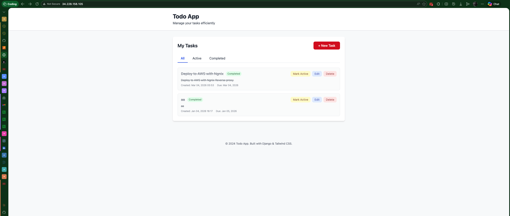