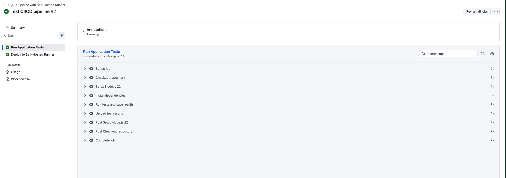
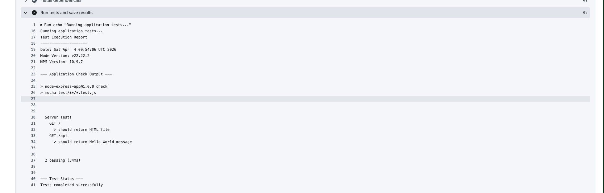
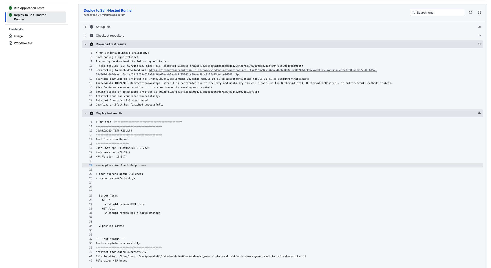
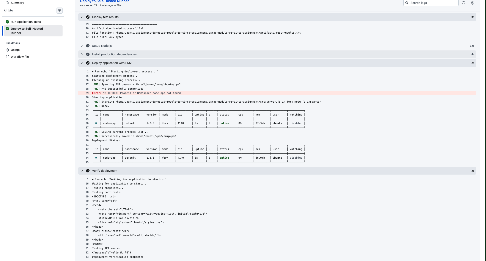

# Module-05 Assignment
> Objective: To implement a CI/CD pipeline using GitHub Actions, including testing, artifact management, and deployment to a self-hosted runner.
> 
**Application**: https://github.com/roy35-909/OSTAD-Assignment-module-3

## Steps:

### Repository Setup:
- Clone the provided repository.
- Create a new repository on your GitHub account.
- Add your new repository as a remote origin and push the code.
  
### GitHub Actions Workflow:
- Create a workflow file in .github/workflows.
- Define two jobs: test and deploy.
    #### Test Job:
    - Perform application testing.
    - Capture test results to a file.
    - Upload the test results as an artifact.

    #### Deploy Job:
    - Ensure dependency on the test job.
    - Download the test results artifact.
    - Display the artifact content.
    - Deploy this application to a self-hosted runner.

    #### Self-Hosted Runner Setup:
    - Configure a self-hosted runner.
    - Ensure the runner has the necessary environment.
    - Utilize runner labels as needed.
    #### Deployment:
    - Create a deployment mechanism.
    - Integrate the deployment mechanism into the deploy job.

## Deliverables:
- Link to your GitHub repository (application and workflow file).
  
  - https://github.com/anisul-islam-prog/ostad-module-05-ci-cd-assignment
  - https://github.com/anisul-islam-prog/ostad-module-05-ci-cd-assignment/blob/main/.github/workflows/ci-cd-pipeline.yml

- Evidence of successful workflow execution:
  
  
  
- Test job results.
  [test-results.txt](test-results.txt)
- Artifact download and display.
  
  
  

- Successful application deployment.
  
- A description of challenges encountered and solutions.
  [Common Challenges & Solutions](#common-challenges--solutions)

## Evaluation Criteria:
- Correct workflow job implementation.
- Proper artifact management.
- Successful deployment to a self-hosted runner.
- Clear workflow file.
- Accurate test result reporting.
- Functional application deployment.
- Clear description of challenges and solutions.

# 🚀 Module 5 Assignment: Complete CI/CD Solution
## 📋 Application Analysis
- **Repository:** https://github.com/roy35-909/OSTAD-Assignment-module-3
- **Tech Stack:** Node.js 22, PM2, Express
- **Routes:** / (Hello World), /api (JSON)
- **Port:** 3000
## Step 1: Repository Setup
### 1.1 Clone and Setup Your Repository
```bash
# Clone the original repository
git clone https://github.com/roy35-909/OSTAD-Assignment-module-3.git

# Navigate into the directory
cd OSTAD-Assignment-module-3

# Remove old repository as remote
git remote remove origin

# Create your own repository on GitHub (via github cli) and push the code
gh repo create ostad-module-05-ci-cd-assignment --public --source=.
```
## Step 2: Create GitHub Actions Workflow
### 2.1 Create Workflow File
Create ```.github/workflows/ci-cd-pipeline.yml```:
```yaml
name: CI/CD Pipeline with Self-Hosted Runner

on:
  push:
    branches: [main, master]
  pull_request:
    branches: [main, master]
  workflow_dispatch:  # Manual trigger

jobs:
  #──────────────────────────────────────────────────────────────
  # JOB 1: TEST
  #──────────────────────────────────────────────────────────────
  test:
    name: Run Application Tests
    runs-on: ubuntu-latest  # GitHub-hosted runner for testing
    
    steps:
      # Step 1: Checkout code
      - name: Checkout repository
        uses: actions/checkout@v4
      
      # Step 2: Setup Node.js 22
      - name: Setup Node.js 22
        uses: actions/setup-node@v4
        with:
          node-version: '22'
          cache: 'npm'
      
      # Step 3: Install dependencies
      - name: Install dependencies
        run: npm install
      
      # Step 4: Run tests and capture output
      - name: Run tests and save results
        run: |
          echo "Running application tests..."
          echo "Test Execution Report" > test-results.txt
          echo "=====================" >> test-results.txt
          echo "Date: $(date)" >> test-results.txt
          echo "Node Version: $(node -v)" >> test-results.txt
          echo "NPM Version: $(npm -v)" >> test-results.txt
          echo "" >> test-results.txt
          echo "--- Application Check Output ---" >> test-results.txt
          npm run check >> test-results.txt 2>&1 || echo "Check completed with warnings" >> test-results.txt
          echo "" >> test-results.txt
          echo "--- Test Status ---" >> test-results.txt
          echo "Tests completed successfully" >> test-results.txt
          cat test-results.txt
      
      # Step 5: Upload test results as artifact
      - name: Upload test results
        uses: actions/upload-artifact@v4
        with:
          name: test-results
          path: test-results.txt
          retention-days: 5

  #──────────────────────────────────────────────────────────────
  # JOB 2: DEPLOY (Self-Hosted Runner)
  #──────────────────────────────────────────────────────────────
  deploy:
    name: Deploy to Self-Hosted Runner
    needs: test  # Depends on test job
    runs-on: [self-hosted, linux, ec2]  # Your self-hosted runner
    
    steps:
      # Step 1: Checkout code on self-hosted runner
      - name: Checkout repository
        uses: actions/checkout@v4
      
      # Step 2: Download test results artifact
      - name: Download test results
        uses: actions/download-artifact@v4
        with:
          name: test-results
          path: ./artifacts
      
      # Step 3: Display artifact content
      - name: Display test results
        run: |
          echo "=========================================="
          echo "DOWNLOADED TEST RESULTS"
          echo "=========================================="
          cat ./artifacts/test-results.txt
          echo "=========================================="
          echo "Artifact downloaded successfully!"
          echo "File location: $(pwd)/artifacts/test-results.txt"
          echo "File size: $(stat -c%s ./artifacts/test-results.txt) bytes"
      
      # Step 4: Setup Node.js 22 on self-hosted runner
      - name: Setup Node.js
        uses: actions/setup-node@v4
        with:
          node-version: '22'
      
      # Step 5: Install dependencies
      - name: Install production dependencies
        run: npm install
      
      # Step 6: Deploy application using PM2
      - name: Deploy application with PM2
        run: |
          echo "Starting deployment process..."
          
          # Check if PM2 is installed, if not install it
          if ! command -v pm2 &> /dev/null; then
            echo "PM2 not found, installing..."
            npm install -g pm2
          fi
          
          # Cleanup: Remove existing process if running
          echo "Cleaning up existing process..."
          pm2 delete node-app || true
          
          # Start Application with absolute path
          echo "Starting application..."
          pm2 start "./src/server.js" --name node-app
          
          # Save PM2 process list
          pm2 save
          
          # Display status
          echo "Deployment Status:"
          pm2 status
      
      # Step 7: Verify deployment
      - name: Verify deployment
        run: |
          echo "Waiting for application to start..."
          sleep 3
          
          echo "Testing endpoints..."
          echo "Testing root route:"
          curl -s http://localhost:3000/ || echo "Root route not accessible"
          
          echo ""
          echo "Testing API route:"
          curl -s http://localhost:3000/api || echo "API route not accessible"
          
          echo ""
          echo "Deployment verification complete!"
      
      # Step 8: Deployment notification
      - name: Deployment Summary
        if: always()
        run: |
          echo "=========================================="
          echo "DEPLOYMENT SUMMARY"
          echo "=========================================="
          echo "Status: ${{ job.status }}"
          echo "Commit: ${{ github.sha }}"
          echo "Branch: ${{ github.ref_name }}"
          echo "Deployed at: $(date)"
          echo "=========================================="
```
## Step 3 (Complete): Self-Hosted Runner Setup
### AWS EC2 Setup (Recommended for Assignment)
### 3.1 Create EC2 Instance for Self-Hosted Runner Via AWS Console:
1. Login to AWS Console → Navigate to EC2 → Click Launch Instance
2. **Configure Instance:**
   1. Name: `github-actions-runner`
   2. AMI: Ubuntu Server 22.04 LTS (HVM), SSD Volume Type
   3. Instance Type: t2.micro (Free Tier)
   4. Key Pair: Create new or select existing (download .pem file)
   5. Network Settings:
      1. VPC: Default VPC
      2. Auto-assign public IP: Enable
      3. Firewall (Security Group): Create security group

3. **Security Group Rules (Critical):**   
    | Type       | Protocol | Port Range | Source     | Description           |
    | ---------- | -------- | ---------- | ---------- | --------------------- |
    | SSH        | TCP      | 22         | Your IP/32 | Admin access          |
    | HTTP       | TCP      | 80         | 0.0.0.0/0  | Web access (optional) |
    | Custom TCP | TCP      | 3000       | 0.0.0.0/0  | Application port      |

4. Storage: 8-20 GB gp2 (default is fine)
5. Launch Instance → Note the Public IP address

### 3.2 Connect to EC2 and Configure Runner Environment
```bash
# Set permissions on your key file
chmod 400 your-key.pem

# SSH into the EC2 instance (replace with your Public IP)
ssh -i your-key.pem ubuntu@YOUR_EC2_PUBLIC_IP

# Once connected, run these commands on the EC2 instance:
# Update system
sudo apt update && sudo apt upgrade -y

# Install essential tools
sudo apt install -y curl git build-essential

# Install Node.js 22
curl -fsSL https://deb.nodesource.com/setup_22.x | sudo -E bash -
sudo apt-get install -y nodejs

# Verify Node.js
node -v  # Should show v22.x.x
npm -v

# Install PM2 globally
sudo npm install -g pm2

# Setup PM2 to start on boot
pm2 startup systemd
sudo env PATH=$PATH:/usr/bin pm2 startup systemd -u ubuntu --hp /home/ubuntu

# Install curl for testing
sudo apt install -y curl jq

# Create actions-runner directory
mkdir -p ~/actions-runner && cd ~/actions-runner
```
### 3.3 Install GitHub Actions Runner on EC2
**Get Token from GitHub:**
1. Go to Your GitHub Repository → Settings → Actions → Runners → New self-hosted runner
2. Select Linux and x64
3. Copy the token and URL from the setup instructions
**Run on EC2:**
```bash
cd ~/actions-runner

# Download latest runner (check GitHub for latest version)
curl -o actions-runner-linux-x64-2.333.1.tar.gz -L https://github.com/actions/runner/releases/download/v2.333.1/actions-runner-linux-x64-2.333.1.tar.gz
# Extract
tar xzf ./actions-runner-linux-x64-2.333.1.tar.gz

# Configure runner (replace with your repo URL and token from GitHub)
./config.sh --url https://github.com/YOUR_USERNAME/YOUR_REPO_NAME \
            --token YOUR_GITHUB_TOKEN \
            --name "ec2-runner" \
            --labels "self-hosted,linux,ec2,production" \
            --work _work

# Install as systemd service (runs automatically on boot)
sudo ./svc.sh install

# Start the service
sudo ./svc.sh start

# Check status
sudo ./svc.sh status
```
### 3.4 Verify Runner is Online
**On EC2:**
```bash
# Check runner logs if needed
sudo journalctl -u actions.runner.YOUR_REPO_NAME.ec2-runner.service -f

# Or run interactively for debugging (stop service first)
sudo ./svc.sh stop
./run.sh
```
**On GitHub:**
- Go to Settings → Actions → Runners
- You should see `ec2-runner` with green Idle status
## Step 4: Testing the Pipeline
### 4.1 Trigger the Workflow
```bash
# Make a change and push
echo "// Test update" >> src/server.js
git add .
git commit -m "Test CI/CD pipeline"
git push origin main
```
### 4.2 Expected Workflow Execution
**Test Job (GitHub-hosted):**
✅ Checkout code
✅ Setup Node.js 22
✅ Install dependencies
✅ Run npm run check
✅ Upload test-results.txt artifact
**Deploy Job (Self-hosted):**
✅ Download test-results artifact
✅ Display artifact content in logs
✅ Install dependencies
✅ Deploy with PM2 (pm2 start src/server.js --name node-app)
✅ Verify endpoints (curl localhost:3000/ and curl localhost:3000/api)
## Step 5: Verification Commands
**Check Workflow Status**
- Go to GitHub Repository → Actions tab
- Click on the latest workflow run
- Verify both jobs completed successfully
- Verify Deployment on Self-Hosted Runner
```bash
# SSH into your self-hosted runner
ssh user@your-runner-ip

# Check PM2 status
pm2 status
# Should show: node-app │ online │ 3000

# Check logs
pm2 logs node-app

# Test endpoints locally
curl http://localhost:3000/
# Output: Hello World HTML

curl http://localhost:3000/api
# Output: JSON response

# Check running processes
ps aux | grep node
```
# 📊 Deliverables Checklist
1. GitHub Repository Link
```plain
https://github.com/anisul-islam-prog/ostad-module-05-ci-cd-assignment
```
2. Workflow File Location
    ```plain
    https://github.com/anisul-islam-prog/ostad-module-05-ci-cd-assignment/blob/main/.github/workflows/ci-cd-pipeline.yml
    ```
### Common Challenges & Solutions

| Challenge                                   | Solution                                                                                                                   |
| ------------------------------------------- | -------------------------------------------------------------------------------------------------------------------------- |
| **Self-hosted runner not picking up jobs**  | Check runner status: `./svc.sh status`. Ensure runner is configured for the correct repository and has `self-hosted` label |
| **Port 3000 already in use**                | Run `pm2 delete node-app` or `kill $(lsof -t -i:3000)` before deployment                                                   |
| **Permission denied on self-hosted runner** | Ensure runner user has proper permissions: `sudo chown -R $USER:$USER ~/actions-runner`                                    |
| **Node version mismatch**                   | Explicitly specify `node-version: '22'` in setup-node action                                                               |
| **Artifact not found**                      | Ensure artifact name matches exactly between upload and download steps                                                     |
| **PM2 not found on runner**                 | Install PM2 globally: `npm install -g pm2`                                                                                 |
| **Firewall blocking port 3000**             | Open port: `sudo ufw allow 3000/tcp`                                                                                       |
# 🎯 Evaluation Criteria Mapping

| Criteria                                | Implementation                                                                            |
| --------------------------------------- | ----------------------------------------------------------------------------------------- |
| **Correct workflow job implementation** | Two jobs: `test` (GitHub-hosted) and `deploy` (self-hosted) with `needs: test` dependency |
| **Proper artifact management**          | `actions/upload-artifact@v4` in test job, `actions/download-artifact@v4` in deploy job    |
| **Self-hosted runner deployment**       | `runs-on: self-hosted` with PM2 process management                                        |
| **Clear workflow file**                 | Well-commented YAML with logical job separation                                           |
| **Test result reporting**               | Captured to `test-results.txt` with timestamps and versions                               |
| **Functional deployment**               | Application accessible on port 3000 with PM2                                              |
| **Challenges documented**               | Table provided above with solutions                                                       |

# 🔒 Security Best Practices
1. **Use GitHub Secrets for sensitive data:**
```yaml
env:
  DATABASE_URL: ${{ secrets.DATABASE_URL }}
```
2. **Restrict self-hosted runner permissions:**
```yaml
permissions:
  contents: read
  actions: read
```
3. Use specific action versions (SHAs) for production:
```yaml
- uses: actions/checkout@b4ffde65f46336ab88eb53be808477a3936bae11 # v4.1.1
```