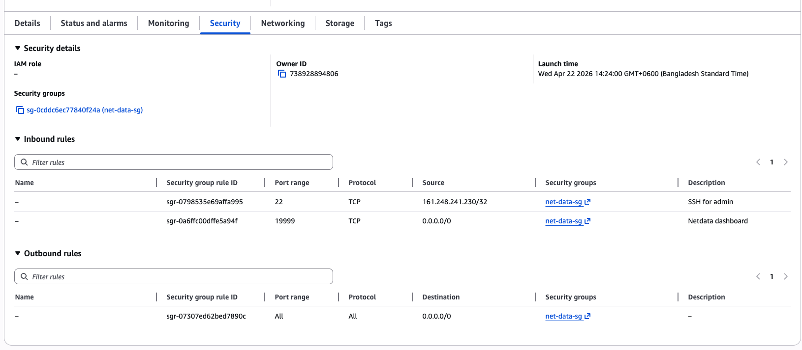
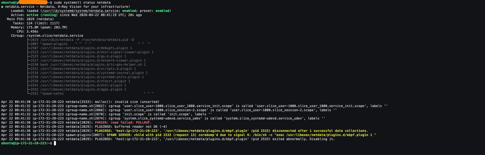
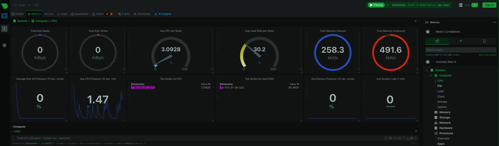
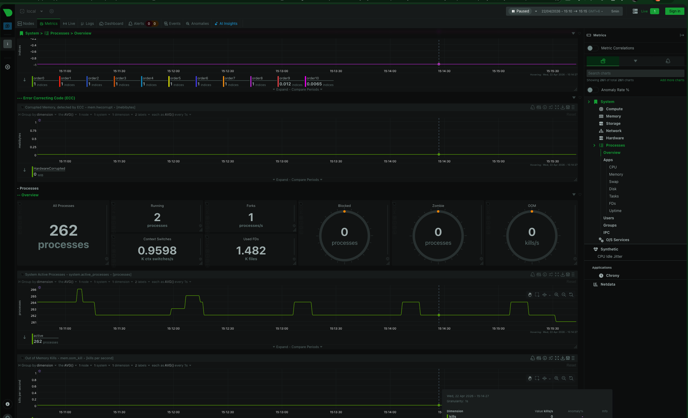
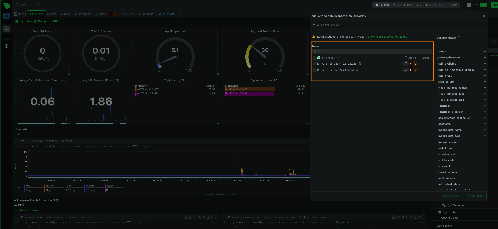
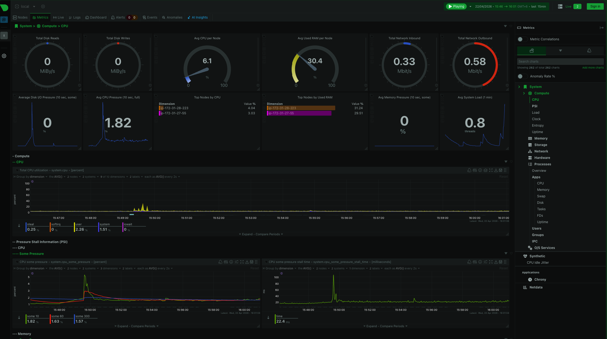

# Module-06 Assignment

## **Monitoring EC2 Instance with NetData**

> **Objective:** Install NetData on an EC2 instance to monitor live server metrics and optionally connect another node for centralized monitoring.


### Steps to Complete the Assignment
### Step 1: Launch EC2 Instance
  
  - Create a new EC2 instance on AWS.
  - Choose an appropriate operating system (Ubuntu 22.04 or Amazon Linux 2 recommended).
  - Ensure the instance has access via SSH.
  - Allow traffic to the NetData dashboard port (default: 19999) in the security group.

### Step 2: Install NetData
  - Install NetData on the EC2 instance using the official installation method provided on the NetData website.
  - Ensure that NetData service starts automatically after installation.
         

### Step 3:  Access NetData Dashboard

- Open a web browser.
- Navigate to the public IP of your EC2 instance followed by the NetData port (default 19999).
- Explore the dashboard to view live server metrics, including CPU, memory, disk, network, and processes.

### Step 4: Optional – Monitor Another Node

- Launch a second EC2 instance (or use another server).
- Install NetData on the second instance.
- Configure the first instance to receive metrics from the second instance.
- Configure the second instance to send its metrics to the first instance.
- Access the first instance’s dashboard to view metrics from both nodes in a single interface.

### Step 5: Observation and Reporting

- Observe metrics like CPU usage, memory usage, disk activity, network traffic, and running processes.
- Optionally, observe how metrics from multiple nodes appear together.
- Prepare a short report describing what metrics you observed and how NetData helps in real-time monitoring.

**Learning Outcomes:**

- Understand how to deploy a monitoring tool on a cloud server
- Explore real-time server metrics.
- Learn the concept of centralized monitoring across multiple nodes.

**Submission Guidelines:** 

>Screenshots (Mandatory)

- EC2 instance running (AWS console view)
- NetData dashboard showing live metrics (CPU, Memory, Disk, Network)
- Security group rule allowing port 19999
- (Optional) Multi-node dashboard if second node is configured

## **Phase 1: EC2 Infrastructure Provisioning**

### **Step 1.1: Launch Primary EC2 Instance (NetData Parent)**

**Specifications:**
- **AMI**: Ubuntu Server 22.04 LTS (HVM), SSD Volume Type
- **Instance Type**: `t2.micro` (free tier eligible) or `t2.small` for smoother performance
- **Key Pair**: Create or use existing RSA `.pem` key
- **Network**: Default VPC with public subnet (Auto-assign public IP: **Enable**)
- **Storage**: 8 GB GP3 (default is fine)

**Security Group Configuration:**


| Type | Protocol | Port Range | Source | Description |
|------|----------|------------|--------|-------------|
| SSH | TCP | 22 | Your IP/0.0.0.0/0 | Administrative access |
| Custom TCP | TCP | **19999** | 0.0.0.0/0 | **NetData Dashboard** |
| Custom TCP | TCP | 19999 | Private subnet CIDR | Child node streaming (optional) |

**Screenshot**:



---

## **Phase 2: NetData Installation (2026 Best Practice)**

NetData's `kickstart.sh` is the officially recommended method as of 2026. It auto-detects your OS, uses native packages where possible, and handles systemd integration .

### **Step 2.1: System Preparation**

```bash
# SSH into your instance
ssh -i your-key.pem ubuntu@<PUBLIC_IP>

# Update system packages
sudo apt update && sudo apt upgrade -y

# Install prerequisites
sudo apt install -y wget curl uuid-runtime
```

### **Step 2.2: Install NetData (Official Method)**

```bash
# Download and verify the kickstart script
wget -O /tmp/netdata-kickstart.sh https://get.netdata.cloud/kickstart.sh

# Verify script integrity (production security practice)
[ "39321e7a8e05f0054f93df1824189abd" = "$(cat /tmp/netdata-kickstart.sh | md5sum | cut -d ' ' -f 1)" ] && echo "OK, VALID" || echo "FAILED, INVALID"

# Execute installation (stable channel, no auto-updates for assignment stability)
sudo sh /tmp/netdata-kickstart.sh --stable-channel --no-updates --non-interactive
```

**What this does:**
- Detects Ubuntu 22.04 and installs via native DEB packages
- Configures systemd service for auto-start
- Sets up the NetData repository for future updates 

### **Step 2.3: Verify Installation**

```bash
# Check service status
sudo systemctl status netdata

# Enable auto-start (if not already enabled)
sudo systemctl enable --now netdatasudo systemctl enable --now netdata

# Verify API responsiveness
curl -s http://localhost:19999/api/v1/info | jq '.version'
```

**Screenshot:**




---

## **Phase 3: Dashboard Access & Configuration**

### **Step 3.1: Bind to Public Interface**

By default, NetData binds to `127.0.0.1`. For EC2 access, reconfigure:

```bash
# Edit configuration
sudo vi /etc/netdata/netdata.conf
```

**Modify/Add the `[web]` section:**

```ini
[web]
    bind to = 0.0.0.0
    default port = 19999
    allow connections from = *
```

**Restart to apply:**

```bash
sudo systemctl restart netdata
```

### **Step 3.2: Access Dashboard**

Navigate to:
```
http://<YOUR_EC2_PUBLIC_IP>:19999
```

**Screenshots:**

**Overview Dashboard**: Shows CPU, Memory, Disk, Network at top




---

## **Phase 4: Multi-Node Centralized Monitoring (Optional but Recommended)**

### **Step 4.1: Launch Second EC2 Instance (Child)**

- Same specifications as Node 1
- **Security Group**: Allow port 19999 from Node 1's private IP (or subnet CIDR)

### **Step 4.2: Install NetData on Child**

Repeat Phase 2 steps on Node 2.

### **Step 4.3: Generate API Key (On Parent Node)**

```bash
# Generate UUID for authentication
cat /proc/sys/kernel/random/uuid
# Output: cc809459-7aed-41e4-a5f4-e5b4b3ba79e4 (example)
```

### **Step 4.4: Configure Parent Node (Node 1)**

```bash
cd /etc/netdata
sudo ./edit-config stream.conf
```

**Add to `stream.conf`:**

```ini
[11111111-2222-3333-4444-555555555555]
    enabled = yes
    default history = 3600
    default memory mode = dbengine
    health enabled by default = auto
    allow from = *
```

**Restart:**
```bash
sudo systemctl restart netdata
```

### **Step 4.5: Configure Child Node (Node 2)**

```bash
cd /etc/netdata
sudo ./edit-config stream.conf
```

**Configure the `[stream]` section:**

```ini
[stream]
    enabled = yes
    destination = <PARENT_PRIVATE_IP>:19999
    api key = 11111111-2222-3333-4444-555555555555
```

**Restart:**
```bash
sudo systemctl restart netdata
```

### **Step 4.6: Verify Multi-Node Dashboard**

Return to Node 1's dashboard (`http://<NODE1_IP>:19999`). You should see:
- A dropdown at the top-left showing "2 nodes"
- Ability to switch between Node 1 and Node 2 metrics
- Replicated charts from the Child node

**Screenshots**:



---

## **Phase 5: Observation & Reporting**

### **Metrics to Document**

| Metric Category | What to Observe | DevOps Relevance |
|----------------|----------------|------------------|
| **CPU** | User vs. System vs. I/O wait time | Identify resource contention |
| **Memory** | Used, cached, buffers, swap usage | Detect memory leaks |
| **Disk** | I/O operations per second (IOPS), throughput | Storage bottleneck analysis |
| **Network** | Packets in/out, bandwidth utilization | DDoS detection, capacity planning |
| **Processes** | Top CPU/memory consumers | Troubleshooting runaway processes |
| **Load Average** | 1m, 5m, 15m trends | System capacity health |

### **Report Structure**

```
1. Executive Summary
   - Objective: Real-time infrastructure monitoring
   - Architecture: Single Parent + [X] Child nodes via streaming replication

2. Infrastructure Details
   - EC2 Instance Type, OS, Security Group rules
   - Network topology diagram (simple text-based)

3. NetData Configuration
   - Installation method (kickstart.sh)
   - Streaming configuration (API key auth, dbengine storage)

4. Observations
   - Baseline metrics under idle load
   - Per-second granularity observations
   - Multi-node dashboard comparison

5. Conclusion
   - NetData's value for proactive monitoring
   - Recommendations for production (retention policies, alerting)
```

---

### **Bonus Step: Configure Slack Notifications**

**Prerequisites:**
- Slack workspace admin access
- Incoming Webhook URL (from Slack Apps)

**Configuration on Parent Node:**

```bash
cd /etc/netdata
sudo ./edit-config health_alarm_notify.conf
```

**Add Slack configuration:**

```bash
#------------------------------------------------------------------------------
# Slack notification options

SEND_SLACK="YES"
SLACK_WEBHOOK_URL=""
DEFAULT_RECIPIENT_SLACK="#devops-alerts"
```

**Test the integration:**

```bash
# Switch to netdata user
sudo su -s /bin/bash netdata

# Send test alarm
/usr/libexec/netdata/plugins.d/alarm-notify.sh test
```

## **2026 Industry Best Practices Summary**

1. **Immutable Infrastructure**: Use UserData scripts to automate NetData installation on launch (IaC approach)
2. **Security Hardening**: Restrict port 19999 to your IP during assignment; use VPN/Bastion in production
3. **Retention Strategy**: Parent uses `dbengine` mode for long-term storage; Children use `alloc` mode (RAM only) to minimize production impact 
4. **Backup Parent Config**: Version-control your `netdata.conf` and `stream.conf` in Git
5. **NetData Cloud**: For production, consider claiming nodes to NetData Cloud for SaaS-based centralized management without manual Parent configuration 
