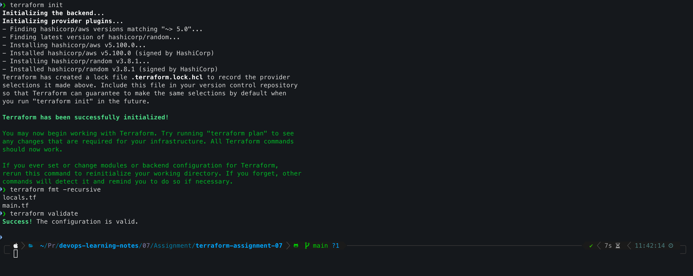
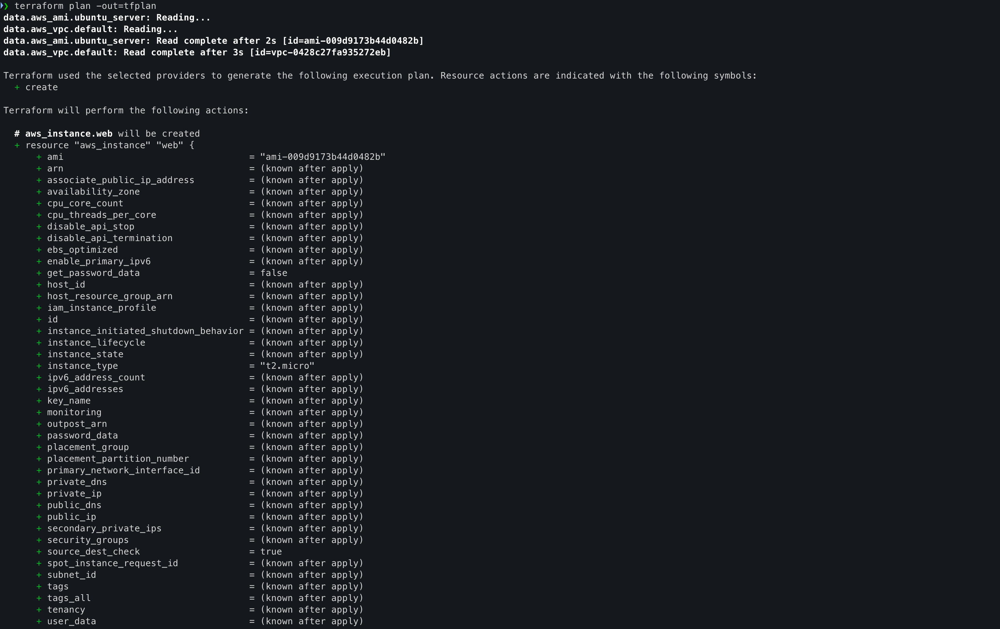
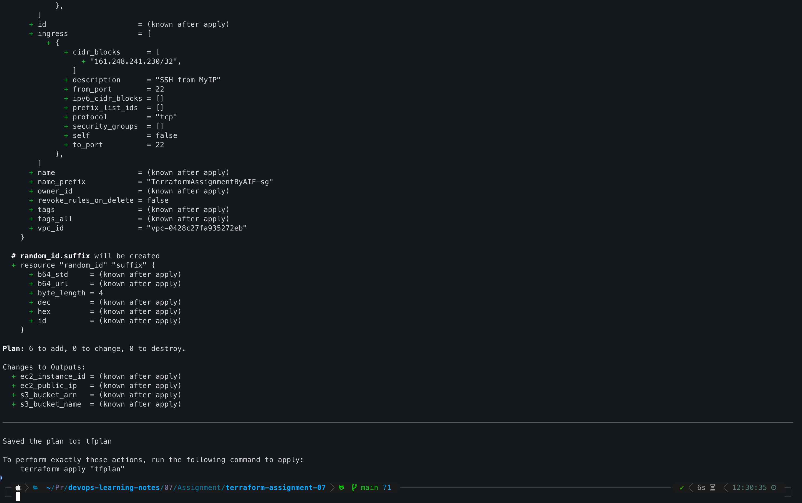
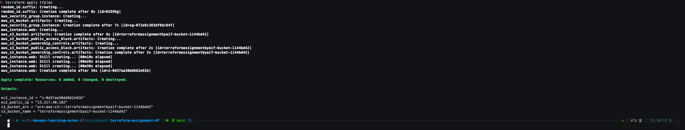
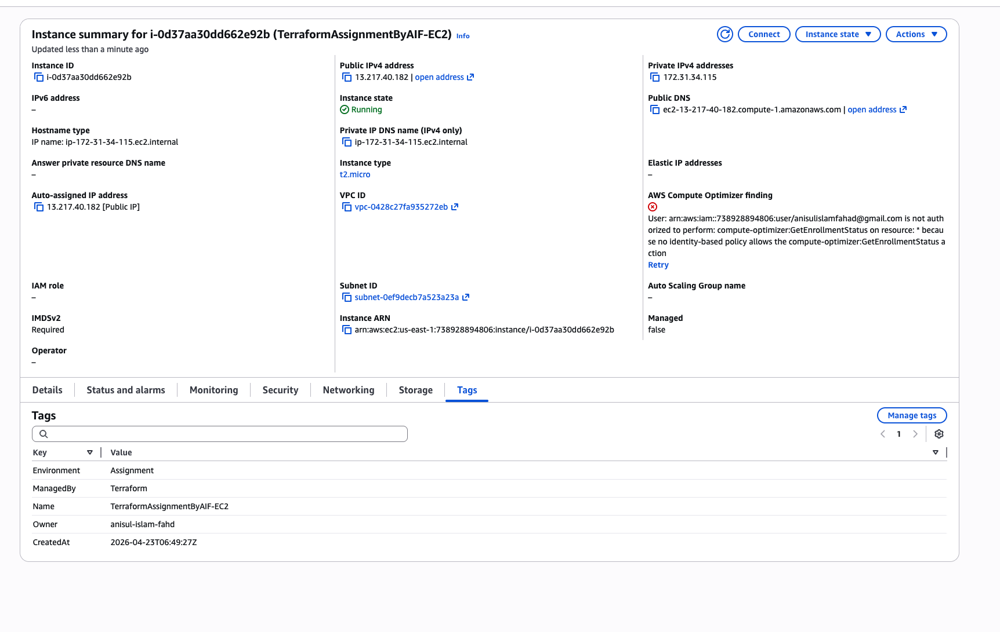
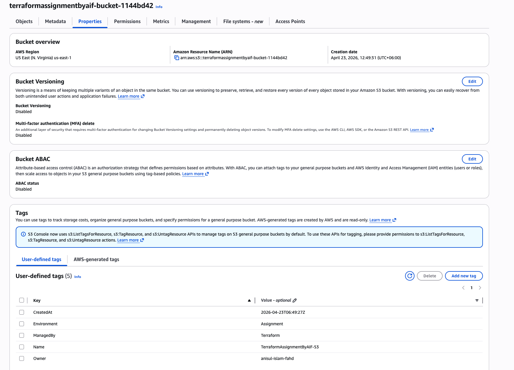
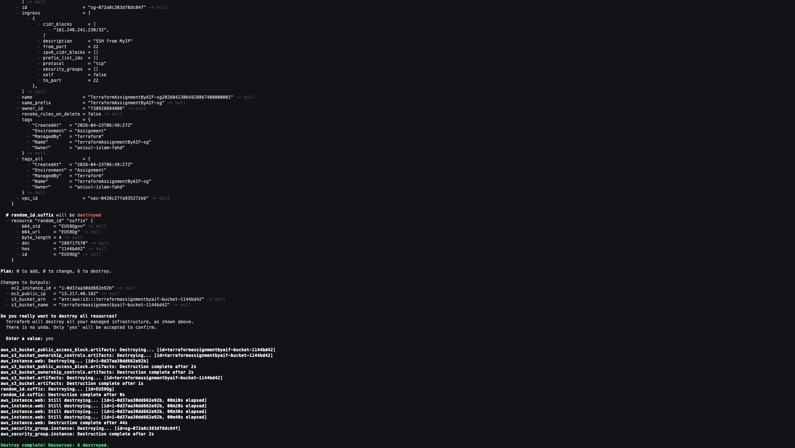
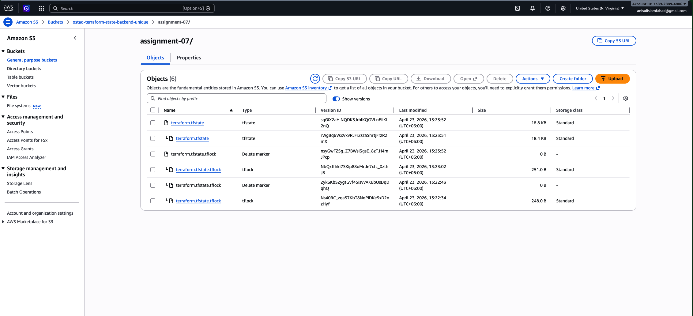
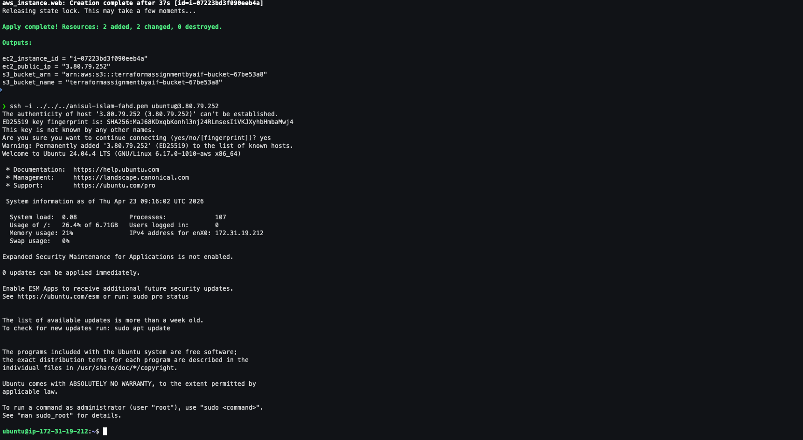

# Assignment-07

## Terraform Assignment: EC2 and S3 Resource Lifecycle

>Objective: Use Terraform to provision and then clean up AWS resources.

## Task Description:
You are required to write Terraform configuration files to perform the following tasks:

### 1. Create Resources:
- Launch an EC2 instance using the t2.micro type in the us-east-1 region.
- Create an S3 bucket with a unique name.
- Ensure both resources are defined in your Terraform configuration using appropriate AWS provider settings.
### 2. Provision Resources:
- Use terraform init and terraform apply to provision the EC2 instance and S3 bucket.
- Validate that both resources are successfully created in your AWS account.
### 3. Destroy Resources:
- After verification, use terraform destroy to remove all created resources.

### Deliverables:

**Submit the following:**
- Screenshots of the created EC2 instance and S3 bucket in the AWS Console.
- Screenshot of the terminal showing terraform apply execution
- Screenshot of the terminal showing successful terraform destroy.
- Your Terraform .tf configuration files (as code snippets or screenshots).

### Bonus:
Add tags to your EC2 instance and S3 bucket (e.g., `Name = "TerraformAssignment"`).

## **Phase 1: Project Bootstrap & Remote State (The Foundation)**

Before writing resource code, establish **project hygiene**. This separates hobbyist Terraform from professional Infrastructure-as-Code (IaC).

### **Directory Structure**
```bash
terraform-assignment-07/
├── backend.tf          # Remote state configuration (Bonus edge)
├── provider.tf         # AWS provider & constraints
├── variables.tf        # Input variables with validation
├── locals.tf           # Common tagging strategy
├── main.tf             # Resource definitions
└── outputs.tf          # Exported values
```
### Install AWS CLI

To manage credentionals in terminal and use by terraform we need AWS CLI
Install using Homebrew:

```bash
brew update

brew install awscli

aws --version
```

### Get AWS credentials
#### Using the "Security Credentials" Shortcut
The fastest way for an individual user to generate keys without opening the IAM dashboard is through the user profile dropdown:

**Step 1:** In the top-right corner of the AWS console, click on your Username or Account ID.

**Step 2:** Select Security Credentials from the dropdown menu.

**Step 3:** Scroll down to the Access keys section.

**Step 4:** Click Create access key.

**Step 5:** Choose the "Command Line Interface (CLI)" or "Other" use case, then click Create access key.

**Step 6:** Save the Access Key ID and Secret Access Key immediately. As a security best practice, AWS will never show the secret key again after you close this screen. 

Go to your terminal and run:
```bash
aws configure --profile my-profile
```
Enter access key and secret key.

Verify:
```
# get account details
aws sts get-caller-identity

# list all profiles
aws configure list-profiles
```

---
## **Phase 2: Terraform Configuration Files**

### **File: `provider.tf`**
```hcl
terraform {
  required_version = ">= 1.5.0"

  required_providers {
    aws = {
      source  = "hashicorp/aws"
      version = "~> 5.0"
    }
  }
}

provider "aws" {
  region = var.aws_region

  default_tags {
    tags = local.common_tags
  }
}
```

### **File: `variables.tf`**
```hcl
variable "aws_region" {
  description = "AWS region for resource deployment"
  type        = string
  default     = "us-east-1"
}

variable "instance_type" {
  description = "EC2 instance type"
  type        = string
  default     = "t2.micro"

  validation {
    condition     = contains(["t2.micro", "t3.micro", "t3.small"], var.instance_type)
    error_message = "Instance type must be t2.micro, t3.micro, or t3.small."
  }
}

variable "project_name" {
  description = "Project identifier for resource naming"
  type        = string
  default     = "TerraformAssignment"
}
```

### **File: `locals.tf`**
```hcl
locals {
  common_tags = {
    Name        = var.project_name
    Environment = "Assignment"
    ManagedBy   = "Terraform"
    Owner       = "your-name"
    CreatedAt   = timestamp()
  }
  
  # Ensure globally unique S3 bucket name
  bucket_name = lower("${var.project_name}-bucket-${random_id.suffix.hex}")
}
```

### **File: `main.tf`**
```hcl
# Random suffix for globally unique S3 bucket naming
resource "random_id" "suffix" {
  byte_length = 4
}

# Fetch latest Ubuntu AMI (keeps code region-agnostic)
data "aws_ami" "ubuntu_server" {
  most_recent = true
  # ownerid ubuntu = 099720109477
  owners      = ["099720109477"] 

  filter {
    name   = "name"
    values = ["ubuntu/images/hvm-ssd-gp3/ubuntu-noble-24.04-amd64-server-*"]
  }

  filter {
    name   = "virtualization-type"
    values = ["hvm"]
  }
}

# Login to ec2 with .pem
# Extract the public key: ssh-keygen -y -f path/to/your/keypair.pem > your_key.pub
resource "aws_key_pair" "deployer" {
  key_name   = "deployer-key"
  public_key = file("~/your_key.pub") # Path to your local public key
}

# Default VPC data source
data "aws_vpc" "default" {
  default = true
}

# Find your Public IP using `curl ipinfo.io/ip` from your terminal
# Security Group for SSH and basic egress
resource "aws_security_group" "instance" {
  name_prefix = "${var.project_name}-sg"
  description = "Allow SSH inbound traffic"
  vpc_id      = data.aws_vpc.default.id

  ingress {
    description = "SSH from myIp"
    from_port   = 22
    to_port     = 22
    protocol    = "tcp"
    cidr_blocks = ["161.248.241.230/32"]
  }

  egress {
    description = "Allow all outbound traffic"
    from_port   = 0
    to_port     = 0
    protocol    = "-1"
    cidr_blocks = ["0.0.0.0/0"]
  }

  tags = merge(local.common_tags, {
    Name = "${var.project_name}-sg"
  })
}

# EC2 Instance
resource "aws_instance" "web" {
  ami                    = data.aws_ami.amazon_linux.id
  instance_type          = var.instance_type
  key_name               = aws_key_pair.deployer.key_name
  vpc_security_group_ids = [aws_security_group.instance.id]

  root_block_device {
    volume_size = 8
    volume_type = "gp3"
    encrypted   = true
  }

  tags = merge(local.common_tags, {
    Name = "${var.project_name}-EC2"
  })
}

# S3 Bucket
resource "aws_s3_bucket" "artifacts" {
  bucket = local.bucket_name

  tags = merge(local.common_tags, {
    Name = "${var.project_name}-S3"
  })
}

# S3 Bucket Ownership Controls (AWS Provider v5 best practice)
resource "aws_s3_bucket_ownership_controls" "artifacts" {
  bucket = aws_s3_bucket.artifacts.id
  rule {
    object_ownership = "BucketOwnerEnforced"
  }
}

# Block all public access (security best practice)
resource "aws_s3_bucket_public_access_block" "artifacts" {
  bucket = aws_s3_bucket.artifacts.id

  block_public_acls       = true
  block_public_policy     = true
  ignore_public_acls      = true
  restrict_public_buckets = true
}
```

### **File: `outputs.tf`**
```hcl
output "ec2_instance_id" {
  description = "ID of the created EC2 instance"
  value       = aws_instance.web.id
}

output "ec2_public_ip" {
  description = "Public IP address of the EC2 instance"
  value       = aws_instance.web.public_ip
}

output "s3_bucket_name" {
  description = "Name of the created S3 bucket"
  value       = aws_s3_bucket.artifacts.id
}

output "s3_bucket_arn" {
  description = "ARN of the created S3 bucket"
  value       = aws_s3_bucket.artifacts.arn
}
```

---

## **Phase 3: Execution Lifecycle**

### **Step 3.1: Initialize & Validate**
```bash
terraform init
terraform fmt -recursive      # Format code to canonical style
terraform validate            # Validate configuration syntax
```

**Screenshot**: 



### **Step 3.2: Plan with Output File (Production Pattern)**
```bash
terraform plan -out=tfplan
```

This creates an immutable plan file. In CI/CD pipelines, this plan is reviewed before any apply.

**Screenshots**: 




### **Step 3.3: Apply Infrastructure**
```bash
terraform apply tfplan
```

**Why use the plan file?** This ensures **exactly** what was reviewed is what gets deployed—no configuration drift between plan and apply.

**Screenshot**: 



### **Step 3.4: Verification in AWS Console**
1. **EC2 Console**: Verify instance is `Running`, note Instance ID and Public IP
2. **S3 Console**: Verify bucket exists, check tags in Properties tab
3. **Tags**: Verify `Name`, `Environment`, `ManagedBy`, `Owner` tags exist on both resources

**Screenshots**: 




---

## **Phase 4: Resource Destruction**

### **Step 4.1: Controlled Destroy**
```bash
terraform destroy
```

When prompted, type `yes`. Terraform will read the state file and destroy resources in the correct dependency order:
1. S3 Bucket Public Access Block
2. S3 Bucket Ownership Controls
3. S3 Bucket
4. EC2 Instance
5. Security Group
6. Random ID

**Screenshot**:



### **Step 4.2: Console Verification**
Navigate to EC2 and S3 consoles to confirm resources are fully terminated/deleted.

---

## Remote State Backend with Locking

### **Why This Matters**
- **Local state** (`terraform.tfstate` on your laptop) is fragile—lose it, and you lose track of infrastructure.
- **Remote state** enables team collaboration and CI/CD integration.
- **State locking** prevents concurrent runs from corrupting state.

### **Implementation**

**Prerequisite**: Manually create a bootstrap bucket (one-time setup):

```bash
# Create bootstrap bucket (replace with YOUR unique name)
aws s3 mb s3://ostad-terraform-state-backend-unique --region us-east-1
aws s3api put-bucket-versioning --bucket ostad-terraform-state-backend-unique \
  --versioning-configuration Status=Enabled
```

**File: `backend.tf`**
```hcl
terraform {
  backend "s3" {
    bucket         = "ostad-terraform-state-backend-unique"
    key            = "assignment-07/terraform.tfstate"
    region         = "us-east-1"
    use_lockfile   = true
    encrypt        = true
  }
}
```

After adding `backend.tf`:
```bash
terraform init -reconfigure
```

Now state is **encrypted**, **versioned**, and **locked**—just like a production platform engineering team operates.




---

## **Submission Checklist**

| Deliverable | Status | Evidence |
|-------------|--------|----------|
| Terraform `.tf` files | &#9745; | Code snippets or GitHub repo link |
| `terraform init` output | &#9745; | Terminal screenshot |
| `terraform plan` output | &#9745; | Terminal screenshot |
| `terraform apply` success | &#9745; | Terminal screenshot with outputs |
| EC2 Console verification | &#9745; | AWS Console screenshot (Running + Tags) |
| S3 Console verification | &#9745; | AWS Console screenshot (Bucket + Tags) |
| `terraform destroy` success | &#9745; | Terminal screenshot |
| **Bonus: Remote State** | &#9745; | S3 backend bucket screenshot (optional) |

---

## **2026 Industry Best Practices Summary**

1. **Immutable Plans**: Always use `terraform plan -out=tfplan` and `terraform apply tfplan` in automated workflows to prevent unreviewed changes.
2. **Data Sources over Hardcoding**: Use `data "aws_ami"` instead of hardcoded AMI IDs to ensure portability across regions and time.
3. **Security by Default**: Include `aws_s3_bucket_public_access_block` on every bucket; encryption on every EBS volume.
4. **Tagging Strategy**: Use `locals` + `merge()` to enforce consistent metadata for cost allocation and automation.
5. **State is Sacred**: Never commit `.tfstate` to Git. Use S3 backends with versioning and locking in all non-trivial projects.
6. **Provider Constraints**: Pin provider versions (`~> 5.0`) to prevent accidental breaking changes on future runs.
