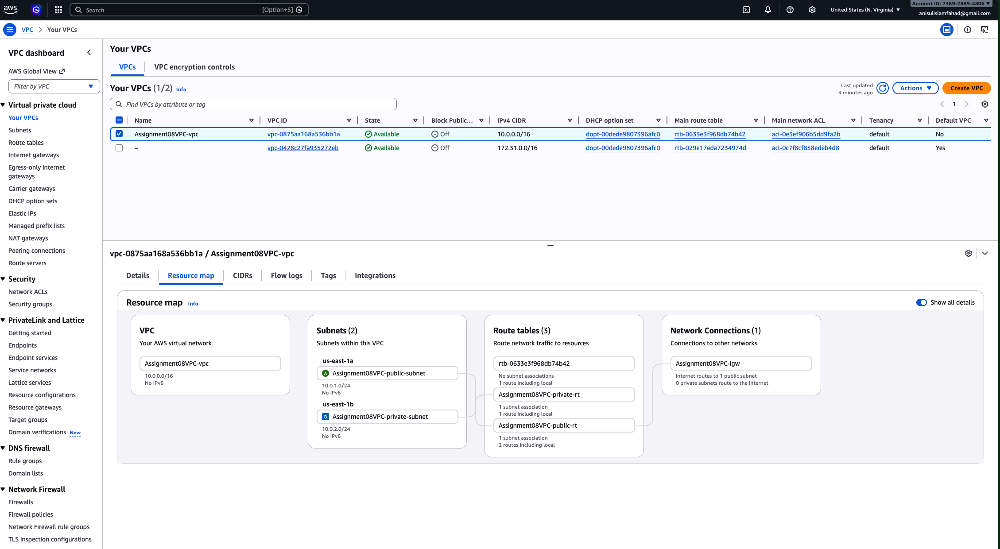
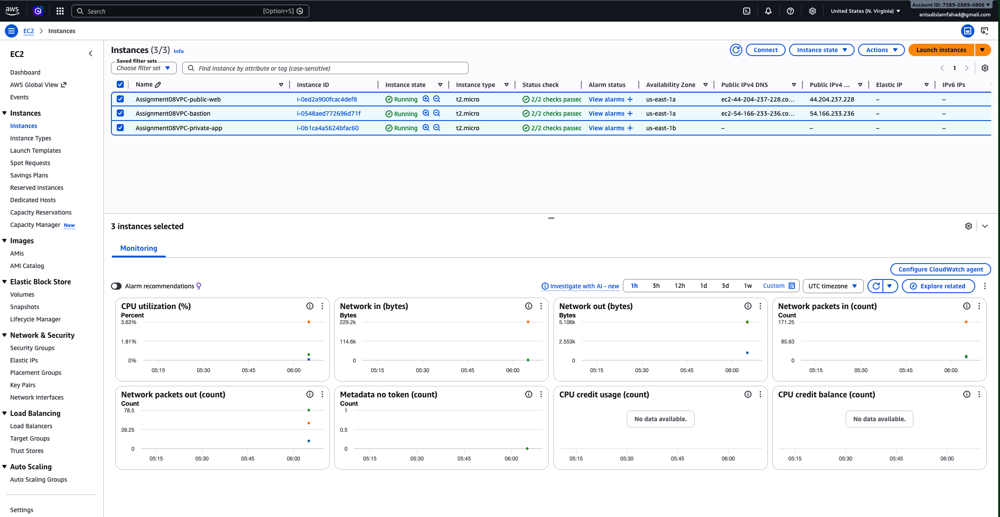
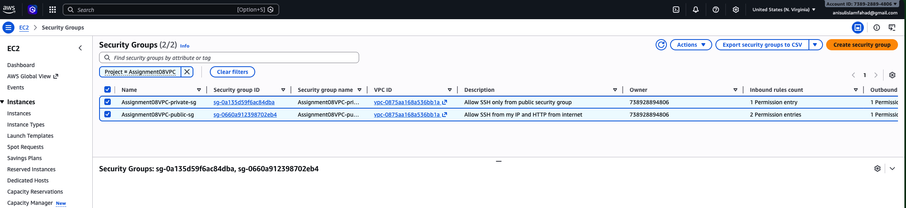
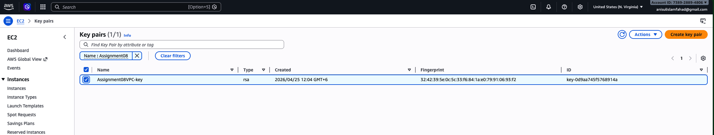
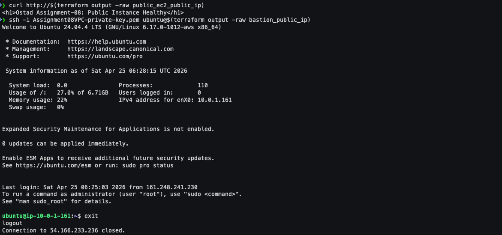
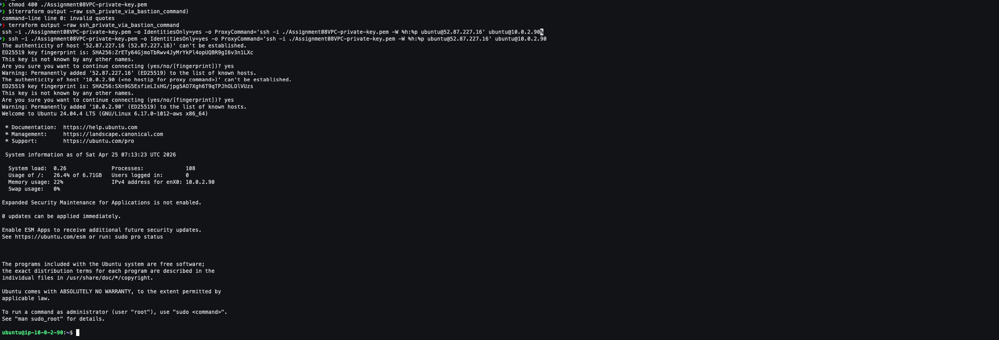

# Assignment-08
## AWS VPC Infrastructure with Public & Private EC2 (Using Infrastructure as Code)
> **Objective:**
> Design and provision a secure AWS infrastructure using Infrastructure as Code principles. The architecture must include a custom VPC, public and private networking, controlled access using security groups, and EC2 instances deployed in appropriate subnets.

## Project Scenario

You are working as a Cloud/DevOps Engineer for a startup. The company requires a secure AWS environment where:
- Public-facing resources are accessible from the internet
- Internal resources remain private and accessible only through a bastion host
- SSH access is tightly controlled
- The entire infrastructure is reproducible and automated

You must design and deploy this architecture using Infrastructure as Code.

## Project Requirements

### AWS Configuration
- Use an AWS provider configuration with a specific region
- Use a named AWS profile instead of default credentials

### Key Management
- Generate an SSH key pair programmatically
- Store the private key securely on the local system
- Register the public key in AWS for EC2 access

### Networking Setup
- Create a custom VPC with a private IP range
- **Create:**
  - One public subnet
  - One private subnet
- **Ensure:**
  - Public subnet resources can access the internet
  - Private subnet resources cannot access the internet directly


### Internet Connectivity
- Attach an Internet Gateway to the VPC
- Configure a route table that allows outbound internet access only for the public subnet
- Associate route tables correctly with subnets

### Security Groups
- **Create a public security group that:**
  - Allows SSH access
  - Allows HTTP access
  - Allows outbound traffic

- **Create a private security group that:**
  - Allows SSH access only from the public security group
  - Allows outbound traffic

### EC2 Deployment
- **Launch**:
  - One EC2 instance in the public subnet
  - One EC2 instance in the private subnet
  - One EC2 instance acting as a bastion host
- Use the generated SSH key for all instances

- **Ensure:**
  - Public and bastion instances receive public IPs
  - Private instance does not have a public IP

## Outputs
**Display:**
  - Public EC2 public IP
  - Private EC2 private IP
  - Bastion host public IP
  - Path to the generated SSH private key

## Submission Instructions
**Submit:**
- Infrastructure configuration files
- Screenshots showing successful resource creation
- A short explanation of how the bastion host enables secure access
-  All screenshots must be combined into one PDF or docx file


## **Infrastructure Architecture Overview**

### **3-Tier Architecture with Bastion Pattern**

In a production startup environment, this is the classic **DMZ-Bastion-App** pattern:

| Tier | Subnet | Components | Accessibility |
|------|--------|-----------|---------------|
| **Frontend / DMZ** | **Public Subnet** | Bastion Host, Public Web Server | Internet-facing via IGW |
| **Backend / App** | **Private Subnet** | Application Server, Internal APIs | No direct internet; accessed via Bastion |
| **Management** | **Cross-subnet** | IAM, SSH Keys, SSM, Flow Logs | Administrative only |

**Traffic Flow:**
1. **User** → Internet → Public Subnet (HTTP to Web Server)
2. **Engineer** → Internet → Bastion Host (SSH) → Private Subnet (SSH to App Server)
3. **Private Instance** → No outbound internet route (isolated by route table)

### **AWS Services Required**
- **VPC** — Custom isolated network (`10.0.0.0/16`)
- **Subnets** — Public (`10.0.1.0/24`) & Private (`10.0.2.0/24`)
- **Internet Gateway (IGW)** — Internet access for public tier only
- **Route Tables** — Public routes to IGW; Private routes local-only
- **Security Groups** — Stateful firewall rules (public vs. private)
- **EC2** — 3 instances (Bastion, Public Web, Private App)
- **IAM** — Instance profile for Systems Manager (bonus edge)
- **Key Pairs** — Programmatically generated RSA key

---

## **Prerequisites: Named AWS Profile**

The assignment requires a **named profile**. Configure this before running Terraform:

```bash
# Configure a named profile (do NOT use default)
aws configure --profile ostad-student
# Enter your AWS Access Key ID, Secret Key, and region (us-east-1)

# Verify it works
aws sts get-caller-identity --profile ostad-student
```

---

## **Project Structure**

```text
assignment-08-vpc/
├── backend.tf
├── provider.tf
├── variables.tf
├── locals.tf
├── networking.tf
├── security.tf
├── keypair.tf
├── iam.tf          # Bonus: SSM Instance Profile
├── compute.tf
├── outputs.tf
└── terraform.tfvars
```

---

## **Phase 1: Terraform Configuration Files**

### **`provider.tf`**
```hcl
terraform {
  required_version = ">= 1.5.0"

  required_providers {
    aws = {
      source  = "hashicorp/aws"
      version = "~> 5.0"
    }
    tls = {
      source  = "hashicorp/tls"
      version = "~> 4.0"
    }
    local = {
      source  = "hashicorp/local"
      version = "~> 2.0"
    }
  }
}

provider "aws" {
  region  = var.aws_region
  profile = var.aws_profile

  default_tags {
    tags = local.common_tags
  }
}
```

### **`variables.tf`**
```hcl
variable "aws_region" {
  description = "AWS region for deployment"
  type        = string
  default     = "us-east-1"
}

variable "aws_profile" {
  description = "Named AWS CLI profile (NOT default)"
  type        = string
}

variable "project_name" {
  description = "Project identifier for resource naming"
  type        = string
  default     = "OstadVPC"
}

variable "my_ip" {
  description = "Your public IP address with CIDR (e.g., 203.0.113.10/32)"
  type        = string
}

variable "instance_type" {
  description = "EC2 instance type"
  type        = string
  default     = "t2.micro"
}
```

### **`locals.tf`**
```hcl
locals {
  common_tags = {
    Environment = "Assignment"
    ManagedBy   = "Terraform"
    Project     = var.project_name
  }
  name_prefix = var.project_name
}
```

### **`keypair.tf`** — *Programmatic Key Generation*
```hcl
resource "tls_private_key" "ssh" {
  algorithm = "RSA"
  rsa_bits  = 4096
}

resource "aws_key_pair" "main" {
  key_name   = "${local.name_prefix}-key"
  public_key = tls_private_key.ssh.public_key_openssh
  tags       = local.common_tags
}

resource "local_file" "private_key_pem" {
  content         = tls_private_key.ssh.private_key_pem
  filename        = "${path.module}/${local.name_prefix}-private-key.pem"
  file_permission = "0400"
}
```

### **`networking.tf`**
```hcl
data "aws_availability_zones" "available" {
  state = "available"
}

resource "aws_vpc" "main" {
  cidr_block           = "10.0.0.0/16"
  enable_dns_hostnames = true
  enable_dns_support   = true
  tags                 = merge(local.common_tags, { Name = "${local.name_prefix}-vpc" })
}

resource "aws_internet_gateway" "main" {
  vpc_id = aws_vpc.main.id
  tags   = merge(local.common_tags, { Name = "${local.name_prefix}-igw" })
}

resource "aws_subnet" "public" {
  vpc_id                  = aws_vpc.main.id
  cidr_block              = "10.0.1.0/24"
  availability_zone       = data.aws_availability_zones.available.names[0]
  map_public_ip_on_launch = true
  tags                    = merge(local.common_tags, { Name = "${local.name_prefix}-public-subnet" })
}

resource "aws_subnet" "private" {
  vpc_id            = aws_vpc.main.id
  cidr_block        = "10.0.2.0/24"
  availability_zone = data.aws_availability_zones.available.names[1]
  tags              = merge(local.common_tags, { Name = "${local.name_prefix}-private-subnet" })
}

resource "aws_route_table" "public" {
  vpc_id = aws_vpc.main.id

  route {
    cidr_block = "0.0.0.0/0"
    gateway_id = aws_internet_gateway.main.id
  }

  tags = merge(local.common_tags, { Name = "${local.name_prefix}-public-rt" })
}

resource "aws_route_table" "private" {
  vpc_id = aws_vpc.main.id
  tags   = merge(local.common_tags, { Name = "${local.name_prefix}-private-rt" })
}

resource "aws_route_table_association" "public" {
  subnet_id      = aws_subnet.public.id
  route_table_id = aws_route_table.public.id
}

resource "aws_route_table_association" "private" {
  subnet_id      = aws_subnet.private.id
  route_table_id = aws_route_table.private.id
}
```

### **`security.tf`**
```hcl
resource "aws_security_group" "public" {
  name_prefix = "${local.name_prefix}-public-sg"
  description = "Allow SSH from my IP and HTTP from internet"
  vpc_id      = aws_vpc.main.id

  ingress {
    description = "SSH from my IP only"
    from_port   = 22
    to_port     = 22
    protocol    = "tcp"
    cidr_blocks = [var.my_ip]
  }

  ingress {
    description = "HTTP from internet"
    from_port   = 80
    to_port     = 80
    protocol    = "tcp"
    cidr_blocks = ["0.0.0.0/0"]
  }

  egress {
    description = "Allow all outbound traffic"
    from_port   = 0
    to_port     = 0
    protocol    = "-1"
    cidr_blocks = ["0.0.0.0/0"]
  }

  tags = merge(local.common_tags, { Name = "${local.name_prefix}-public-sg" })
}

resource "aws_security_group" "private" {
  name_prefix = "${local.name_prefix}-private-sg"
  description = "Allow SSH only from public security group"
  vpc_id      = aws_vpc.main.id

  ingress {
    description     = "SSH from public security group"
    from_port       = 22
    to_port         = 22
    protocol        = "tcp"
    security_groups = [aws_security_group.public.id]
  }

  egress {
    description = "Allow all outbound traffic"
    from_port   = 0
    to_port     = 0
    protocol    = "-1"
    cidr_blocks = ["0.0.0.0/0"]
  }

  tags = merge(local.common_tags, { Name = "${local.name_prefix}-private-sg" })
}
```

### **`iam.tf`** — *Bonus: Systems Manager Access*
```hcl
resource "aws_iam_role" "ssm" {
  name = "${local.name_prefix}-ssm-role"

  assume_role_policy = jsonencode({
    Version = "2012-10-17"
    Statement = [{
      Action    = "sts:AssumeRole"
      Effect    = "Allow"
      Principal = { Service = "ec2.amazonaws.com" }
    }]
  })

  tags = local.common_tags
}

resource "aws_iam_role_policy_attachment" "ssm" {
  role       = aws_iam_role.ssm.name
  policy_arn = "arn:aws:iam::aws:policy/AmazonSSMManagedInstanceCore"
}

resource "aws_iam_instance_profile" "ssm" {
  name = "${local.name_prefix}-ssm-profile"
  role = aws_iam_role.ssm.name
}
```

### **`compute.tf`**
```hcl
data "aws_ami" "ubuntu" {
  most_recent = true
  owners      = ["099720109477"] # Canonical

  filter {
    name   = "name"
    values = ["ubuntu/images/hvm-ssd-gp3/ubuntu-noble-24.04-arm64-server-*"]
  }

  filter {
    name   = "virtualization-type"
    values = ["hvm"]
  }
}

locals {
  user_data_public = <<-EOF
    #!/bin/bash
    apt-get update -y
    apt-get install -y nginx
    systemctl start nginx
    systemctl enable nginx
    echo "<h1>Ostad Assignment-08: Public Instance Healthy</h1>" > /var/www/html/index.html
  EOF
}

resource "aws_instance" "bastion" {
  ami                         = data.aws_ami.ubuntu.id
  instance_type               = var.instance_type
  subnet_id                   = aws_subnet.public.id
  vpc_security_group_ids      = [aws_security_group.public.id]
  key_name                    = aws_key_pair.main.key_name
  associate_public_ip_address = true
  iam_instance_profile        = aws_iam_instance_profile.ssm.name

  tags = merge(local.common_tags, { Name = "${local.name_prefix}-bastion" })
}

resource "aws_instance" "public" {
  ami                         = data.aws_ami.ubuntu.id
  instance_type               = var.instance_type
  subnet_id                   = aws_subnet.public.id
  vpc_security_group_ids      = [aws_security_group.public.id]
  key_name                    = aws_key_pair.main.key_name
  associate_public_ip_address = true
  iam_instance_profile        = aws_iam_instance_profile.ssm.name
  user_data                   = local.user_data_public

  tags = merge(local.common_tags, { Name = "${local.name_prefix}-public-web" })
}

resource "aws_instance" "private" {
  ami                         = data.aws_ami.ubuntu.id
  instance_type               = var.instance_type
  subnet_id                   = aws_subnet.private.id
  vpc_security_group_ids      = [aws_security_group.private.id]
  key_name                    = aws_key_pair.main.key_name
  associate_public_ip_address = false
  iam_instance_profile        = aws_iam_instance_profile.ssm.name

  tags = merge(local.common_tags, { Name = "${local.name_prefix}-private-app" })
}
```

### **`outputs.tf`**
```hcl
output "vpc_id" {
  description = "Created VPC ID"
  value       = aws_vpc.main.id
}

output "public_subnet_id" {
  description = "Public Subnet ID"
  value       = aws_subnet.public.id
}

output "private_subnet_id" {
  description = "Private Subnet ID"
  value       = aws_subnet.private.id
}

output "bastion_public_ip" {
  description = "Bastion host public IP"
  value       = aws_instance.bastion.public_ip
}

output "public_ec2_public_ip" {
  description = "Public EC2 public IP"
  value       = aws_instance.public.public_ip
}

output "private_ec2_private_ip" {
  description = "Private EC2 private IP"
  value       = aws_instance.private.private_ip
}

output "ssh_private_key_path" {
  description = "Path to generated SSH private key"
  value       = local_file.private_key_pem.filename
}

output "ssh_bastion_command" {
  description = "SSH command for bastion access"
  value       = "ssh -i ${local_file.private_key_pem.filename} ec2-user@${aws_instance.bastion.public_ip}"
}

output "ssh_private_via_bastion_command" {
  description = "SSH command for private instance via bastion"
  value       = "ssh -i ${local_file.private_key_pem.filename} -o IdentitiesOnly=yes -o ProxyCommand='ssh -i ${local_file.private_key_pem.filename} -W %h:%p ubuntu@${aws_instance.bastion.public_ip}' ubuntu@${aws_instance.private.private_ip}"
}ye

output "http_test_url" {
  description = "URL to test public HTTP access"
  value       = "http://${aws_instance.public.public_ip}"
}
```

### **`terraform.tfvars`** — *Create this file*
```hcl
aws_profile = "ostad-student"
my_ip       = "YOUR.IP.ADDRESS.HERE/32"  # Get via: curl ifconfig.me
```

### **`backend.tf`** - Remote State Backend with Locking
```hcl
terraform {
  backend "s3" {
    bucket       = "terraform-state-backend-assignment-08"
    key          = "assignment-08/terraform.tfstate"
    region       = "us-east-1"
    use_lockfile = true
    encrypt      = true
  }
}
```

---

## **Phase 2: Execution Lifecycle**

### **Step 2.1: Initialize & Validate**
```bash
# Bucket creation for Remote State Backend with Locking
aws s3 mb s3://terraform-state-backend-assignment-08 --region us-east-1
aws s3api put-bucket-versioning --bucket terraform-state-backend-assignment-08 \
--versioning-configuration Status=Enabled

terraform init
terraform fmt -recursive
terraform validate
```

### **Step 2.2: Plan & Apply**
```bash
terraform plan -out=tfplan
terraform apply tfplan
```

**Screenshot**: 


### **Step 2.3: AWS Console Verification**

**Screenshots:**

1. **VPC Dashboard**: 
   
2. **EC2 Instances**: 
   
3. **Security Groups**: 
   
4. **Key Pairs**: 
   

### **Step 2.4: Connectivity Testing**

**A. Test HTTP on Public Instance:**
```bash
curl $(terraform output -raw http_test_url)
# Expected: <h1>Ostad Assignment-08: Public Instance Healthy</h1>
```

**B. SSH into Bastion:**
```bash
chmod 400 OstadVPC-private-key.pem
$(terraform output -raw ssh_bastion_command)
```

**C. SSH into Private via Bastion (Modern ProxyJump):**
```bash
# From your LOCAL machine (single command)
$(terraform output -raw ssh_private_via_bastion_command)
```

**Screenshot**: 



---

## **Phase 3: How the Bastion Host Enables Secure Access**

### **The Problem**
Your Private EC2 instance has **no public IP address** and resides in a subnet with **no route to the Internet Gateway**. Direct SSH from the internet is physically impossible.

### **The Solution: Bastion as a Controlled Jump Host**

```
[Your Laptop] ──SSH──► [Bastion Host: Public IP] ──SSH──► [Private Instance: 10.0.2.x]
                            ▲                                      ▲
                      Port 22 open                             Port 22 open
                      to your IP only                          to Public SG only
```

**Security Layers:**
1. **Network Isolation**: Private subnet has no IGW route table entry
2. **IP Whitelisting**: Bastion SSH is restricted to your public IP (`/32`)
3. **Security Group Chaining**: Private instance accepts SSH **only** from the Public Security Group (not from the internet)
4. **Key Authentication**: All access requires the programmatically generated 4096-bit RSA key
5. **No Data Exposure**: The private application tier is never exposed to port scanners or brute-force attacks

**Modern Method**: Using `ProxyJump` (`-J`) creates an **encrypted end-to-end tunnel** through the bastion without storing keys on the bastion server itself — more secure than traditional agent forwarding.



---

## AWS Systems Manager Session Manager**

### **Why This Is Impressive**
- **Keyless Access**: No SSH keys, no open ports, no bastion maintenance
- **Audit Logging**: Every command is logged to CloudTrail / S3
- **No Public IP Required**: Access private instances directly from the AWS Console or CLI
- **Defense in Depth**: Even if your Security Group fails, SSM provides a separate control plane

### **How to use It**

`iam.tf` already attached the `AmazonSSMManagedInstanceCore` policy. After `terraform apply`, run:

```bash
# Access private instance WITHOUT SSH, WITHOUT bastion, WITHOUT keys
aws ssm start-session \
  --target $(terraform output -raw private_ec2_instance_id) \
  --profile ostad-student
```
> *The modern, keyless alternative to bastion hosts that reduces attack surface by eliminating open SSH ports and provides immutable session logging for compliance — a best practice in enterprise cloud security."*

---

## **Submission Checklist**

| Deliverable | Status | Evidence |
|-------------|--------|----------|
| `provider.tf` with named profile | &#9745; | Code snippet |
| `keypair.tf` — programmatic generation | &#9745; | Code snippet |
| `networking.tf` — VPC, subnets, IGW, routes | &#9745; | Code snippet |
| `security.tf` — Public & Private SGs | &#9745; | Code snippet |
| `compute.tf` — 3 EC2 instances | &#9745; | Code snippet |
| `outputs.tf` — Required outputs | &#9745; | Code snippet |
| AWS Console: VPC + Subnets | &#9745; | Screenshot |
| AWS Console: EC2 list (3 instances) | &#9745; | Screenshot |
| AWS Console: Security Group rules | &#9745; | Screenshot |
| Terminal: `terraform apply` success | &#9745; | Screenshot |
| Terminal: SSH via Bastion to Private | &#9745; | Screenshot |

---

## **2026 Industry Best Practices Summary**

1. **No Hardcoded Secrets**: The private key is generated by Terraform and never appears in code or state backups
2. **Least Privilege SSH**: Port 22 is open to your IP only (`/32`), not `0.0.0.0/0`
3. **Security Group Referencing**: Private SG references the Public SG **by ID**, not by CIDR — if the public tier changes, the private tier adapts automatically
4. **Immutable Infrastructure**: UserData scripts ensure the public instance is configured identically on every launch
5. **Data Sources over Hardcoding**: AMI ID is fetched dynamically; AZs are queried at runtime — code works in any region
6. **Named Profiles**: Explicit `profile` usage prevents accidental deployment to default/production credentials
7. **SSM as Bastion Alternative**: Modern enterprises are moving to keyless, audit-native access.

