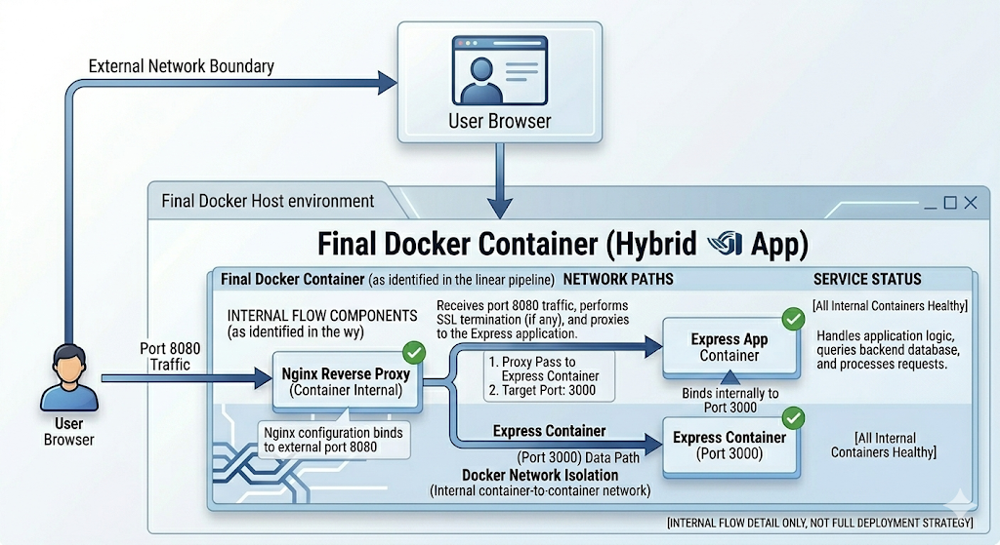
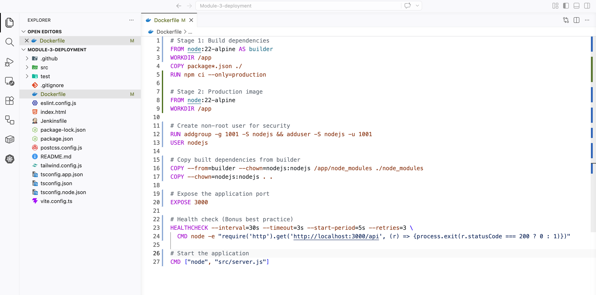
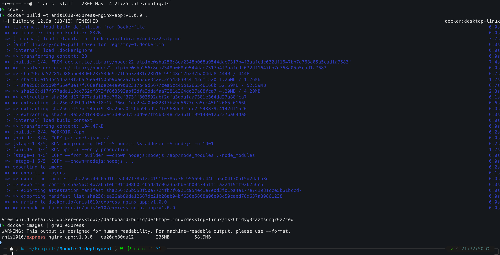
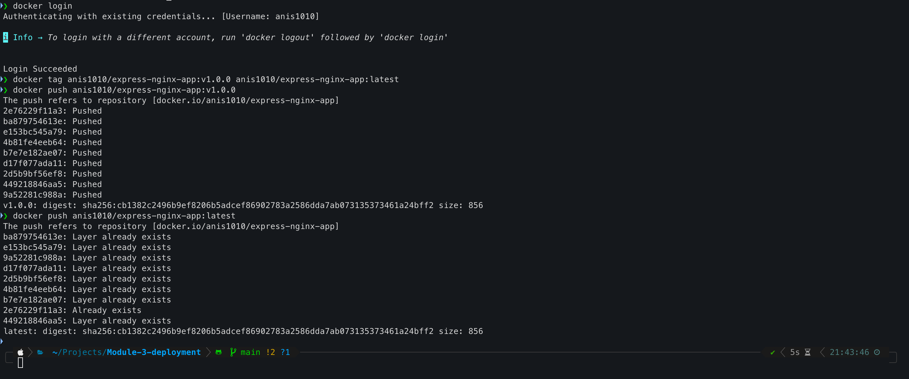
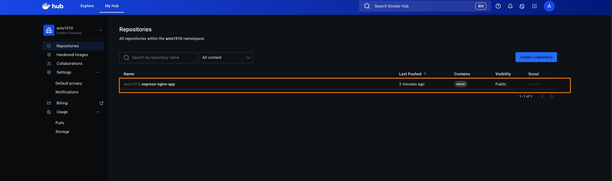
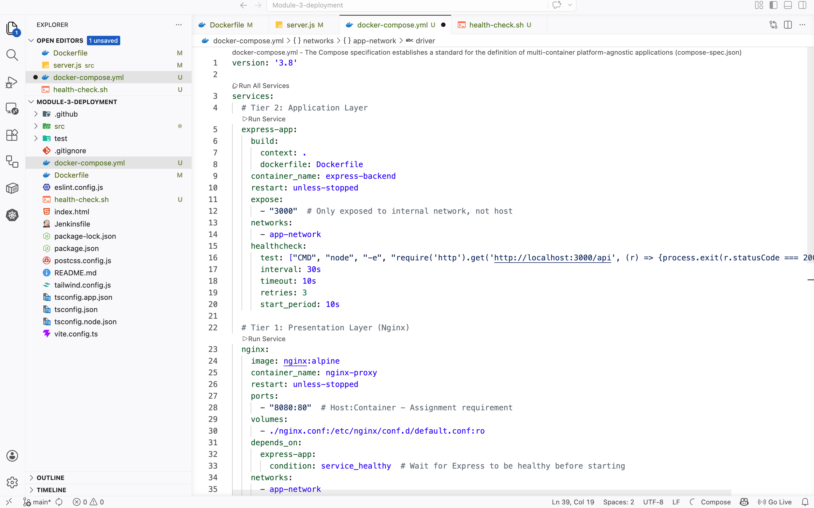
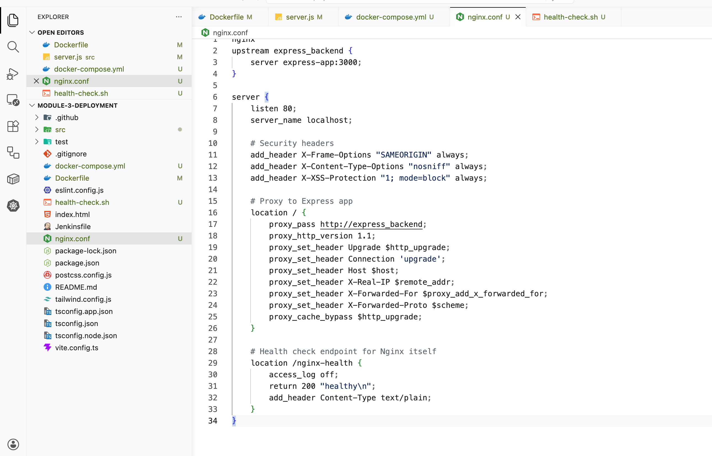
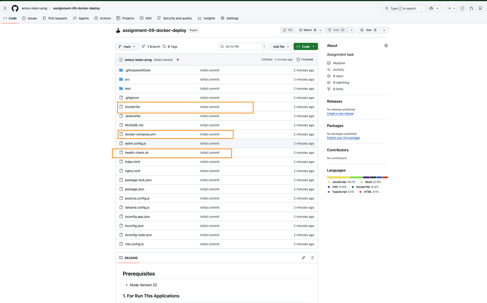

# Assignment-09 (2)
## Assignment: Dockerize and Deploy Express.js App Using Docker Compose with Nginx
> Repository to Use: https://github.com/roy35-909/Module-3-deployment

This repository contains a simple Express.js server.

## Objectives:

Your task is to containerize this Express.js app and run it alongside Nginx using Docker Compose. You will:
1. Dockerize the Node.js (Express) app.
    - Also push the image to the DockerHub
2. Create a docker-compose.yml file that:
    - Just Runs a Nginx image.
    - Builds and runs the Express.js app from the Dockerfile.
    - Starts the Express app after Nginx.
3. Expose the application on port 8080.
4. Use Docker Compose to run everything.
5. Verify it's working in the browser.

## Submission

- Take screenshots of each step and compile them into a PDF for submission.
- DockerHub Image Link.
- Add your Dockerfile and docker-compose.yml file on your git-repo and share the public link .

---

# Infrastructure Architecture & Project Overview

**Traffic Flow:**
```
User Browser → Port 8080 → Nginx Container → Express Container (Port 3000)
                     ↑___________________________↓
                              Docker Network
```



---

## Local Development & Containerization

### Clone and Inspect the Repository
```bash
# Clone the repo
git clone https://github.com/roy35-909/Module-3-deployment.git
cd Module-3-deployment

# Inspect structure
ls -la
cat package.json
cat src/server.js  # Verify routes and port
```

**Screenshot 1:** Terminal showing `git clone` and directory listing.


### Create the Dockerfile
Create `Dockerfile` in the project root:

```dockerfile
# Stage 1: Build dependencies
FROM node:22-alpine AS builder
WORKDIR /app
COPY package*.json ./
RUN npm ci --only=production

# Stage 2: Production image
FROM node:22-alpine
WORKDIR /app

# Create non-root user for security
RUN addgroup -g 1001 -S nodejs && adduser -S nodejs -u 1001
USER nodejs

# Copy built dependencies from builder
COPY --from=builder --chown=nodejs:nodejs /app/node_modules ./node_modules
COPY --chown=nodejs:nodejs . .

# Expose the application port
EXPOSE 3000

# Health check (Bonus best practice)
HEALTHCHECK --interval=30s --timeout=3s --start-period=5s --retries=3 \
  CMD node -e "require('http').get('http://localhost:3000/api', (r) => {process.exit(r.statusCode === 200 ? 0 : 1)})"

# Start the application
CMD ["node", "src/server.js"]
```

**Key DevOps Standards Applied:**
- **Multi-stage build:** Reduces final image size (~50% smaller)
- **Non-root user:** Security best practice (CVE mitigation)
- **Health check:** Built-in container health verification
- **Alpine Linux:** Minimal attack surface

**Screenshot 2:** Dockerfile content in editor.


### Build and Test the Docker Image Locally
```bash
# Build the image
docker build -t yourdockerhubusername/express-nginx-app:v1.0.0 .

# Verify image built
docker images | grep express

# Test run (detached mode)
docker run -d -p 3000:3000 --name express-test yourdockerhubusername/express-nginx-app:v1.0.0

# Check if running
docker ps
curl http://localhost:3000
curl http://localhost:3000/api

# Stop and remove test container
docker stop express-test && docker rm express-test
```

**Screenshot 3:** Docker build output and `curl` verification.




### Push to Docker Hub
```bash
# Login to Docker Hub
docker login

# Tag for Docker Hub (replace with your username)
docker tag yourdockerhubusername/express-nginx-app:v1.0.0 yourdockerhubusername/express-nginx-app:latest

# Push both tags
docker push yourdockerhubusername/express-nginx-app:v1.0.0
docker push yourdockerhubusername/express-nginx-app:latest
```
> DockerHub Link 🔗 → https://hub.docker.com/r/anis1010/express-nginx-app

**Screenshot 4:** Docker Hub push success and repository page showing the image.



---

## Docker Compose Orchestration

### Create docker-compose.yml
Create `docker-compose.yml` in the project root:

```yaml
version: '3.8'

services:
  # Tier 2: Application Layer
  express-app:
    build:
      context: .
      dockerfile: Dockerfile
    container_name: express-backend
    restart: unless-stopped
    expose:
      - "3000"  # Only exposed to internal network, not host
    networks:
      - app-network
    healthcheck:
      test: ["CMD", "node", "-e", "require('http').get('http://localhost:3000/api', (r) => {process.exit(r.statusCode === 200 ? 0 : 1)})"]
      interval: 30s
      timeout: 10s
      retries: 3
      start_period: 10s

  # Tier 1: Presentation Layer (Nginx)
  nginx:
    image: nginx:alpine
    container_name: nginx-proxy
    restart: unless-stopped
    ports:
      - "8080:80"  # Host:Container - Assignment requirement
    volumes:
      - ./nginx.conf:/etc/nginx/conf.d/default.conf:ro
    depends_on:
      express-app:
        condition: service_healthy  # Wait for Express to be healthy before starting
    networks:
      - app-network

networks:
  app-network:
    driver: bridge
```

**Screenshot 5:** docker-compose.yml content.



### Create Nginx Configuration
Create `nginx.conf` in the project root:

```nginx
upstream express_backend {
    server express-app:3000;
}

server {
    listen 80;
    server_name localhost;

    # Security headers
    add_header X-Frame-Options "SAMEORIGIN" always;
    add_header X-Content-Type-Options "nosniff" always;
    add_header X-XSS-Protection "1; mode=block" always;

    # Proxy to Express app
    location / {
        proxy_pass http://express_backend;
        proxy_http_version 1.1;
        proxy_set_header Upgrade $http_upgrade;
        proxy_set_header Connection 'upgrade';
        proxy_set_header Host $host;
        proxy_set_header X-Real-IP $remote_addr;
        proxy_set_header X-Forwarded-For $proxy_add_x_forwarded_for;
        proxy_set_header X-Forwarded-Proto $scheme;
        proxy_cache_bypass $http_upgrade;
    }

    # Health check endpoint for Nginx itself
    location /nginx-health {
        access_log off;
        return 200 "healthy\n";
        add_header Content-Type text/plain;
    }
}
```

**Screenshot 6:** nginx.conf content.



### Run Docker Compose Locally
```bash
# Start services (Nginx will wait for Express health check)
docker-compose up -d

# View logs
docker-compose logs -f

# Verify services
docker-compose ps

# Test endpoints
curl http://localhost:8080
curl http://localhost:8080/api
curl http://localhost:8080/nginx-health
```

**Screenshot 7:** `docker-compose ps` showing both containers running.


**Screenshot 8:** Browser showing `localhost:8080` with the hello world page.


**Screenshot 9:** Browser showing `localhost:8080/api` with JSON response.


---

## Git Repository & Submission Preparation

### Commit Configuration Files to Your Git Repo
```bash
# On your local machine, in the project directory
git add Dockerfile docker-compose.yml nginx.conf
git commit -m "feat: add Docker containerization with Nginx reverse proxy

- Add multi-stage Dockerfile with Node.js 22 Alpine
- Add docker-compose.yml with health checks and dependency management
- Add Nginx configuration with security headers and reverse proxy
- Expose application on port 8080 per assignment requirements"

git push origin main
```

> github repo link 🔗 → https://github.com/anisul-islam-prog/assignment-09-docker-deploy

**Screenshot 10:** GitHub repository showing the three new files.



---

## Best Practice Recommendation: Automated Health Check Dashboard

To make your submission stand out, implement a **Container Health Check Dashboard** using a simple shell script that outputs a real-time status report. This demonstrates monitoring awareness without requiring CloudWatch access.

### Add Health Monitoring Script
Create `health-check.sh` in your repo:

```bash
#!/bin/bash
# health-check.sh - Standalone container health monitor
# Usage: ./health-check.sh

echo "=========================================="
echo "  Container Health Check Dashboard"
echo "  $(date)"
echo "=========================================="

# Check Docker daemon
echo -e "\n🐳 Docker Status:"
docker info --format '{{.Name}} - {{.ServerVersion}}' 2>/dev/null || echo "❌ Docker not running"

# Check running containers
echo -e "\n📦 Running Containers:"
docker ps --format "table {{.Names}}\t{{.Status}}\t{{.Ports}}" | grep -E "(express|nginx)" || echo "❌ No app containers found"

# Check container health
echo -e "\n🏥 Container Health:"
for container in express-backend nginx-proxy; do
    health=$(docker inspect --format='{{.State.Health.Status}}' $container 2>/dev/null)
    if [ "$health" == "healthy" ]; then
        echo "  ✅ $container: $health"
    elif [ "$health" == "unhealthy" ]; then
        echo "  ❌ $container: $health"
    else
        echo "  ⚠️  $container: No health check configured"
    fi
done

# Test application endpoints
echo -e "\n🌐 Application Endpoints:"
for endpoint in "http://localhost:8080" "http://localhost:8080/api" "http://localhost:8080/nginx-health"; do
    status=$(curl -s -o /dev/null -w "%{http_code}" $endpoint 2>/dev/null)
    if [ "$status" == "200" ]; then
        echo "  ✅ $endpoint → HTTP $status"
    else
        echo "  ❌ $endpoint → HTTP $status"
    fi
done

echo -e "\n=========================================="
echo "  End of Health Report"
echo "=========================================="
```

Make it executable:
```bash
chmod +x health-check.sh
```

**Screenshot 11:** Terminal showing `./health-check.sh` output with all green checks.


---

### Summary Checklist for Submission

| Requirement | Evidence | Status |
|-------------|----------|--------|
| **Dockerfile** | Multi-stage, non-root user, health check | &#9745; |
| **docker-compose.yml** | Nginx + Express, dependency management, port 8080 | &#9745; |
| **Docker Hub Image** | `yourdockerhubusername/express-nginx-app:v1.0.0` | &#9745; |
| **Git Repo Link** | Public repo with Dockerfile, docker-compose.yml, nginx.conf | &#9745; |
| **Screenshots** | 11 screenshots covering all steps | &#9745; |
| **Bonus** | health-check.sh script | &#9745; |

---