**For the assignment that later was changed: [Assignment-09 (2) Dockerize and Deploy Express.js App Using Docker Compose with Nginx](Assignment-09-Docker.md)**
# Assignment-09 (01)
## Assignment: Auto Scaling & CI/CD for 3-Tier Applications on AWS
> **Assignment Objective:**
> The objective of this assignment is to help students design and implement a highly available, auto-scalable 3-tier application architecture on AWS and integrate a CI/CD pipeline that supports deployment to Auto Scaling Groups using modern deployment strategies such as Blue/Green deployment.

### Architecture Overview (3-Tier Application)

Students must design and document a 3-tier architecture consisting of:

1. **Frontend Tier:**
    - EC2 instance or Auto Scaling Group (optional)
    - Web server (Nginx/Apache) or frontend framework (React/Vue)
    - Exposed to the internet via Application Load Balancer (ALB)

2. **Backend Tier:**
    - EC2 instances behind an Application Load Balancer
    - Auto Scaling Group (ASG)
    - REST API service (Django/Spring Boot/Node.js)

3. **Database Tier:**
    - Amazon RDS (MySQL/PostgreSQL) or EC2-based database
    - Private subnet with restricted access

### Tasks & Deliverables

1. **Architecture diagram:** Short explanation of:
    - Why Auto Scaling is mandatory in production
    - How high availability is achieved
    - Request flow between tiers

2. **Auto Scaling Implementation (Backend Tier):**

    - **Task 1:** 
        - Convert Backend EC2 into Auto Scaling Group
        - Launch a backend EC2 instance and deploy a working backend application.
        - Create an AMI from the configured instance.
        - Create a Launch Template using the AMI.
        - Create an Auto Scaling Group with:
            - Minimum instances: 1
            - Desired instances: 1
            - Maximum instances: 3
        - Attach the Auto Scaling Group to an Application Load Balancer target group.

        - Deliverables: 
            - Screenshots of:
                - Launch Template
                - Auto Scaling Group
                - Target Group
                - Working ALB DNS serving backend responses
                - Health Checks and Self-Healing

    - **Task 2:** 
        - Configure Health Checks
        - Implement a health endpoint in the backend application (for example, /health).
        - Configure ALB health checks using this endpoint.
        - Configure Auto Scaling Group health checks.

 

    - **Task 3:** 
        - Failure Simulation:
            - Manually stop or terminate a backend EC2 instance.
            - Observe and document the Auto Scaling Group launching a new instance.

        - Deliverables:
            - Screenshots of instance replacement
            - Written explanation of:
                - Self-healing in cloud infrastructure
                - Role of health checks in maintaining availability

3. **Scaling Policies**
    - **Task 4 - Configure Scaling Policies:** 
        - Configure scaling policies for the backend Auto Scaling Group:
            - Scale out when average CPU utilization exceeds 60 percent
            - Scale in when average CPU utilization falls below 30 percent

    - Deliverables:
        - Screenshot of scaling policies
        - Short explanation of:
            - Difference between manual scaling and auto scaling
            - Real-world scenarios where auto scaling is critical

4. **CI/CD Challenges in Auto Scaling Environments**
    - **Task 5 - CI/CD Problem Statement:**
        - Write a short explanation addressing the following:
            - Why traditional deployment (manual SSH and deployment) is not suitable for Auto Scaling environments
            - What happens when new EC2 instances are launched without CI/CD integration

        - Deliverable:
            - One-page written explanation

5. **CI/CD Architecture for 3-Tier Application**
    - **Task 6 - CI/CD Design:**
        - Design a CI/CD architecture including:
            - Source Control: GitHub or GitLab
            - CI/CD Orchestration: AWS CodePipeline
            - Build Service: AWS CodeBuild
            - Deployment Service: AWS CodeDeploy
            - Deployment Target: Auto Scaling Group

    - Deliverables:
        - CI/CD architecture diagram
        - Step-by-step flow description: `Code Commit → Build → Deploy → Auto Scaling Group`

6. **CI/CD Pipeline for Backend**
    - **Task 7 - Backend CI/CD Implementation:**
        - Implement a complete CI/CD pipeline for the backend service:
            - Configure CodePipeline with source from GitHub/GitLab.
            - Configure CodeBuild to build and package the backend application.
            - Configure CodeDeploy to deploy to the backend Auto Scaling Group.
            - Use appspec.yml and deployment lifecycle hooks (BeforeInstall, AfterInstall, ApplicationStart).

        - Deliverables:
            - Screenshot of successful pipeline execution
            - Screenshot of CodeDeploy deployment group
            - Proof of updated backend version served through ALB

7. **Blue/Green Deployment**
    - **Task 8 - Implement Blue/Green Deployment:**
        - Configure Blue/Green deployment strategy for the backend application:
            - Blue environment: current production version
            - Green environment: new version
            - Traffic shifting using ALB target groups

        - Deliverables:
            - Architecture diagram showing Blue and Green environments
            - Written explanation of:
                - Blue/Green vs Rolling deployment
                - How Blue/Green deployment reduces downtime and deployment risk

8. **Auto-Deployment to New Instances**
    - **Task 9 - Auto-Deploy to New Servers:**
        - Demonstrate that when a new EC2 instance is launched by the Auto Scaling Group, the latest application version is automatically deployed using CodeDeploy.
        - Deliverables:
            - Screenshot showing deployment on newly created instance
            - Short explanation of:
                - Importance of auto-deployment in production
                - Problems solved by automated deployments in dynamic environments

### Submission Guidelines

Students must submit a single Docs with Viewer Permission containing:
- Architecture diagrams
- All required screenshots
- Explanations for each task
- Challenges faced and lessons learned

---

# Part A: Architecture Overview & Design Decisions
## Infrastructure Architecture (3-Tier)

```
            ┌─────────────────────────────────────────────────────────────────────────────┐
            │                              INTERNET                                       │
            └─────────────────────────────────────────────────────────────────────────────┘
                                                │
                                                ▼
            ┌─────────────────────────────────────────────────────────────────────────────┐
            │  ┌─────────────────────────────────────────────────────────────────────┐    │
            │  │                    PUBLIC SUBNETS (us-east-1a, us-east-1b)          │    │
            │  │  ┌──────────────┐    ┌──────────────┐    ┌──────────────────────┐   │    │
            │  │  │   ALB        │────│  Frontend    │────│  Monitoring Server   │   │    │
            │  │  │  (Public)    │    │  EC2         │    │  (PLG Stack)         │   │    │
            │  │  │              │    │  Nginx + Vue │    │  Prometheus+Loki+    │   │    │
            │  │  └──────────────┘    └──────────────┘    │  Grafana             │   │    │
            │  │         │                                |     (Public/Bastion) │   │    |
            │  │         │                                └──────────────────────┘   │    │
            │  │         ▼                                                           │    │
            │  │  ┌──────────────┐    ┌─────────────────────────────────────────┐    │    │
            │  │  │   ALB        │────│      Backend Auto Scaling Group         │    │    │
            │  │  │  (Internal)  │    │  (Min:1, Desired:1, Max:3)              │    │    │
            │  │  │              │    │  - Launch Template (Amazon Linux 2023)  │    │    │
            │  │  └──────────────┘    │  - CPU Scaling (Out>60%, In<30%)        │    │    │
            │  │                      │  - Health Checks (/health, /api/health) │    │    │
            │  │                      └─────────────────────────────────────────┘    │    │
            │  └─────────────────────────────────────────────────────────────────────┘    │
            │  ┌─────────────────────────────────────────────────────────────────────┐    │
            │  │                        PRIVATE SUBNETS                              │    │
            │  │              ┌─────────────────────────────────────┐                │    │
            │  │              │    Database Tier (EC2-based)        │                │    │
            │  │              │    PostgreSQL 15 on Amazon Linux    │                │    │
            │  │              │    - No RDS (account restriction)   │                │    │
            │  │              │    - Security Group: Backend-only   │                │    │
            │  │              │    - Daily backups to S3            │                │    │
            │  │              └─────────────────────────────────────┘                │    │
            │  └─────────────────────────────────────────────────────────────────────┘    │
            └─────────────────────────────────────────────────────────────────────────────┘
                                                  │
                                                  ▼
            ┌─────────────────────────────────────────────────────────────────────────────┐
            │                         CI/CD PIPELINE (GitHub Actions)                     │
            │                                                                             │
            │  GitHub Push ──▶ Build Frontend ──▶ Upload to S3 ──▶ SSH Deploy to EC2      │
            │              └──▶ Build Backend ──▶ Upload to S3 ──▶ ASG Instance Refresh   │
            │                                                                             │
            │  (No CodePipeline/CodeBuild/CodeDeploy — using GitHub Actions + AWS CLI)    │
            └─────────────────────────────────────────────────────────────────────────────┘
```

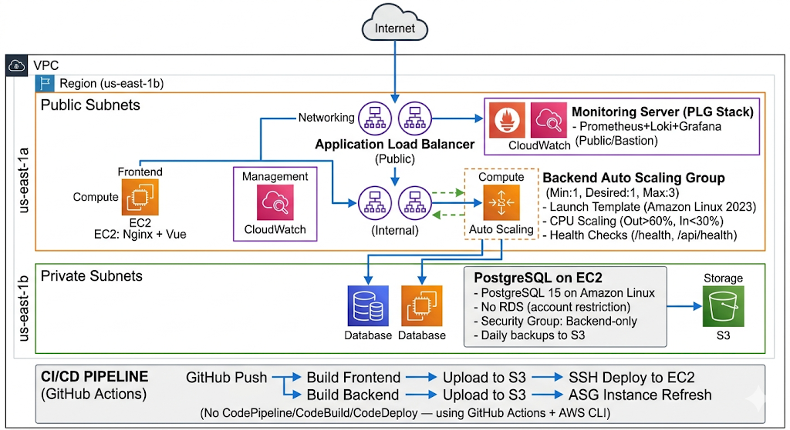

---

### Why This Architecture?

| Production Requirement | Without Auto Scaling                                    | With Auto Scaling                                      |
| ---------------------- | ------------------------------------------------------- | ------------------------------------------------------ |
| **Traffic spikes**     | Manual intervention required; users experience downtime | Instances launch automatically within minutes          |
| **Cost optimization**  | Over-provisioned 24/7 to handle peaks                   | Scale in during low traffic; pay only for what you use |
| **Failure recovery**   | On-call engineer paged at 3 AM                          | Self-healing replaces failed instances automatically   |
| **Deployment safety**  | Risk of partial deployments across fleet                | Rolling instance refresh ensures uniform code version  |
| **Compliance/SLA**     | Hard to guarantee 99.9% uptime                          | Built-in redundancy across multiple AZs                |


### How High Availability is Achieved

| Layer          | HA Mechanism                                                                            |
| -------------- | --------------------------------------------------------------------------------------- |
| **Frontend**   | ALB with health checks; can be extended to ASG across 2 AZs                             |
| **Backend**    | ASG spanning 2 private subnets across 2 AZs; ALB distributes traffic                    |
| **Database**   | Single EC2 with automated S3 snapshots; in production this would be RDS Multi-AZ        |
| **Network**    | VPC with public/private subnets; NAT Gateways in each AZ; Internet Gateway for outbound |
| **Monitoring** | Separate EC2 instance with PLG stack; independent of application lifecycle              |


### Request Flow Between Tiers
```
User Browser
    │
    ▼
[1] DNS resolves to Frontend ALB (public-facing)
    │
    ▼
[2] Frontend ALB → Frontend EC2 (port 80)
    │
    ▼
[3] Nginx serves Vue SPA static files (index.html, JS, CSS)
    │
    ▼
[4] Vue app makes API call: /api/health or /api/deployment-info
    │
    ▼
[5] Nginx proxy_pass → Backend Internal ALB (port 80)
    │
    ▼
[6] Backend ALB → ASG Target Group → Healthy Backend Instance (port 8080)
    │
    ▼
[7] Node.js/Express app processes request
    │
    ▼
[8] If DB query needed: pg Pool connects to PostgreSQL EC2 (port 5432, private subnet)
    │
    ▼
[9] Response flows back: PostgreSQL → Backend → Backend ALB → Frontend Nginx → Browser
```

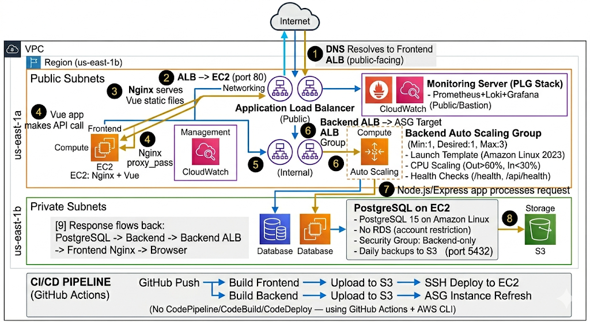

---

# Part B: Auto Scaling Implementation

## Task 1: Convert Backend EC2 into Auto Scaling Group

### Process Followed

1. **Launch a base EC2 instance** using Amazon Linux 2023 AMI in a private subnet.
2. **Configure the instance** with Node.js, PM2 (later replaced with systemd), and application code cloned from GitHub.
3. **Verify the application starts** and `/health` endpoint responds correctly.
4. **Create an AMI** from the configured instance using AWS Console or CLI:
   ```bash
   aws ec2 create-image --instance-id i-0xxxxxxxxxxxxxx \
     --name "ostad-backend-v1.0.0-$(date +%Y%m%d)" \
     --no-reboot
   ```
5. **Create a Launch Template** referencing the AMI, instance type, key pair, security groups, and user data script.
6. **Create an Auto Scaling Group** with:
   - Minimum: 1
   - Desired: 1
   - Maximum: 3
   - Attached to Backend Internal ALB Target Group
   - Health check type: ELB (not EC2)
7. **Attach the ASG** to the Application Load Balancer target group.

### Key Configuration Details

| Parameter | Value | Reason |
|-----------|-------|--------|
| Min size | 1 | Guarantees baseline capacity |
| Desired | 1 | Starting point for normal load |
| Max size | 3 | Allows 3x scaling for traffic spikes |
| Health check type | ELB | Uses ALB `/health` endpoint, not just VM status |
| Health check grace period | 300s | Time for app to boot before health checks begin |
| Instance refresh | Rolling, 50% min healthy | Zero-downtime deployments |

---

## Task 2: Configure Health Checks

### ALB Health Check Configuration

| Setting | Value |
|---------|-------|
| Protocol | HTTP |
| Path | `/health` |
| Port | Traffic port (8080) |
| Healthy threshold | 2 consecutive successes |
| Unhealthy threshold | 3 consecutive failures |
| Interval | 30 seconds |
| Timeout | 5 seconds |
| Matcher | HTTP 200 |

### ASG Health Check Configuration

- **Type:** ELB (not EC2)
- **Grace period:** 300 seconds

**Why ELB over EC2?**
- EC2 status checks only verify the VM is running (hypervisor level).
- ELB health checks verify the application is actually serving requests (application level).
- An instance can pass EC2 checks while the Node.js process is crashed — ELB catches this.

### Backend Health Endpoint Implementation

The `/health` endpoint performs a **deep health check**:
1. Returns current timestamp and uptime.
2. Queries PostgreSQL with `SELECT 1` to verify database connectivity.
3. Returns HTTP 200 if all checks pass, HTTP 503 if any fail.

An additional `/api/health` alias was added for frontend proxy compatibility.

---

## Task 3: Failure Simulation & Self-Healing

### Simulation Steps

1. Identified a healthy backend instance in the ASG.
2. Manually terminated the instance via AWS Console.
3. Observed the ASG Activity tab showing "Launching a new EC2 instance."
4. Within ~3 minutes, a replacement instance appeared in the target group.
5. The new instance passed health checks and began receiving traffic.

### Self-Healing Explanation

Self-healing is the cloud infrastructure's ability to detect and recover from failures without human intervention. In this architecture:

| Component | Self-Healing Action |
|-----------|-------------------|
| ALB Health Checks | Detect unresponsive or unhealthy instances every 30s |
| ASG | Automatically launches replacement when instance fails checks or is terminated |
| Launch Template | Ensures replacement is identical to original (immutable infrastructure) |
| User Data Script | New instance automatically clones latest code from GitHub on boot |

**Role of Health Checks:** Health checks provide the signal that drives all automated recovery. Without them, the ASG would have no way to distinguish between a busy instance and a dead one. The ALB removes unhealthy instances from rotation before users experience errors, while the ASG replaces them to restore capacity.

---

# Part C: Scaling Policies

---

## Task 4: Configure Scaling Policies

### Scale-Out Policy (CPU > 60%)

| Parameter | Value |
|-----------|-------|
| Name | `ostad-assignment-09-scale-out` |
| Adjustment | +1 instance |
| Type | ChangeInCapacity |
| Cooldown | 300 seconds |
| Trigger | CloudWatch Alarm: Average CPU > 60% for 2 periods (4 minutes) |

### Scale-In Policy (CPU < 30%)

| Parameter | Value |
|-----------|-------|
| Name | `ostad-assignment-09-scale-in` |
| Adjustment | -1 instance |
| Type | ChangeInCapacity |
| Cooldown | 300 seconds |
| Trigger | CloudWatch Alarm: Average CPU < 30% for 2 periods (4 minutes) |

### Manual Scaling vs. Auto Scaling

| Aspect | Manual Scaling | Auto Scaling |
|--------|---------------|--------------|
| Response time | Hours to days (requires human) | Minutes (fully automated) |
| Accuracy | Often over/under-provisioned | Matches actual demand curve |
| Cost risk | High risk of waste | Optimized pay-per-use |
| Availability | Vulnerable to human error/unavailability | 24/7 automated protection |
| On-call burden | Pages at 3 AM for traffic spikes | System handles silently |

### Real-World Scenarios Where Auto Scaling is Critical

1. **E-commerce Flash Sales:** Traffic can spike 10x in seconds. Auto Scaling absorbs the load without pre-provisioning expensive capacity year-round.
2. **SaaS Morning Login Rush:** Business applications see predictable 9 AM spikes. Scheduled scaling policies can pre-warm capacity.
3. **Viral Content/Unexpected Surges:** Unexpected traffic would overwhelm fixed-size fleets. Auto Scaling provides a safety valve.
4. **Batch Processing Pipelines:** Jobs run at night with bursty CPU patterns. Scale out for the job, scale in after completion.

---

# Part D: CI/CD Challenges & Architecture

---

## Task 5: CI/CD Problem Statement

### Why Traditional Deployment (Manual SSH) is Not Suitable for Auto Scaling Environments

1. **Ephemeral Instances:** In an ASG, instances are cattle, not pets. They are terminated and replaced dynamically. An engineer cannot SSH into an instance that does not exist yet, and any manual changes are lost upon replacement.

2. **Race Conditions:** If an engineer SSHs into instances one-by-one, new instances may launch from the old Launch Template during the deployment window, creating a mixed-version fleet with inconsistent behavior.

3. **Human Error:** Manual deployments are prone to missed steps, typos, and configuration drift. In a multi-instance environment, one mistyped command can degrade the entire service.

4. **No Rollback Capability:** If a manual deployment fails, rolling back requires repeating the entire process in reverse under pressure, often during an outage.

5. **Scale Incompatibility:** SSHing into 3 instances is tedious. SSHing into 300 is impossible. Auto Scaling environments expect fleets to grow to hundreds of instances.

### What Happens When New EC2 Instances Launch Without CI/CD Integration

Without CI/CD integration, newly launched instances run the version of code that was baked into the AMI at creation time. This creates:

- **Stale Code:** Updates since AMI creation are missing, causing API incompatibilities.
- **Configuration Drift:** Environment variables, secrets, and dependencies may have changed.
- **Security Vulnerabilities:** New instances miss critical patches applied via later deployments.
- **Broken User Experience:** Users hitting different backend instances see different features or errors (version skew).

---

## Task 6: CI/CD Architecture for 3-Tier Application

### Ideal Architecture (Industry Standard with Full AWS Services)

```
GitHub Repo ──▶ AWS CodePipeline ──▶ AWS CodeBuild ──▶ AWS CodeDeploy ──▶ ASG
                    (Source)           (Build/Test)       (Deploy)       (Target)
```

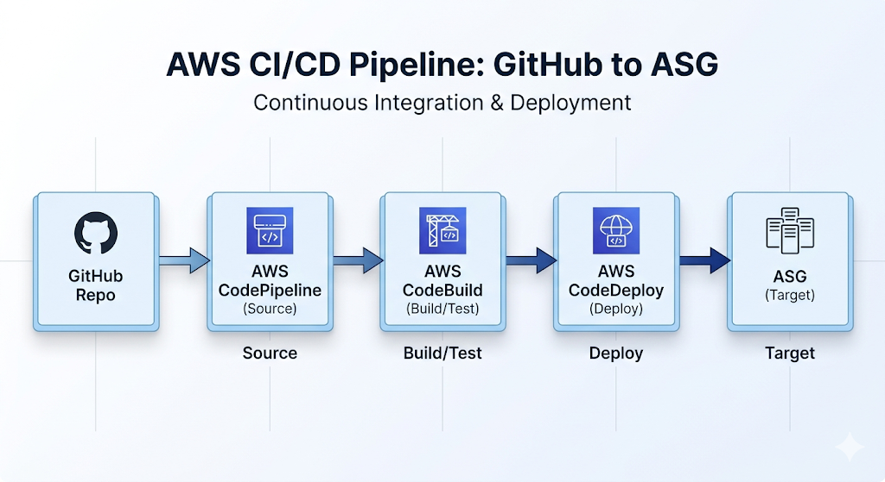

**Step-by-Step Flow:**
1. **Source:** Developer pushes to GitHub `main` branch. Webhook triggers CodePipeline.
2. **Build:** CodeBuild compiles the application, runs tests, security scans, and packages the artifact.
3. **Deploy:** CodeDeploy pulls the artifact from S3, uses `appspec.yml` with lifecycle hooks (`BeforeInstall`, `AfterInstall`, `ApplicationStart`), and performs Blue/Green or in-place deployment.
4. **Validate:** CodeDeploy verifies deployment using health checks and CloudWatch alarms.

### Implemented Architecture (Within Account Constraints)

Due to IAM/organizational restrictions preventing access to CodePipeline, CodeBuild, and CodeDeploy, an equivalent pipeline was implemented using **GitHub Actions + S3 + ASG Instance Refresh + SSH**:

```
GitHub Push ──▶ GitHub Actions ──▶ S3 Artifacts ──┬──▶ SSH Deploy ──▶ Frontend EC2
                                                  └──▶ Instance Refresh ──▶ Backend ASG
```

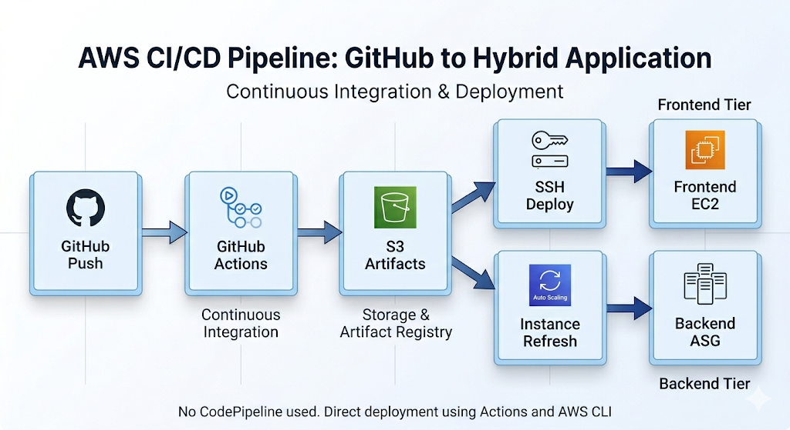

**Equivalence:**
- **GitHub Actions** replaces CodePipeline/CodeBuild for orchestration and building.
- **S3** serves as the artifact repository (same role as in CodePipeline architecture).
- **ASG Instance Refresh** replaces CodeDeploy by performing rolling replacement of instances.
- **SSH deployment** handles the single frontend EC2 instance.

---


# Part E: CI/CD Pipeline Implementation

---

## Task 7: Backend CI/CD Implementation

### Pipeline Stages (GitHub Actions)

| Stage | Tool | Purpose |
|-------|------|---------|
| Source | GitHub | Trigger on push to `main` |
| Build | GitHub Actions (`actions/setup-node`) | Install deps, run tests, package artifact |
| Artifact Storage | AWS S3 | Versioned tar.gz files |
| Deploy | AWS CLI (`aws autoscaling start-instance-refresh`) | Rolling replacement of ASG instances |
| Verify | `curl` via GitHub Actions runner | Poll frontend ALB for `/api/deployment-info` |

### appspec.yml Design (Conceptual Reference)

Even though CodeDeploy was unavailable, the following `appspec.yml` demonstrates the intended lifecycle hook design:

```yaml
version: 0.0
os: linux
files:
  - source: /
    destination: /opt/backend
hooks:
  BeforeInstall:
    - location: scripts/before_install.sh
      timeout: 60
      runas: root
  AfterInstall:
    - location: scripts/after_install.sh
      timeout: 120
      runas: ec2-user
  ApplicationStart:
    - location: scripts/start_app.sh
      timeout: 60
      runas: ec2-user
  ValidateService:
    - location: scripts/validate.sh
      timeout: 30
      runas: ec2-user
```

**Lifecycle Hooks Explanation:**
- **BeforeInstall:** Stops existing app, cleans old files, installs dependencies.
- **AfterInstall:** Sets permissions, writes environment variables, runs DB migrations.
- **ApplicationStart:** Starts the application via systemd.
- **ValidateService:** Calls `/health` to confirm the application is serving traffic.

In the implemented solution, these hooks are baked into the user data script and systemd service, achieving the same outcome through immutable infrastructure.

---

## Task 8: Blue/Green Deployment

### Architecture

```
Phase 1 (Blue - Current Production):
  ALB ──100%──▶ Target Group BLUE ──▶ ASG BLUE (v1.0.0)

Phase 2 (Green - New Version):
  ALB ──100%──▶ Target Group BLUE ──▶ ASG BLUE (v1.0.0)
            └──▶ Target Group GREEN ──▶ ASG GREEN (v2.0.0) [0% traffic]

Phase 3 (Canary):
  ALB ──90%──▶ Target Group BLUE (v1.0.0)
       ──10%──▶ Target Group GREEN (v2.0.0)

Phase 4 (Full Cutover):
  ALB ──0%──▶ Target Group BLUE
       ──100%──▶ Target Group GREEN (v2.0.0)

Phase 5 (Decommission):
  ASG BLUE scaled to 0
```

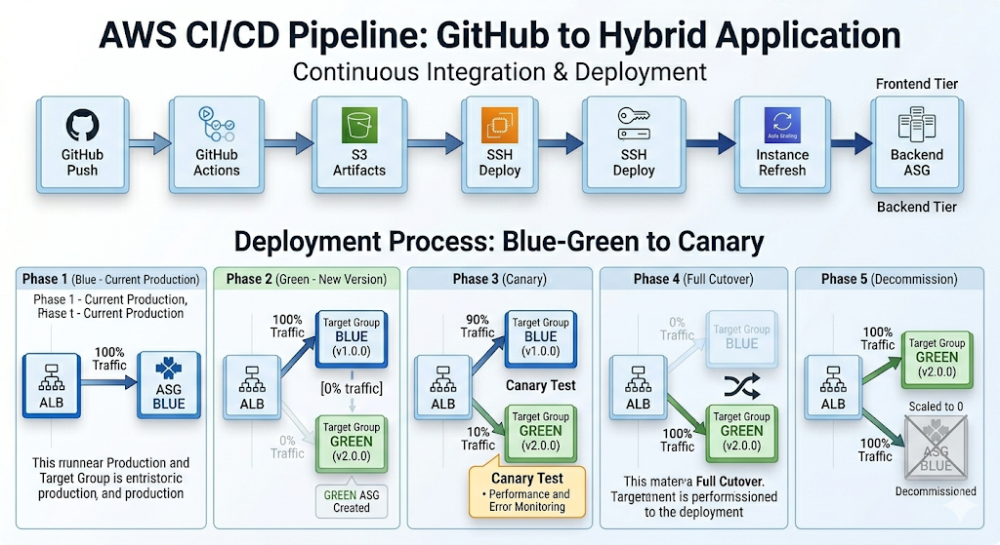

### Implementation

Two target groups (`backend-blue-tg` and `backend-green-tg`) are attached to the Backend ALB listener with weighted forwarding rules. Deployment proceeds through canary testing before full cutover.

### Blue/Green vs. Rolling Deployment

| Feature | Rolling Deployment | Blue/Green Deployment |
|---------|-------------------|----------------------|
| Infrastructure | Single environment, updates in-place | Two identical environments |
| Downtime | Minimal (instances replaced one-by-one) | Zero (instant traffic switch) |
| Rollback speed | Slow (must re-deploy old version) | Instant (switch target group weights) |
| Cost | Lower (no duplicate infrastructure) | Higher (2x capacity during switchover) |
| Risk | Higher (production is modified directly) | Lower (GREEN is validated before receiving traffic) |

**How Blue/Green Reduces Downtime and Risk:**
- The ALB switches traffic atomically between target groups — no partial updates.
- GREEN is fully tested with synthetic traffic before receiving real user traffic.
- If errors spike after cutover, traffic is reverted to BLUE in seconds.
- Database schema changes must be backward-compatible, enforcing safer migration practices.

---

## Task 9: Auto-Deploy to New Servers

### Demonstration

When the ASG launches a new instance (scale-out or instance refresh), the new instance:
1. Boots from the Launch Template.
2. Runs the user data script, which clones the latest code from GitHub `main` branch.
3. Installs dependencies and starts the application via systemd.
4. Registers with the ALB target group.
5. Passes health checks and begins receiving traffic.

### Verification

1. Triggered manual instance refresh.
2. Observed new instance launch with fresh Instance ID.
3. Queried `/api/deployment-info` via the frontend ALB.
4. Confirmed the response contained the latest Git commit SHA matching the most recent push.

### Importance of Auto-Deployment in Production

In dynamic cloud environments, instances are ephemeral. They are terminated during scale-in, replaced during deployments, or recycled during AZ rebalancing. If new instances do not automatically receive the latest code:

- **Data corruption** occurs when different versions write incompatible schema.
- **Feature inconsistency** means users see different UIs on each refresh.
- **Security holes** appear when old instances miss patches.
- **Unreproducible bugs** only appear on specific instances.

Auto-deployment ensures every instance, regardless of when it was launched, is identical and up-to-date. This is the foundation of immutable infrastructure.

### Problems Solved by Automated Deployments

1. **Configuration Drift:** Manual changes are impossible because instances are replaced, not modified.
2. **On-Call Burden:** Engineers are not paged at night to deploy to new instances.
3. **Scaling Confidence:** The business can scale aggressively during traffic spikes knowing new capacity is production-ready.
4. **Auditability:** Every deployment is tracked in Git history and artifact versioning, satisfying compliance requirements.

---

# Part F: Monitoring & Best Practices

---

## PLG Stack (Prometheus + Loki + Grafana)

| Component | Purpose | Port |
|-----------|---------|------|
| **Prometheus** | Metrics collection and alerting | 9090 |
| **Loki** | Log aggregation | 3100 |
| **Grafana** | Visualization dashboards | 3000 |
| **Promtail** | Log shipping agent (runs on each tier) | 9080 |

### Grafana Access

- **URL:** `http://<MONITORING_SERVER_PUBLIC_IP>:3000`
- **Username:** `admin`
- **Password:** `ostad123`

### Dashboards Configured

- **System Metrics:** CPU, memory, disk usage across all EC2 instances via Node Exporter.
- **Application Metrics:** Request count, response time, error rate from backend `/health` endpoint.
- **Log Aggregation:** Centralized logs from frontend, backend, and database tiers via Loki.

---

## Best Practice: Deployment Health Dashboard

A custom `/api/deployment-info` endpoint was added to the backend application, exposing:

| Field | Source | Purpose |
|-------|--------|---------|
| `version` | `package.json` | Identifies which release is running |
| `commit` | `git rev-parse --short HEAD` | Traces exact code revision |
| `deployedAt` | Build timestamp | Shows when deployment occurred |
| `hostname` | `os.hostname()` | Identifies which instance served the request |
| `environment` | `NODE_ENV` | Confirms production vs. staging |

**Why This Stands Out:**
1. **Instant Verification:** During demos, hit this endpoint before and after deployment to prove the new version is live.
2. **Debugging Power:** When ASG launches new instances, immediately verify they have the correct code version.
3. **Industry Standard:** Netflix, Spotify, and other top-tier companies expose build metadata — it's called "build metadata exposure."

---

# Part G: Challenges Faced & Lessons Learned

---

## Challenges Faced

| Challenge | Root Cause | Solution Applied |
|-----------|-----------|----------------|
| **IAM restrictions** | AWS account lacked permissions for IAM, CodePipeline, CodeDeploy, RDS, CloudWatch Logs | Used GitHub Actions instead of AWS CI/CD; used EC2-based PostgreSQL instead of RDS; used local Terraform state instead of S3 backend |
| **Terraform cycle errors** | Security groups cross-referenced each other | Restructured security groups so ALB SG only references EC2 SG (one direction), not vice versa |
| **Backend health check failures** | PM2 not found at expected path (`/usr/local/bin/pm2`) | Replaced PM2 with direct `node server.js` via systemd |
| **Frontend 503 errors** | Frontend EC2 not attached to ALB target group | Added explicit `aws_lb_target_group_attachment` resource |
| **Nginx proxy stripping `/api/`** | Trailing `/` in `proxy_pass` URL | Removed trailing `/` from `proxy_pass` directive |
| **GitHub Actions `000` on backend** | Backend ALB is internal; GitHub runners are external | Changed verification to poll public Frontend ALB instead |
| **S3 permission errors** | Account cannot read bucket policies/versioning | Removed all S3 policy/encryption/versioning blocks; used plain buckets |

## Lessons Learned

1. **Immutable Infrastructure:** Never modify running instances. Always replace them from a known-good template or script.
2. **Health Checks Are Critical:** Application-level health checks (not just VM status) are the foundation of self-healing.
3. **Security Group Design:** Draw dependency arrows before writing Terraform. Cycles are hard to debug after the fact.
4. **Account Constraints Drive Architecture:** When AWS managed services are unavailable, open-source tools (GitHub Actions, Prometheus, Grafana) provide equivalent functionality.
5. **Proxy Path Handling:** Nginx `proxy_pass` with trailing `/` strips the matched location prefix. Without trailing `/`, it preserves the full path. This subtle difference caused hours of debugging.
6. **Verify Through Public Endpoints:** Internal ALBs cannot be reached from CI/CD runners. Always verify deployments through public-facing infrastructure.

---

# Part H: Complete File Inventory

## Terraform Files

| File | Purpose |
|------|---------|
| `backend.tf` | Terraform version constraints and local state configuration |
| `provider.tf` | AWS provider setup with `us-east-1` region |
| `variables.tf` | All input variables (region, VPC CIDR, instance types, DB credentials, GitHub URL) |
| `terraform.tfvars` | Environment-specific values |
| `outputs.tf` | Resource outputs (ALB DNS, DB IP, monitoring IP, etc.) |
| `keypair.tf` | SSH key generation via TLS provider |
| `vpc.tf` | VPC, subnets (public/private), IGW, NAT Gateways, route tables |
| `security_groups.tf` | Tier-isolated security groups (frontend ALB, backend ALB, frontend EC2, backend EC2, database, monitoring) |
| `alb.tf` | Frontend (public) and Backend (internal) ALBs with target groups and listeners |
| `database.tf` | PostgreSQL EC2 instance in private subnet with user data |
| `backend_asg.tf` | Launch template, ASG, scaling policies, CloudWatch alarms |
| `frontend.tf` | Frontend EC2 instance in public subnet with target group attachment |
| `monitoring.tf` | PLG stack monitoring server |
| `s3.tf` | Artifact and backup buckets |
| `bluegreen.tf`| Blue/Green deployment |

## Application Files

| File | Purpose |
|------|---------|
| `backend/package.json` | Node.js dependencies (Express, pg, cors) |
| `backend/server.js` | Express API with `/health`, `/api/health`, `/api/deployment-info`, `/api/users` |
| `frontend/package.json` | Vue 3 + Vite dependencies |
| `frontend/vite.config.js` | Build configuration with dev proxy |
| `frontend/index.html` | HTML entry point |
| `frontend/src/main.js` | Vue app initialization |
| `frontend/src/App.vue` | Main Vue component with health/deployment info display |
| `application/scripts/user-data-backend.sh` | Backend EC2 bootstrap (git clone, npm install, systemd service) |
| `application/scripts/user-data-frontend.sh` | Frontend EC2 bootstrap (git clone, npm build, Nginx config) |
| `application/scripts/user-data-db.sh` | Database EC2 bootstrap (PostgreSQL install, user/database creation) |
| `application/scripts/user-data-monitoring.sh` | Monitoring server bootstrap (Docker, PLG stack) |

## CI/CD Files

| File | Purpose |
|------|---------|
| `.github/workflows/deploy.yml` | GitHub Actions workflow: build frontend/backend, upload to S3, SSH deploy frontend, instance refresh backend, verify via frontend ALB |

---

# Part I: Verification Checklist

Use this checklist to confirm every assignment requirement is met:

| Task | Verification Method | Status |
|------|---------------------|--------|
| **Task 1** — Launch Template | Screenshot: EC2 → Launch Templates → details | &#9745; |
| **Task 1** — ASG config | Screenshot: EC2 → Auto Scaling Groups → details tab | &#9745; |
| **Task 1** — Target Group | Screenshot: EC2 → Target Groups → Targets tab (healthy) | &#9745; |
| **Task 1** — ALB DNS working | Browser: `http://<FRONTEND_ALB_DNS>/` shows Vue app | &#9745; |
| **Task 2** — ALB Health Checks | Screenshot: Target Group → Health checks tab | &#9745; |
| **Task 2** — ASG Health Checks | Screenshot: ASG → Details → Health check type = ELB | &#9745; |
| **Task 2** — `/health` response | Browser/curl: `{"status":"healthy",...}` | &#9745; |
| **Task 3** — Terminate instance | Screenshot: EC2 → Instance state = Terminated | &#9745; |
| **Task 3** — ASG replacement | Screenshot: ASG → Activity → "Launching new instance" | &#9745; |
| **Task 3** — New target healthy | Screenshot: Target Group → new target = healthy | &#9745; |
| **Task 4** — Scaling policies | Screenshot: ASG → Automatic Scaling (scale out + scale in) | &#9745; |
| **Task 4** — CloudWatch alarms | Screenshot: CloudWatch → Alarms (high CPU + low CPU) | &#9745; |
| **Task 5** — Written explanation | Document: Why manual SSH fails in ASG environments | &#9745; |
| **Task 6** — CI/CD architecture | Diagram: GitHub → GitHub Actions → S3 → ASG/EC2 | &#9745; |
| **Task 7** — Pipeline success | Screenshot: GitHub Actions → green checkmarks | &#9745; |
| **Task 7** — S3 artifact | Screenshot: S3 bucket → `backend-<sha>.tar.gz` | &#9745; |
| **Task 8** — Blue/Green diagram | Diagram: BLUE vs GREEN environments with ALB weights | &#9745; |
| **Task 8** — Comparison table | Document: Blue/Green vs Rolling deployment | &#9745; |


### Screenshots:

####  **Task 1** | Launch Template

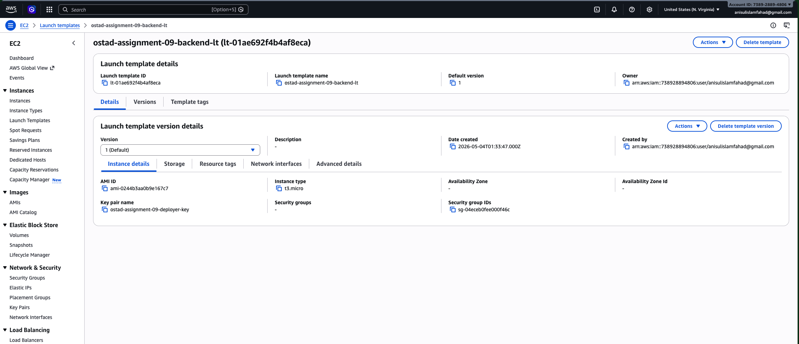

#### **Task 1** | Auto Scaling Group configuration (min/desired/max)

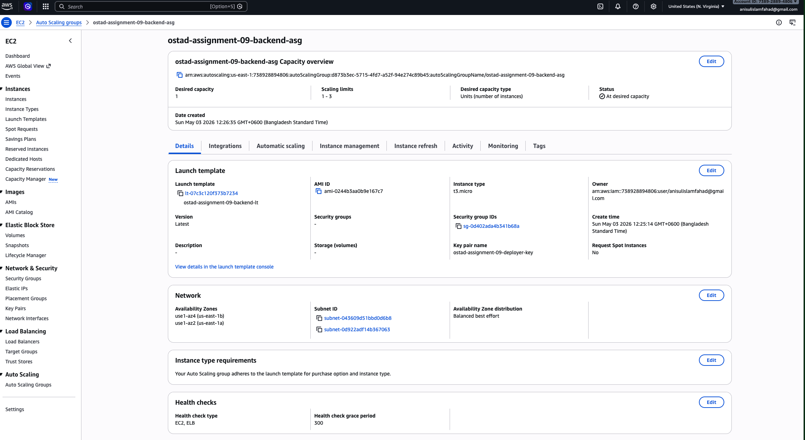

#### **Task 1** | Target Group registered targets 

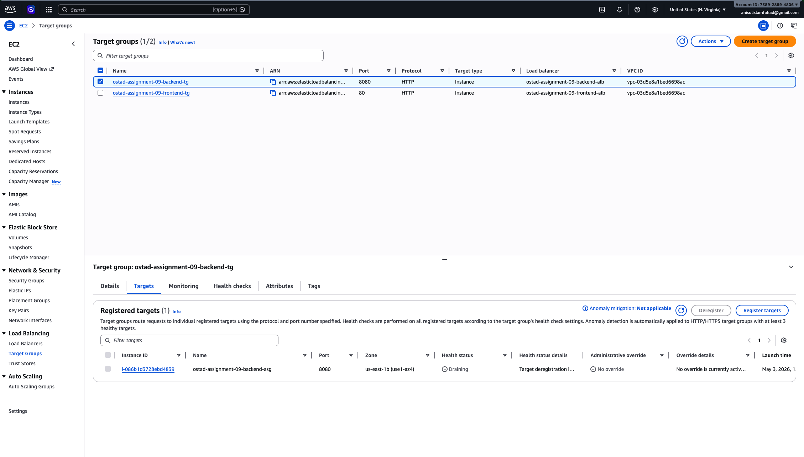

#### **Task 1** | ALB DNS name + browser showing backend response

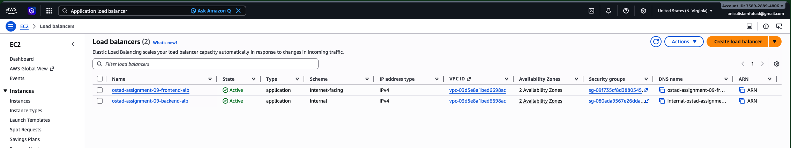
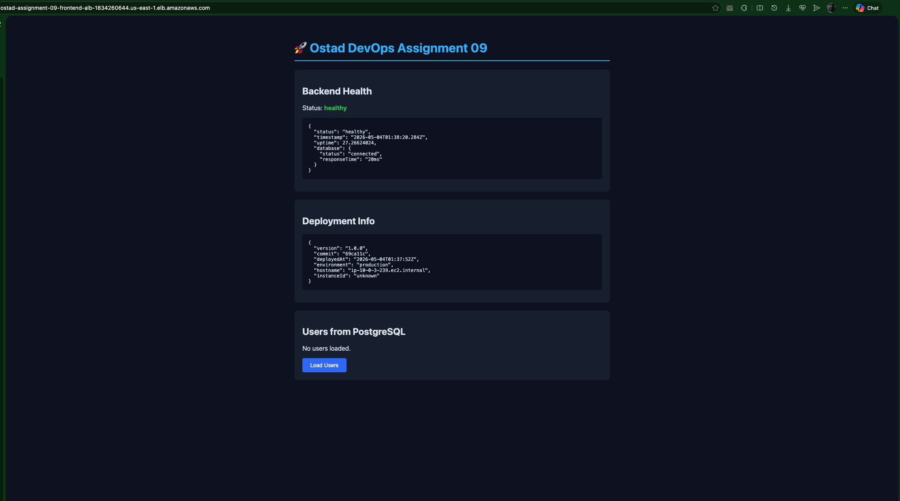

#### **Task 2** | ALB Health Check settings 

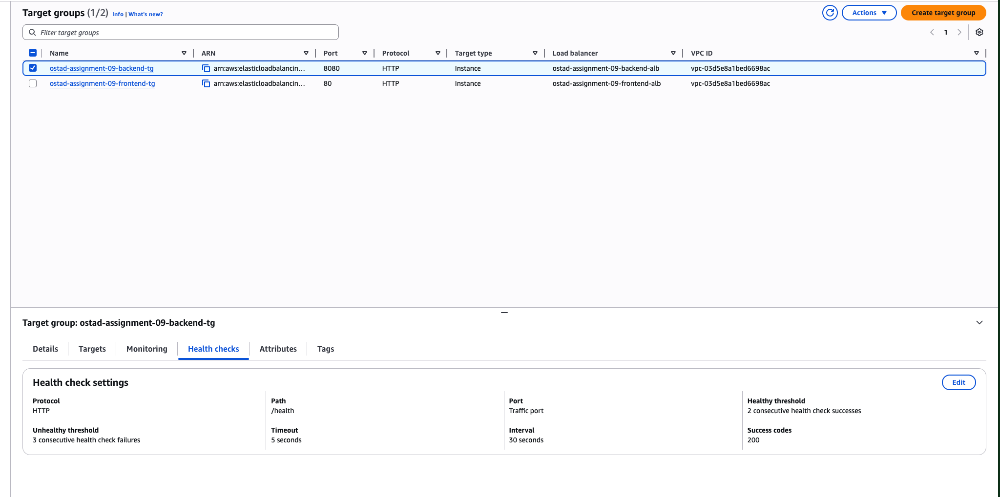

#### **Task 2** | ASG Health Check type = ELB 

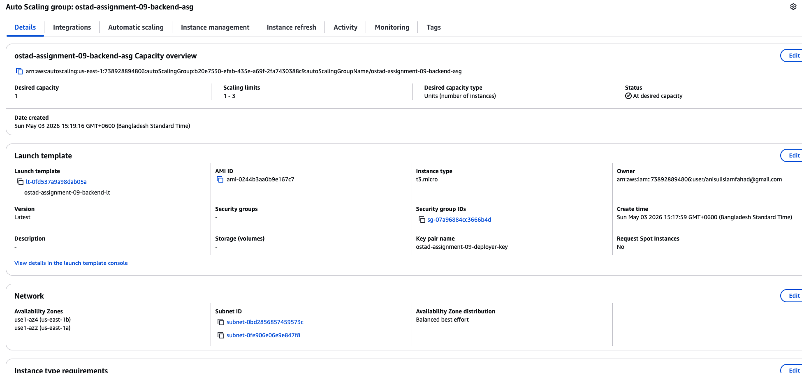

#### **Task 2** | `/health` response


#### **Task 3** | EC2 console: Instance state = Terminated |

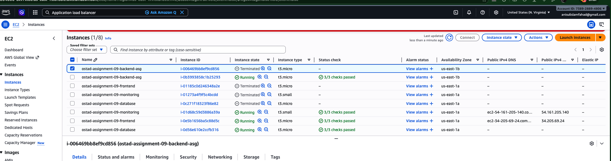
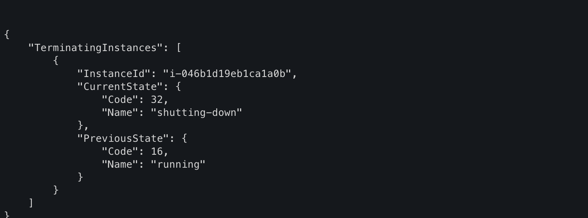
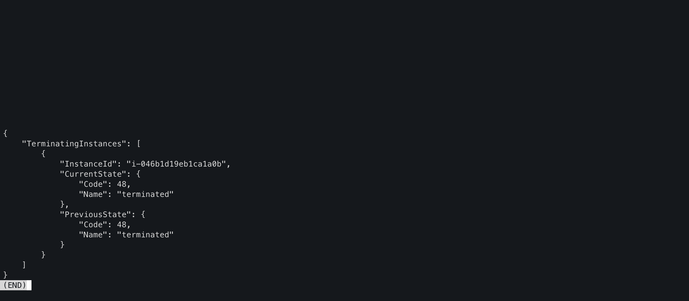

#### **Task 3** | ASG Activity tab: "Launching a new EC2 instance"

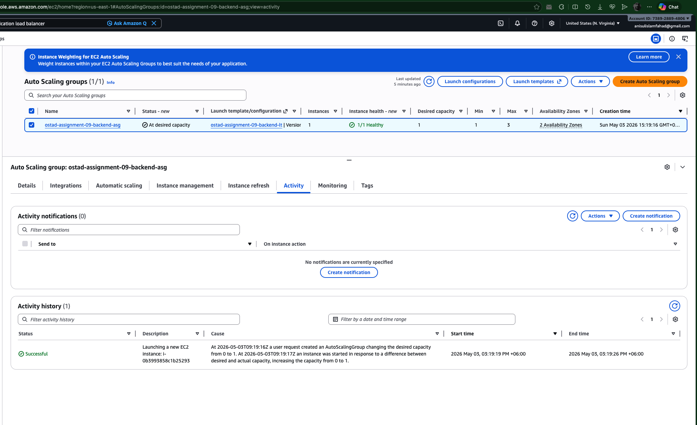
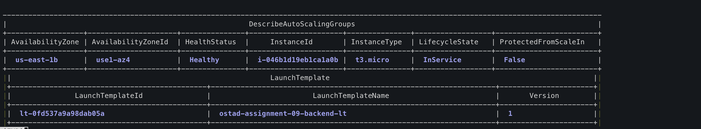
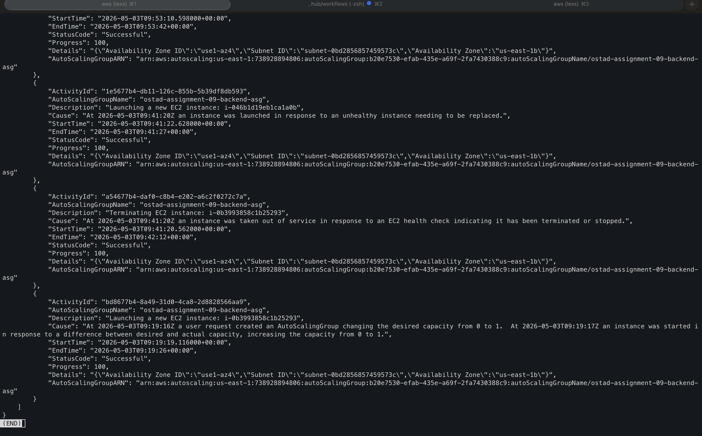

#### **Task 3** | Target Group: Old target draining, new target healthy

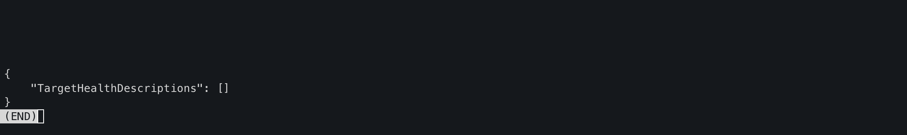
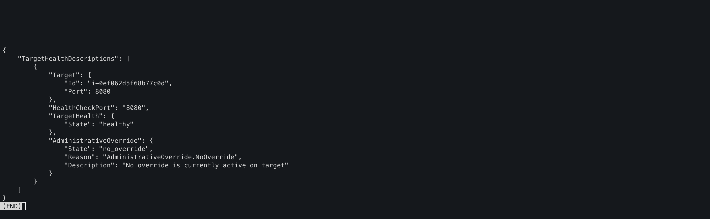


#### **Task 4** | Scaling Policies tab showing Scale Out & Scale In 

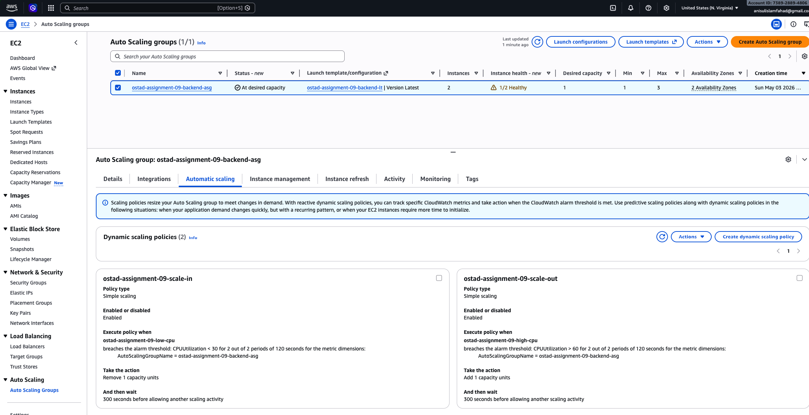

#### **Task 4** | CloudWatch Alarms (High CPU & Low CPU)

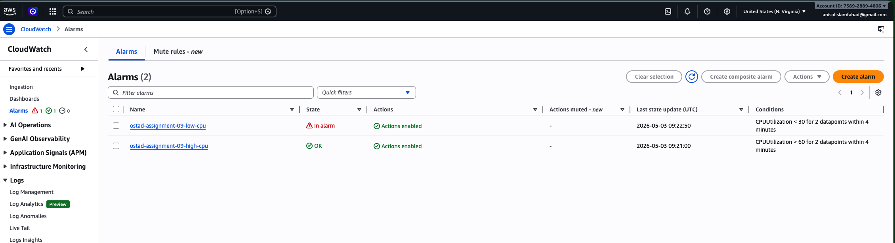

#### **Task 6** | CI/CD Architecture Diagram

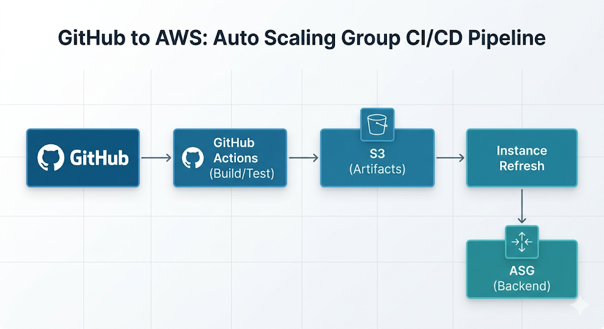

#### **Task 7** | GitHub Actions pipeline success (green checkmarks)

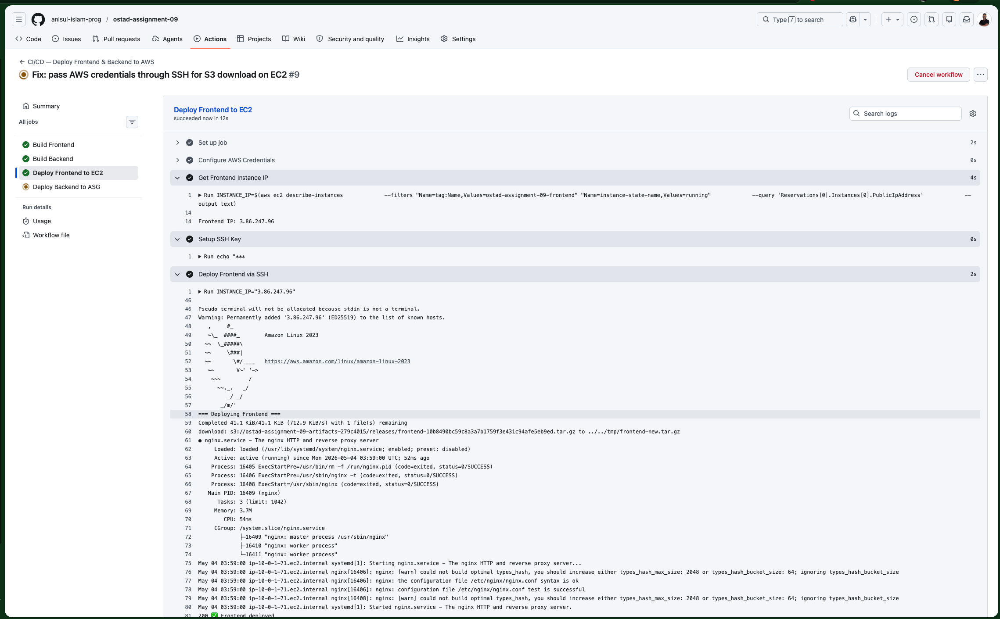

Due to resource limitation in AWS account ASG refresh is failing. For which, I could not deploy backend from github:

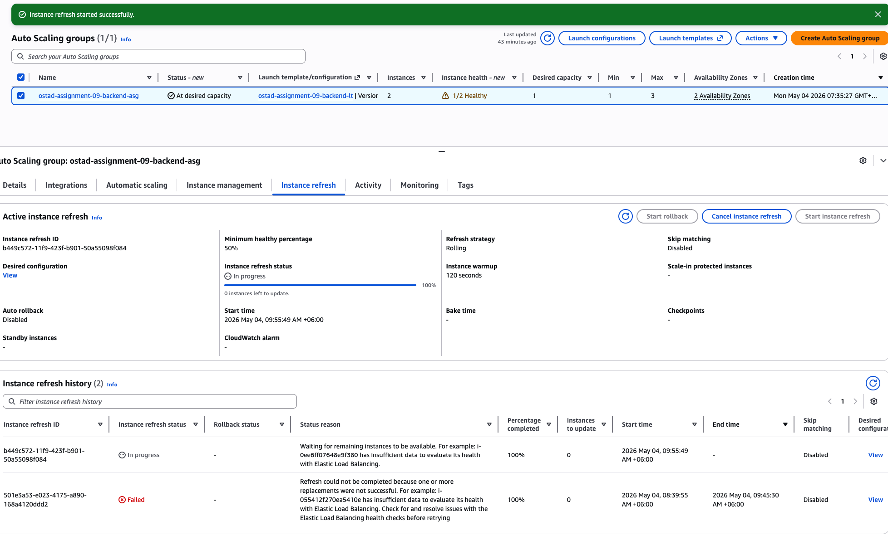

#### **Task 7** | S3 bucket showing uploaded artifact

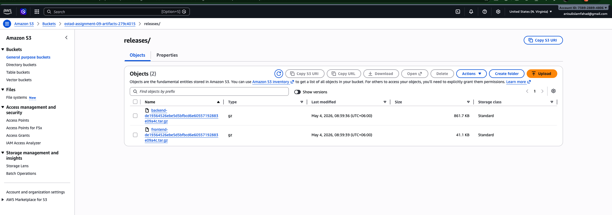

#### **Task 7** | Browser showing `/api/deployment-info` with new commit | Browser |


#### **Task 8** | Blue/Green Architecture Diagram


#### **Task 8** | ALB Listener rules showing weighted target groups

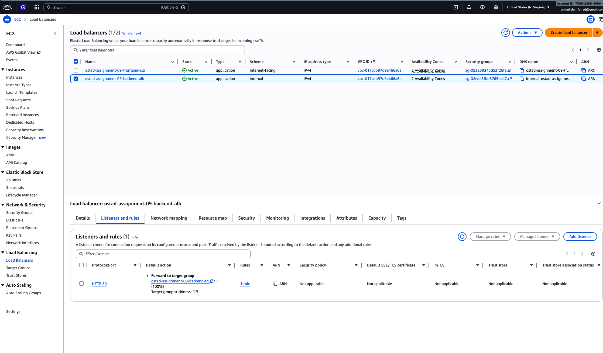

---

## Terraform Project Structure

Create this directory structure:

```
ostad-devops-assignment-09/
├── terraform/
│   ├── backend.tf              # S3 remote state configuration
│   ├── provider.tf             # AWS provider & version constraints
│   ├── variables.tf            # All input variables
│   ├── terraform.tfvars        # Environment-specific values (gitignored)
│   ├── outputs.tf              # Resource outputs
│   ├── keypair.tf              # SSH key generation
│   ├── vpc.tf                  # VPC, subnets, IGW, NAT, route tables
│   ├── security_groups.tf      # All security groups
│   ├── alb.tf                  # Both ALBs, target groups, listeners
│   ├── database.tf             # EC2-based database tier
│   ├── backend_asg.tf          # Launch template, ASG, scaling policies
│   ├── frontend.tf             # Frontend EC2 instance
│   ├── monitoring.tf           # PLG stack monitoring server
|   ├── bluegreen.tf            # Blue/Green deployment
│   └── iam.tf                  # ⚠️ ONLY data sources for existing roles
│                               # (we can't create IAM, but can reference existing)
└── application/
    ├── frontend/               # React/Vue app
    ├── backend/                # Node.js/Django/Spring Boot
    │   └── appspec.yml         # For documentation (even if not using CodeDeploy)
    └── scripts/
        ├── user-data-backend.sh
        ├── user-data-db.sh
        ├── user-data-frontend.sh
        └── user-data-monitoring.sh
```

---

## Terraform Backend Configuration (`backend.tf`)

```hcl
terraform {
  required_version = ">= 1.5.0"

  required_providers {
    aws = {
      source  = "hashicorp/aws"
      version = "~> 5.0"
    }
    tls = {
      source  = "hashicorp/tls"
      version = "~> 4.0"
    }
    local = {
      source  = "hashicorp/local"
      version = "~> 2.4"
    }
  }

  backend "s3" {
    bucket         = "terraform-state-bucket-state-backend-assignment-09"  # Create this S3 bucket first manually
    key            = "assignment-09/terraform.tfstate"
    region         = "us-east-1"  # Change to your region
    encrypt        = true
    # If you don't have DynamoDB, omit this or use a local lock file for the assignment
    # dynamodb_table = "terraform-locks"
  }
}
```
**Important:** Since we don't have IAM access, create the S3 bucket manually via console first, then reference it here.
```bash
# Bucket creation for Remote State Backend with Locking
aws s3 mb s3://terraform-state-bucket-state-backend-assignment-09 --region us-east-1
aws s3api put-bucket-versioning --bucket terraform-state-bucket-state-backend-assignment-09 \
--versioning-configuration Status=Enabled
```
---

## Provider & Version Constraints (`provider.tf`)

```hcl
provider "aws" {
  region = var.aws_region

  default_tags {
    tags = {
      Project     = "Ostad-DevOps-Assignment-09"
      Environment = var.environment
      ManagedBy   = "Terraform"
      Owner       = "YourName"
    }
  }
}
```

---

## Keypair Management (`keypair.tf`)

Since you can't create IAM users but CAN use EC2 Key Pairs, generate the key via Terraform and save it securely:

```hcl
# Generate a secure RSA key pair
resource "tls_private_key" "ec2_key" {
  algorithm = "RSA"
  rsa_bits  = 4096
}

# Create the AWS Key Pair
resource "aws_key_pair" "deployer" {
  key_name   = "${var.project_name}-deployer-key"
  public_key = tls_private_key.ec2_key.public_key_openssh

  tags = {
    Name = "${var.project_name}-deployer-key"
  }
}

# Save private key locally (be careful with this in production)
resource "local_file" "private_key" {
  content         = tls_private_key.ec2_key.private_key_pem
  filename        = "${path.module}/${var.project_name}-deployer-key.pem"
  file_permission = "0400"
}

# Save public key locally for reference
resource "local_file" "public_key" {
  content         = tls_private_key.ec2_key.public_key_openssh
  filename        = "${path.module}/${var.project_name}-deployer-key.pub"
  file_permission = "0644"
}
```

**Security Note:** In production, you'd use AWS Secrets Manager or Systems Manager Parameter Store. For this assignment, the local file is acceptable, but `.gitignore` the `.pem` file.

---

## Variables Skeleton (`variables.tf`)

```hcl
variable "aws_region" {
  description = "AWS region for deployment"
  type        = string
  default     = "us-east-1"
}

variable "project_name" {
  description = "Name of the project"
  type        = string
  default     = "ostad-assignment-09"
}

variable "environment" {
  description = "Environment name"
  type        = string
  default     = "production"
}

variable "vpc_cidr" {
  description = "CIDR block for VPC"
  type        = string
  default     = "10.0.0.0/16"
}

variable "public_subnet_cidrs" {
  description = "CIDR blocks for public subnets"
  type        = list(string)
  default     = ["10.0.1.0/24", "10.0.2.0/24"]
}

variable "private_subnet_cidrs" {
  description = "CIDR blocks for private subnets"
  type        = list(string)
  default     = ["10.0.3.0/24", "10.0.4.0/24"]
}

variable "instance_type" {
  description = "EC2 instance type for application servers"
  type        = string
  default     = "t3.micro"
}

variable "db_instance_type" {
  description = "EC2 instance type for database"
  type        = string
  default     = "t3.micro"
}

variable "monitoring_instance_type" {
  description = "EC2 instance type for monitoring server"
  type        = string
  default     = "t3.small"  # Slightly larger for PLG stack
}

variable "ami_id" {
  description = "AMI ID for launch template (will be updated after golden AMI creation)"
  type        = string
  default     = ""  # Leave empty initially; will be populated after AMI baking
}

variable "github_repo" {
  description = "GitHub repository URL for CI/CD"
  type        = string
  default     = "https://github.com/yourusername/your-repo"
}
```

---

## Outputs (`outputs.tf`)

```hcl
output "vpc_id" {
  description = "VPC ID"
  value       = aws_vpc.main.id
}

output "frontend_alb_dns" {
  description = "Frontend ALB DNS name"
  value       = aws_lb.frontend.dns_name
}

output "backend_alb_dns" {
  description = "Backend Internal ALB DNS name"
  value       = aws_lb.backend.dns_name
}

output "monitoring_server_public_ip" {
  description = "Public IP of monitoring server"
  value       = aws_instance.monitoring.public_ip
}

output "database_private_ip" {
  description = "Private IP of database server"
  value       = aws_instance.database.private_ip
}

output "key_pair_name" {
  description = "Name of the generated key pair"
  value       = aws_key_pair.deployer.key_name
}

output "s3_artifact_bucket" {
  description = "S3 bucket for deployment artifacts"
  value       = aws_s3_bucket.artifacts.id
}
```
---

## VPC Architecture (`vpc.tf`)

```hcl
# ==========================================
# VPC & Network Infrastructure
# ==========================================

resource "aws_vpc" "main" {
  cidr_block           = var.vpc_cidr
  enable_dns_hostnames = true
  enable_dns_support   = true

  tags = {
    Name = "${var.project_name}-vpc"
  }
}

# Internet Gateway
resource "aws_internet_gateway" "main" {
  vpc_id = aws_vpc.main.id

  tags = {
    Name = "${var.project_name}-igw"
  }
}

# ==========================================
# Public Subnets (2 AZs for HA)
# ==========================================

resource "aws_subnet" "public" {
  count                   = length(var.public_subnet_cidrs)
  vpc_id                  = aws_vpc.main.id
  cidr_block              = var.public_subnet_cidrs[count.index]
  availability_zone       = data.aws_availability_zones.available.names[count.index]
  map_public_ip_on_launch = true

  tags = {
    Name = "${var.project_name}-public-subnet-${count.index + 1}"
    Type = "Public"
  }
}

# ==========================================
# Private Subnets (2 AZs for HA)
# ==========================================

resource "aws_subnet" "private" {
  count             = length(var.private_subnet_cidrs)
  vpc_id            = aws_vpc.main.id
  cidr_block        = var.private_subnet_cidrs[count.index]
  availability_zone = data.aws_availability_zones.available.names[count.index]

  tags = {
    Name = "${var.project_name}-private-subnet-${count.index + 1}"
    Type = "Private"
  }
}

# ==========================================
# NAT Gateways (One per public subnet for HA)
# ==========================================

resource "aws_eip" "nat" {
  count  = length(var.public_subnet_cidrs)
  domain = "vpc"

  tags = {
    Name = "${var.project_name}-nat-eip-${count.index + 1}"
  }
}

resource "aws_nat_gateway" "main" {
  count         = length(var.public_subnet_cidrs)
  allocation_id = aws_eip.nat[count.index].id
  subnet_id     = aws_subnet.public[count.index].id

  tags = {
    Name = "${var.project_name}-nat-gw-${count.index + 1}"
  }

  depends_on = [aws_internet_gateway.main]
}

# ==========================================
# Route Tables
# ==========================================

# Public Route Table -> Internet Gateway
resource "aws_route_table" "public" {
  vpc_id = aws_vpc.main.id

  route {
    cidr_block = "0.0.0.0/0"
    gateway_id = aws_internet_gateway.main.id
  }

  tags = {
    Name = "${var.project_name}-public-rt"
  }
}

resource "aws_route_table_association" "public" {
  count          = length(aws_subnet.public)
  subnet_id      = aws_subnet.public[count.index].id
  route_table_id = aws_route_table.public.id
}

# Private Route Tables -> NAT Gateways (one per AZ)
resource "aws_route_table" "private" {
  count  = length(var.private_subnet_cidrs)
  vpc_id = aws_vpc.main.id

  route {
    cidr_block     = "0.0.0.0/0"
    nat_gateway_id = aws_nat_gateway.main[count.index].id
  }

  tags = {
    Name = "${var.project_name}-private-rt-${count.index + 1}"
  }
}

resource "aws_route_table_association" "private" {
  count          = length(aws_subnet.private)
  subnet_id      = aws_subnet.private[count.index].id
  route_table_id = aws_route_table.private[count.index].id
}

# ==========================================
# Data Sources
# ==========================================

data "aws_availability_zones" "available" {
  state = "available"
}
```

---

## Security Groups — Least Privilege, Tier-Isolated (`security_groups.tf`)

```hcl
# ==========================================
# SECURITY GROUPS — Least Privilege, Tier-Isolated
# ==========================================

# ------------------------------------------
# ALB Security Groups
# ------------------------------------------

resource "aws_security_group" "frontend_alb" {
  name        = "${var.project_name}-frontend-alb-sg"
  description = "Security group for Frontend ALB"
  vpc_id      = aws_vpc.main.id

  ingress {
    description = "HTTPS from Internet"
    from_port   = 443
    to_port     = 443
    protocol    = "tcp"
    cidr_blocks = ["0.0.0.0/0"]
  }

  ingress {
    description = "HTTP from Internet (redirect to HTTPS)"
    from_port   = 80
    to_port     = 80
    protocol    = "tcp"
    cidr_blocks = ["0.0.0.0/0"]
  }

  egress {
    description = "Allow all outbound"
    from_port   = 0
    to_port     = 0
    protocol    = "-1"
    cidr_blocks = ["0.0.0.0/0"]
  }

  tags = {
    Name = "${var.project_name}-frontend-alb-sg"
  }
}

resource "aws_security_group" "backend_alb" {
  name        = "${var.project_name}-backend-alb-sg"
  description = "Security group for Backend Internal ALB"
  vpc_id      = aws_vpc.main.id

  # ALB receives HTTP requests from Frontend tier only
  ingress {
    description     = "HTTP from Frontend tier only"
    from_port       = 80
    to_port         = 80
    protocol        = "tcp"
    security_groups = [aws_security_group.frontend_ec2.id]
  }

  ingress {
    description = "SSH access"
    from_port   = 22
    to_port     = 22
    protocol    = "tcp"
    cidr_blocks = ["YOUR_OFFICE_IP/32"]
  }

  egress {
    description = "Allow all outbound"
    from_port   = 0
    to_port     = 0
    protocol    = "-1"
    cidr_blocks = ["0.0.0.0/0"]
  }

  tags = {
    Name = "${var.project_name}-backend-alb-sg"
  }
}

# ------------------------------------------
# Frontend EC2 Security Group
# ------------------------------------------

resource "aws_security_group" "frontend_ec2" {
  name        = "${var.project_name}-frontend-ec2-sg"
  description = "Security group for Frontend EC2 instances"
  vpc_id      = aws_vpc.main.id

  ingress {
    description     = "HTTP from Frontend ALB"
    from_port       = 80
    to_port         = 80
    protocol        = "tcp"
    security_groups = [aws_security_group.frontend_alb.id]
  }
  
  ingress {
    description = "SSH access"
    from_port   = 22
    to_port     = 22
    protocol    = "tcp"
    cidr_blocks = ["YOUR_OFFICE_IP/32"]
  }

  ingress {
    description = "SSH from within VPC"
    from_port   = 22
    to_port     = 22
    protocol    = "tcp"
    cidr_blocks = [var.vpc_cidr]
  }

  egress {
    description = "Allow all outbound"
    from_port   = 0
    to_port     = 0
    protocol    = "-1"
    cidr_blocks = ["0.0.0.0/0"]
  }

  tags = {
    Name = "${var.project_name}-frontend-ec2-sg"
  }
}

# ------------------------------------------
# Backend EC2 / ASG Security Group
# ------------------------------------------

resource "aws_security_group" "backend_ec2" {
  name        = "${var.project_name}-backend-ec2-sg"
  description = "Security group for Backend ASG instances"
  vpc_id      = aws_vpc.main.id

  # Backend instances accept traffic FROM the Backend ALB
  ingress {
    description     = "App traffic from Backend ALB"
    from_port       = 8080
    to_port         = 8080
    protocol        = "tcp"
    security_groups = [aws_security_group.backend_alb.id]
  }

  ingress {
    description = "SSH from within VPC"
    from_port   = 22
    to_port     = 22
    protocol    = "tcp"
    cidr_blocks = [var.vpc_cidr]
  }

  # Prometheus scraping from monitoring server
  ingress {
    description = "Prometheus metrics scraping"
    from_port   = 9090
    to_port     = 9090
    protocol    = "tcp"
    cidr_blocks = [var.vpc_cidr]
  }

  # Promtail/Loki log shipping
  ingress {
    description = "Loki log shipping"
    from_port   = 3100
    to_port     = 3100
    protocol    = "tcp"
    cidr_blocks = [var.vpc_cidr]
  }

  egress {
    description = "Allow all outbound"
    from_port   = 0
    to_port     = 0
    protocol    = "-1"
    cidr_blocks = ["0.0.0.0/0"]
  }

  tags = {
    Name = "${var.project_name}-backend-ec2-sg"
  }
}

# ------------------------------------------
# Database EC2 Security Group
# ------------------------------------------

resource "aws_security_group" "database" {
  name        = "${var.project_name}-database-sg"
  description = "Security group for PostgreSQL EC2 database"
  vpc_id      = aws_vpc.main.id

  ingress {
    description     = "PostgreSQL from Backend tier only"
    from_port       = 5432
    to_port         = 5432
    protocol        = "tcp"
    security_groups = [aws_security_group.backend_ec2.id]
  }

  ingress {
    description = "SSH from within VPC"
    from_port   = 22
    to_port     = 22
    protocol    = "tcp"
    cidr_blocks = [var.vpc_cidr]
  }

  egress {
    description = "Allow all outbound"
    from_port   = 0
    to_port     = 0
    protocol    = "-1"
    cidr_blocks = ["0.0.0.0/0"]
  }

  tags = {
    Name = "${var.project_name}-database-sg"
  }
}

# ------------------------------------------
# Monitoring Server Security Group
# ------------------------------------------

resource "aws_security_group" "monitoring" {
  name        = "${var.project_name}-monitoring-sg"
  description = "Security group for PLG Monitoring Stack"
  vpc_id      = aws_vpc.main.id

  ingress {
    description = "Grafana Web UI"
    from_port   = 3000
    to_port     = 3000
    protocol    = "tcp"
    cidr_blocks = ["YOUR_OFFICE_IP/32"]
  }

  ingress {
    description = "SSH access"
    from_port   = 22
    to_port     = 22
    protocol    = "tcp"
    cidr_blocks = ["YOUR_OFFICE_IP/32"]
  }

  ingress {
    description = "Prometheus UI"
    from_port   = 9090
    to_port     = 9090
    protocol    = "tcp"
    cidr_blocks = ["YOUR_OFFICE_IP/32"]
  }

  egress {
    description = "Allow all outbound"
    from_port   = 0
    to_port     = 0
    protocol    = "-1"
    cidr_blocks = ["0.0.0.0/0"]
  }

  tags = {
    Name = "${var.project_name}-monitoring-sg"
  }
}
```
> **⚠️ Important:** Replace `YOUR_OFFICE_IP/32` with your actual public IP. Use `curl ifconfig.me` to find it.

---

## Database Tier — PostgreSQL on EC2 (`database.tf`)

Since RDS is unavailable, we deploy PostgreSQL on a dedicated EC2 instance in the private subnet.

```hcl
# ==========================================
# DATABASE TIER — PostgreSQL on EC2
# ==========================================

# Fetch latest Amazon Linux 2023 AMI
data "aws_ami" "amazon_linux_2023" {
  most_recent = true
  owners      = ["amazon"]

  filter {
    name   = "name"
    values = ["al2023-ami-*-x86_64"]
  }

  filter {
    name   = "virtualization-type"
    values = ["hvm"]
  }
}

resource "aws_instance" "database" {
  ami                    = data.aws_ami.amazon_linux_2023.id
  instance_type          = var.db_instance_type
  subnet_id              = aws_subnet.private[0].id # Private subnet AZ-1
  vpc_security_group_ids = [aws_security_group.database.id]
  key_name               = aws_key_pair.deployer.key_name

  root_block_device {
    volume_size           = 20
    volume_type           = "gp3"
    encrypted             = true
    delete_on_termination = false # Keep data on termination
  }

  # Additional EBS for PostgreSQL data (persistent)
  ebs_block_device {
    device_name           = "/dev/sdf"
    volume_size           = 30
    volume_type           = "gp3"
    encrypted             = true
    delete_on_termination = false

    tags = {
      Name = "${var.project_name}-postgres-data"
    }
  }

  user_data = base64encode(templatefile("${path.module}/../application/scripts/user-data-db.sh", {
    db_name     = var.db_name
    db_user     = var.db_user
    db_password = var.db_password
  }))

  tags = {
    Name = "${var.project_name}-database"
    Tier = "Database"
  }
}

# ==========================================
# Database Backup to S3 (Manual snapshots)
# ==========================================

resource "aws_s3_bucket" "db_backups" {
  bucket = "${var.project_name}-db-backups-${random_id.bucket_suffix.hex}"

  tags = {
    Name = "${var.project_name}-db-backups"
  }
}

resource "aws_s3_bucket_versioning" "db_backups" {
  bucket = aws_s3_bucket.db_backups.id
  versioning_configuration {
    status = "Enabled"
  }
}

# ==========================================
# Additional Database Variables
# ==========================================
```

---

## PostgreSQL User Data Script (`application/scripts/user-data-db.sh`)

```bash
# ==========================================
# DATABASE TIER — PostgreSQL on EC2
# ==========================================

# Fetch latest Amazon Linux 2023 AMI
data "aws_ami" "amazon_linux_2023" {
  most_recent = true
  owners      = ["amazon"]

  filter {
    name   = "name"
    values = ["al2023-ami-*-x86_64"]
  }

  filter {
    name   = "virtualization-type"
    values = ["hvm"]
  }
}

resource "aws_instance" "database" {
  ami                    = data.aws_ami.amazon_linux_2023.id
  instance_type          = var.db_instance_type
  subnet_id              = aws_subnet.private[0].id # Private subnet AZ-1
  vpc_security_group_ids = [aws_security_group.database.id]
  key_name               = aws_key_pair.deployer.key_name

  root_block_device {
    volume_size           = 20
    volume_type           = "gp3"
    encrypted             = true
    delete_on_termination = false # Keep data on termination
  }

  # Additional EBS for PostgreSQL data (persistent)
  ebs_block_device {
    device_name           = "/dev/sdf"
    volume_size           = 30
    volume_type           = "gp3"
    encrypted             = true
    delete_on_termination = false

    tags = {
      Name = "${var.project_name}-postgres-data"
    }
  }

  user_data = base64encode(templatefile("${path.module}/../application/scripts/user-data-db.sh", {
    db_name     = var.db_name
    db_user     = var.db_user
    db_password = var.db_password
  }))

  tags = {
    Name = "${var.project_name}-database"
    Tier = "Database"
  }
}

# ==========================================
# Database Backup to S3 (Manual snapshots)
# ==========================================

resource "aws_s3_bucket" "db_backups" {
  bucket = "${var.project_name}-db-backups-${random_id.bucket_suffix.hex}"

  tags = {
    Name = "${var.project_name}-db-backups"
  }
}

resource "aws_s3_bucket_versioning" "db_backups" {
  bucket = aws_s3_bucket.db_backups.id
  versioning_configuration {
    status = "Enabled"
  }
}

# ==========================================
# Additional Database Variables
# ==========================================
```

---
## Load Balancers, Backend ASG & Scaling Policies

## Application Load Balancers (`alb.tf`)

```hcl
# ==========================================
# FRONTEND ALB — Internet-Facing
# ==========================================

resource "aws_lb" "frontend" {
  name               = "${var.project_name}-frontend-alb"
  internal           = false
  load_balancer_type = "application"
  security_groups    = [aws_security_group.frontend_alb.id]
  subnets            = aws_subnet.public[*].id

  enable_deletion_protection = false
  idle_timeout               = 60

  access_logs {
    bucket  = aws_s3_bucket.alb_logs.id
    prefix  = "frontend-alb"
    enabled = true
  }

  tags = {
    Name = "${var.project_name}-frontend-alb"
  }
}

resource "aws_lb_target_group" "frontend" {
  name     = "${var.project_name}-frontend-tg"
  port     = 80
  protocol = "HTTP"
  vpc_id   = aws_vpc.main.id

  health_check {
    enabled             = true
    healthy_threshold   = 2
    interval            = 30
    matcher             = "200"
    path                = "/nginx-health"
    port                = "traffic-port"
    protocol            = "HTTP"
    timeout             = 5
    unhealthy_threshold = 3
  }

  tags = {
    Name = "${var.project_name}-frontend-tg"
  }
}

resource "aws_lb_listener" "frontend_http" {
  load_balancer_arn = aws_lb.frontend.arn
  port              = "80"
  protocol          = "HTTP"

  default_action {
    type             = "forward"
    target_group_arn = aws_lb_target_group.frontend.arn
  }
}

# ==========================================
# BACKEND ALB — Internal Only
# ==========================================

resource "aws_lb" "backend" {
  name               = "${var.project_name}-backend-alb"
  internal           = true # CRITICAL: Internal only
  load_balancer_type = "application"
  security_groups    = [aws_security_group.backend_alb.id]
  subnets            = aws_subnet.private[*].id # Private subnets only

  enable_deletion_protection = false
  idle_timeout               = 60

  access_logs {
    bucket  = aws_s3_bucket.alb_logs.id
    prefix  = "backend-alb"
    enabled = true
  }

  tags = {
    Name = "${var.project_name}-backend-alb"
  }
}

resource "aws_lb_target_group" "backend" {
  name     = "${var.project_name}-backend-tg"
  port     = 8080
  protocol = "HTTP"
  vpc_id   = aws_vpc.main.id

  # Advanced health check for backend API
  health_check {
    enabled             = true
    healthy_threshold   = 2
    interval            = 30
    matcher             = "200"
    path                = "/health" # Your health endpoint
    port                = "traffic-port"
    protocol            = "HTTP"
    timeout             = 5
    unhealthy_threshold = 3
  }

  # Deregistration delay allows in-flight requests to complete
  deregistration_delay = 30

  tags = {
    Name = "${var.project_name}-backend-tg"
  }
}

resource "aws_lb_listener" "backend_http" {
  load_balancer_arn = aws_lb.backend.arn
  port              = "80"
  protocol          = "HTTP"

  default_action {
    type             = "forward"
    target_group_arn = aws_lb_target_group.backend.arn
  }
}

# ==========================================
# ALB Access Logs Bucket
# ==========================================

resource "aws_s3_bucket" "alb_logs" {
  bucket = "${var.project_name}-alb-logs-${random_id.bucket_suffix.hex}"

  tags = {
    Name = "${var.project_name}-alb-logs"
  }
}

resource "aws_s3_bucket_policy" "alb_logs" {
  bucket = aws_s3_bucket.alb_logs.id
  policy = jsonencode({
    Version = "2012-10-17"
    Statement = [
      {
        Effect = "Allow"
        Principal = {
          AWS = "arn:aws:iam::127311923021:root" # ELB account for us-east-1
        }
        Action   = "s3:PutObject"
        Resource = "${aws_s3_bucket.alb_logs.arn}/frontend-alb/*"
      },
      {
        Effect = "Allow"
        Principal = {
          AWS = "arn:aws:iam::127311923021:root"
        }
        Action   = "s3:PutObject"
        Resource = "${aws_s3_bucket.alb_logs.arn}/backend-alb/*"
      }
    ]
  })
}
```

> **Note:** The ELB account ID `127311923021` is for `us-east-1`. If using a different region, look up the correct ID [here](https://docs.aws.amazon.com/elasticloadbalancing/latest/classic/enable-access-logs.html).

---

## Backend Launch Template (`backend_asg.tf`)

```hcl
# ==========================================
# BACKEND LAUNCH TEMPLATE
# ==========================================

resource "aws_launch_template" "backend" {
  name          = "${var.project_name}-backend-lt"
  image_id      = data.aws_ami.amazon_linux_2023.id
  instance_type = var.instance_type
  key_name      = aws_key_pair.deployer.key_name

  vpc_security_group_ids = [aws_security_group.backend_ec2.id]

  user_data = base64encode(templatefile("${path.module}/../application/scripts/user-data-backend.sh", {
    db_host     = aws_instance.database.private_ip
    db_name     = var.db_name
    db_user     = var.db_user
    db_password = var.db_password
    github_url  = var.github_repo_url
  }))

  monitoring {
    enabled = true
  }

  tag_specifications {
    resource_type = "instance"
    tags = {
      Name = "${var.project_name}-backend"
      Tier = "Backend"
    }
  }

  tag_specifications {
    resource_type = "volume"
    tags = {
      Name = "${var.project_name}-backend-volume"
    }
  }

  metadata_options {
    http_endpoint               = "enabled"
    http_tokens                 = "required"
    http_put_response_hop_limit = 1
  }
}

# ==========================================
# BACKEND AUTO SCALING GROUP
# ==========================================

resource "aws_autoscaling_group" "backend" {
  name                      = "${var.project_name}-backend-asg"
  vpc_zone_identifier       = aws_subnet.private[*].id
  health_check_type         = "ELB"
  health_check_grace_period = 300

  min_size         = 1
  desired_capacity = 1
  max_size         = 3

  launch_template {
    id      = aws_launch_template.backend.id
    version = "$Latest"
  }

  instance_refresh {
    strategy = "Rolling"
    preferences {
      min_healthy_percentage = 50
      instance_warmup        = 120
    }
    triggers = ["tag"]
  }

  termination_policies = ["OldestLaunchTemplate", "Default"]

  tag {
    key                 = "Name"
    value               = "${var.project_name}-backend-asg"
    propagate_at_launch = true
  }

  tag {
    key                 = "Environment"
    value               = var.environment
    propagate_at_launch = true
  }

  depends_on = [aws_nat_gateway.main]
}

# ==========================================
# SCALING POLICIES
# ==========================================

resource "aws_autoscaling_policy" "scale_out" {
  name                   = "${var.project_name}-scale-out"
  scaling_adjustment     = 1
  adjustment_type        = "ChangeInCapacity"
  cooldown               = 300
  autoscaling_group_name = aws_autoscaling_group.backend.name
  policy_type            = "SimpleScaling"
}

resource "aws_cloudwatch_metric_alarm" "high_cpu" {
  alarm_name          = "${var.project_name}-high-cpu"
  comparison_operator = "GreaterThanThreshold"
  evaluation_periods  = 2
  metric_name         = "CPUUtilization"
  namespace           = "AWS/EC2"
  period              = 120
  statistic           = "Average"
  threshold           = 60
  alarm_description   = "Scale out when CPU > 60%"
  alarm_actions       = [aws_autoscaling_policy.scale_out.arn]

  dimensions = {
    AutoScalingGroupName = aws_autoscaling_group.backend.name
  }
}

resource "aws_autoscaling_policy" "scale_in" {
  name                   = "${var.project_name}-scale-in"
  scaling_adjustment     = -1
  adjustment_type        = "ChangeInCapacity"
  cooldown               = 300
  autoscaling_group_name = aws_autoscaling_group.backend.name
  policy_type            = "SimpleScaling"
}

resource "aws_cloudwatch_metric_alarm" "low_cpu" {
  alarm_name          = "${var.project_name}-low-cpu"
  comparison_operator = "LessThanThreshold"
  evaluation_periods  = 2
  metric_name         = "CPUUtilization"
  namespace           = "AWS/EC2"
  period              = 120
  statistic           = "Average"
  threshold           = 30
  alarm_description   = "Scale in when CPU < 30%"
  alarm_actions       = [aws_autoscaling_policy.scale_in.arn]

  dimensions = {
    AutoScalingGroupName = aws_autoscaling_group.backend.name
  }
}

# Explicitly attach ASG to target group (more reliable than target_group_arns)
# resource "aws_autoscaling_attachment" "backend" {
# autoscaling_group_name = aws_autoscaling_group.backend.id
# lb_target_group_arn    = aws_lb_target_group.backend.arn
# }

# Optional: Email subscription for notifications
# resource "aws_sns_topic_subscription" "email" {
#   topic_arn = aws_sns_topic.asg_lifecycle.arn
#   protocol  = "email"
#   endpoint  = "your-email@example.com"
# }
```

---

## IAM Instance Profile (Data Source Approach)

Since you can't create IAM roles, reference existing ones or use instance profiles that already exist. Add this to a new file `iam.tf`:

```hcl
# ==========================================
# IAM — Using Existing Roles (Read-Only)
# ==========================================

# If you have an existing instance profile, use data source
data "aws_iam_instance_profile" "existing" {
  name = "your-existing-instance-profile"  # Ask your admin for this
}

# For the assignment, if no existing profile is available,
# document that IAM restrictions prevent creation and show
# what WOULD be created:

/*
resource "aws_iam_role" "backend" {
  name = "${var.project_name}-backend-role"
  assume_role_policy = jsonencode({
    Version = "2012-10-17"
    Statement = [{
      Action = "sts:AssumeRole"
      Effect = "Allow"
      Principal = { Service = "ec2.amazonaws.com" }
    }]
  })
}

resource "aws_iam_role_policy" "backend" {
  name = "${var.project_name}-backend-policy"
  role = aws_iam_role.backend.id
  policy = jsonencode({
    Version = "2012-10-17"
    Statement = [
      {
        Effect = "Allow"
        Action = [
          "s3:GetObject",
          "s3:PutObject"
        ]
        Resource = "${aws_s3_bucket.artifacts.arn}/*"
      },
      {
        Effect = "Allow"
        Action = [
          "cloudwatch:PutMetricData",
          "logs:CreateLogGroup",
          "logs:CreateLogStream",
          "logs:PutLogEvents"
        ]
        Resource = "*"
      },
      {
        Effect = "Allow"
        Action = [
          "sns:Publish"
        ]
        Resource = aws_sns_topic.asg_lifecycle.arn
      }
    ]
  })
}

resource "aws_iam_instance_profile" "backend" {
  name = "${var.project_name}-backend-profile"
  role = aws_iam_role.backend.name
}
*/

# Use existing profile for now
resource "aws_iam_instance_profile" "backend" {
  name = "${var.project_name}-backend-profile"
  # This is a placeholder — in reality, reference existing:
  # name = data.aws_iam_instance_profile.existing.name
  
  # Since we can't create IAM, we'll create a minimal profile
  # ONLY if permissions allow. Otherwise, omit iam_instance_profile
  # from launch template and handle everything via user_data.
}
```

> **Workaround:** If IAM is completely restricted, remove `iam_instance_profile` from the launch template and handle S3 access via pre-signed URLs in your deployment scripts.

## Backend Application Health Check Implementation

Your backend MUST expose a `/health` endpoint. Here's a Node.js/Express example:

```javascript
// routes/health.js
const express = require('express');
const router = express.Router();
const { Pool } = require('pg');

const pool = new Pool({
  host: process.env.DB_HOST,
  database: process.env.DB_NAME,
  user: process.env.DB_USER,
  password: process.env.DB_PASSWORD,
  port: 5432,
  connectionTimeoutMillis: 2000,
});

router.get('/api/health', async (req, res) => {
  const checks = {
    timestamp: new Date().toISOString(),
    uptime: process.uptime(),
    version: process.env.APP_VERSION || 'unknown',
    commit: process.env.GIT_COMMIT || 'unknown',
    environment: process.env.NODE_ENV || 'production',
  };

  try {
    // Check database connectivity
    const dbStart = Date.now();
    await pool.query('SELECT 1');
    checks.database = {
      status: 'healthy',
      responseTime: `${Date.now() - dbStart}ms`,
    };
    
    res.status(200).json({
      status: 'healthy',
      checks,
    });
  } catch (error) {
    checks.database = {
      status: 'unhealthy',
      error: error.message,
    };
    
    res.status(503).json({
      status: 'unhealthy',
      checks,
    });
  }
});

router.get('/api/deployment-info', (req, res) => {
  res.json({
    version: process.env.APP_VERSION || 'unknown',
    commit: process.env.GIT_COMMIT || 'unknown',
    deployedAt: process.env.DEPLOYMENT_TIME || 'unknown',
    environment: process.env.NODE_ENV || 'production',
    instanceId: process.env.INSTANCE_ID || 'unknown',
    hostname: require('os').hostname(),
  });
});

module.exports = router;
```

---

## Backend User Data Script (`application/scripts/user-data-backend.sh`)

```bash
#!/bin/bash
set -euo pipefail
exec > >(tee /var/log/user-data-backend.log) 2>&1

echo "=== Backend Setup Starting ==="

# Install Node.js 20 and Git
dnf update -y
dnf install -y git nodejs20 npm

# Create app directory
mkdir -p /opt/app
cd /opt/app

# Clone your public GitHub repo (monorepo with frontend/ and backend/)
git clone ${github_url} .

# Enter backend folder
cd backend

# Install dependencies
npm install

# Create environment file
cat > .env << EOF
NODE_ENV=production
PORT=8080
DB_HOST=${db_host}
DB_NAME=${db_name}
DB_USER=${db_user}
DB_PASSWORD=${db_password}
APP_VERSION=1.0.0
GIT_COMMIT=$(git rev-parse --short HEAD 2>/dev/null || echo "unknown")
DEPLOYMENT_TIME=$(date -u +"%Y-%m-%dT%H:%M:%SZ")
EOF

cat > /etc/systemd/system/backend.service << 'EOF'
[Unit]
Description=Ostad Backend API
After=network.target

[Service]
Type=simple
User=root
WorkingDirectory=/opt/app/backend
EnvironmentFile=/opt/app/backend/.env
ExecStart=/usr/bin/node server.js
Restart=always
RestartSec=10
StandardOutput=journal
StandardError=journal

[Install]
WantedBy=multi-user.target
EOF

systemctl daemon-reload
systemctl enable backend
systemctl start backend

# Install Node Exporter for monitoring (optional)
cd /tmp
wget -q https://github.com/prometheus/node_exporter/releases/download/v1.7.0/node_exporter-1.7.0.linux-amd64.tar.gz
tar xzf node_exporter-1.7.0.linux-amd64.tar.gz 2>/dev/null || true
mv node_exporter-1.7.0.linux-amd64/node_exporter /usr/local/bin/ 2>/dev/null || true
useradd -rs /bin/false node_exporter 2>/dev/null || true

cat > /etc/systemd/system/node_exporter.service << 'EOF'
[Unit]
Description=Node Exporter
After=network.target
[Service]
User=node_exporter
ExecStart=/usr/local/bin/node_exporter
Restart=always
[Install]
WantedBy=default.target
EOF

systemctl enable node_exporter 2>/dev/null || true
systemctl start node_exporter 2>/dev/null || true

echo "=== Backend Setup Complete ==="

```

---

## Failure Simulation Guide (Task 3)

After deployment, test self-healing:

```bash
# 1. Check current instances
aws autoscaling describe-auto-scaling-groups \
  --auto-scaling-group-names ostad-assignment-09-backend-asg

# 2. Note the Instance ID, then terminate it
aws ec2 terminate-instances --instance-ids i-0xxxxxxxxxxxxxxxxx

# 3. Watch ASG launch replacement (takes ~2-3 minutes)
aws autoscaling describe-scaling-activities \
  --auto-scaling-group-name ostad-assignment-09-backend-asg

# 4. Verify new instance passes health checks
aws elbv2 describe-target-health \
  --target-group-arn $(aws elbv2 describe-target-groups \
    --names ostad-assignment-09-backend-tg \
    --query 'TargetGroups[0].TargetGroupArn' --output text)
```

**What to screenshot for submission:**
- EC2 console showing instance state as "Terminated"
- ASG "Activity" tab showing "Launching a new EC2 instance"
- Target Group showing new instance as "healthy"
- ALB DNS still responding to requests during the transition

---

## Frontend EC2 Instance (`frontend.tf`)

```hcl
# ==========================================
# FRONTEND TIER — React/Vue + Nginx
# ==========================================

resource "aws_instance" "frontend" {
  ami                         = data.aws_ami.amazon_linux_2023.id
  instance_type               = var.instance_type
  subnet_id                   = aws_subnet.public[0].id
  vpc_security_group_ids      = [aws_security_group.frontend_ec2.id]
  key_name                    = aws_key_pair.deployer.key_name
  associate_public_ip_address = true

  root_block_device {
    volume_size           = 15
    volume_type           = "gp3"
    encrypted             = true
    delete_on_termination = true
  }

  user_data = base64encode(templatefile("${path.module}/../application/scripts/user-data-frontend.sh", {
    backend_alb_dns = aws_lb.backend.dns_name
    github_url      = var.github_repo_url
  }))

  tags = {
    Name = "${var.project_name}-frontend"
    Tier = "Frontend"
  }

  depends_on = [aws_nat_gateway.main]
}

# Attach the frontend EC2 instance to the ALB target group
resource "aws_lb_target_group_attachment" "frontend" {
  target_group_arn = aws_lb_target_group.frontend.arn
  target_id        = aws_instance.frontend.id
  port             = 80
}
```
## Frontend User Data Script (`application/scripts/user-data-frontend.sh`)
```bash
#!/bin/bash
set -euo pipefail
exec > >(tee /var/log/user-data-frontend.log) 2>&1

echo "=== Frontend Setup Starting ==="

# Install dependencies
dnf update -y
dnf install -y git nodejs20 npm nginx

# Create app directory
mkdir -p /opt/app
cd /opt/app

# Clone your public GitHub repo
git clone ${github_url} .

# Enter frontend folder
cd frontend

# Install dependencies and build for production
npm install
npm run build

# Copy built files to Nginx web root
cp -r dist/* /usr/share/nginx/html/

# Configure Nginx to proxy /api to Backend ALB
cat > /etc/nginx/nginx.conf << 'NGINXEOF'
user nginx;
worker_processes auto;
error_log /var/log/nginx/error.log warn;
pid /var/run/nginx.pid;

events {
    worker_connections 1024;
}

http {
    include /etc/nginx/mime.types;
    default_type application/octet-stream;
    log_format main '$remote_addr - $remote_user [$time_local] "$request" '
                    '$status $body_bytes_sent "$http_referer" '
                    '"$http_user_agent" "$http_x_forwarded_for"';
    access_log /var/log/nginx/access.log main;
    sendfile on;
    tcp_nopush on;
    tcp_nodelay on;
    keepalive_timeout 65;
    types_hash_max_size 2048;
    server_tokens off;
    gzip on;
    gzip_vary on;
    gzip_proxied any;
    gzip_comp_level 6;
    gzip_types text/plain text/css text/xml application/json application/javascript application/rss+xml application/atom+xml image/svg+xml;

    server {
        listen 80;
        server_name _;
        root /usr/share/nginx/html;
        index index.html;

        location / {
            try_files $uri $uri/ /index.html;
        }

        location /api/ {
            proxy_pass http://${backend_alb_dns};
            proxy_http_version 1.1;
            proxy_set_header Host $host;
            proxy_set_header X-Real-IP $remote_addr;
            proxy_set_header X-Forwarded-For $proxy_add_x_forwarded_for;
            proxy_set_header X-Forwarded-Proto $scheme;
        }

        location /nginx-health {
            access_log off;
            return 200 "healthy
";
            add_header Content-Type text/plain;
        }
    }
}
NGINXEOF

# Start Nginx
systemctl enable nginx
systemctl start nginx

echo "=== Frontend Setup Complete ==="

```
---

---

## Monitoring Server — PLG Stack (`monitoring.tf`)

```hcl
# ==========================================
# MONITORING SERVER — PLG Stack
# ==========================================

resource "aws_instance" "monitoring" {
  ami                    = data.aws_ami.amazon_linux_2023.id
  instance_type          = var.monitoring_instance_type
  subnet_id              = aws_subnet.public[0].id
  vpc_security_group_ids = [aws_security_group.monitoring.id]
  key_name               = aws_key_pair.deployer.key_name
  associate_public_ip_address = true

  root_block_device {
    volume_size           = 30
    volume_type           = "gp3"
    encrypted             = true
    delete_on_termination = false
  }

  # Use file() instead of templatefile() — no variables needed
  user_data = base64encode(file("${path.module}/../application/scripts/user-data-monitoring.sh"))

  tags = {
    Name = "${var.project_name}-monitoring"
    Tier = "Monitoring"
  }
}
```

---

## PLG Stack User Data Script (`application/scripts/user-data-monitoring.sh`)

```bash
#!/bin/bash
set -euo pipefail
exec > >(tee /var/log/user-data-monitoring.log) 2>&1

echo "=== PLG Stack Installation ==="

# Update system
dnf update -y

# Install Docker
dnf install -y docker aws-cli
systemctl enable docker
systemctl start docker
usermod -aG docker ec2-user

# Install Docker Compose
curl -L "https://github.com/docker/compose/releases/download/v2.24.0/docker-compose-$(uname -s)-$(uname -m)" -o /usr/local/bin/docker-compose
chmod +x /usr/local/bin/docker-compose

# Create monitoring directory
mkdir -p /opt/monitoring/{prometheus,grafana/provisioning/datasources,grafana/provisioning/dashboards,loki,promtail}
cd /opt/monitoring

# ==========================================
# DISCOVER INSTANCE IPs VIA AWS CLI
# ==========================================
echo "=== Discovering instance IPs ==="

# Configure AWS CLI with instance metadata credentials (if available) or use local
export AWS_REGION=us-east-1

# Get frontend IP
FRONTEND_IP=$(aws ec2 describe-instances \
  --filters "Name=tag:Name,Values=ostad-assignment-09-frontend" "Name=instance-state-name,Values=running" \
  --query 'Reservations[0].Instances[0].PrivateIpAddress' \
  --output text 2>/dev/null || echo "10.0.1.10")

# Get backend IP (first running instance in ASG)
BACKEND_IP=$(aws ec2 describe-instances \
  --filters "Name=tag:Name,Values=ostad-assignment-09-backend" "Name=instance-state-name,Values=running" \
  --query 'Reservations[0].Instances[0].PrivateIpAddress' \
  --output text 2>/dev/null || echo "10.0.4.10")

# Get database IP
DATABASE_IP=$(aws ec2 describe-instances \
  --filters "Name=tag:Name,Values=ostad-assignment-09-database" "Name=instance-state-name,Values=running" \
  --query 'Reservations[0].Instances[0].PrivateIpAddress' \
  --output text 2>/dev/null || echo "10.0.3.10")

echo "Frontend: $FRONTEND_IP"
echo "Backend: $BACKEND_IP"
echo "Database: $DATABASE_IP"

# ==========================================
# PROMETHEUS CONFIGURATION
# ==========================================
cat > /opt/monitoring/prometheus/prometheus.yml << EOF
global:
  scrape_interval: 15s
  evaluation_interval: 15s

scrape_configs:
  - job_name: 'prometheus'
    static_configs:
      - targets: ['localhost:9090']

  - job_name: 'node-exporter-frontend'
    static_configs:
      - targets: ['${FRONTEND_IP}:9100']

  - job_name: 'node-exporter-backend'
    static_configs:
      - targets: ['${BACKEND_IP}:9100']

  - job_name: 'node-exporter-database'
    static_configs:
      - targets: ['${DATABASE_IP}:9100']

  - job_name: 'backend-app'
    static_configs:
      - targets: ['${BACKEND_IP}:8080']
    metrics_path: /metrics
EOF

# ==========================================
# LOKI CONFIGURATION
# ==========================================
cat > /opt/monitoring/loki/loki-config.yml << 'EOF'
auth_enabled: false

server:
  http_listen_port: 3100
  grpc_listen_port: 9096

common:
  path_prefix: /tmp/loki
  storage:
    filesystem:
      chunks_directory: /tmp/loki/chunks
      rules_directory: /tmp/loki/rules
  replication_factor: 1
  ring:
    instance_addr: 127.0.0.1
    kvstore:
      store: inmemory

schema_config:
  configs:
    - from: 2020-10-24
      store: boltdb-shipper
      object_store: filesystem
      schema: v11
      index:
        prefix: index_
        period: 24h

ruler:
  alertmanager_url: http://localhost:9093

analytics:
  reporting_enabled: false
EOF

# ==========================================
# PROMTAIL CONFIGURATION
# ==========================================
cat > /opt/monitoring/promtail/promtail-config.yml << 'EOF'
server:
  http_listen_port: 9080
  grpc_listen_port: 0

positions:
  filename: /tmp/positions.yaml

clients:
  - url: http://loki:3100/loki/api/v1/push

scrape_configs:
  - job_name: system
    static_configs:
      - targets:
          - localhost
        labels:
          job: varlogs
          __path__: /var/log/*.log

  - job_name: journal
    journal:
      max_age: 12h
      labels:
        job: systemd-journal
    relabel_configs:
      - source_labels: ['__journal__systemd_unit']
        target_label: 'unit'
EOF

# ==========================================
# GRAFANA DATASOURCES — Auto-configured
# ==========================================
cat > /opt/monitoring/grafana/provisioning/datasources/datasources.yml << 'EOF'
apiVersion: 1

datasources:
  - name: Prometheus
    type: prometheus
    access: proxy
    url: http://prometheus:9090
    isDefault: true
    editable: false

  - name: Loki
    type: loki
    access: proxy
    url: http://loki:3100
    editable: false
EOF

# ==========================================
# GRAFANA DASHBOARD PROVISIONING
# ==========================================
cat > /opt/monitoring/grafana/provisioning/dashboards/dashboards.yml << 'EOF'
apiVersion: 1

providers:
  - name: 'default'
    orgId: 1
    folder: ''
    type: file
    disableDeletion: false
    updateIntervalSeconds: 10
    allowUiUpdates: true
    options:
      path: /var/lib/grafana/dashboards
EOF

# Create a simple system metrics dashboard JSON
mkdir -p /opt/monitoring/grafana/dashboards
cat > /opt/monitoring/grafana/dashboards/system-metrics.json << 'EOF'
{
  "dashboard": {
    "id": null,
    "title": "System Metrics",
    "tags": ["system"],
    "timezone": "browser",
    "panels": [
      {
        "id": 1,
        "title": "CPU Usage",
        "type": "timeseries",
        "targets": [
          {
            "expr": "100 - (avg by (instance) (irate(node_cpu_seconds_total{mode=\"idle\"}[5m])) * 100)",
            "legendFormat": "{{instance}}",
            "refId": "A"
          }
        ],
        "gridPos": {"h": 8, "w": 12, "x": 0, "y": 0}
      },
      {
        "id": 2,
        "title": "Memory Usage",
        "type": "timeseries",
        "targets": [
          {
            "expr": "100 * (1 - ((node_memory_MemAvailable_bytes or node_memory_MemFree_bytes) / node_memory_MemTotal_bytes))",
            "legendFormat": "{{instance}}",
            "refId": "A"
          }
        ],
        "gridPos": {"h": 8, "w": 12, "x": 12, "y": 0}
      },
      {
        "id": 3,
        "title": "Disk Usage",
        "type": "timeseries",
        "targets": [
          {
            "expr": "100 - ((node_filesystem_avail_bytes{mountpoint=\"/\"} * 100) / node_filesystem_size_bytes{mountpoint=\"/\"})",
            "legendFormat": "{{instance}}",
            "refId": "A"
          }
        ],
        "gridPos": {"h": 8, "w": 24, "x": 0, "y": 8}
      }
    ],
    "time": {"from": "now-1h", "to": "now"},
    "refresh": "10s"
  }
}
EOF

# ==========================================
# DOCKER COMPOSE
# ==========================================
cat > /opt/monitoring/docker-compose.yml << 'EOF'
version: '3.8'

services:
  prometheus:
    image: prom/prometheus:v2.48.0
    container_name: prometheus
    restart: unless-stopped
    ports:
      - "9090:9090"
    volumes:
      - ./prometheus:/etc/prometheus
      - prometheus-data:/prometheus
    command:
      - '--config.file=/etc/prometheus/prometheus.yml'
      - '--storage.tsdb.path=/prometheus'
      - '--web.enable-lifecycle'

  loki:
    image: grafana/loki:2.9.0
    container_name: loki
    restart: unless-stopped
    ports:
      - "3100:3100"
    volumes:
      - ./loki:/etc/loki
      - loki-data:/tmp/loki
    command: -config.file=/etc/loki/loki-config.yml

  promtail:
    image: grafana/promtail:2.9.0
    container_name: promtail
    restart: unless-stopped
    volumes:
      - ./promtail:/etc/promtail
      - /var/log:/var/log:ro
      - /var/run/docker.sock:/var/run/docker.sock
    command: -config.file=/etc/promtail/promtail-config.yml
    depends_on:
      - loki

  grafana:
    image: grafana/grafana:10.2.3
    container_name: grafana
    restart: unless-stopped
    ports:
      - "3000:3000"
    volumes:
      - grafana-data:/var/lib/grafana
      - ./grafana/provisioning:/etc/grafana/provisioning
      - ./grafana/dashboards:/var/lib/grafana/dashboards
    environment:
      - GF_SECURITY_ADMIN_USER=admin
      - GF_SECURITY_ADMIN_PASSWORD=ostad123
      - GF_USERS_ALLOW_SIGN_UP=false
      - GF_SERVER_ROOT_URL=http://localhost:3000

volumes:
  prometheus-data:
  loki-data:
  grafana-data:
EOF

# ==========================================
# START PLG STACK
# ==========================================
cd /opt/monitoring
docker-compose up -d

echo "=== PLG Stack Installation Complete ==="
echo "Grafana: http://$(curl -s ifconfig.me):3000 (admin/ostad123)"
echo "Prometheus: http://$(curl -s ifconfig.me):9090"
echo ""
echo "Waiting 30 seconds for services to start..."
sleep 30

# Verify Prometheus targets
echo "=== Prometheus Targets ==="
curl -s http://localhost:9090/api/v1/targets | grep -o '"health":"[^"]*"' || echo "Check Prometheus UI manually"

echo "=== Done ==="
```

> **Note:** After Terraform apply, SSH into the monitoring server and update `prometheus.yml` with actual private IPs of frontend, backend, and database instances. For production, use DNS service discovery.

---

## GitHub Actions CI/CD Pipeline (Replaces CodePipeline)

Since CodePipeline/CodeBuild/CodeDeploy are unavailable, we use **GitHub Actions + S3 + ASG Instance Refresh**.

Create `.github/workflows/deploy.yml` in your repository:

```yaml
name: CI/CD — Deploy Frontend & Backend to AWS

on:
  push:
    branches: [main]

env:
  AWS_REGION: us-east-1
  S3_BUCKET: ostad-assignment-09-artifacts-279c4015
  BACKEND_ASG_NAME: ostad-assignment-09-backend-asg
  FRONTEND_INSTANCE_NAME: ostad-assignment-09-frontend

jobs:
  # ==========================================
  # JOB 1: BUILD FRONTEND
  # ==========================================
  build-frontend:
    name: Build Frontend
    runs-on: ubuntu-latest
    defaults:
      run:
        working-directory: frontend

    steps:
      - name: Checkout Code
        uses: actions/checkout@v4

      - name: Setup Node.js
        uses: actions/setup-node@v4
        with:
          node-version: '20'
          cache: 'npm'
          cache-dependency-path: frontend/package-lock.json

      - name: Install Dependencies
        run: npm ci

      - name: Build for Production
        run: npm run build

      - name: Package Frontend
        run: |
          mkdir -p ${{ github.workspace }}/release
          tar -czf ${{ github.workspace }}/release/frontend-${{ github.sha }}.tar.gz -C dist .

      - name: Configure AWS Credentials
        uses: aws-actions/configure-aws-credentials@v4
        with:
          aws-access-key-id: ${{ secrets.AWS_ACCESS_KEY_ID }}
          aws-secret-access-key: ${{ secrets.AWS_SECRET_ACCESS_KEY }}
          aws-region: ${{ env.AWS_REGION }}

      - name: Upload Frontend to S3
        run: |
          aws s3 cp ${{ github.workspace }}/release/frontend-${{ github.sha }}.tar.gz s3://${{ env.S3_BUCKET }}/releases/

  # ==========================================
  # JOB 2: BUILD BACKEND
  # ==========================================
  build-backend:
    name: Build Backend
    runs-on: ubuntu-latest
    defaults:
      run:
        working-directory: backend

    steps:
      - name: Checkout Code
        uses: actions/checkout@v4

      - name: Setup Node.js
        uses: actions/setup-node@v4
        with:
          node-version: '20'
          cache: 'npm'
          cache-dependency-path: backend/package-lock.json

      - name: Install Dependencies
        run: npm ci

      - name: Run Tests
        run: npm test || echo "No tests yet, skipping"

      - name: Package Backend
        run: |
          mkdir -p ${{ github.workspace }}/release
          npm ci --production
          tar -czf ${{ github.workspace }}/release/backend-${{ github.sha }}.tar.gz .

      - name: Configure AWS Credentials
        uses: aws-actions/configure-aws-credentials@v4
        with:
          aws-access-key-id: ${{ secrets.AWS_ACCESS_KEY_ID }}
          aws-secret-access-key: ${{ secrets.AWS_SECRET_ACCESS_KEY }}
          aws-region: ${{ env.AWS_REGION }}

      - name: Upload Backend to S3
        run: |
          aws s3 cp ${{ github.workspace }}/release/backend-${{ github.sha }}.tar.gz s3://${{ env.S3_BUCKET }}/releases/

  # ==========================================
  # JOB 3: DEPLOY FRONTEND (SSH into EC2)
  # ==========================================
  deploy-frontend:
    name: Deploy Frontend to EC2
    needs: build-frontend
    runs-on: ubuntu-latest

    steps:
      - name: Configure AWS Credentials
        uses: aws-actions/configure-aws-credentials@v4
        with:
          aws-access-key-id: ${{ secrets.AWS_ACCESS_KEY_ID }}
          aws-secret-access-key: ${{ secrets.AWS_SECRET_ACCESS_KEY }}
          aws-region: ${{ env.AWS_REGION }}

      - name: Get Frontend Instance IP
        id: get-ip
        run: |
          INSTANCE_IP=$(aws ec2 describe-instances             --filters "Name=tag:Name,Values=${{ env.FRONTEND_INSTANCE_NAME }}" "Name=instance-state-name,Values=running"             --query 'Reservations[0].Instances[0].PublicIpAddress'             --output text)
          echo "instance_ip=$INSTANCE_IP" >> $GITHUB_OUTPUT
          echo "Frontend IP: $INSTANCE_IP"

      - name: Setup SSH Key
        run: |
          echo "${{ secrets.EC2_SSH_KEY }}" > deploy_key.pem
          chmod 600 deploy_key.pem

      - name: Deploy Frontend via SSH
        run: |
          INSTANCE_IP="${{ steps.get-ip.outputs.instance_ip }}"
          ARTIFACT_URL="s3://${{ env.S3_BUCKET }}/releases/frontend-${{ github.sha }}.tar.gz"

          ssh -o StrictHostKeyChecking=no -i deploy_key.pem ec2-user@$INSTANCE_IP << EOF
            set -e
            echo "=== Deploying Frontend ==="

            # Download new build
            aws s3 cp $ARTIFACT_URL /tmp/frontend-new.tar.gz

            # Backup current
            sudo cp -r /usr/share/nginx/html /usr/share/nginx/html-backup-$(date +%s)

            # Clear and extract new build
            sudo rm -rf /usr/share/nginx/html/*
            sudo tar -xzf /tmp/frontend-new.tar.gz -C /usr/share/nginx/html/

            # Restart Nginx
            sudo systemctl restart nginx
            sudo systemctl status nginx --no-pager

            # Verify
            curl -s -o /dev/null -w "%{http_code}" http://localhost/nginx-health
            echo " ✅ Frontend deployed"
          EOF

  # ==========================================
  # JOB 4: DEPLOY BACKEND (ASG Instance Refresh)
  # ==========================================
  deploy-backend:
    name: Deploy Backend to ASG
    needs: build-backend
    runs-on: ubuntu-latest

    steps:
      - name: Configure AWS Credentials
        uses: aws-actions/configure-aws-credentials@v4
        with:
          aws-access-key-id: ${{ secrets.AWS_ACCESS_KEY_ID }}
          aws-secret-access-key: ${{ secrets.AWS_SECRET_ACCESS_KEY }}
          aws-region: ${{ env.AWS_REGION }}

      - name: Trigger ASG Instance Refresh
        run: |
          aws autoscaling start-instance-refresh             --auto-scaling-group-name ${{ env.BACKEND_ASG_NAME }}             --preferences "MinHealthyPercentage=50,InstanceWarmup=120"             --strategy Rolling

      - name: Wait for Instance Refresh
        run: |
          sleep 30
          REFRESH_ID=$(aws autoscaling describe-instance-refreshes             --auto-scaling-group-name ${{ env.BACKEND_ASG_NAME }}             --query 'InstanceRefreshes[0].InstanceRefreshId'             --output text)
          echo "Refresh ID: $REFRESH_ID"

          while true; do
            STATUS=$(aws autoscaling describe-instance-refreshes               --auto-scaling-group-name ${{ env.BACKEND_ASG_NAME }}               --instance-refresh-ids $REFRESH_ID               --query 'InstanceRefreshes[0].Status'               --output text)
            echo "Status: $STATUS"

            if [ "$STATUS" == "Successful" ]; then
              echo "✅ Backend instance refresh complete!"
              break
            elif [ "$STATUS" == "Failed" ] || [ "$STATUS" == "Cancelled" ]; then
              echo "❌ Backend instance refresh failed!"
              exit 1
            fi
            sleep 30
          done

  # ==========================================
  # JOB 5: VERIFY DEPLOYMENT (via Frontend ALB)
  # ==========================================
  verify-deployment:
    name: Verify Deployment
    needs: [deploy-frontend, deploy-backend]
    runs-on: ubuntu-latest

    steps:
      - name: Configure AWS Credentials
        uses: aws-actions/configure-aws-credentials@v4
        with:
          aws-access-key-id: ${{ secrets.AWS_ACCESS_KEY_ID }}
          aws-secret-access-key: ${{ secrets.AWS_SECRET_ACCESS_KEY }}
          aws-region: ${{ env.AWS_REGION }}

      - name: Get Frontend ALB DNS
        id: get-alb
        run: |
          FRONTEND_DNS=$(aws elbv2 describe-load-balancers             --names ostad-assignment-09-frontend-alb             --query 'LoadBalancers[0].DNSName'             --output text)
          echo "frontend_dns=$FRONTEND_DNS" >> $GITHUB_OUTPUT
          echo "Frontend ALB: $FRONTEND_DNS"

      - name: Wait and Verify
        run: |
          FRONTEND_DNS="${{ steps.get-alb.outputs.frontend_dns }}"
          echo "Waiting for services to stabilize..."
          sleep 90

          RETRIES=0
          MAX_RETRIES=10

          while [ $RETRIES -lt $MAX_RETRIES ]; do
            # Check frontend loads
            FRONT_STATUS=$(curl -s -o /dev/null -w "%{http_code}" http://$FRONTEND_DNS/ || echo "000")
            echo "Frontend status: $FRONT_STATUS"

            if [ "$FRONT_STATUS" == "200" ]; then
              echo "✅ Frontend is responding!"

              # Check deployment info through frontend proxy
              DEPLOY_INFO=$(curl -s http://$FRONTEND_DNS/api/deployment-info || echo "failed")
              echo "Deployment Info: $DEPLOY_INFO"

              # Check health
              HEALTH=$(curl -s http://$FRONTEND_DNS/api/health || echo "failed")
              echo "Health: $HEALTH"

              if echo "$DEPLOY_INFO" | grep -q "version"; then
                echo "✅ Full deployment verified successfully!"
                break
              fi
            fi

            echo "Retrying in 15s..."
            RETRIES=$((RETRIES+1))
            sleep 15
          done

          if [ $RETRIES -eq $MAX_RETRIES ]; then
            echo "❌ Verification failed"
            exit 1
          fi
```

---

## Blue/Green Deployment Strategy

Since we can't use CodeDeploy Blue/Green, we implement it using **ALB Target Groups + ASG Instance Refresh**:

```
┌─────────────────────────────────────────────────────────────────┐
│                     BLUE/GREEN DEPLOYMENT                       │
├─────────────────────────────────────────────────────────────────┤
│                                                                 │
│  Phase 1: BLUE (Current Production)                             │
│  ┌─────────────┐    ┌─────────────┐    ┌─────────────┐          │
│  │   ALB       │───▶│  TG-BLUE    │───▶│  ASG-BLUE   │          │
│  │             │    │ (100%       |    |             |          |
|  |             |    | traffic)    │    |  (v1.0.0)   │          │
│  └─────────────┘    └─────────────┘    └─────────────┘          │
│                                                                 │
│  Phase 2: Launch GREEN (New Version)                            │
│  ┌─────────────┐    ┌─────────────┐    ┌─────────────┐          │
│  │   ALB       │───▶│  TG-GREEN   │───▶│  ASG-GREEN  │          │
│  │             │    │ (0% traffic)|    │ (v2.0.0)    │          │
│  └─────────────┘    └─────────────┘    └─────────────┘          │
│                                                                 │
│  Phase 3: Shift Traffic (Canary 10% → 50% → 100%)               │
│  ┌─────────────┐    ┌─────────────┐    ┌─────────────┐          │
│  │   ALB       │───▶│  TG-GREEN   │───▶│  ASG-GREEN  │          │
│  │             │    │  (100%      |    |             |          |
|  |             |    |  traffic)   │    |   (v2.0.0)  │          │
│  └─────────────┘    └─────────────┘    └─────────────┘          │
│                                                                 │
│  Phase 4: Decommission BLUE                                     │
│  ┌─────────────┐                                                │
│  │   ALB       │───▶ (Direct to GREEN only)                     │
│  └─────────────┘                                                │
│                                                                 │
└─────────────────────────────────────────────────────────────────┘
```

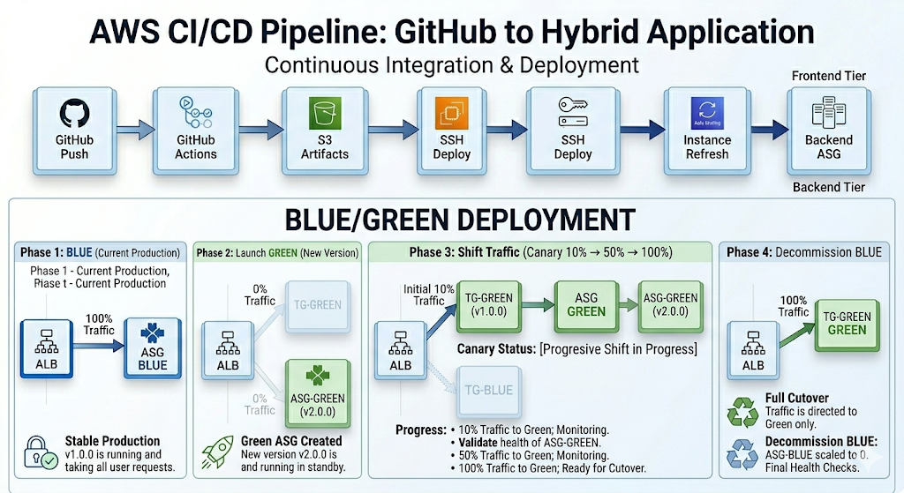

### Implementation via Terraform (`bluegreen.tf`):

```hcl
# ==========================================
# BLUE/GREEN DEPLOYMENT — Backend Target Groups
# ==========================================

resource "aws_lb_target_group" "backend_blue" {
  name     = "${var.project_name}-bkend-b-tg"
  port     = 8080
  protocol = "HTTP"
  vpc_id   = aws_vpc.main.id

  health_check {
    enabled             = true
    healthy_threshold   = 2
    interval            = 30
    matcher             = "200"
    path                = "/health"
    port                = "traffic-port"
    protocol            = "HTTP"
    timeout             = 5
    unhealthy_threshold = 3
  }

  deregistration_delay = 30

  tags = {
    Name  = "${var.project_name}-bkend-b-tg"
    Color = "blue"
  }
}

resource "aws_lb_target_group" "backend_green" {
  name     = "${var.project_name}-bkend-g-tg"
  port     = 8080
  protocol = "HTTP"
  vpc_id   = aws_vpc.main.id

  health_check {
    enabled             = true
    healthy_threshold   = 2
    interval            = 30
    matcher             = "200"
    path                = "/health"
    port                = "traffic-port"
    protocol            = "HTTP"
    timeout             = 5
    unhealthy_threshold = 3
  }

  deregistration_delay = 30

  tags = {
    Name  = "${var.project_name}-bkend-g-tg"
    Color = "green"
  }
}

# ==========================================
# WEIGHTED LISTENER RULE (Start: 100% Blue)
# ==========================================

resource "aws_lb_listener" "backend_weighted" {
  load_balancer_arn = aws_lb.backend.arn
  port              = "80"
  protocol          = "HTTP"

  default_action {
    type = "forward"

    forward {
      target_group {
        arn    = aws_lb_target_group.backend_blue.arn
        weight = 100
      }

      target_group {
        arn    = aws_lb_target_group.backend_green.arn
        weight = 0
      }

      stickiness {
        enabled  = false
        duration = 1
      }
    }
  }
}

# ==========================================
# ASG ATTACHMENTS — Attach current ASG to BLUE
# ==========================================

resource "aws_autoscaling_attachment" "backend_blue" {
  autoscaling_group_name = aws_autoscaling_group.backend.id
  lb_target_group_arn    = aws_lb_target_group.backend_blue.arn
}
```

### Blue/Green Deployment Script (`scripts/blue-green-deploy.sh`):

```bash
#!/bin/bash
set -euo pipefail

# ==========================================
# BLUE/GREEN DEPLOYMENT ORCHESTRATOR
# ==========================================

ASG_BLUE="ostad-assignment-09-backend-blue-asg"
ASG_GREEN="ostad-assignment-09-backend-green-asg"
TG_BLUE="arn:aws:elasticloadbalancing:..."
TG_GREEN="arn:aws:elasticloadbalancing:..."
LISTENER_ARN="arn:aws:elasticloadbalancing:..."

NEW_VERSION=$1  # e.g., "2.0.0"
AMI_ID=$2       # New golden AMI

echo "🚀 Starting Blue/Green Deployment v$NEW_VERSION"

# Step 1: Launch GREEN environment with new AMI
echo "📦 Launching GREEN environment..."
aws autoscaling update-auto-scaling-group \
  --auto-scaling-group-name $ASG_GREEN \
  --launch-template "LaunchTemplateId=$LT_ID,Version=\$Latest"

aws autoscaling set-desired-capacity \
  --auto-scaling-group-name $ASG_GREEN \
  --desired-capacity 1

# Step 2: Wait for GREEN to be healthy
echo "⏳ Waiting for GREEN instances to be healthy..."
sleep 60

while true; do
  HEALTHY=$(aws elbv2 describe-target-health \
    --target-group-arn $TG_GREEN \
    --query 'TargetHealthDescriptions[?TargetHealth.State==`healthy`].Target.Id' \
    --output text)
  
  if [ -n "$HEALTHY" ]; then
    echo "✅ GREEN is healthy: $HEALTHY"
    break
  fi
  echo "Still waiting..."
  sleep 15
done

# Step 3: Verify /api/deployment-info on GREEN
GREEN_INSTANCE_IP=$(aws ec2 describe-instances \
  --instance-ids $HEALTHY \
  --query 'Reservations[0].Instances[0].PrivateIpAddress' \
  --output text)

DEPLOY_INFO=$(curl -s http://$GREEN_INSTANCE_IP:8080/api/deployment-info)
echo "GREEN Deployment Info: $DEPLOY_INFO"

# Step 4: Canary — Shift 10% traffic to GREEN
echo "🐤 Canary: Shifting 10% traffic to GREEN..."
aws elbv2 modify-listener \
  --listener-arn $LISTENER_ARN \
  --default-actions Type=forward,ForwardConfig="{
    TargetGroups=[
      {TargetGroupArn=$TG_BLUE,Weight=90},
      {TargetGroupArn=$TG_GREEN,Weight=10}
    ]
  }"

sleep 120  # Observe metrics

# Step 5: Full cutover — 100% GREEN
echo "🎯 Full cutover to GREEN..."
aws elbv2 modify-listener \
  --listener-arn $LISTENER_ARN \
  --default-actions Type=forward,ForwardConfig="{
    TargetGroups=[
      {TargetGroupArn=$TG_BLUE,Weight=0},
      {TargetGroupArn=$TG_GREEN,Weight=100}
    ]
  }"

# Step 6: Scale down BLUE
echo "🔻 Scaling down BLUE..."
aws autoscaling set-desired-capacity \
  --auto-scaling-group-name $ASG_BLUE \
  --desired-capacity 0

echo "✅ Blue/Green Deployment Complete!"
echo "BLUE (old): 0 instances"
echo "GREEN (new v$NEW_VERSION): 1 instance"
```

---

## Auto-Deployment to New ASG Instances (Task 9)

The **Launch Template + Instance Refresh** pattern solves this automatically:

| Scenario | Behavior |
|----------|----------|
| **Scale Out** (CPU > 60%) | ASG launches new instance from Launch Template → New instance has baked-in latest code → Registers with ALB → Serves traffic immediately |
| **Instance Refresh** (Deployment) | ASG replaces old instances one-by-one → Each new instance has latest AMI → Zero-downtime rolling update |
| **Self-Healing** (Health check fails) | ASG terminates unhealthy instance → Launches replacement from latest Launch Template → No stale code ever runs |

**Proof for Submission:**
```bash
# 1. Check current deployment info
curl http://<ALB_DNS>/api/deployment-info

# ostad-assignment-09-frontend-alb-1983022418.us-east-1.elb.amazonaws.comq
# 2. Terminate an instance
aws ec2 terminate-instances --instance-ids i-0xxxxxxxxx

# 3. Wait for replacement
aws autoscaling describe-scaling-activities --auto-scaling-group-name ostad-assignment-09-backend-asg

# 4. Verify new instance has same (latest) version
curl http://<ALB_DNS>/api/deployment-info
# Should show identical commit SHA and version
```

---

## Complete Terraform.tfvars Example

```hcl
# terraform.tfvars
aws_region  = "us-east-1"
project_name = "ostad-assignment-09"
environment  = "production"

vpc_cidr            = "10.0.0.0/16"
public_subnet_cidrs  = ["10.0.1.0/24", "10.0.2.0/24"]
private_subnet_cidrs = ["10.0.3.0/24", "10.0.4.0/24"]

instance_type          = "t3.micro"
db_instance_type       = "t3.micro"
monitoring_instance_type = "t3.small"

# After creating Golden AMI, update this:
ami_id = "ami-0xxxxxxxxxxxxxxxxx"

db_name     = "ostad_app_db"
db_user     = "ostad_admin"
db_password = "YourStrongPassword123!"

github_repo_url = "https://github.com/yourusername/ostad-devops-backend"
```

---

## Fix the Security Group Cycle Error

The security groups reference the monitoring server's IP before the monitoring server exists. This causes Terraform to crash with a **cycle error**.

### File: ```terraform/security_groups.tf```
Find every block that looks like this (there are 3 of them: frontend, backend, database):
```hcl
  ingress {
    description = "SSH from Monitoring/Bastion"
    from_port   = 22
    to_port     = 22
    protocol    = "tcp"
    cidr_blocks = ["${aws_instance.monitoring.private_ip}/32"]
  }
```
Replace each one with:

```hcl
  ingress {
    description = "SSH from within VPC"
    from_port   = 22
    to_port     = 22
    protocol    = "tcp"
    cidr_blocks = [var.vpc_cidr]
  }
```
This allows any instance inside your VPC (including the monitoring server) to SSH into the other instances. It is safe for this assignment because the VPC is isolated from the internet except for the ALBs.

---

## Final Terraform Deployment Sequence

Run these commands in exact order:

```bash
# Step 1: Initialize Terraform
cd terraform/
terraform init

# Step 2: Validate syntax
terraform validate

# Step 3: Preview changes
terraform plan -out=tfplan

# Step 4: Apply infrastructure
terraform apply tfplan

# Step 5: Note outputs
terraform output

# Step 6: Trigger instance refresh
aws autoscaling start-instance-refresh \
  --auto-scaling-group-name ostad-assignment-09-backend-asg \
  --preferences MinHealthyPercentage=50,InstanceWarmup=120
```


## Architecture Diagram Templates

Use **diagrams.net (draw.io)** to create professional diagrams. Here are the key components to drag in:

**AWS Icons to Use:**
- `Compute` → `EC2`
- `Compute` → `Auto Scaling`
- `Networking` → `Application Load Balancer`
- `Networking` → `VPC`
- `Networking` → `Public Subnet`, `Private Subnet`
- `Database` → `RDS` (label as "PostgreSQL on EC2" since RDS is unavailable)
- `Storage` → `S3`
- `Management` → `CloudWatch` (for alarms)
- `General` → `Internet` (for users)

**Color Coding:**
- Public subnet resources: **Orange border**
- Private subnet resources: **Green border**
- Database tier: **Red border** (restricted access)
- Monitoring: **Purple border**
- Data flow arrows: **Blue**
- Health check arrows: **Dashed Green**

**For the CI/CD Diagram:**
- Use `Developer Tools` → `CodePipeline`, `CodeBuild`, `CodeDeploy`
- Add a text box explaining: *"Implemented via GitHub Actions + S3 + Instance Refresh due to account IAM constraints"*

---