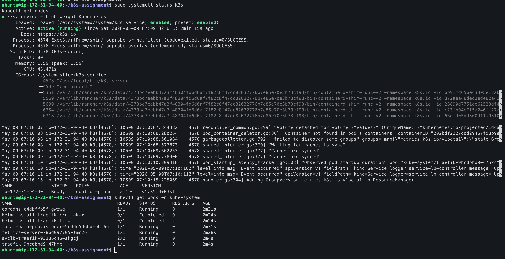
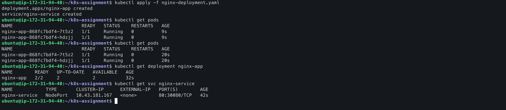
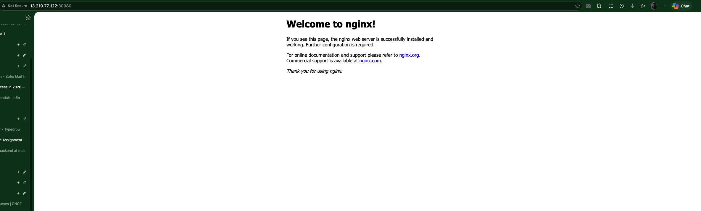
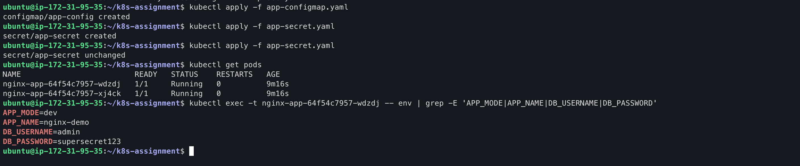
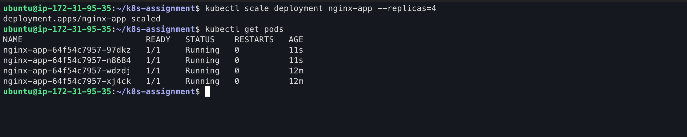
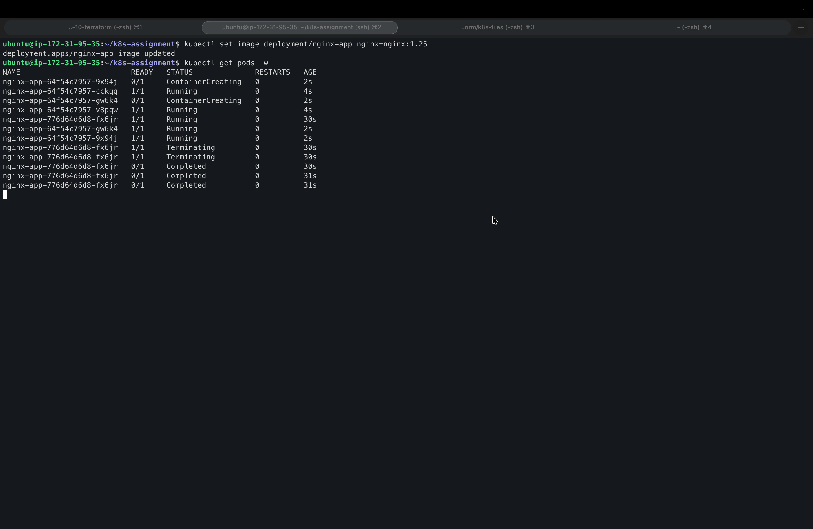
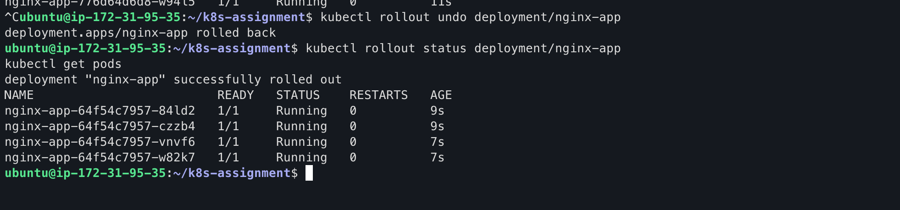
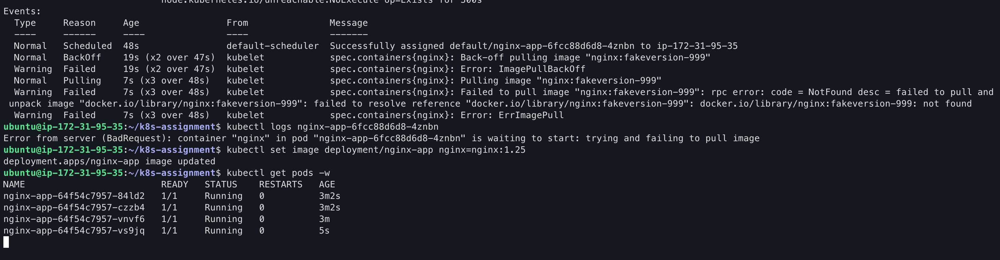
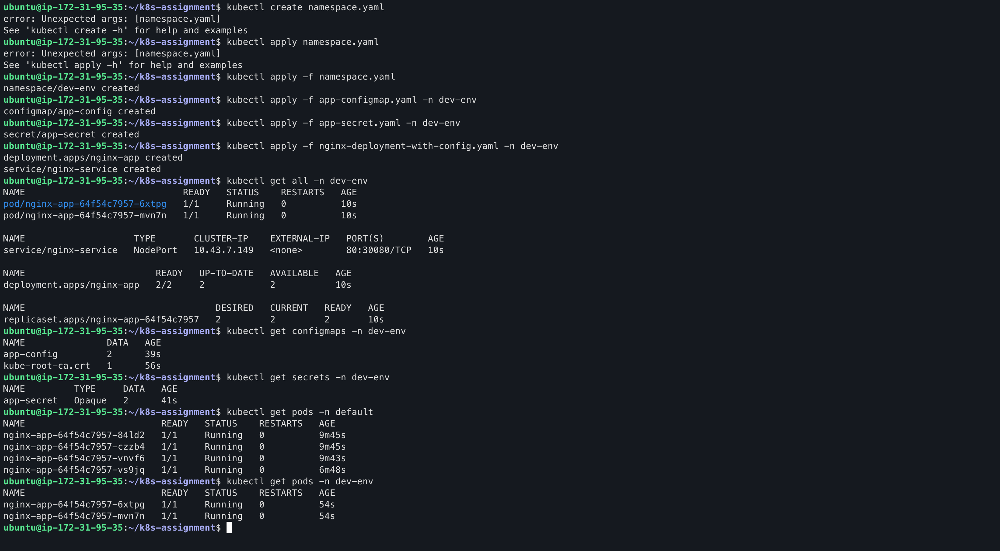
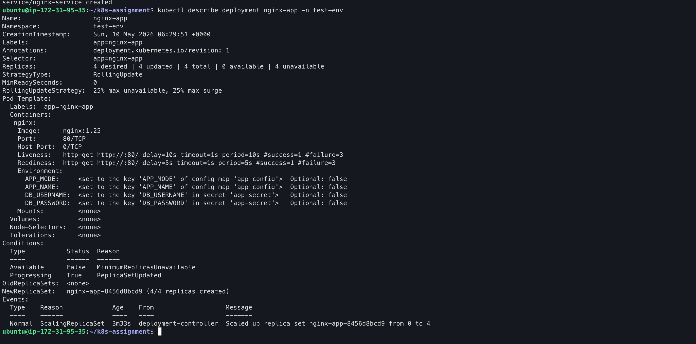

# Assignment - 10
## Assignment: Kubernetes Application Deployment & Management
>**Objective:**
>Deploy and manage a containerized application in Kubernetes with basic configuration, scaling, and troubleshooting. This assignment focuses on practical understanding of core components and workflows. 

**Request For Not Use AI Tool For Answering Part 1: Conceptual Understanding.**

## Part 1: Conceptual Understanding
Answer briefly (3–5 lines each):
1. How does Kubernetes ensure high availability compared to traditional deployment?
2. Explain the relationship between Pods, ReplicaSets, and Deployments.
3. Why are Services required in Kubernetes?
4. Difference between ConfigMaps and Secrets with a practical example.

## Part 2: Cluster Setup & Verification

Set up a cluster using:
- Minikube or K3s

Then:
- Verify nodes and cluster status
- Check all system pods in the kube-system namespace
- Explain what you observe (2–3 lines)

## Part 3: Multi-Resource Deployment

Deploy an application using Nginx with the following:
- A Deployment with 2 replicas 
- A Service (NodePort) to expose the app
- Proper labels and selectors

After deployment:
- Verify Pods, Deployment, and Service
- Access the application via browser

## Part 4: Configuration & Secrets
Enhance your deployment:

- Create a ConfigMap for:
    - App environment (e.g., APP_MODE=dev)

- Create a Secret for:
    - Dummy credential (e.g., username/password)

- Update your Deployment:
    - Inject ConfigMap and Secret as environment variables
    - Verify inside the container using kubectl exec

## Part 5: Scaling & Rolling Updates
1. Scale your Deployment to 4 replicas
2. Perform a rolling update (change image version or add label)
3. Observe rollout status using:
    - kubectl rollout status
4. Rollback to previous version

Write a short explanation of what happened during update and rollback.

## Part 6: Basic Troubleshooting
Perform the following:

- Intentionally break your deployment (e.g., wrong image name)

- Observe Pod status

- Use:
    - kubectl describe pod
    - kubectl logs

Then:
- Fix the issue
- Explain how you identified and resolved it

## Part 7: Namespaces (Isolation)
1. Create a new namespace (e.g., dev-env)
2. Deploy your application inside that namespace
3. Show that resources are isolated from default namespace

## Submission Requirements
- YAML manifests (Deployment, Service, ConfigMap, Secret)
- Screenshots:
    - Running Pods
    - Service access in browser
    - Scaling result
    - Short written explanations for:
        - Concepts (Part 1)
        - Observations (Parts 2, 5, 6)

---

## Infrastructure Architecture

We are building a **single-node K3s cluster** on AWS EC2. This is lightweight, fast to provision, and perfect for academic demos without needing managed EKS/IAM permissions.

| Component | Purpose |
|-----------|---------|
| **1× EC2 (t3.medium, Ubuntu 22.04)** | K3s server node (control plane + worker) |
| **Security Group** | Allows SSH (22), HTTP (80), HTTPS (443), K3s API (6443), and NodePort range (30000–32767) |
| **K3s** | Lightweight Kubernetes distribution; installs in ~30 seconds |
| **Namespace `dev-env`** | Isolates your assignment resources from system namespaces |
| **Deployment + Service + ConfigMap + Secret** | Standard K8s primitives for app lifecycle and configuration |

### Why K3s over Minikube here?
Since you have AWS EC2 access, running K3s on a real cloud instance gives you a public IP. This makes browser screenshots (NodePort access) and external validation much cleaner than Minikube tunneling hacks.

---

## Part 1: Conceptual Understanding

**1. How does Kubernetes ensure high availability compared to traditional deployment?**

In traditional deployment, we usually run our app on one or a few servers manually. If that server crashes, the app goes down until someone fixes it. Kubernetes fixes this by running multiple copies (replicas) of our app across different nodes. If one pod or node fails, the controller automatically creates a new one. It also distributes traffic evenly, so no single pod gets overwhelmed. Basically, it self-heals without us doing everything manually.

**2. Explain the relationship between Pods, ReplicaSets, and Deployments.**

Think of it like layers. Pod is the smallest thing — it holds your actual container. ReplicaSet sits above it and makes sure the exact number of pods you asked for are always running. Deployment is the top layer that manages ReplicaSets. When you update your app, the Deployment creates a new ReplicaSet with the updated pods and slowly replaces the old ones. So we usually just write Deployment YAMLs, and Kubernetes handles the rest.

**3. Why are Services required in Kubernetes?**

Pods are temporary — they get new IP addresses every time they restart. If we hardcode pod IPs, everything breaks when a pod dies. Service solves this by giving a stable IP and DNS name. It also acts as a load balancer, sending traffic to all healthy pods matching its selector. Without Services, internal communication and external access would be a nightmare.

**4. Difference between ConfigMaps and Secrets with a practical example.**

ConfigMap is for non-sensitive stuff like app settings, feature flags, or environment names. Secret is for sensitive data like passwords, API keys, or database credentials. The main difference is Secrets are base64 encoded (and can be encrypted at rest if configured). For example, I'd put `APP_MODE=dev` in a ConfigMap, but put my database `USERNAME` and `PASSWORD` in a Secret. Both can be injected as environment variables, but Secrets keep the sensitive values hidden from plain view.

---

## Terraform: Provision the K3s Node

Save this as `main.tf`. Run `terraform init` → `terraform apply`.

```hcl
terraform {
  required_providers {
    aws = {
      source  = "hashicorp/aws"
      version = "~> 5.0"
    }
  }
}

provider "aws" {
  region = "ap-south-1"  # Change to your allowed region
}

# Security Group for K3s
resource "aws_security_group" "k3s_sg" {
  name_prefix = "k3s-assignment-sg-"

  ingress {
    description = "SSH"
    from_port   = 22
    to_port     = 22
    protocol    = "tcp"
    cidr_blocks = ["0.0.0.0/0"]
  }

  ingress {
    description = "HTTP"
    from_port   = 80
    to_port     = 80
    protocol    = "tcp"
    cidr_blocks = ["0.0.0.0/0"]
  }

  ingress {
    description = "HTTPS"
    from_port   = 443
    to_port     = 443
    protocol    = "tcp"
    cidr_blocks = ["0.0.0.0/0"]
  }

  ingress {
    description = "K3s API Server"
    from_port   = 6443
    to_port     = 6443
    protocol    = "tcp"
    cidr_blocks = ["0.0.0.0/0"]
  }

  ingress {
    description = "NodePort Range"
    from_port   = 30000
    to_port     = 32767
    protocol    = "tcp"
    cidr_blocks = ["0.0.0.0/0"]
  }

  egress {
    from_port   = 0
    to_port     = 0
    protocol    = "-1"
    cidr_blocks = ["0.0.0.0/0"]
  }

  tags = {
    Name = "k3s-assignment-sg"
  }
}

# EC2 Instance for K3s
resource "aws_instance" "k3s_server" {
  ami                    = "ami-0f5ee92e2d63afc18"   # Ubuntu 22.04 LTS (ap-south-1)
  instance_type          = "t3.medium"               # 2 vCPU, 4GB RAM — enough for K3s
  vpc_security_group_ids = [aws_security_group.k3s_sg.id]

  user_data = <<-EOF
              #!/bin/bash
              exec > >(tee /var/log/user-data.log) 2>&1
              set -x

              echo "=== START at $(date) ==="

              # IMDSv2: Get token first, then fetch metadata
              TOKEN=$(curl -X PUT "http://169.254.169.254/latest/api/token" -H "X-aws-ec2-metadata-token-ttl-seconds: 21600")
              PUBLIC_IP=$(curl -H "X-aws-ec2-metadata-token: $TOKEN" -sf http://169.254.169.254/latest/meta-data/public-ipv4)
              echo "PUBLIC_IP=$PUBLIC_IP"

              # Wait for apt lock
              for i in $(seq 1 60); do
                if ! fuser /var/lib/dpkg/lock-frontend >/dev/null 2>&1; then
                  break
                fi
                echo "apt locked, waiting... ($i)"
                sleep 5
              done

              apt-get update -y

              # Download installer, then execute with proper variable expansion
              curl -sfL https://get.k3s.io -o /tmp/k3s-install.sh
              chmod +x /tmp/k3s-install.sh
              INSTALL_K3S_EXEC="server --tls-san $PUBLIC_IP" /tmp/k3s-install.sh

              # Setup kubeconfig
              mkdir -p /home/ubuntu/.kube
              cp /etc/rancher/k3s/k3s.yaml /home/ubuntu/.kube/config
              chown -R ubuntu:ubuntu /home/ubuntu/.kube
              chmod 600 /home/ubuntu/.kube/config
              echo "export KUBECONFIG=/home/ubuntu/.kube/config" >> /home/ubuntu/.bashrc
              echo "export KUBECONFIG=/home/ubuntu/.kube/config" >> /etc/profile.d/k3s.sh

              mkdir -p /home/ubuntu/k8s-assignment
              chown ubuntu:ubuntu /home/ubuntu/k8s-assignment

              echo "=== END at $(date) ==="
              EOF

  tags = {
    Name = "k3s-master-node"
  }
}

output "k3s_public_ip" {
  description = "Public IP of the K3s server"
  value       = aws_instance.k3s_server.public_ip
}
```

> **Note:** Find the correct Ubuntu 22.04 AMI for your region via the AWS Console (EC2 → Launch Instance → copy AMI ID). The one above is for `ap-south-1`.


```bash
terraform init
terraform fmt -recursive
terraform validate
terraform plan -out=tfplan
terraform apply tfplan
```
---

## Part 2: Cluster Setup & Verification

### Step 1: SSH into your instance
```bash
ssh -i your-key.pem ubuntu@<k3s_public_ip>
```

### Step 2: Verify K3s is running
```bash
sudo systemctl status k3s
kubectl get nodes
```
**Expected:** One node in `Ready` state.

### Step 3: Check system pods
```bash
kubectl get pods -n kube-system
```
**What you will observe:** You’ll see pods like `coredns`, `local-path-provisioner`, `metrics-server`, and `traefik` (K3s ships with these by default). These are the control plane and system components that make the cluster functional. Seeing them all `Running` confirms the cluster is healthy.


---

## Part 3: Multi-Resource Deployment

Save this as `nginx-deployment.yaml`:

```yaml
apiVersion: apps/v1
kind: Deployment
metadata:
  name: nginx-app
  labels:
    app: nginx-app
spec:
  replicas: 2
  selector:
    matchLabels:
      app: nginx-app
  template:
    metadata:
      labels:
        app: nginx-app
    spec:
      containers:
      - name: nginx
        image: nginx:1.25
        ports:
        - containerPort: 80
---
apiVersion: v1
kind: Service
metadata:
  name: nginx-service
spec:
  type: NodePort
  selector:
    app: nginx-app
  ports:
    - protocol: TCP
      port: 80
      targetPort: 80
      nodePort: 30080
```

### Copy yaml, Deploy and Verify
```bash
# Upload all YAML files to the EC2 instance
scp -i your-key.pem *.yaml ubuntu@<PUBLIC_IP>:/home/ubuntu/k8s-assignment/

# Login to EC2 
ssh -i your-key.pem ubuntu@<PUBLIC_IP>
cd ~/k8s-assignment

# Deploy
kubectl apply -f nginx-deployment.yaml

# Verify
kubectl get pods
kubectl get deployment nginx-app
kubectl get svc nginx-service
```

### Access via Browser
Open: `http://<k3s_public_ip>:30080`

**Screenshot**:



## Part 4: Configuration & Secrets

We will create a ConfigMap for app settings and a Secret for dummy credentials, then inject both into the Nginx container as environment variables.

### Step 1: Create the ConfigMap

Save as `app-configmap.yaml`:

```yaml
apiVersion: v1
kind: ConfigMap
metadata:
  name: app-config
data:
  APP_MODE: "dev"
  APP_NAME: "nginx-demo"
```

Apply it:
```bash
kubectl apply -f app-configmap.yaml
```

### Step 2: Create the Secret

Secrets require base64-encoded values. Generate them first:

```bash
echo -n 'admin' | base64
# Output: YWRtaW4=

echo -n 'supersecret123' | base64
# Output: c3VwZXJzZWNyZXQxMjM=
```

Save as `app-secret.yaml`:

```yaml
apiVersion: v1
kind: Secret
metadata:
  name: app-secret
type: Opaque
data:
  DB_USERNAME: YWRtaW4=
  DB_PASSWORD: c3VwZXJzZWNyZXQxMjM=
```

Apply it:
```bash
kubectl apply -f app-secret.yaml
```

### Step 3: Update the Deployment

Save this updated manifest as `nginx-deployment-with-config.yaml`:

```yaml
apiVersion: apps/v1
kind: Deployment
metadata:
  name: nginx-app
  labels:
    app: nginx-app
spec:
  replicas: 2
  selector:
    matchLabels:
      app: nginx-app
  template:
    metadata:
      labels:
        app: nginx-app
    spec:
      containers:
      - name: nginx
        image: nginx:1.25
        ports:
        - containerPort: 80
        env:
        - name: APP_MODE
          valueFrom:
            configMapKeyRef:
              name: app-config
              key: APP_MODE
        - name: APP_NAME
          valueFrom:
            configMapKeyRef:
              name: app-config
              key: APP_NAME
        - name: DB_USERNAME
          valueFrom:
            secretKeyRef:
              name: app-secret
              key: DB_USERNAME
        - name: DB_PASSWORD
          valueFrom:
            secretKeyRef:
              name: app-secret
              key: DB_PASSWORD
---
apiVersion: v1
kind: Service
metadata:
  name: nginx-service
spec:
  type: NodePort
  selector:
    app: nginx-app
  ports:
    - protocol: TCP
      port: 80
      targetPort: 80
      nodePort: 30080
```

Apply the update:
```bash
kubectl apply -f nginx-deployment-with-config.yaml
```

### Step 4: Verify Inside the Container

Get a pod name:
```bash
kubectl get pods
```

Exec into one pod and print the environment variables:
```bash
kubectl exec -it <pod-name> -- env | grep -E 'APP_MODE|APP_NAME|DB_USERNAME|DB_PASSWORD'
```

**Expected output:**
```
APP_MODE=dev
APP_NAME=nginx-demo
DB_USERNAME=admin
DB_PASSWORD=supersecret123
```

**Screenshot:** 


---

## Part 5: Scaling & Rolling Updates

### 1. Scale the Deployment to 4 Replicas

```bash
kubectl scale deployment nginx-app --replicas=4
```

Verify:
```bash
kubectl get pods
```
**Screenshot:** 



### 2. Perform a Rolling Update

Update the image version. You can do this imperatively:
```bash
kubectl set image deployment/nginx-app nginx=nginx:1.26
```

Or declaratively by changing `image: nginx:1.25` to `image: nginx:1.26` in your YAML and reapplying.

### 3. Observe Rollout Status

```bash
kubectl rollout status deployment/nginx-app
```

You will see output like:
```
Waiting for deployment "nginx-app" rollout to finish: 2 out of 4 new replicas have been updated...
Waiting for deployment "nginx-app" rollout to finish: 3 out of 4 new replicas have been updated...
deployment "nginx-app" successfully rolled out
```
**Screenshot:**


In another terminal, watch the pods change:
```bash
kubectl get pods -w
```
You will see new pods spinning up with the new image while old pods terminate one by one.



### 4. Rollback to Previous Version

```bash
kubectl rollout undo deployment/nginx-app
```

Verify rollback:
```bash
kubectl rollout status deployment/nginx-app
kubectl get pods
```
**Screenshot:**



### Explanation of What Happened

During the rolling update, Kubernetes created a new ReplicaSet with the updated image (`nginx:1.26`) and gradually replaced old pods. It ensured that the total number of available pods never dropped below the desired count, so there was zero downtime. When I rolled back, Kubernetes reactivated the previous ReplicaSet (`nginx:1.25`) and reversed the process, bringing the old version back safely.

---

## Part 6: Basic Troubleshooting

### Step 1: Intentionally Break the Deployment

Change the image to something that does not exist:
```bash
kubectl set image deployment/nginx-app nginx=nginx:fakeversion-999
```

### Step 2: Observe Pod Status

```bash
kubectl get pods
```

You will see pods stuck in `ErrImagePull` or `ImagePullBackOff`.

### Step 3: Investigate with Describe and Logs

```bash
kubectl describe pod <failing-pod-name>
```

Look at the `Events` section at the bottom. You will see an error like:
```
Failed to pull image "nginx:fakeversion-999": rpc error: code = NotFound...
```

Try logs (it may be empty since the container never started, but good to check):
```bash
kubectl logs <failing-pod-name>
```

### Step 4: Fix the Issue

Revert to a valid image:
```bash
kubectl set image deployment/nginx-app nginx=nginx:1.25
```

Watch recovery:
```bash
kubectl get pods -w
```

### Explanation of Identification and Resolution

I identified the issue by checking `kubectl get pods` and seeing `ImagePullBackOff`. Then I ran `kubectl describe pod` and checked the Events section, which clearly showed the image pull failure. This told me the image tag was invalid. I fixed it by rolling back to the correct image tag, after which Kubernetes automatically recreated the pods and they returned to `Running` status.

---

**Screenshot:**



## Part 7: Namespaces (Isolation)

### Step 1: Create a New Namespace

```bash
kubectl create namespace dev-env
```

Or via YAML (`namespace.yaml`):
```yaml
apiVersion: v1
kind: Namespace
metadata:
  name: dev-env
```

### Step 2: Deploy the Application Inside the Namespace

Apply all your manifests to the new namespace:
```bash
kubectl apply -f nginx-deployment-with-config.yaml -n dev-env
kubectl apply -f app-configmap.yaml -n dev-env
kubectl apply -f app-secret.yaml -n dev-env
```

### Step 3: Verify Resources in the Namespace

```bash
kubectl get all -n dev-env
kubectl get configmaps -n dev-env
kubectl get secrets -n dev-env
```

### Step 4: Show Isolation from Default Namespace

Check the default namespace:
```bash
kubectl get pods -n default
kubectl get pods -n dev-env
```

**Explanation:** When I query the `default` namespace, I only see the original pods (or none if I deleted them). When I query `dev-env`, I see the completely separate set of pods, services, and configs. Namespaces act like virtual clusters — they keep resources isolated, preventing name collisions and allowing different teams or environments to coexist safely on the same cluster.

**Screenshot:**


---
**Best Practice to Add: Implement a readinessProbe and livenessProbe in your Deployment.**

Add this inside the `containers:` section of your Deployment:

```yaml
        livenessProbe:
          httpGet:
            path: /
            port: 80
          initialDelaySeconds: 10
          periodSeconds: 10
        readinessProbe:
          httpGet:
            path: /
            port: 80
          initialDelaySeconds: 5
          periodSeconds: 5
```

The readinessProbe ensures the pod only receives traffic once it is truly ready. The livenessProbe ensures Kubernetes restarts the pod if it becomes unresponsive.

Check:
```bash
kubectl describe deployment nginx-app -n dev-env
```

**Screenshot:**


---

### File 1: `namespace.yaml`
```yaml
apiVersion: v1
kind: Namespace
metadata:
  name: dev-env
```

### File 2: `app-configmap.yaml`
```yaml
apiVersion: v1
kind: ConfigMap
metadata:
  name: app-config
  namespace: dev-env
data:
  APP_MODE: "dev"
  APP_NAME: "nginx-demo"
```

### File 3: `app-secret.yaml`
```yaml
apiVersion: v1
kind: Secret
metadata:
  name: app-secret
  namespace: dev-env
type: Opaque
data:
  DB_USERNAME: YWRtaW4=
  DB_PASSWORD: c3VwZXJzZWNyZXQxMjM=
```

### File 4: `nginx-complete.yaml`
```yaml
apiVersion: apps/v1
kind: Deployment
metadata:
  name: nginx-app
  namespace: dev-env
  labels:
    app: nginx-app
spec:
  replicas: 4
  selector:
    matchLabels:
      app: nginx-app
  template:
    metadata:
      labels:
        app: nginx-app
    spec:
      containers:
      - name: nginx
        image: nginx:1.25
        ports:
        - containerPort: 80
        env:
        - name: APP_MODE
          valueFrom:
            configMapKeyRef:
              name: app-config
              key: APP_MODE
        - name: APP_NAME
          valueFrom:
            configMapKeyRef:
              name: app-config
              key: APP_NAME
        - name: DB_USERNAME
          valueFrom:
            secretKeyRef:
              name: app-secret
              key: DB_USERNAME
        - name: DB_PASSWORD
          valueFrom:
            secretKeyRef:
              name: app-secret
              key: DB_PASSWORD
        livenessProbe:
          httpGet:
            path: /
            port: 80
          initialDelaySeconds: 10
          periodSeconds: 10
        readinessProbe:
          httpGet:
            path: /
            port: 80
          initialDelaySeconds: 5
          periodSeconds: 5
---
apiVersion: v1
kind: Service
metadata:
  name: nginx-service
  namespace: dev-env
spec:
  type: NodePort
  selector:
    app: nginx-app
  ports:
    - protocol: TCP
      port: 80
      targetPort: 80
      nodePort: 30080
```

---

## Quick Reference: All Commands You Need

```bash
# Terraform
terraform init
terraform fmt -recursive
terraform validate
terraform plan -out=tfplan
terraform apply tfplan

# SSH
ssh -i your-key.pem ubuntu@<PUBLIC_IP>

# Cluster check
kubectl get nodes
kubectl get pods -n kube-system

# Deploy everything
kubectl apply -f namespace.yaml
kubectl apply -f app-configmap.yaml
kubectl apply -f app-secret.yaml
kubectl apply -f nginx-with-probe.yaml

# Verify
kubectl get all -n dev-env
kubectl exec -it <pod> -n dev-env -- env | grep APP

# Scale
kubectl scale deployment nginx-app --replicas=4 -n dev-env

# Rolling update
kubectl set image deployment/nginx-app nginx=nginx:1.26 -n dev-env
kubectl rollout status deployment/nginx-app -n dev-env

# Rollback
kubectl rollout undo deployment/nginx-app -n dev-env

# Troubleshooting
kubectl set image deployment/nginx-app nginx=nginx:fakeversion-999 -n dev-env
kubectl describe pod <pod> -n dev-env
kubectl logs <pod> -n dev-env
kubectl rollout undo deployment/nginx-app -n dev-env
```
