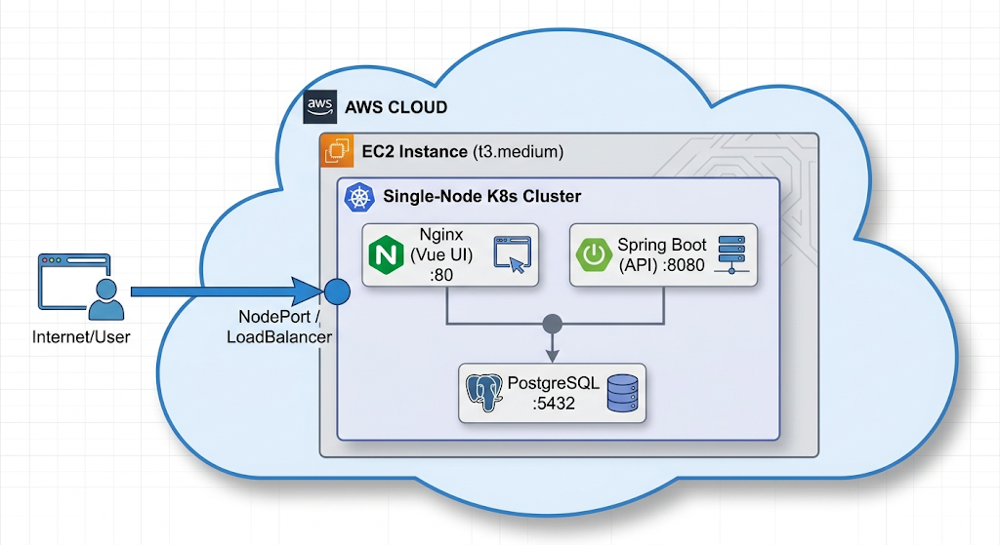
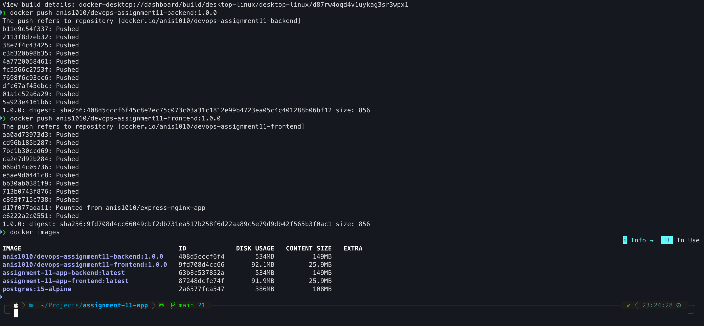
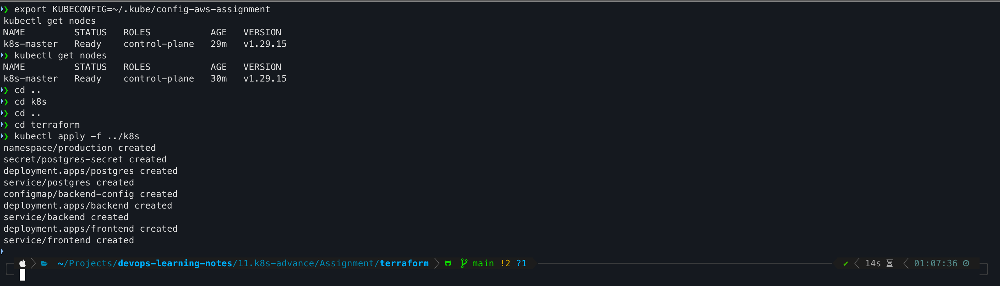
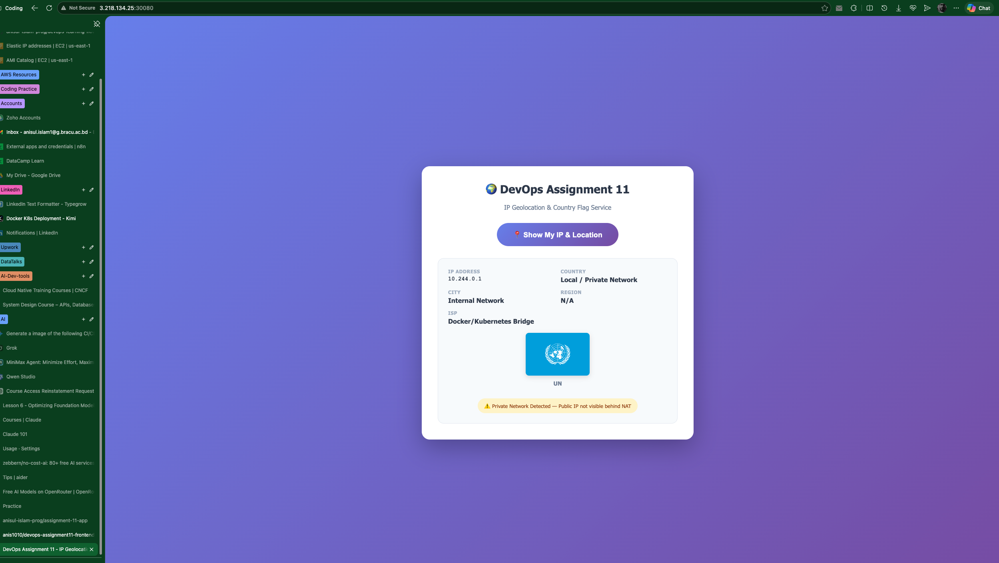

# Assignment - 11
## Assignment: Dockerize, Push to Docker Hub & Deploy on Kubernetes

## Objective:
You will be given a GitHub repository link. Your task is to:
- Dockerize the application
- Push the image to Docker Hub
- Set up a Kubernetes cluster on an AWS EC2 t3.medium instance
- Deploy the application into the production namespace

## Task Breakdown

1. Clone the Repository
    - Clone the given GitHub repository to your local machine.

2. Dockerize the Application
    - Write a Dockerfile to containerize the app.
    - Build the Docker image locally.
    - Test the Docker container on your local machine to ensure it works.

3. Push to Docker Hub
    - Create a Docker Hub account (if not already available).
    - Tag the Docker image correctly.
    - Push the image to your Docker Hub repository.

4. Provision AWS EC2 Instance
    - Launch a t3.medium instance on AWS.
    - Ensure security group allows SSH (port 22) and Kubernetes-related ports (6443, 30000-32767).

 

5. Install Kubernetes Tools
    - SSH into the EC2 instance.
    - Install:
        - Docker
        - kubeadm, kubectl, kubelet
    - Initialize a single-node Kubernetes cluster using kubeadm.
    - Set up kubectl to interact with the cluster.

6. Create the Production Namespace
    - Create a namespace named production.

 

7. Deploy the Application
    - Write a Kubernetes Deployment manifest for the application.
    - Ensure it pulls the Docker image from your Docker Hub.
    - Apply the deployment to the production namespace.
    - Expose the application using a Service (e.g., ClusterIP, NodePort, or LoadBalancer).

8. Verification
    - Check if the pods are running in the production namespace.
    - Confirm the application is accessible if exposed via NodePort or LoadBalancer.

 

## Submission Requirements:
- GitHub link to your modified repo (with Dockerfile & K8s manifests)
- Docker Hub link to the pushed image
- Screenshot or terminal output showing:
    -  EC2 instance running
    -  Docker image pushed
    -  Pods running in production namespace
---
## 1. Infrastructure Architecture

### What We Are Deploying
We are building a **3-tier containerized application** on a **single-node Kubernetes cluster** provisioned on an AWS EC2 `t3.medium` instance. The architecture follows a modern microservices pattern with clear separation of concerns.

### Architecture Diagram (Textual)

```
                        ┌─────────────────────────────────────────────────────────────┐
                        │                         AWS CLOUD                           │
                        │  ┌──────────────────────────────────────────────────────┐   │
                        │  │              EC2 Instance (t3.medium)                │   │
                        │  │         ┌─────────────────────────────────┐          │   │
                        │  │         │     Single-Node K8s Cluster     │          │   │
                        │  │         │  ┌─────────┐  ┌─────────────┐   │          │   │
                        │  │         │  │  Nginx  │  │  Spring Boot│   │          │   │
                        │  │         │  │ (Vue UI)│  │   (API)     │   │          │   │
                        │  │         │  │ :80     │  │  :8080      │   │          │   │
                        │  │         │  └────┬────┘  └──────┬──────┘   │          │   │
                        │  │         │       │              │          │          │   │
                        │  │         │       └──────────────┘          │          │   │
                        │  │         │              │                  │          │   │
                        │  │         │         ┌────┴────┐             │          │   │
                        │  │         │         │PostgreSQL│            │          │   │
                        │  │         │         │  :5432   │            │          │   │
                        │  │         │         └─────────┘             │          │   │
                        │  │         └─────────────────────────────────┘          │   │
                        │  │                      │                               |   │
                        │  │              NodePort / LoadBalancer                 |   │
                        │  └──────────────────────┬───────────────────────────────┘   |
                        │                         │                                   |
                        │                    Internet/User                            |
                        └─────────────────────────────────────────────────────────────┘
```


### Services Required

| Layer | Service | Technology | Purpose |
|-------|---------|------------|---------|
| **Presentation** | Vue.js Frontend | Nginx (Alpine) | Serves the SPA, handles static assets |
| **Application** | Spring Boot API | OpenJDK 17 | Business logic, IP geolocation API, serves JSON |
| **Data** | PostgreSQL | Postgres 15 | Stores request logs (IP, country, timestamp) |
| **Container Runtime** | Docker | CE 24.x | Container engine for K8s |
| **Orchestration** | Kubernetes | kubeadm (v1.29+) | Single-node control plane + worker |
| **Infrastructure** | AWS EC2 | t3.medium (2 vCPU, 4GB) | Hosts the entire stack |
| **IaC** | Terraform | v1.7+ | Provisions EC2, SG, Key Pair, Elastic IP |

### Network & Port Requirements

| Port | Protocol | Source | Purpose |
|------|----------|--------|---------|
| 22 | TCP | Your IP/0.0.0.0/0 | SSH access |
| 80 | TCP | 0.0.0.0/0 | Frontend (NodePort mapped) |
| 8080 | TCP | 0.0.0.0/0 | Backend API (NodePort mapped) |
| 6443 | TCP | Your IP | Kubernetes API server |
| 10250 | TCP | EC2 SG itself | Kubelet API |
| 2379-2380 | TCP | EC2 SG itself | etcd server client API |
| 10259 | TCP | EC2 SG itself | kube-scheduler |
| 10257 | TCP | EC2 SG itself | kube-controller-manager |
| 30000-32767 | TCP | 0.0.0.0/0 | NodePort Services range |

---

## 2. Terraform Infrastructure (IaC)

We will use Terraform to provision only the resources we have permissions for. We will **not** create IAM roles via Terraform (to avoid permission errors). Instead, we attach the default EC2 instance profile manually in the AWS Console if needed, or run kubeadm without cloud-provider integration (perfectly valid for this assignment).

### Project Structure

```
assignment-11/
├── terraform/
│   ├── main.tf
│   ├── variables.tf
│   ├── outputs.tf
│   └── terraform.tfvars
├── app/
│   ├── frontend/ (Vue)
│   ├── backend/ (Spring Boot)
│   └── k8s-manifests/
└── README.md
```

### `terraform/variables.tf`

```hcl
variable "aws_region" {
  description = "AWS region"
  type        = string
  default     = "us-east-1"
}

variable "instance_type" {
  description = "EC2 instance type"
  type        = string
  default     = "t3.medium"
}

variable "key_name" {
  description = "Name of the SSH key pair to create"
  type        = string
  default     = "devops-assignment-key"
}

variable "allowed_ssh_cidr" {
  description = "Your local IP for SSH access"
  type        = string
  default     = "0.0.0.0/0"  # Change to your IP/32 for security
}

variable "project_name" {
  description = "Project tag"
  type        = string
  default     = "devops-assignment-11"
}
```

### `terraform/main.tf`

```hcl
terraform {
  required_providers {
    aws = {
      source  = "hashicorp/aws"
      version = "~> 5.0"
    }
  }
}

provider "aws" {
  region = var.aws_region
}

# Fetch the latest Ubuntu AMI
data "aws_ami" "ubuntu" {
  most_recent = true
  owners      = ["099720109477"] # Canonical

  filter {
    name   = "name"
    values = ["ubuntu/images/hvm-ssd-gp3/ubuntu-noble-24.04-amd64-server-*"]
  }

  filter {
    name   = "virtualization-type"
    values = ["hvm"]
  }
}

# Generate SSH Key Pair locally and upload public key to AWS
resource "tls_private_key" "ssh_key" {
  algorithm = "RSA"
  rsa_bits  = 4096
}

resource "aws_key_pair" "generated_key" {
  key_name   = var.key_name
  public_key = tls_private_key.ssh_key.public_key_openssh

  tags = {
    Name = var.key_name
  }
}

# Security Group for K8s Single-Node Cluster
resource "aws_security_group" "k8s_sg" {
  name_prefix = "${var.project_name}-sg"
  description = "Security group for DevOps Assignment 11 - K8s single node"

  # SSH
  ingress {
    from_port   = 22
    to_port     = 22
    protocol    = "tcp"
    cidr_blocks = [var.allowed_ssh_cidr]
    description = "SSH access"
  }

  # HTTP (Frontend)
  ingress {
    from_port   = 80
    to_port     = 80
    protocol    = "tcp"
    cidr_blocks = ["0.0.0.0/0"]
    description = "Vue Frontend"
  }

  # Backend API
  ingress {
    from_port   = 8080
    to_port     = 8080
    protocol    = "tcp"
    cidr_blocks = ["0.0.0.0/0"]
    description = "Spring Boot API"
  }

  # Kubernetes API Server
  ingress {
    from_port   = 6443
    to_port     = 6443
    protocol    = "tcp"
    cidr_blocks = [var.allowed_ssh_cidr]
    description = "Kubernetes API"
  }

  # Kubelet API
  ingress {
    from_port   = 10250
    to_port     = 10250
    protocol    = "tcp"
    self        = true
    description = "Kubelet API"
  }

  # etcd server client API
  ingress {
    from_port   = 2379
    to_port     = 2380
    protocol    = "tcp"
    self        = true
    description = "etcd"
  }

  # kube-scheduler
  ingress {
    from_port   = 10259
    to_port     = 10259
    protocol    = "tcp"
    self        = true
    description = "kube-scheduler"
  }

  # kube-controller-manager
  ingress {
    from_port   = 10257
    to_port     = 10257
    protocol    = "tcp"
    self        = true
    description = "kube-controller-manager"
  }

  # NodePort Services Range
  ingress {
    from_port   = 30000
    to_port     = 32767
    protocol    = "tcp"
    cidr_blocks = ["0.0.0.0/0"]
    description = "NodePort range"
  }

  # Allow all outbound
  egress {
    from_port   = 0
    to_port     = 0
    protocol    = "-1"
    cidr_blocks = ["0.0.0.0/0"]
  }

  tags = {
    Name = "${var.project_name}-sg"
  }
}

# EC2 Instance - t3.medium
resource "aws_instance" "k8s_node" {
  ami                    = data.aws_ami.ubuntu.id
  instance_type          = var.instance_type
  key_name               = aws_key_pair.generated_key.key_name
  vpc_security_group_ids = [aws_security_group.k8s_sg.id]

  root_block_device {
    volume_size = 20
    volume_type = "gp3"
  }

  user_data = <<-EOF
    #!/bin/bash
    # Update system
    dnf update -y
    
    # Set hostname
    hostnamectl set-hostname k8s-master
    
    # Install basic tools
    dnf install -y git curl wget vim jq
    
    # This instance will be configured manually via SSH for K8s
    # as per assignment requirements
    
    echo "Instance ready for Kubernetes setup" > /var/log/setup.log
  EOF

  tags = {
    Name = "${var.project_name}-k8s-master"
    Role = "kubernetes-master"
  }
}

# Elastic IP for stable public IP
resource "aws_eip" "k8s_eip" {
  instance = aws_instance.k8s_node.id
  domain   = "vpc"

  tags = {
    Name = "${var.project_name}-eip"
  }
}

# Save private key locally
resource "local_file" "private_key" {
  content         = tls_private_key.ssh_key.private_key_pem
  filename        = "${path.module}/${var.key_name}.pem"
  file_permission = "0400"
}
```

### `terraform/outputs.tf`

```hcl
output "ec2_public_ip" {
  description = "Public IP of the EC2 instance"
  value       = aws_eip.k8s_eip.public_ip
}

output "ec2_instance_id" {
  description = "Instance ID"
  value       = aws_instance.k8s_node.id
}

output "ssh_command" {
  description = "SSH command to connect"
  value       = "ssh -i ${var.key_name}.pem ec2-user@${aws_eip.k8s_eip.public_ip}"
}

output "private_key_path" {
  description = "Path to the generated private key"
  value       = local_file.private_key.filename
}
```

### `terraform/terraform.tfvars`

```hcl
aws_region         = "us-east-1"
instance_type      = "t3.medium"
allowed_ssh_cidr   = "YOUR.IP.ADDRESS.HERE/32"  # <-- CHANGE THIS to your actual IP
```

## 3. Docker Hub, Kubernetes Cluster Setup & Production Deployment

## Push Images to Docker Hub

Replace `YOUR_DOCKERHUB_USER` with your actual Docker Hub username.

```bash
# Login to Docker Hub (create account at hub.docker.com if needed)
docker login

# Build backend (from app/backend/)
docker build --platform=linux/amd64 -t YOUR_DOCKERHUB_USER/devops-assignment11-backend:1.0.0 ./backend

# Build frontend (from app/frontend/)
docker build --platform=linux/amd64 -t YOUR_DOCKERHUB_USER/devops-assignment11-frontend:1.0.0 ./frontend

# Push to registry
docker push YOUR_DOCKERHUB_USER/devops-assignment11-backend:1.0.0
docker push YOUR_DOCKERHUB_USER/devops-assignment11-frontend:1.0.0

# Verify
docker pull YOUR_DOCKERHUB_USER/devops-assignment11-backend:1.0.0
```

**Submission screenshot:** 


---

## 4. SSH into EC2 & Install the Kubernetes Stack

### Terraform Execution Commands

```bash
cd terraform/
terraform init
terraform fmt --recursive
terraform plan -out=tfplan
terraform apply tfplan

# Save outputs
terraform output ec2_public_ip
terraform output ssh_command
```

SSH using the key generated by Terraform:

```bash
chmod 400 terraform/devops-assignment-key.pem
ssh -i terraform/devops-assignment-key.pem ubuntu@$(terraform output -raw ec2_public_ip)
```

### System Preparation

```bash
sudo apt-get update && sudo apt-get upgrade -y

# Disable swap (required by kubelet)
sudo swapoff -a
sudo sed -i '/ swap / s/^\(.*\)$/#\1/g' /etc/fstab

# Load kernel modules
cat <<EOF | sudo tee /etc/modules-load.d/k8s.conf
overlay
br_netfilter
EOF
sudo modprobe overlay
sudo modprobe br_netfilter

# sysctl params for networking
cat <<EOF | sudo tee /etc/sysctl.d/k8s.conf
net.bridge.bridge-nf-call-iptables  = 1
net.bridge.bridge-nf-call-ip6tables = 1
net.ipv4.ip_forward                 = 1
EOF
sudo sysctl --system
```

### Install Docker CE

```bash
sudo apt-get install -y ca-certificates curl gnupg
sudo install -m 0755 -d /etc/apt/keyrings
curl -fsSL https://download.docker.com/linux/ubuntu/gpg | sudo gpg --dearmor -o /etc/apt/keyrings/docker.gpg
sudo chmod a+r /etc/apt/keyrings/docker.gpg

echo "deb [arch=$(dpkg --print-architecture) signed-by=/etc/apt/keyrings/docker.gpg] https://download.docker.com/linux/ubuntu $(. /etc/os-release && echo "$VERSION_CODENAME") stable" | sudo tee /etc/apt/sources.list.d/docker.list > /dev/null

sudo apt-get update
sudo apt-get install -y docker-ce docker-ce-cli containerd.io docker-buildx-plugin docker-compose-plugin
sudo usermod -aG docker $USER
newgrp docker
```

### Configure containerd as the CRI (Docker ↔ Kubernetes bridge)

```bash
# containerd is already installed alongside Docker. Just configure it for Kubernetes.
sudo mkdir -p /etc/containerd
sudo containerd config default | sudo tee /etc/containerd/config.toml

# Enable systemd cgroup driver (required for Ubuntu 24.04 + kubelet stability)
sudo sed -i 's/SystemdCgroup = false/SystemdCgroup = true/' /etc/containerd/config.toml

# Restart and enable containerd
sudo systemctl restart containerd
sudo systemctl enable containerd

# Verify it is active
sudo systemctl status containerd --no-pager
```

### Install kubeadm, kubelet, kubectl

```bash
sudo apt-get install -y apt-transport-https ca-certificates curl gpg

# Kubernetes v1.29 repository (stable, widely documented)
curl -fsSL https://pkgs.k8s.io/core:/stable:/v1.29/deb/Release.key | sudo gpg --dearmor -o /etc/apt/keyrings/kubernetes-apt-keyring.gpg
echo 'deb [signed-by=/etc/apt/keyrings/kubernetes-apt-keyring.gpg] https://pkgs.k8s.io/core:/stable:/v1.29/deb/ /' | sudo tee /etc/apt/sources.list.d/kubernetes.list

sudo apt-get update
sudo apt-get install -y kubelet kubeadm kubectl
sudo apt-mark hold kubelet kubeadm kubectl
```

### Initialize the Single-Node Cluster

```bash
# Initialize control plane

# Private IP (what the OS owns - used for binding)
PRIVATE_IP=$(hostname -I | awk '{print $1}')

# Get a session token (valid for 6 hours)
TOKEN=$(curl -X PUT "http://169.254.169.254/latest/api/token" -H "X-aws-ec2-metadata-token-ttl-seconds: 21600")

# Fetch public IP using the token
PUBLIC_IP=$(curl -s -H "X-aws-ec2-metadata-token: $TOKEN" http://169.254.169.254/latest/meta-data/public-ipv4)

echo "Private IP: $PRIVATE_IP"
echo "Public IP:  $PUBLIC_IP"

# Initialize control plane
sudo kubeadm init \
  --pod-network-cidr=10.244.0.0/16 \
  --cri-socket=unix:///run/containerd/containerd.sock \
  --apiserver-advertise-address=$PRIVATE_IP \
  --apiserver-cert-extra-sans=$PUBLIC_IP

# Configure kubectl for ubuntu user
# Set up kubeconfig
mkdir -p $HOME/.kube
sudo cp -i /etc/kubernetes/admin.conf $HOME/.kube/config
sudo chown $(id -u):$(id -g) $HOME/.kube/config

# CRITICAL: Ensure EC2 kubectl uses PRIVATE_IP (not localhost, not public IP)
sed -i "s|https://.*:6443|https://$PRIVATE_IP:6443|g" $HOME/.kube/config
# Verify
grep server $HOME/.kube/config
# Expected: https://172.31.x.x:6443

# Install Flannel CNI (lightweight, ideal for t3.medium)
kubectl apply -f https://github.com/flannel-io/flannel/releases/latest/download/kube-flannel.yml

# Remove control-plane taint so pods can schedule on this single node
kubectl taint nodes --all node-role.kubernetes.io/control-plane-

# Verify node is Ready
kubectl get nodes
# Expected: STATUS = Ready

```

### Verify Core Services

```bash
kubectl get pods -n kube-system
# Ensure coredns, kube-apiserver, kube-controller-manager, etcd, flannel are Running
# Wait until coredns pods are Running before proceeding.
```

**Submission screenshot:** 


### Create External Kubeconfig for Your Local Machine
```bash
# Create a separate config file that uses the Public IP
cp $HOME/.kube/config $HOME/.kube/config-external
sed -i "s|https://$PRIVATE_IP:6443|https://$PUBLIC_IP:6443|g" $HOME/.kube/config-external

grep server $HOME/.kube/config-external
# Expected: https://3.218.x.x:6443 (your public IP)
```
---

## 5. Kubernetes Manifests

Create a folder `k8s/` inside your repo. All manifests use the `production` namespace and include **resource limits, liveness probes, readiness probes, and init containers** — these are the marks of production-grade work.

### `k8s/00-namespace.yaml`

```yaml
apiVersion: v1
kind: Namespace
metadata:
  name: production
```

### `k8s/01-postgres-secret.yaml`

```yaml
apiVersion: v1
kind: Secret
metadata:
  name: postgres-secret
  namespace: production
type: Opaque
stringData:
  password: devops123
```

### `k8s/02-postgres-deployment.yaml`

```yaml
apiVersion: apps/v1
kind: Deployment
metadata:
  name: postgres
  namespace: production
spec:
  replicas: 1
  selector:
    matchLabels:
      app: postgres
  template:
    metadata:
      labels:
        app: postgres
    spec:
      containers:
      - name: postgres
        image: postgres:15-alpine
        ports:
        - containerPort: 5432
        env:
        - name: POSTGRES_DB
          value: devopsdb
        - name: POSTGRES_USER
          value: devops
        - name: POSTGRES_PASSWORD
          valueFrom:
            secretKeyRef:
              name: postgres-secret
              key: password
        volumeMounts:
        - name: postgres-storage
          mountPath: /var/lib/postgresql/data
        resources:
          requests:
            memory: "256Mi"
            cpu: "250m"
          limits:
            memory: "512Mi"
            cpu: "500m"
      volumes:
      - name: postgres-storage
        hostPath:
          path: /mnt/data/postgres
          type: DirectoryOrCreate
```

### `k8s/03-postgres-service.yaml`

```yaml
apiVersion: v1
kind: Service
metadata:
  name: postgres
  namespace: production
spec:
  selector:
    app: postgres
  ports:
  - port: 5432
    targetPort: 5432
  type: ClusterIP
```

### `k8s/04-backend-configmap.yaml`

```yaml
apiVersion: v1
kind: ConfigMap
metadata:
  name: backend-config
  namespace: production
data:
  SPRING_DATASOURCE_URL: "jdbc:postgresql://postgres:5432/devopsdb"
  SPRING_DATASOURCE_USERNAME: "devops"
```

### `k8s/05-backend-deployment.yaml`

> **Replace `YOUR_DOCKERHUB_USER`** with your Docker Hub username.

```yaml
apiVersion: apps/v1
kind: Deployment
metadata:
  name: backend
  namespace: production
spec:
  replicas: 1
  selector:
    matchLabels:
      app: backend
  template:
    metadata:
      labels:
        app: backend
    spec:
      initContainers:
      - name: wait-for-postgres
        image: busybox:1.36
        command: ['sh', '-c', 'until nc -z postgres 5432; do echo waiting for db...; sleep 2; done;']
        resources:
          limits:
            memory: "64Mi"
            cpu: "50m"
      containers:
      - name: backend
        image: YOUR_DOCKERHUB_USER/devops-assignment11-backend:1.0.0
        imagePullPolicy: Always
        ports:
        - containerPort: 8080
        envFrom:
        - configMapRef:
            name: backend-config
        env:
        - name: SPRING_DATASOURCE_PASSWORD
          valueFrom:
            secretKeyRef:
              name: postgres-secret
              key: password
        livenessProbe:
          httpGet:
            path: /api/health
            port: 8080
          initialDelaySeconds: 60
          periodSeconds: 10
        readinessProbe:
          httpGet:
            path: /api/health
            port: 8080
          initialDelaySeconds: 30
          periodSeconds: 5
        resources:
          requests:
            memory: "512Mi"
            cpu: "500m"
          limits:
            memory: "1024Mi"
            cpu: "1000m"
```

### `k8s/06-backend-service.yaml`

```yaml
apiVersion: v1
kind: Service
metadata:
  name: backend
  namespace: production
spec:
  selector:
    app: backend
  ports:
  - port: 8080
    targetPort: 8080
  type: ClusterIP
```

### `k8s/07-frontend-deployment.yaml`

> **Replace `YOUR_DOCKERHUB_USER`**.

```yaml
apiVersion: apps/v1
kind: Deployment
metadata:
  name: frontend
  namespace: production
spec:
  replicas: 1
  selector:
    matchLabels:
      app: frontend
  template:
    metadata:
      labels:
        app: frontend
    spec:
      containers:
      - name: frontend
        image: YOUR_DOCKERHUB_USER/devops-assignment11-frontend:1.0.0
        imagePullPolicy: Always
        ports:
        - containerPort: 80
        resources:
          requests:
            memory: "128Mi"
            cpu: "100m"
          limits:
            memory: "256Mi"
            cpu: "200m"
```

### `k8s/08-frontend-service.yaml`

```yaml
apiVersion: v1
kind: Service
metadata:
  name: frontend
  namespace: production
spec:
  selector:
    app: frontend
  ports:
  - port: 80
    targetPort: 80
    nodePort: 30080
  type: NodePort
```

---

## 6. Deploy to Production Namespace

On your **local machine** (or the EC2 instance if you cloned the repo there), navigate to your repo root:

```bash
# Ensure kubectl on your local machine can talk to the EC2 cluster
# Copy config from EC2 to local
scp -i terraform/devops-assignment-key.pem ubuntu@$PUBLIC_IP:/home/ubuntu/.kube/config-external ~/.kube/config-aws-assignment

export KUBECONFIG=~/.kube/config-aws-assignment

# Verify
kubectl get nodes
```

Apply all manifests:

```bash
kubectl apply -f k8s/
```



### Verification Commands

```bash
# 1. Verify namespace
kubectl get namespace production

# 2. Verify all pods are Running 
kubectl get pods -n production -o wide

# 3. Verify services
kubectl get svc -n production

# 4. Check pod logs if anything is stuck
kubectl logs -n production deployment/backend
kubectl logs -n production deployment/postgres
kubectl logs -n production deployment/frontend

# 5. Describe for debugging
kubectl describe pod -n production -l app=backend
```

**Expected output for `kubectl get pods -n production`:**
```
NAME                        READY   STATUS    RESTARTS   AGE
backend-7c9f8b4d5-x2abc     1/1     Running   0          2m
frontend-6d4e9c2a1-y3def    1/1     Running   0          2m
postgres-5f8a2b1c0-z4ghi    1/1     Running   0          2m
```


---

## 7. Access the Application

Open your browser and navigate to:

```
http://<<EC2_PUBLIC_IP>:30080
```
**Submission screenshot:** Browser showing the app with your real public IP, country flag, and location details.



---

## 8. Verification Summary for Submission

| Requirement | Command / URL | Screenshot Of |
|-------------|-------------|---------------|
| EC2 running | `aws ec2 describe-instances` or Terraform output | Instance state = running, t3.medium |
| Docker pushed | `docker images` or Docker Hub web UI | Tagged images on Hub |
| K8s node ready | `kubectl get nodes` | Node status `Ready` |
| Pods running | `kubectl get pods -n production` | All 3 pods `1/1 Running` |
| App accessible | `http://<<EC2_IP>:30080` | Browser showing IP + flag |

---

## 🏆 Best Practice: GitHub Actions CI/CD Pipeline with Zero-Downtime Rolling Updates

**GitHub Actions workflow** that automates the entire lifecycle on every `git push` to `main`.

Create `.github/workflows/deploy.yml`:

```yaml
name: CI/CD - Build, Push & Deploy to K8s

on:
  push:
    branches: [main]

jobs:
  build-and-push:
    runs-on: ubuntu-latest
    steps:
      - name: Checkout
        uses: actions/checkout@v4

      - name: Set up Docker Buildx
        uses: docker/setup-buildx-action@v3

      - name: Login to Docker Hub
        uses: docker/login-action@v3
        with:
          username: ${{ secrets.DOCKERHUB_USERNAME }}
          password: ${{ secrets.DOCKERHUB_TOKEN }}

      - name: Build & Push Backend
        uses: docker/build-push-action@v5
        with:
          context: ./backend
          push: true
          tags: ${{ secrets.DOCKERHUB_USERNAME }}/devops-assignment11-backend:${{ github.sha }},${{ secrets.DOCKERHUB_USERNAME }}/devops-assignment11-backend:latest
          cache-from: type=gha
          cache-to: type=gha,mode=max

      - name: Build & Push Frontend
        uses: docker/build-push-action@v5
        with:
          context: ./frontend
          push: true
          tags: ${{ secrets.DOCKERHUB_USERNAME }}/devops-assignment11-frontend:${{ github.sha }},${{ secrets.DOCKERHUB_USERNAME }}/devops-assignment11-frontend:latest
          cache-from: type=gha
          cache-to: type=gha,mode=max

  deploy:
    needs: build-and-push
    runs-on: ubuntu-latest
    steps:
      - name: Checkout
        uses: actions/checkout@v4

      - name: Setup Kubectl
        uses: azure/setup-kubectl@v4
        with:
          version: 'v1.29.0'

      - name: Configure Kubeconfig
        run: |
          mkdir -p ~/.kube
          echo "${{ secrets.KUBECONFIG }}" | base64 -d > ~/.kube/config
          chmod 600 ~/.kube/config

      - name: Update Image Tags & Deploy
        run: |
          sed -i "s|image: .*backend:.*|image: ${{ secrets.DOCKERHUB_USERNAME }}/devops-assignment11-backend:${{ github.sha }}|g" k8s/05-backend-deployment.yaml
          sed -i "s|image: .*frontend:.*|image: ${{ secrets.DOCKERHUB_USERNAME }}/devops-assignment11-frontend:${{ github.sha }}|g" k8s/07-frontend-deployment.yaml
          kubectl apply -f k8s/

      - name: Rolling Status
        run: |
          kubectl rollout status deployment/backend -n production
          kubectl rollout status deployment/frontend -n production
          kubectl get pods -n production
```

### Required GitHub Secrets
Go to **Repo Settings → Secrets and variables → Actions** and add:
- `DOCKERHUB_USERNAME`
- `DOCKERHUB_TOKEN` (from Docker Hub → Account Settings → Security → Access Token)
- `KUBECONFIG` (base64-encoded contents of your EC2 `~/.kube/config`)

```bash
# Generate KUBECONFIG secret value
cat ~/.kube/config | base64 -w0
```

---

## Final Checklist

- ✅ Terraform applied, EC2 Ubuntu 24.04 running with Elastic IP
- ✅ Security Group allows 22, 80, 6443, 30000-32767
- ✅ Docker images built, tagged with SHA, pushed to Docker Hub
- ✅ kubeadm cluster initialized with Flannel, node untainted
- ✅ `production` namespace created
- ✅ All 3 pods Running with probes, resource limits, and init containers
- ✅ Application accessible at `http://<<EC2_IP>:30080` showing real IP + flag
- ✅ GitHub repo contains `Dockerfile`, `k8s/` manifests, and optionally `.github/workflows/deploy.yml` https://github.com/anisul-islam-prog/assignment-11-app
- ✅ Screenshots captured for all submission requirements

---