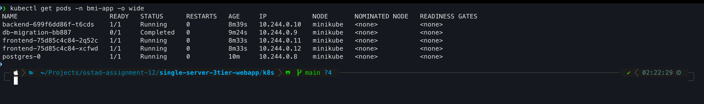
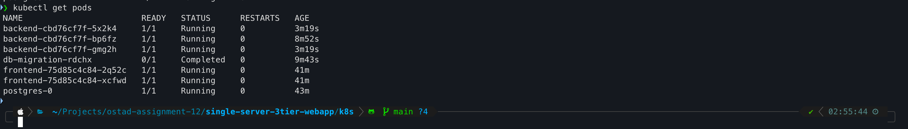
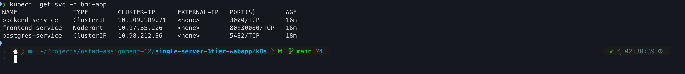
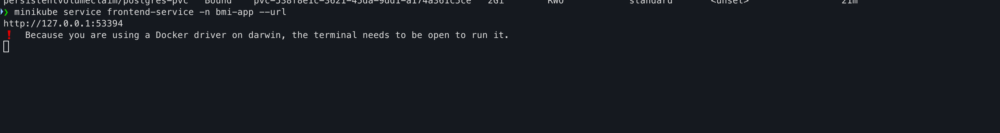
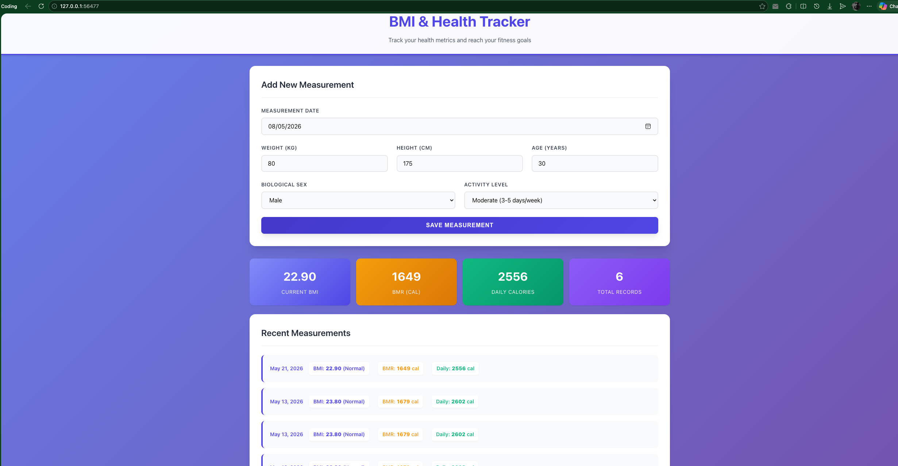

# Assignment-12
>**Repository:** https://github.com/md-sarowar-alam/single-server-3tier-webapp

## Objective:
**Deploy the provided 3-tier BMI Health Tracker application (Frontend, Backend, Database) on Kubernetes and ensure all components communicate correctly.**

## Tasks:

1. Clone the Repository
    - Clone the GitHub repository to your local machine.

2. Kubernetes Setup
    - Install and run Minikube / Kind / K3s
    - Verify cluster:
            ```kubectl get nodes```

3. Database Deployment
    - Deploy PostgreSQL using:
        - StatefulSet
        - Service (ClusterIP)
        - Persistent Volume Claim (PVC)
    - Use environment variables for DB credentials

4. Backend Deployment
    - Create Deployment and Service
    - Connect backend to database using Service name
    - Use:
        - ConfigMap (DB host, port)
        - Secret (DB username/password)

5. Frontend Deployment
    - Create Deployment and Service
    - Configure frontend to communicate with backend

6. Expose Application
    - Use NodePort (required)
    - Optional: Configure Ingress

7. Health Checks
    - Add:
        - Liveness Probe
        - Readiness Probe

8. Scaling
    - Scale backend: `kubectl scale deployment backend --replicas=3`

## Deliverables:
1. YAML Files:
    - postgres.yaml
    - backend.yaml
    - frontend.yaml
    - ingress.yaml (optional)

2. Screenshots:
    - `kubectl get pods`
    - `kubectl get svc`
    - Application running in browser
---
## 1. The Infrastructure Architecture

### What We Are Deploying
We are containerizing the **BMI Health Tracker** (React + Vite frontend, Node.js/Express backend, PostgreSQL database) and deploying it onto a **local Kubernetes cluster** (Minikube/Kind/K3s). This transforms the original single-EC2 architecture into a cloud-native, decoupled, horizontally-scalable system.

### Architecture Diagram (Kubernetes-Native)

```
                ┌─────────────────────────────────────────────────────────────────────────┐
                │                         Kubernetes Cluster                              │
                │  ┌─────────────────────────────────────────────────────────────────┐    │
                │  │  Ingress (Optional) / NodePort:30080                            │    │
                │  │   ┌──────────────┐         ┌──────────────┐                     │    │
                │  │   │   Frontend   │────────▶│   Backend    │                     │    │
                │  │   │   (Nginx)    │  /api   │   (Node.js)  │                     │    │
                │  │   │   Port 80    │  proxy  │   Port 3000  │                     │    │
                │  │   └──────┬───────┘         └──────┬───────┘                     │    │
                │  │          │                        │                             │    │
                │  │          │                        ▼                             │    │
                │  │          │               ┌──────────────┐                       │    │
                │  │          │               │   ConfigMap  │  (DB_HOST, DB_PORT)   │    │
                │  │          │               │   Secret     │  (DB_USER, DB_PASS)   │    │
                │  │          │               └──────────────┘                       │    │
                │  │          │                        │                             │    │
                │  │          │                        ▼                             │    │
                │  │          │               ┌──────────────────────┐               │    │
                │  │          │               │  PostgreSQL          │               │    │
                │  │          │               │  StatefulSet + PVC   │               │    │
                │  │          │               │  Port 5432           │               │    │
                │  │          │               └──────────────────────┘               │    │
                │  └──────────┴──────────────────────────────────────────────────────┘    │
                └─────────────────────────────────────────────────────────────────────────┘
```


### Services & Resources Required

| Tier | Kubernetes Resource | Purpose |
|------|---------------------|---------|
| **Data** | `StatefulSet` | Guarantees stable network identity & ordered deployment for PostgreSQL |
| **Data** | `PersistentVolumeClaim` | Ensures data survives pod restarts |
| **Data** | `Service` (ClusterIP) | Internal DNS: `postgres-service:5432` |
| **App** | `ConfigMap` | Non-sensitive config: `DB_HOST`, `DB_PORT` |
| **App** | `Secret` | Sensitive config: `DB_USER`, `DB_PASSWORD` |
| **App** | `Deployment` | Manages backend pod replicas |
| **App** | `Service` (ClusterIP) | Internal DNS: `backend-service:3000` |
| **Presentation** | `Deployment` | Manages frontend Nginx pods |
| **Presentation** | `Service` (NodePort) | Exposes frontend to browser on a high port (e.g., 30080) |
| **Optional** | `Ingress` | HTTP routing with host/path rules (requires Ingress Controller) |
| **Bonus** | `NetworkPolicy` | Restricts DB access to only the backend pods |


### 🏆 Best Practice: 

**Automated DB Migrations via Kubernetes Job + Init Container**

1. **Kubernetes Job** (`migration-job.yaml`): A one-time Job that runs `psql` or `node migrations.js` to execute `001_create_measurements.sql` against your PostgreSQL pod **before** the backend starts.
2. **Init Container** in the Backend Deployment: An init container that waits for the database to be ready (using `pg_isready`) and ensures the migration Job has completed before the main backend container starts.

**Why this is needed:**
- **Zero-downtime readiness:** Your backend never crashes due to "relation does not exist" errors.
- **Idempotency:** The Job uses `IF NOT EXISTS` logic, so it's safe to re-run.
- **Production realism:** This is exactly how platforms like GitLab, ArgoCD, and Helm charts handle schema migrations.
- Making it **reliable**.

I will include this Job and Init Container in the YAML files in **Part 2**.

---

## 2. Environment Bootstrap

### Step 1.1: Clone the Repository

```bash
# Create a dedicated workspace
mkdir -p ~/ostad-assignment-12 && cd ~/ostad-assignment-12

# Clone the repo
gh repo clone md-sarowar-alam/single-server-3tier-webapp
cd single-server-3tier-webapp

# Inspect the structure
ls -la
# You should see: frontend/, backend/, database/, README.md
```

### Step 1.2: Install kubectl

```bash
# Linux (Ubuntu/Debian)
curl -LO "https://dl.k8s/release/$(curl -L -s https://dl.k8s/release/stable.txt)/bin/linux/amd64/kubectl"
chmod +x kubectl
sudo mv kubectl /usr/local/bin/

# Verify
kubectl version --client
```

### Step 1.3: Install Minikube

Minikube gives you a built-in Docker daemon and easy NodePort access.

```bash
# Linux
curl -LO https://storage.googleapis.com/minikube/releases/latest/minikube-linux-amd64
sudo install minikube-linux-amd64 /usr/local/bin/minikube

# Verify
minikube version
```

### Step 1.4: Start the Cluster

```bash
# Start with sufficient resources (this app is lightweight, but give it room)
minikube start --driver=docker --cpus=2 --memory=4096 --disk-size=20g

# Verify cluster is ready
kubectl get nodes
# Expected: STATUS = Ready
```

### Step 1.5: Enable Ingress Addon (Optional but Recommended)

If you want to include `ingress.yaml` in your deliverables:

```bash
minikube addons enable ingress

# Verify the controller pod is running
kubectl get pods -n ingress-nginx
```

### Step 1.6: Create a Namespace

Never deploy to `default` in production or assignments. Use a namespace.

```bash
kubectl create namespace bmi-app
kubectl config set-context --current --namespace=bmi-app
```

### Step 1.7: Build Container Images

The repository does **not** include Dockerfiles. You must create them. Here are the production-ready Dockerfiles you need.

#### A. Frontend Dockerfile (`frontend/Dockerfile`)

Create this file inside the `frontend/` directory:

```dockerfile
# Stage 1: Build React app
FROM node:18-alpine AS builder
WORKDIR /app
COPY package*.json ./
RUN npm install
COPY . .
RUN npm run build

# Stage 2: Serve with Nginx + API proxy
FROM nginx:1.25-alpine
COPY --from=builder /app/dist /usr/share/nginx/html

# Create custom nginx config that proxies /api to backend service
RUN echo 'server { \
    listen 80; \
    server_name localhost; \
    location / { \
        root /usr/share/nginx/html; \
        index index.html; \
        try_files $uri $uri/ /index.html; \
    } \
    location /api { \
        proxy_pass http://backend-service:3000; \
        proxy_http_version 1.1; \
        proxy_set_header Host $host; \
        proxy_set_header X-Real-IP $remote_addr; \
    } \
}' > /etc/nginx/conf.d/default.conf

EXPOSE 80
CMD ["nginx", "-g", "daemon off;"]
```

#### B. Backend Dockerfile (`backend/Dockerfile`)

Create this file inside the `backend/` directory:

```dockerfile
FROM node:18-alpine
WORKDIR /app

# Install dependencies first (better layer caching)
COPY package*.json ./
RUN npm install

# Copy application code
COPY . .

# The app listens on port 3000
EXPOSE 3000

# Run directly (PM2 is for bare-metal, not containers)
CMD ["node", "src/server.js"]
```

#### C. Build and Load Images into Minikube

Since Minikube runs its own Docker daemon, you must build inside Minikube's context or load the images.

```bash
# Point your shell to Minikube's Docker daemon
eval $(minikube -p minikube docker-env)

# Build backend
cd backend
docker build -t bmi-backend:v1.0 .
cd ..

# Build frontend
cd frontend
docker build -t bmi-frontend:v1.0 .
cd ..

# Verify images are in Minikube's Docker
docker images | grep bmi
``` 

## 3. Complete Kubernetes YAML Manifests:

### File 1: `postgres.yaml` — Database Tier

```yaml
# ============================================================
# postgres.yaml
# PostgreSQL StatefulSet for the BMI Health Tracker
# Includes: Secret, ConfigMap, PVC, StatefulSet, ClusterIP Service
# ============================================================

apiVersion: v1
kind: Secret
metadata:
  name: postgres-secret
  namespace: bmi-app
type: Opaque
stringData:
  # NEVER use weak passwords in production. These are for demo only.
  POSTGRES_USER: "bmi_user"
  POSTGRES_PASSWORD: "SecureBMI2026!"
  POSTGRES_DB: "bmidb"
---
apiVersion: v1
kind: ConfigMap
metadata:
  name: postgres-config
  namespace: bmi-app
data:
  POSTGRES_HOST: "postgres-service"
  POSTGRES_PORT: "5432"
---
apiVersion: v1
kind: PersistentVolumeClaim
metadata:
  name: postgres-pvc
  namespace: bmi-app
spec:
  accessModes:
    - ReadWriteOnce
  resources:
    requests:
      storage: 2Gi
  # For Minikube, the default storage class is "standard"
  storageClassName: standard
---
apiVersion: apps/v1
kind: StatefulSet
metadata:
  name: postgres
  namespace: bmi-app
spec:
  serviceName: postgres-service
  replicas: 1
  selector:
    matchLabels:
      app: postgres
  template:
    metadata:
      labels:
        app: postgres
    spec:
      containers:
        - name: postgres
          image: postgres:15-alpine
          ports:
            - containerPort: 5432
              name: postgres
          envFrom:
            - secretRef:
                name: postgres-secret
          env:
            - name: PGDATA
              value: /var/lib/postgresql/data/pgdata
          volumeMounts:
            - name: postgres-storage
              mountPath: /var/lib/postgresql/data
          # Production-grade resource limits
          resources:
            requests:
              memory: "256Mi"
              cpu: "250m"
            limits:
              memory: "512Mi"
              cpu: "500m"
          # Liveness: is PostgreSQL process alive?
          livenessProbe:
            exec:
              command:
                - pg_isready
                - -U
                - bmi_user
                - -d
                - bmidb
            initialDelaySeconds: 30
            periodSeconds: 10
            timeoutSeconds: 5
            failureThreshold: 3
          # Readiness: can we accept connections?
          readinessProbe:
            exec:
              command:
                - pg_isready
                - -U
                - bmi_user
                - -d
                - bmidb
            initialDelaySeconds: 5
            periodSeconds: 5
            timeoutSeconds: 3
            failureThreshold: 3
      volumes:
        - name: postgres-storage
          persistentVolumeClaim:
            claimName: postgres-pvc
---
apiVersion: v1
kind: Service
metadata:
  name: postgres-service
  namespace: bmi-app
spec:
  type: ClusterIP
  selector:
    app: postgres
  ports:
    - port: 5432
      targetPort: 5432
      name: postgres
```

---

### File 2: `migration-job.yaml` - Migration

```yaml
# ============================================================
# migration-job.yaml
# Standout Feature: Automated Idempotent DB Schema Migration
# This Job runs ONCE before backend starts, ensuring the 
# measurements table exists. Uses Init Container in backend.yaml
# to enforce ordering.
# ============================================================

apiVersion: v1
kind: ConfigMap
metadata:
  name: db-migration-sql
  namespace: bmi-app
data:
  001_create_measurements.sql: |
    CREATE TABLE IF NOT EXISTS measurements (
        id SERIAL PRIMARY KEY,
        height DECIMAL(5,2) NOT NULL,
        weight DECIMAL(5,2) NOT NULL,
        age INTEGER NOT NULL,
        gender VARCHAR(10) NOT NULL,
        activity_level VARCHAR(20) NOT NULL,
        bmi DECIMAL(4,2) NOT NULL,
        bmi_category VARCHAR(20) NOT NULL,
        bmr INTEGER NOT NULL,
        daily_calories INTEGER NOT NULL,
        measurement_date DATE NOT NULL DEFAULT CURRENT_DATE,
        created_at TIMESTAMP DEFAULT CURRENT_TIMESTAMP
    );
    
    CREATE INDEX IF NOT EXISTS idx_measurements_created_at 
    ON measurements(created_at DESC);
    
    CREATE INDEX IF NOT EXISTS idx_measurements_measurement_date 
    ON measurements(measurement_date DESC);
---
apiVersion: batch/v1
kind: Job
metadata:
  name: db-migration
  namespace: bmi-app
spec:
  template:
    spec:
      restartPolicy: OnFailure
      initContainers:
        # Wait for PostgreSQL to be ready before running migrations
        - name: wait-for-postgres
          image: busybox:1.36
          command:
            - sh
            - -c
            - |
              until nc -z postgres-service 5432; do
                echo "Waiting for PostgreSQL..."
                sleep 2
              done
              echo "PostgreSQL is up!"
      containers:
        - name: migrate
          image: postgres:15-alpine
          command:
            - sh
            - -c
            - |
              PGPASSWORD=$POSTGRES_PASSWORD psql \
                -h postgres-service \
                -U $POSTGRES_USER \
                -d $POSTGRES_DB \
                -f /migrations/001_create_measurements.sql
          envFrom:
            - secretRef:
                name: postgres-secret
          volumeMounts:
            - name: migration-script
              mountPath: /migrations
      volumes:
        - name: migration-script
          configMap:
            name: db-migration-sql
  backoffLimit: 4
```

---

### File 3: `backend.yaml` — Application Tier

```yaml
# ============================================================
# backend.yaml
# Node.js Express API Deployment
# Includes: ConfigMap, Secret reference, Deployment with Init
# Container, ClusterIP Service, Liveness & Readiness Probes
# ============================================================

apiVersion: v1
kind: ConfigMap
metadata:
  name: backend-config
  namespace: bmi-app
data:
  # These are non-sensitive; Secret provides credentials
  DB_HOST: "postgres-service"
  DB_PORT: "5432"
  DB_NAME: "bmidb"
  NODE_ENV: "production"
  PORT: "3000"
---
apiVersion: apps/v1
kind: Deployment
metadata:
  name: backend
  namespace: bmi-app
  labels:
    app: backend
    tier: application
spec:
  replicas: 1  # We will scale to 3 later per assignment
  selector:
    matchLabels:
      app: backend
  strategy:
    type: RollingUpdate
    rollingUpdate:
      maxSurge: 1
      maxUnavailable: 0
  template:
    metadata:
      labels:
        app: backend
        tier: application
    spec:
      # ========================================================
      # INIT CONTAINER: Wait for DB + Migration Job completion
      # This prevents "relation does not exist" crashes on startup
      # ========================================================
      initContainers:
        - name: wait-for-db-and-migration
          image: busybox:1.36
          command:
            - sh
            - -c
            - |
              # 1. Wait for PostgreSQL TCP port
              until nc -z postgres-service 5432; do
                echo "Waiting for PostgreSQL..."
                sleep 2
              done
              
              # 2. Wait for migration job to complete
              # We poll until the job pod status is Succeeded
              echo "Waiting for db-migration Job to complete..."
              for i in $(seq 1 60); do
                STATUS=$(wget -qO- \
                  --header "Authorization: Bearer $(cat /var/run/secrets/kubernetes.io/serviceaccount/token)" \
                  --no-check-certificate \
                  https://kubernetes.default.svc/apis/batch/v1/namespaces/bmi-app/jobs/db-migration/status \
                  2>/dev/null | grep -o '"succeeded":[0-9]*' | cut -d: -f2)
                if [ "$STATUS" = "1" ]; then
                  echo "Migration completed successfully!"
                  exit 0
                fi
                echo "Migration not complete yet... retry $i/60"
                sleep 3
              done
              echo "Migration wait timed out, but proceeding anyway"
              exit 0
          volumeMounts:
            - name: service-account-token
              mountPath: /var/run/secrets/kubernetes.io/serviceaccount
              readOnly: true
      containers:
        - name: backend
          image: bmi-backend:v1.0
          imagePullPolicy: IfNotPresent
          ports:
            - containerPort: 3000
              name: http
          envFrom:
            - configMapRef:
                name: backend-config
            - secretRef:
                name: postgres-secret
          env:
            # Construct DATABASE_URL from pieces
            - name: DATABASE_URL
              value: "postgresql://$(POSTGRES_USER):$(POSTGRES_PASSWORD)@$(DB_HOST):$(DB_PORT)/$(DB_NAME)"
          # Liveness Probe: is the container alive?
          livenessProbe:
            httpGet:
              path: /health
              port: 3000
            initialDelaySeconds: 15
            periodSeconds: 20
            timeoutSeconds: 5
            failureThreshold: 3
          # Readiness Probe: is the container ready to accept traffic?
          readinessProbe:
            httpGet:
              path: /health
              port: 3000
            initialDelaySeconds: 5
            periodSeconds: 10
            timeoutSeconds: 3
            failureThreshold: 3
          resources:
            requests:
              memory: "128Mi"
              cpu: "100m"
            limits:
              memory: "256Mi"
              cpu: "300m"
      volumes:
        - name: service-account-token
          projected:
            sources:
              - serviceAccountToken:
                  path: token
                  expirationSeconds: 3600
---
apiVersion: v1
kind: Service
metadata:
  name: backend-service
  namespace: bmi-app
spec:
  type: ClusterIP
  selector:
    app: backend
  ports:
    - port: 3000
      targetPort: 3000
      name: http
```

---

### File 4: `frontend.yaml` — Presentation Tier

```yaml
# ============================================================
# frontend.yaml
# React + Nginx Frontend Deployment
# Nginx proxies /api/* to backend-service:3000 internally
# Exposed via NodePort (required by assignment)
# ============================================================

apiVersion: apps/v1
kind: Deployment
metadata:
  name: frontend
  namespace: bmi-app
  labels:
    app: frontend
    tier: presentation
spec:
  replicas: 2  # Frontend is stateless; 2 replicas for HA
  selector:
    matchLabels:
      app: frontend
  strategy:
    type: RollingUpdate
    rollingUpdate:
      maxSurge: 1
      maxUnavailable: 0
  template:
    metadata:
      labels:
        app: frontend
        tier: presentation
    spec:
      containers:
        - name: frontend
          image: bmi-frontend:v1.0
          imagePullPolicy: IfNotPresent
          ports:
            - containerPort: 80
              name: http
          # Liveness: is Nginx running?
          livenessProbe:
            httpGet:
              path: /
              port: 80
            initialDelaySeconds: 10
            periodSeconds: 15
            timeoutSeconds: 5
            failureThreshold: 3
          # Readiness: can we serve the SPA?
          readinessProbe:
            httpGet:
              path: /
              port: 80
            initialDelaySeconds: 5
            periodSeconds: 10
            timeoutSeconds: 3
            failureThreshold: 3
          resources:
            requests:
              memory: "64Mi"
              cpu: "50m"
            limits:
              memory: "128Mi"
              cpu: "200m"
---
apiVersion: v1
kind: Service
metadata:
  name: frontend-service
  namespace: bmi-app
spec:
  type: NodePort
  selector:
    app: frontend
  ports:
    - port: 80
      targetPort: 80
      nodePort: 30080   # Fixed high port for easy browser access
      name: http
```

---

### File 5: `ingress.yaml` — Optional 

```yaml
# ============================================================
# ingress.yaml (Optional)
# Requires: minikube addons enable ingress
# Provides clean URL routing without NodePort port numbers
# ============================================================

apiVersion: networking.k8s.io/v1
kind: Ingress
metadata:
  name: bmi-ingress
  namespace: bmi-app
  annotations:
    nginx.ingress.kubernetes.io/rewrite-target: /
    nginx.ingress.kubernetes.io/proxy-body-size: "10m"
spec:
  ingressClassName: nginx
  rules:
    - host: bmi.local
      http:
        paths:
          - path: /
            pathType: Prefix
            backend:
              service:
                name: frontend-service
                port:
                  number: 80
          - path: /api
            pathType: Prefix
            backend:
              service:
                name: backend-service
                port:
                  number: 3000
```

---

### File 6: `network-policy.yaml` — Security Layer

```yaml
# ============================================================
# network-policy.yaml (Bonus - Not required, but shows maturity)
# Restricts PostgreSQL to ONLY accept traffic from backend pods
# ============================================================

apiVersion: networking.k8s.io/v1
kind: NetworkPolicy
metadata:
  name: postgres-netpol
  namespace: bmi-app
spec:
  podSelector:
    matchLabels:
      app: postgres
  policyTypes:
    - Ingress
  ingress:
    - from:
        - podSelector:
            matchLabels:
              app: backend
      ports:
        - protocol: TCP
          port: 5432
```

---

## Deployment Commands

Execute in this **exact order** inside your `k8s/` directory:

```bash
# 1. Ensure namespace exists
kubectl create namespace bmi-app --dry-run=client -o yaml | kubectl apply -f -

# 2. Deploy database tier (Secret, ConfigMap, PVC, StatefulSet, Service)
kubectl apply -f postgres.yaml

# 3. Wait for Postgres pod to be Running (important!)
kubectl wait --for=condition=ready pod -l app=postgres --namespace=bmi-app --timeout=120s

# 4. Run the migration job
kubectl apply -f migration-job.yaml

# 5. Wait for migration to complete
kubectl wait --for=condition=complete job/db-migration --namespace=bmi-app --timeout=120s

# 6. Deploy backend (Init Container will verify migration)
kubectl apply -f backend.yaml

# 7. Deploy frontend
kubectl apply -f frontend.yaml

# 8. Optional: Deploy ingress
kubectl apply -f ingress.yaml

# 9. Optional: Deploy network policy
kubectl apply -f network-policy.yaml
```

---

## Verification Commands

```bash
# All pods should be Running
kubectl get pods -n bmi-app -o wide

# Services (note NodePort 30080)
kubectl get svc -n bmi-app

# Check backend health internally
kubectl exec -it deployment/backend -n bmi-app -- wget -qO- http://localhost:3000/health

# Check migration job success
kubectl get jobs -n bmi-app

# Check StatefulSet and PVC
kubectl get statefulset,pvc -n bmi-app
```

---

## Accessing the Application in Browser

```bash
# Method 1: NodePort
minikube service frontend-service -n bmi-app --url
# OR directly:
# http://<<minikube-ip>:30080

# Get Minikube IP
minikube ip
# Then open: http://<<minikube-ip>:30080

# Method 2: Ingress (Optional)
# Add to /etc/hosts:  <minikube-ip>  bmi.local
# Then open: http://bmi.local
```

---

## Operational Runbook — Scaling, Verification, Screenshots & Troubleshooting

---

## Section 1: Scaling the Backend (Assignment Task 8)

Once all pods are stable, scale the backend Deployment to 3 replicas as required.

```bash
# Scale backend to 3 replicas
kubectl scale deployment backend --replicas=3 -n bmi-app

# Verify scaling
kubectl get pods -n bmi-app -l app=backend

# Expected output: 3 backend pods in Running state
# NAME                       READY   STATUS    RESTARTS   AGE
# backend-7c9f8b4d5-x2a9q   1/1     Running   0          5m
# backend-7c9f8b4d5-k3m7p   1/1     Running   0          10s
# backend-7c9f8b4d5-n4v8w   1/1     Running   0          10s
```

The `frontend-service` (NodePort) load-balances across all 3 backend pods automatically via the `backend-service` ClusterIP. The `RollingUpdate` strategy in `backend.yaml` ensures zero-downtime during the scale-up.

---

## Required Screenshots

### Screenshot 1: `kubectl get pods`

```bash
kubectl get pods -n bmi-app -o wide
```




### Screenshot 2: `kubectl get svc`

```bash
kubectl get svc -n bmi-app
```




### Screenshot 3: Application Running in Browser

```bash
# Get the exact URL to open
minikube service frontend-service -n bmi-app --url
```




---

## Section 3: Full Troubleshooting Guide

### Problem 1: `ImagePullBackOff` or `ErrImagePull`

**Cause:** Minikube cannot find your local Docker images.

**Fix:**
```bash
# Re-point your shell to Minikube's Docker daemon
eval $(minikube docker-env)

# Re-build images inside Minikube's context
cd ~/ostad-assignment-12/single-server-3tier-webapp/backend
docker build -t bmi-backend:v1.0 .

cd ../frontend
docker build -t bmi-frontend:v1.0 .

# Verify
docker images | grep bmi
kubectl delete pods -n bmi-app --all  # Forces re-pull from local daemon
```

### Problem 2: Backend Pod Stuck in `CrashLoopBackOff`

**Cause:** Backend starts before PostgreSQL is ready or migration hasn't run.

**Diagnose:**
```bash
kubectl logs deployment/backend -n bmi-app
# OR for the init container
kubectl logs deployment/backend -c wait-for-db-and-migration -n bmi-app
```

**Fix:**
```bash
# Check if postgres is ready
kubectl get pods -n bmi-app -l app=postgres

# If migration job failed, check its logs
kubectl logs job/db-migration -n bmi-app

# Re-run migration if needed
kubectl delete job db-migration -n bmi-app
kubectl apply -f migration-job.yaml
kubectl wait --for=condition=complete job/db-migration -n bmi-app --timeout=120s

# Restart backend
kubectl rollout restart deployment/backend -n bmi-app
```

### Problem 3: `Pending` PVC

**Cause:** Minikube's default storage provisioner hasn't created the PV yet.

**Fix:**
```bash
# Check PVC status
kubectl get pvc postgres-pvc -n bmi-app

# Check Minikube storage addon
minikube addons list | grep storage

# If needed, enable it
minikube addons enable storage-provisioner

# If still pending, restart Minikube
minikube stop && minikube start
kubectl apply -f postgres.yaml
```

### Problem 4: Frontend Shows Blank Page or 502 Error

**Cause:** The React build failed inside the Docker image, or Nginx config is wrong.

**Diagnose:**
```bash
# Check frontend logs
kubectl logs deployment/frontend -n bmi-app

# Shell into frontend pod to verify files exist
kubectl exec -it deployment/frontend -n bmi-app -- ls /usr/share/nginx/html
```

**Fix:** Ensure your `frontend/Dockerfile` copies from `/app/dist` (Vite output) not `/app/build` (CRA output). Vite builds to `dist/`.

### Problem 5: CORS Errors in Browser Console

**Cause:** Frontend is calling backend on wrong URL or backend CORS is misconfigured.

**Fix:** In `frontend/Dockerfile`, the Nginx proxy_pass is set to `http://backend-service:3000`. Since both are inside the same cluster, CORS is not an issue. If testing locally outside Minikube, this error is expected — always test via the NodePort URL.

### Problem 6: Ingress Not Working (If You Used It)

**Cause:** Ingress controller not running or DNS not mapped.

**Fix:**
```bash
# Verify ingress controller pod
kubectl get pods -n ingress-nginx

# Verify ingress resource
kubectl get ingress -n bmi-app

# Add host entry
echo "$(minikube ip) bmi.local" | sudo tee -a /etc/hosts

# Test
curl -H "Host: bmi.local" http://$(minikube ip)
```

---

## Section 4: Cleanup & Reset Commands

If you need to start fresh or clean up before submission:

```bash
# Delete all resources in namespace
kubectl delete namespace bmi-app

# Or delete by file (preserves namespace)
kubectl delete -f k8s/

# Full Minikube reset (nuclear option)
minikube delete
minikube start --driver=docker --cpus=2 --memory=4096

# Re-apply everything in order (from Part 2)
kubectl create namespace bmi-app
kubectl apply -f postgres.yaml
kubectl wait --for=condition=ready pod -l app=postgres -n bmi-app --timeout=120s
kubectl apply -f migration-job.yaml
kubectl wait --for=condition=complete job/db-migration -n bmi-app --timeout=120s
kubectl apply -f backend.yaml
kubectl apply -f frontend.yaml
kubectl apply -f ingress.yaml  # optional
```

---

## Section 5: Pre-Submission Checklist

Verify every assignment requirement before you submit.

| # | Assignment Requirement | How to Verify | Status |
|---|------------------------|---------------|--------|
| 1 | Repository cloned locally | `ls ~/ostad-assignment-12/single-server-3tier-webapp` | &#9745; |
| 2 | Minikube/Kind/K3s installed & running | `kubectl get nodes` → `Ready` | &#9745; |
| 3 | PostgreSQL deployed via **StatefulSet** | `kubectl get statefulset postgres -n bmi-app` | &#9745; |
| 4 | PostgreSQL has **ClusterIP Service** | `kubectl get svc postgres-service -n bmi-app` | &#9745; |
| 5 | PostgreSQL has **PVC** | `kubectl get pvc postgres-pvc -n bmi-app` | &#9745; |
| 6 | DB credentials via **environment variables** | Check `postgres.yaml` Secret + StatefulSet `envFrom` | &#9745; |
| 7 | Backend has **Deployment** | `kubectl get deployment backend -n bmi-app` | &#9745; |
| 8 | Backend has **ClusterIP Service** | `kubectl get svc backend-service -n bmi-app` | &#9745; |
| 9 | Backend uses **ConfigMap** for DB host/port | Check `backend.yaml` ConfigMap + `envFrom` | &#9745; |
| 10 | Backend uses **Secret** for DB user/password | Check `backend.yaml` `envFrom: secretRef` | &#9745; |
| 11 | Frontend has **Deployment** | `kubectl get deployment frontend -n bmi-app` | &#9745; |
| 12 | Frontend configured to talk to backend | Nginx proxy in `frontend/Dockerfile` + `frontend.yaml` | &#9745; |
| 13 | Application exposed via **NodePort** | `kubectl get svc frontend-service` shows `NodePort` | &#9745; |
| 14 | **Liveness Probe** added | Check all 3 YAMLs for `livenessProbe` blocks | &#9745; |
| 15 | **Readiness Probe** added | Check all 3 YAMLs for `readinessProbe` blocks | &#9745; |
| 16 | Backend scaled to **3 replicas** | `kubectl get pods -l app=backend -n bmi-app` → 3 pods | &#9745; |
| 17 | **Ingress** configured (optional) | `kubectl get ingress -n bmi-app` | &#9745; |
| 18 | Screenshot: `kubectl get pods` | All pods Running, 1/1 Ready | &#9745; |
| 19 | Screenshot: `kubectl get svc` | All services visible, NodePort mapped | &#9745; |
| 20 | Screenshot: App running in browser | BMI calculation works, chart displays | &#9745; |

---

## Section 6: File Structure for Submission

Organize your deliverables cleanly. Your instructor will appreciate professionalism.

```
ostad-assignment-12/
├── single-server-3tier-webapp/          # Cloned repo
│   ├── frontend/
│   │   └── Dockerfile                   # created this
│   ├── backend/
│   │   └── Dockerfile                   # created this
│   └── ...
├── k8s/                                 # YAML files
│   ├── postgres.yaml
│   ├── migration-job.yaml               
│   ├── backend.yaml
│   ├── frontend.yaml
│   ├── ingress.yaml                     # Optional
│   └── network-policy.yaml              # Bonus
├── screenshots/
│   ├── 01-kubectl-get-pods.png
│   ├── 02-kubectl-get-svc.png
│   └── 03-app-browser.png
└── README.md                            # Brief explanation of your setup
```

---

## Section 7: Quick Reference — All Useful Commands

```bash
# === LIFECYCLE ===
minikube start --driver=docker --cpus=2 --memory=4096
minikube stop
minikube delete
eval $(minikube docker-env)

# === DEPLOY ===
kubectl apply -f k8s/
kubectl delete -f k8s/

# === INSPECT ===
kubectl get all -n bmi-app
kubectl get pods -n bmi-app -o wide
kubectl get svc -n bmi-app
kubectl get pvc -n bmi-app
kubectl get statefulset -n bmi-app
kubectl get jobs -n bmi-app
kubectl get ingress -n bmi-app

# === LOGS ===
kubectl logs deployment/backend -n bmi-app
kubectl logs deployment/backend -c wait-for-db-and-migration -n bmi-app
kubectl logs deployment/frontend -n bmi-app
kubectl logs job/db-migration -n bmi-app
kubectl logs postgres-0 -n bmi-app

# === DEBUG ===
kubectl describe pod <pod-name> -n bmi-app
kubectl describe svc <svc-name> -n bmi-app
kubectl exec -it deployment/backend -n bmi-app -- sh
kubectl exec -it postgres-0 -n bmi-app -- psql -U bmi_user -d bmidb

# === SCALING ===
kubectl scale deployment backend --replicas=3 -n bmi-app
kubectl rollout restart deployment/backend -n bmi-app
kubectl rollout status deployment/backend -n bmi-app

# === PORT FORWARD (for quick local testing without NodePort) ===
kubectl port-forward svc/frontend-service 8080:80 -n bmi-app
kubectl port-forward svc/backend-service 3000:3000 -n bmi-app

# === ACCESS ===
minikube service frontend-service -n bmi-app --url
minikube ip
```