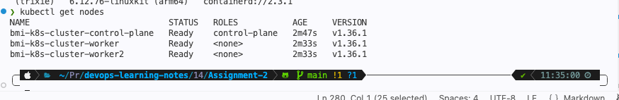
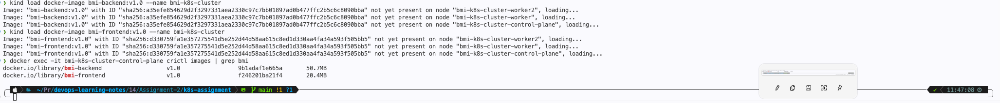
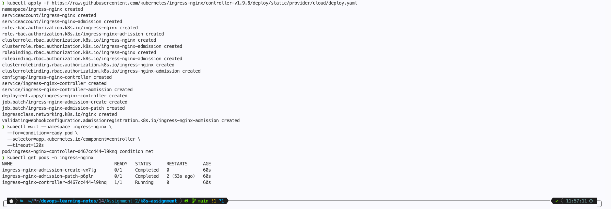
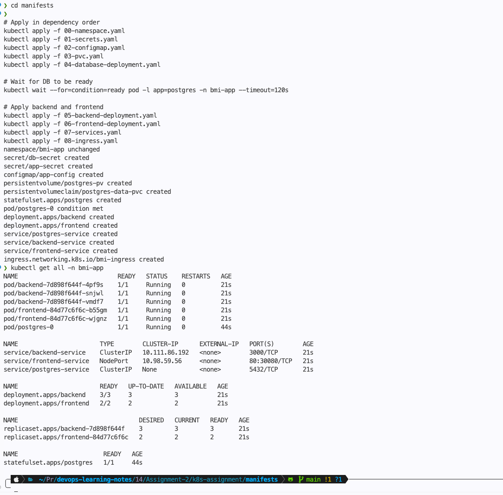
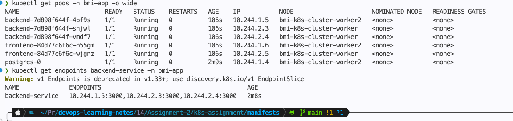
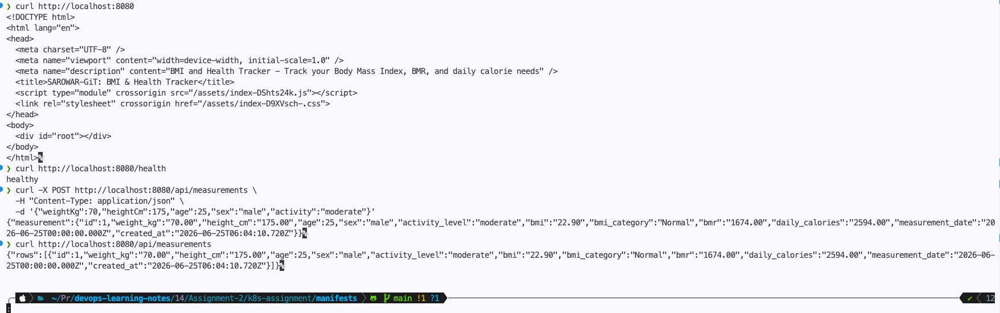

# Assignment-14

## Scalable Infrastructure Deployment Using Local Kubernetes (Kind / Kubeadm)

```markdown
### Project Overview

This assignment focuses on designing and deploying a production-style Kubernetes environment
on a local cluster using Kind (Kubernetes in Docker) or Kubeadm.
You will deploy a containerized three-tier Node.js application to demonstrate your understanding
of container orchestration, networking, scaling, and Kubernetes resource management.

### Technical Specifications

#### Phase I: Cluster Provisioning

You must set up a local Kubernetes cluster with the following requirements:

- Cluster Type: Kind or Kubeadm
- Kubernetes Version: 1.29 or higher
- Node Configuration:
  - Minimum 2 worker nodes
  - 1 control plane node

- Networking:
  - Default CNI (KindNet / Calico / Flannel)
  - Ensure inter-node pod communication works properly
- Ingress (Optional but Recommended):
  - Install NGINX Ingress Controller for better traffic routing

#### Phase II: Three-Tier Architecture

You will deploy the following application:
Repository: https://github.com/sarowar-alam/3-tier-app-terraform-jenkins

1. Frontend Tier

    - React or static Node-based frontend
    - Exposed using:
        - NodePort OR Ingress (preferred)
    - Must communicate with backend via Kubernetes internal DNS

2. Backend Tier

    - Node.js API service
    - Must include:
        - Deployment controller
        - ClusterIP service
    - Minimum 3 replicas (for scaling demonstration)

3. Database Tier

    - Use a containerized database (e.g., MongoDB / MySQL / PostgreSQL)
    - Must include:
        - Persistent Volume (PV)
        - Persistent Volume Claim (PVC)

#### Implementation Requirements

**Deployment Strategy:**

- Each tier must be defined in separate YAML files:
  - frontend-deployment.yaml
  - backend-deployment.yaml
  - database-deployment.yaml
  - services.yaml
  - pvc.yaml
  - secrets.yaml

**Resource Management:**

- Define resource requests and limits for containers:
  - CPU and memory constraints
- Ensure fair scheduling across the two worker nodes

**Scaling Requirement:**

- Backend must run at least 3 replicas
  - Validate:
    - Pods distributed across nodes
    - Load balancing works correctly

**Networking & Security:**

- Use Kubernetes Services properly:
  - Frontend → NodePort / Ingress
  - Backend → ClusterIP
  - Database → ClusterIP
- Restrict unnecessary exposure of services

**Secrets & Configuration:**

- Do NOT hardcode sensitive data
- Use:
  - Kubernetes Secrets → DB credentials
  - ConfigMaps → environment variables
- Inject values into pods using environment variables
```

---

## Scalable Kubernetes Deployment of BMI Health Tracker (3-Tier App)

---

## Infrastructure Architecture

### Kubernetes Architecture Diagram

```plain
            ┌─────────────────────────────────────────────────────────────────────┐
            │                         LOCAL MACHINE / AWS EC2                     │
            │                         (Kind / Kubeadm Cluster)                    │
            ├─────────────────────────────────────────────────────────────────────┤
            │                                                                     │
            │   ┌─────────────────────────────────────────────────────────────┐   │
            │   │                    NGINX Ingress Controller                 │   │
            │   │              (NodePort 30080/30443 or hostPort)             │   │
            │   │                    Routes: / → Frontend                     │   │
            │   │                            /api/* → Backend                 │   │
            │   └─────────────────────────────┬───────────────────────────────┘   │
            │                                 │                                   │
            │   ┌─────────────────────────────▼───────────────────────────────┐   │
            │   │                    FRONTEND TIER                            │   │
            │   │  ┌─────────┐  ┌─────────┐  ┌─────────┐                      │   │
            │   │  │ Pod 1   │  │ Pod 2   │  │ Pod 3   │  (2 replicas, HPA)   │   │
            │   │  │ React   │  │ React   │  │ React   │                      │   │
            │   │  │ + Nginx │  │ + Nginx │  │ + Nginx │                      │   │
            │   │  └─────────┘  └─────────┘  └─────────┘                      │   │
            │   │              Service: frontend-service (ClusterIP)          │   │
            │   └─────────────────────────────────────────────────────────────┘   │
            │                                 │                                   │
            │   ┌─────────────────────────────▼───────────────────────────────┐   │
            │   │                    BACKEND TIER                             │   │
            │   │  ┌─────────┐  ┌─────────┐  ┌─────────┐  ┌─────────┐         │   │
            │   │  │ Pod 1   │  │ Pod 2   │  │ Pod 3   │  │ Pod 4   │(3+      │   │
            │   │  │ Node.js │  │ Node.js │  │ Node.js │  │ Node.js │replicas)│   │
            │   │  │ Express │  │ Express │  │ Express │  │ Express │         │   │
            │   │  └─────────┘  └─────────┘  └─────────┘  └─────────┘         │   │
            │   │              Service: backend-service (ClusterIP)           │   │
            │   └─────────────────────────────────────────────────────────────┘   │
            │                                 │                                   │
            │   ┌─────────────────────────────▼───────────────────────────────┐   │
            │   │                    DATABASE TIER                            │   │
            │   │  ┌─────────────────────────────────────────────────────┐    │   │
            │   │  │              PostgreSQL StatefulSet (1 replica)     │    │   │
            │   │  │  ┌─────────────┐    ┌─────────────────────────────┐ │    │   │
            │   │  │  │ PostgreSQL  │───▶│  PVC: postgres-data-pvc     │ │    │   │
            │   │  │  │  Container  │    │  (hostPath / local-storage) │ │    │   │
            │   │  │  └─────────────┘    └─────────────────────────────┘ │    │   │
            │   │  └─────────────────────────────────────────────────────┘    │   │
            │   │              Service: postgres-service (ClusterIP)          │   │
            │   └─────────────────────────────────────────────────────────────┘   │
            │                                                                     │
            │   ┌─────────────────────────────────────────────────────────────┐   │
            │   │  SECRETS & CONFIGMAPS                                       │   │
            │   │  • db-secret (DB_PASSWORD, DB_USER)                         │   │
            │   │  • app-config (DB_HOST, DB_PORT, DB_NAME, NODE_ENV)         │   │
            │   └─────────────────────────────────────────────────────────────┘   │
            │                                                                     │
            └─────────────────────────────────────────────────────────────────────┘
```

### 1.3 Why StatefulSet for PostgreSQL (Not Deployment)

For a **local learning cluster**, using a StatefulSet with a PVC is the correct choice per assignment requirements. Here's why:

| Aspect | Deployment | StatefulSet |
| -------- | ----------- | ------------- |
| Pod Identity | Random names | Ordered, stable names (`postgres-0`) |
| Storage | Shared PVC (risky) | Dedicated PVC per pod |
| Ordering | Random startup | Sequential startup/shutdown |
| Network | Dynamic IP | Stable DNS (`postgres-0.postgres-service`) |
| Use Case | Stateless apps | Databases, message queues |

**For production**, you'd use **Cloud RDS** (AWS RDS, Cloud SQL) or operators like **CloudNativePG** — but since this is a local cluster assignment, StatefulSet + PVC is exactly what's expected.

---

## Step-by-Step Execution Plan

### Phase 0: Prerequisites Setup

#### **Step 0.1 — Install Required Tools**

```bash
# Check if Homebrew is installed
brew --version

# If not installed, run:
/bin/bash -c "$(curl -fsSL https://raw.githubusercontent.com/Homebrew/install/HEAD/install.sh)"

# For Apple Silicon (M1/M2/M3), add to your shell profile:
echo 'eval "$(/opt/homebrew/bin/brew shellenv)"' >> ~/.zprofile
eval "$(/opt/homebrew/bin/brew shellenv)"

# Install Docker Desktop (includes Docker Engine, Docker CLI, containerd)
# Download from: https://www.docker.com/products/docker-desktop/
# Or install via Homebrew:
brew install --cask docker

# Start Docker Desktop from Applications folder or:
open -a Docker

# Wait for Docker to be ready (check whale icon in menu bar)
docker --version        # Should be 24.x+

# Install kubectl (v1.29+)
brew install kubectl
kubectl version --client  # Should be 1.29+

# Install Kind (Kubernetes in Docker)
brew install kind
kind version  # Should be v0.32.0+

# Install additional useful tools
brew install kubeconform   # YAML validation (optional but recommended)
brew install kustomize     # Native K8s config management
brew install helm          # Package manager (optional bonus)

# Verify all tools
echo "Docker: $(docker --version)"
echo "Kubectl: $(kubectl version --client -o json | jq -r '.clientVersion.gitVersion')"
echo "Kind: $(kind version)"

```

#### **Step 0.2 — Create Kind Cluster Configuration**

Create `kind-cluster-config.yaml`:

```yaml
# kind-cluster-config.yaml
kind: Cluster
apiVersion: kind.x-k8s.io/v1alpha4
name: bmi-k8s-cluster
nodes:
  - role: control-plane
    kubeadmConfigPatches:
      - |
        kind: InitConfiguration
        nodeRegistration:
          kubeletExtraArgs:
            node-labels: "ingress-ready=true"
    extraPortMappings:
      # Map host ports to container ports for local access
      - containerPort: 80
        hostPort: 80
        protocol: TCP
      - containerPort: 443
        hostPort: 443
        protocol: TCP
      - containerPort: 30080
        hostPort: 30080
        protocol: TCP
  - role: worker
    labels:
      tier: backend
  - role: worker
    labels:
      tier: database
networking:
  apiServerPort: 6443
  podSubnet: "10.244.0.0/16"
  serviceSubnet: "10.96.0.0/12"
  # KindNet is the default CNI — no need to change
```

#### **Step 0.3 — Create the Cluster**

```bash
# Create the cluster
kind create cluster --config kind-cluster-config.yaml

# Verify cluster
kubectl get nodes
kubectl get nodes -o wide

# Expected output:
# NAME                           STATUS   ROLES           AGE   VERSION
# bmi-k8s-cluster-control-plane  Ready    control-plane   2m    v1.29.x
# bmi-k8s-cluster-worker         Ready    <none>          1m    v1.29.x
# bmi-k8s-cluster-worker2        Ready    <none>          1m    v1.29.x
```



---

### Phase 1: Containerization (Dockerfiles)

Before deploying to K8s, we need Docker images. Since you don't have access to AWS ECR/CodeCommit, we'll build locally and use Kind's built-in image loading.

#### **Step 1.1 — Create Project Directory Structure**

```bash
mkdir -p ~/k8s-assignment/{docker,manifests}
cd ~/k8s-assignment
```

#### **Step 1.2 — Backend Dockerfile**

Create `docker/Dockerfile.backend`:

```dockerfile
# docker/Dockerfile.backend
# Stage 1: Build
FROM node:20-alpine AS builder

WORKDIR /app

# Copy package files
COPY backend/package*.json ./
RUN npm ci --only=production

# Stage 2: Production
FROM node:20-alpine

# Create non-root user for security
RUN addgroup -g 1001 -S nodejs && \
    adduser -S nodejs -u 1001

WORKDIR /app

# Copy dependencies from builder
COPY --from=builder /app/node_modules ./node_modules

# Copy application code
COPY backend/src ./src
COPY backend/migrations ./migrations
COPY backend/package.json ./

# Set proper ownership
RUN chown -R nodejs:nodejs /app

USER nodejs

# Health check
HEALTHCHECK --interval=30s --timeout=3s --start-period=5s --retries=3 \
    CMD node -e "require('http').get('http://localhost:3000/health', (r) => {process.exit(r.statusCode === 200 ? 0 : 1)})"

EXPOSE 3000

CMD ["node", "src/server.js"]
```

#### **Step 1.3 — Frontend Dockerfile**

Create `docker/Dockerfile.frontend`:

```dockerfile
# docker/Dockerfile.frontend
# Stage 1: Build React app
FROM node:20-alpine AS builder

WORKDIR /app

COPY frontend/package*.json ./
RUN npm ci

COPY frontend/ ./
RUN npm run build

# Stage 2: Serve with Nginx
FROM nginx:1.25-alpine

# Remove default nginx config
RUN rm /etc/nginx/conf.d/default.conf

# Copy custom nginx config
COPY docker/nginx.conf /etc/nginx/conf.d/default.conf

# Copy built app from builder
COPY --from=builder /app/dist /usr/share/nginx/html

# Create non-root user
RUN chown -R nginx:nginx /usr/share/nginx/html && \
    chmod -R 755 /usr/share/nginx/html

# Health check
HEALTHCHECK --interval=30s --timeout=3s --start-period=5s --retries=3 \
    CMD wget --quiet --tries=1 --spider http://localhost:80/ || exit 1

EXPOSE 80

CMD ["nginx", "-g", "daemon off;"]
```

#### **Step 1.4 — Nginx Configuration for Frontend**

Create `docker/nginx.conf`:

```nginx
# docker/nginx.conf
server {
    listen 80;
    server_name localhost;
    root /usr/share/nginx/html;
    index index.html;

    # Gzip compression
    gzip on;
    gzip_vary on;
    gzip_min_length 1024;
    gzip_types text/plain text/css application/json application/javascript text/xml;

    # Frontend static files
    location / {
        try_files $uri $uri/ /index.html;
        add_header Cache-Control "public, max-age=3600";
    }

    # Proxy API requests to backend service
    location /api/ {
        proxy_pass http://backend-service:3000/api/;
        proxy_http_version 1.1;
        proxy_set_header Upgrade $http_upgrade;
        proxy_set_header Connection 'upgrade';
        proxy_set_header Host $host;
        proxy_set_header X-Real-IP $remote_addr;
        proxy_set_header X-Forwarded-For $proxy_add_x_forwarded_for;
        proxy_set_header X-Forwarded-Proto $scheme;
        proxy_cache_bypass $http_upgrade;
        
        # Timeouts
        proxy_connect_timeout 5s;
        proxy_send_timeout 10s;
        proxy_read_timeout 10s;
    }

    # Health check endpoint
    location /health {
        access_log off;
        return 200 "healthy\n";
        add_header Content-Type text/plain;
    }
}
```

#### **Step 1.5 — Build and Load Images into Kind**

```bash
cd ~/k8s-assignment

# Clone the app repo (or use your local copy)
git clone https://github.com/sarowar-alam/3-tier-app-terraform-jenkins.git app-repo

# Build backend image
docker build -t bmi-backend:v1.0 -f docker/Dockerfile.backend app-repo/

# Build frontend image
docker build -t bmi-frontend:v1.0 -f docker/Dockerfile.frontend app-repo/

# Load images into Kind cluster
kind load docker-image bmi-backend:v1.0 --name bmi-k8s-cluster
kind load docker-image bmi-frontend:v1.0 --name bmi-k8s-cluster

# Verify images are loaded
docker exec -it bmi-k8s-cluster-control-plane crictl images | grep bmi
```



---

### Phase 2: Kubernetes Manifests

#### **Step 2.1 — Namespace (Best Practice)**

Create `manifests/00-namespace.yaml`:

```yaml
# manifests/00-namespace.yaml
apiVersion: v1
kind: Namespace
metadata:
  name: bmi-app
  labels:
    app.kubernetes.io/name: bmi-health-tracker
    app.kubernetes.io/version: "1.0"
    environment: production
```

Apply: `kubectl apply -f manifests/00-namespace.yaml`

#### **Step 2.2 — Secrets (Database Credentials)**

Create `manifests/01-secrets.yaml`:

```yaml
# manifests/01-secrets.yaml
apiVersion: v1
kind: Secret
metadata:
  name: db-secret
  namespace: bmi-app
type: Opaque
stringData:
  # Base64 encoding happens automatically
  DB_USER: "bmi_user"
  DB_PASSWORD: "SecurePass123!"  # CHANGE THIS IN PRODUCTION!
  DB_NAME: "bmi_db"
---
apiVersion: v1
kind: Secret
metadata:
  name: app-secret
  namespace: bmi-app
type: Opaque
stringData:
  SESSION_SECRET: "your-256-bit-secret-key-change-me"
```

#### **Step 2.3 — ConfigMap (Non-sensitive Config)**

Create `manifests/02-configmap.yaml`:

```yaml
# manifests/02-configmap.yaml
apiVersion: v1
kind: ConfigMap
metadata:
  name: app-config
  namespace: bmi-app
data:
  # Backend config
  NODE_ENV: "production"
  PORT: "3000"
  DB_HOST: "postgres-service"
  DB_PORT: "5432"
  CORS_ORIGIN: "*"
  
  # Frontend config (for build-time injection if needed)
  VITE_API_URL: "/api"
  
  # Database init script
  init.sql: |
    CREATE TABLE IF NOT EXISTS measurements (
        id SERIAL PRIMARY KEY,
        weight_kg DECIMAL(5,2) NOT NULL,
        height_cm DECIMAL(5,2) NOT NULL,
        age INTEGER NOT NULL,
        sex VARCHAR(10) NOT NULL,
        activity_level VARCHAR(20) DEFAULT 'moderate',
        bmi DECIMAL(5,2) NOT NULL,
        bmi_category VARCHAR(20) NOT NULL,
        bmr DECIMAL(8,2) NOT NULL,
        daily_calories DECIMAL(8,2) NOT NULL,
        measurement_date DATE DEFAULT CURRENT_DATE,
        created_at TIMESTAMP DEFAULT CURRENT_TIMESTAMP
    );
    
    CREATE INDEX IF NOT EXISTS idx_measurement_date ON measurements(measurement_date);
```

#### **Step 2.4 — Persistent Volume & Claim (Database)**

Create `manifests/03-pvc.yaml`:

```yaml
# manifests/03-pvc.yaml
apiVersion: v1
kind: PersistentVolume
metadata:
  name: postgres-pv
  namespace: bmi-app
  labels:
    type: local
    app: postgres
spec:
  storageClassName: standard
  capacity:
    storage: 5Gi
  accessModes:
    - ReadWriteOnce
  hostPath:
    path: /data/postgres
    type: DirectoryOrCreate
  nodeAffinity:
    required:
      nodeSelectorTerms:
        - matchExpressions:
            - key: kubernetes.io/hostname
              operator: In
              values:
                - bmi-k8s-cluster-worker2  # Pin to database-labeled worker
---
apiVersion: v1
kind: PersistentVolumeClaim
metadata:
  name: postgres-data-pvc
  namespace: bmi-app
spec:
  storageClassName: standard
  accessModes:
    - ReadWriteOnce
  resources:
    requests:
      storage: 5Gi
  volumeName: postgres-pv
```

#### **Step 2.5 — Database StatefulSet**

Create `manifests/04-database-deployment.yaml`:

```yaml
# manifests/04-database-deployment.yaml
apiVersion: apps/v1
kind: StatefulSet
metadata:
  name: postgres
  namespace: bmi-app
  labels:
    app: postgres
    tier: database
spec:
  serviceName: postgres-service
  replicas: 1
  selector:
    matchLabels:
      app: postgres
  template:
    metadata:
      labels:
        app: postgres
        tier: database
    spec:
      # Ensure database runs on the dedicated worker node
      affinity:
        nodeAffinity:
          requiredDuringSchedulingIgnoredDuringExecution:
            nodeSelectorTerms:
              - matchExpressions:
                  - key: kubernetes.io/hostname
                    operator: In
                    values:
                      - bmi-k8s-cluster-worker2
      containers:
        - name: postgres
          image: postgres:16-alpine
          imagePullPolicy: IfNotPresent
          ports:
            - containerPort: 5432
              name: postgres
          env:
            - name: POSTGRES_USER
              valueFrom:
                secretKeyRef:
                  name: db-secret
                  key: DB_USER
            - name: POSTGRES_PASSWORD
              valueFrom:
                secretKeyRef:
                  name: db-secret
                  key: DB_PASSWORD
            - name: POSTGRES_DB
              valueFrom:
                secretKeyRef:
                  name: db-secret
                  key: DB_NAME
            - name: PGDATA
              value: /var/lib/postgresql/data/pgdata
          resources:
            requests:
              memory: "256Mi"
              cpu: "250m"
            limits:
              memory: "512Mi"
              cpu: "500m"
          volumeMounts:
            - name: postgres-storage
              mountPath: /var/lib/postgresql/data
            - name: init-scripts
              mountPath: /docker-entrypoint-initdb.d
          livenessProbe:
            exec:
              command:
                - pg_isready
                - -U
                - bmi_user
                - -d
                - bmi_db
            initialDelaySeconds: 30
            periodSeconds: 10
            timeoutSeconds: 5
            failureThreshold: 3
          readinessProbe:
            exec:
              command:
                - pg_isready
                - -U
                - bmi_user
                - -d
                - bmi_db
            initialDelaySeconds: 5
            periodSeconds: 5
            timeoutSeconds: 3
            failureThreshold: 3
      volumes:
        - name: init-scripts
          configMap:
            name: app-config
            items:
              - key: init.sql
                path: init.sql
        - name: postgres-storage
          persistentVolumeClaim:
            claimName: postgres-data-pvc
```

#### **Step 2.6 — Backend Deployment (3+ Replicas)**

Create `manifests/05-backend-deployment.yaml`:

```yaml
# manifests/05-backend-deployment.yaml
apiVersion: apps/v1
kind: Deployment
metadata:
  name: backend
  namespace: bmi-app
  labels:
    app: backend
    tier: backend
spec:
  replicas: 3
  strategy:
    type: RollingUpdate
    rollingUpdate:
      maxSurge: 1
      maxUnavailable: 0
  selector:
    matchLabels:
      app: backend
  template:
    metadata:
      labels:
        app: backend
        tier: backend
    spec:
      # Anti-affinity: spread across worker nodes
      affinity:
        podAntiAffinity:
          preferredDuringSchedulingIgnoredDuringExecution:
            - weight: 100
              podAffinityTerm:
                labelSelector:
                  matchExpressions:
                    - key: app
                      operator: In
                      values:
                        - backend
                topologyKey: kubernetes.io/hostname
        nodeAffinity:
          preferredDuringSchedulingIgnoredDuringExecution:
            - weight: 100
              preference:
                matchExpressions:
                  - key: tier
                    operator: In
                    values:
                      - backend
      initContainers:
        # Wait for database to be ready before starting backend
        - name: wait-for-db
          image: busybox:1.36
          command:
            - sh
            - -c
            - |
              until nc -z postgres-service 5432; do
                echo "Waiting for database..."
                sleep 2
              done
              echo "Database is ready!"
      containers:
        - name: backend
          image: bmi-backend:v1.0
          imagePullPolicy: IfNotPresent
          ports:
            - containerPort: 3000
              name: http
          env:
            # From ConfigMap
            - name: NODE_ENV
              valueFrom:
                configMapKeyRef:
                  name: app-config
                  key: NODE_ENV
            - name: PORT
              valueFrom:
                configMapKeyRef:
                  name: app-config
                  key: PORT
            - name: DB_HOST
              valueFrom:
                configMapKeyRef:
                  name: app-config
                  key: DB_HOST
            - name: DB_PORT
              valueFrom:
                configMapKeyRef:
                  name: app-config
                  key: DB_PORT
            - name: CORS_ORIGIN
              valueFrom:
                configMapKeyRef:
                  name: app-config
                  key: CORS_ORIGIN
            # From Secret
            - name: DB_USER
              valueFrom:
                secretKeyRef:
                  name: db-secret
                  key: DB_USER
            - name: DB_PASSWORD
              valueFrom:
                secretKeyRef:
                  name: db-secret
                  key: DB_PASSWORD
            - name: DB_NAME
              valueFrom:
                secretKeyRef:
                  name: db-secret
                  key: DB_NAME
            - name: DATABASE_URL
              value: "postgresql://$(DB_USER):$(DB_PASSWORD)@$(DB_HOST):$(DB_PORT)/$(DB_NAME)"
          resources:
            requests:
              memory: "128Mi"
              cpu: "100m"
            limits:
              memory: "256Mi"
              cpu: "200m"
          livenessProbe:
            httpGet:
              path: /health
              port: 3000
            initialDelaySeconds: 10
            periodSeconds: 15
            timeoutSeconds: 3
            failureThreshold: 3
          readinessProbe:
            httpGet:
              path: /health
              port: 3000
            initialDelaySeconds: 5
            periodSeconds: 5
            timeoutSeconds: 2
            failureThreshold: 3
          lifecycle:
            preStop:
              exec:
                command: ["/bin/sh", "-c", "sleep 10"]  # Graceful shutdown
```

#### **Step 2.7 — Frontend Deployment**

Create `manifests/06-frontend-deployment.yaml`:

```yaml
# manifests/06-frontend-deployment.yaml
apiVersion: apps/v1
kind: Deployment
metadata:
  name: frontend
  namespace: bmi-app
  labels:
    app: frontend
    tier: frontend
spec:
  replicas: 2
  strategy:
    type: RollingUpdate
    rollingUpdate:
      maxSurge: 1
      maxUnavailable: 0
  selector:
    matchLabels:
      app: frontend
  template:
    metadata:
      labels:
        app: frontend
        tier: frontend
    spec:
      affinity:
        podAntiAffinity:
          preferredDuringSchedulingIgnoredDuringExecution:
            - weight: 100
              podAffinityTerm:
                labelSelector:
                  matchExpressions:
                    - key: app
                      operator: In
                      values:
                        - frontend
                topologyKey: kubernetes.io/hostname
      containers:
        - name: frontend
          image: bmi-frontend:v1.0
          imagePullPolicy: IfNotPresent
          ports:
            - containerPort: 80
              name: http
          resources:
            requests:
              memory: "64Mi"
              cpu: "50m"
            limits:
              memory: "128Mi"
              cpu: "100m"
          livenessProbe:
            httpGet:
              path: /health
              port: 80
            initialDelaySeconds: 10
            periodSeconds: 20
            timeoutSeconds: 3
            failureThreshold: 3
          readinessProbe:
            httpGet:
              path: /
              port: 80
            initialDelaySeconds: 5
            periodSeconds: 5
            timeoutSeconds: 2
            failureThreshold: 3
```

#### **Step 2.8 — Services**

Create `manifests/07-services.yaml`:

```yaml
# manifests/07-services.yaml
# Database Service - ClusterIP (Internal only)
apiVersion: v1
kind: Service
metadata:
  name: postgres-service
  namespace: bmi-app
  labels:
    app: postgres
    tier: database
spec:
  type: ClusterIP
  selector:
    app: postgres
  ports:
    - port: 5432
      targetPort: 5432
      name: postgres
  # Headless service for StatefulSet
  clusterIP: None
---
# Backend Service - ClusterIP (Internal only)
apiVersion: v1
kind: Service
metadata:
  name: backend-service
  namespace: bmi-app
  labels:
    app: backend
    tier: backend
spec:
  type: ClusterIP
  selector:
    app: backend
  ports:
    - port: 3000
      targetPort: 3000
      name: http
  sessionAffinity: None
---
# Frontend Service - NodePort (External access)
apiVersion: v1
kind: Service
metadata:
  name: frontend-service
  namespace: bmi-app
  labels:
    app: frontend
    tier: frontend
spec:
  type: NodePort
  selector:
    app: frontend
  ports:
    - port: 80
      targetPort: 80
      nodePort: 30080  # Accessible on any node IP:30080
      name: http
```

#### **Step 2.9 — Ingress Controller (NGINX)**

Create `manifests/08-ingress.yaml`:

```yaml
# manifests/08-ingress.yaml
apiVersion: networking.k8s.io/v1
kind: Ingress
metadata:
  name: bmi-ingress
  namespace: bmi-app
  annotations:
    nginx.ingress.kubernetes.io/rewrite-target: /
    nginx.ingress.kubernetes.io/use-regex: "true"
    nginx.ingress.kubernetes.io/proxy-body-size: "10m"
    nginx.ingress.kubernetes.io/proxy-connect-timeout: "5"
    nginx.ingress.kubernetes.io/proxy-send-timeout: "10"
    nginx.ingress.kubernetes.io/proxy-read-timeout: "10"
spec:
  ingressClassName: nginx
  rules:
    - http:
        paths:
          # API routes go to backend
          - path: /api
            pathType: Prefix
            backend:
              service:
                name: backend-service
                port:
                  number: 3000
          # Health check for backend
          - path: /health
            pathType: Exact
            backend:
              service:
                name: backend-service
                port:
                  number: 3000
          # Everything else goes to frontend
          - path: /
            pathType: Prefix
            backend:
              service:
                name: frontend-service
                port:
                  number: 80
```

---

### Phase 3: Deployment Commands

#### **Step 3.1 — Install NGINX Ingress Controller**

```bash
# Install NGINX Ingress Controller
kubectl apply -f https://raw.githubusercontent.com/kubernetes/ingress-nginx/controller-v1.9.6/deploy/static/provider/cloud/deploy.yaml

# Wait for controller to be ready
kubectl wait --namespace ingress-nginx \
  --for=condition=ready pod \
  --selector=app.kubernetes.io/component=controller \
  --timeout=120s

# Verify
kubectl get pods -n ingress-nginx
```



#### **Step 3.2 — Apply All Manifests in Order**

```bash
cd ~/k8s-assignment/manifests

# Apply in dependency order
kubectl apply -f 00-namespace.yaml
kubectl apply -f 01-secrets.yaml
kubectl apply -f 02-configmap.yaml
kubectl apply -f 03-pvc.yaml
kubectl apply -f 04-database-deployment.yaml

# Wait for DB to be ready
kubectl wait --for=condition=ready pod -l app=postgres -n bmi-app --timeout=120s

# Apply backend and frontend
kubectl apply -f 05-backend-deployment.yaml
kubectl apply -f 06-frontend-deployment.yaml
kubectl apply -f 07-services.yaml
kubectl apply -f 08-ingress.yaml

# Verify everything
kubectl get all -n bmi-app
```



#### **Step 3.3 — Verify Pod Distribution (Scaling Requirement)**

```bash
# Check pods are distributed across nodes
kubectl get pods -n bmi-app -o wide

# Expected: backend pods spread across worker1 and worker2
# NAME                        READY   STATUS    NODE
# backend-xxx                 1/1     Running   bmi-k8s-cluster-worker
# backend-yyy                 1/1     Running   bmi-k8s-cluster-worker2
# backend-zzz                 1/1     Running   bmi-k8s-cluster-worker
# frontend-aaa                1/1     Running   bmi-k8s-cluster-worker
# frontend-bbb                1/1     Running   bmi-k8s-cluster-worker2
# postgres-0                  1/1     Running   bmi-k8s-cluster-worker2

# Verify load balancing works
kubectl get endpoints backend-service -n bmi-app
```



#### **Step 3.4 — Test the Application**

```bash
# Port-forward to test locally
kubectl port-forward svc/frontend-service 8080:80 -n bmi-app &

# Test frontend
curl http://localhost:8080

# Test backend health
curl http://localhost:8080/health

# Test API
curl -X POST http://localhost:8080/api/measurements \
  -H "Content-Type: application/json" \
  -d '{"weightKg":70,"heightCm":175,"age":25,"sex":"male","activity":"moderate"}'

# Get measurements
curl http://localhost:8080/api/measurements
```



---

### Phase 4: Validation Checklist

Run these commands to validate your submission:

```bash
# 1. Cluster has 3 nodes (1 control plane + 2 workers)
kubectl get nodes | grep -c Ready   # Should output 3

# 2. Backend has 3+ replicas
kubectl get deployment backend -n bmi-app -o jsonpath='{.spec.replicas}'  # Should be 3

# 3. Pods are distributed across nodes
kubectl get pods -n bmi-app -o wide | awk '{print $7}' | sort | uniq -c

# 4. Services are correct types
kubectl get svc -n bmi-app
# frontend-service should be NodePort
# backend-service should be ClusterIP
# postgres-service should be ClusterIP

# 5. Secrets are used, not hardcoded
kubectl get secret db-secret -n bmi-app -o yaml | grep -q "DB_PASSWORD" && echo "Secrets OK"

# 6. PVC is bound
kubectl get pvc postgres-data-pvc -n bmi-app  # Should show Bound

# 7. Ingress is configured
kubectl get ingress bmi-ingress -n bmi-app

# 8. Resource limits are set
kubectl describe pod -l app=backend -n bmi-app | grep -A5 "Limits"

# 9. Health checks are configured
kubectl describe pod -l app=backend -n bmi-app | grep -A3 "Liveness"
```

---

### Best Practices

#### **Implement a GitOps-style Declarative Deployment with Kustomize + Automated Rollback Capability**

Here's what to add:

**`kustomization.yaml` for environment management:**

```yaml
# manifests/kustomization.yaml
apiVersion: kustomize.config.k8s.io/v1beta1
kind: Kustomization

namespace: bmi-app

resources:
  - 00-namespace.yaml
  - 01-secrets.yaml
  - 02-configmap.yaml
  - 03-pvc.yaml
  - 04-database-deployment.yaml
  - 05-backend-deployment.yaml
  - 06-frontend-deployment.yaml
  - 07-services.yaml
  - 08-ingress.yaml

images:
  - name: bmi-backend
    newTag: v1.0
  - name: bmi-frontend
    newTag: v1.0

configMapGenerator:
  - name: app-config
    behavior: merge
    literals:
      - NODE_ENV=production

commonLabels:
  managed-by: kustomize
  project: bmi-health-tracker
```

#### **Why this is best practice:**

1. **Kustomize** is the native Kubernetes configuration management tool (built into kubectl since v1.14)
2. Shows you understand **GitOps principles** — single source of truth in Git
3. Enables easy environment promotion (dev → staging → prod) with overlays
4. Demonstrates **production readiness** beyond basic YAML deployment

#### **Deploy with one command:**

```bash
kubectl apply -k manifests/
```

---

## Advanced Operations & Production Hardening

### 5.1 Horizontal Pod Autoscaler (HPA) — Demonstrate True Scaling

While the assignment requires 3 replicas, adding HPA shows you understand **real-world scaling patterns**. Add this to your manifests:

#### **`manifests/09-hpa.yaml`:**

```yaml
# manifests/09-hpa.yaml
apiVersion: autoscaling/v2
kind: HorizontalPodAutoscaler
metadata:
  name: backend-hpa
  namespace: bmi-app
spec:
  scaleTargetRef:
    apiVersion: apps/v1
    kind: Deployment
    name: backend
  minReplicas: 3        # Assignment requirement: minimum 3
  maxReplicas: 6        # Scale up to 6 under load
  metrics:
    - type: Resource
      resource:
        name: cpu
        target:
          type: Utilization
          averageUtilization: 70
    - type: Resource
      resource:
        name: memory
        target:
          type: Utilization
          averageUtilization: 80
  behavior:
    scaleUp:
      stabilizationWindowSeconds: 60
      policies:
        - type: Percent
          value: 100
          periodSeconds: 15
    scaleDown:
      stabilizationWindowSeconds: 300
      policies:
        - type: Percent
          value: 10
          periodSeconds: 60
```

##### **Apply and test:**

```bash
kubectl apply -f manifests/09-hpa.yaml

# Verify HPA
kubectl get hpa -n bmi-app

# Simulate load to test scaling
kubectl run load-generator --image=busybox:1.36 -n bmi-app -- /bin/sh -c "while true; do wget -q -O- http://backend-service:3000/health; done"

# Watch pods scale up
kubectl get pods -n bmi-app -w

# Clean up load generator
kubectl delete pod load-generator -n bmi-app
```

---

### 5.2 Pod Disruption Budget (PDB) — High Availability

Ensures your backend never drops below 3 replicas during node maintenance:

```yaml
# manifests/10-pdb.yaml
apiVersion: policy/v1
kind: PodDisruptionBudget
metadata:
  name: backend-pdb
  namespace: bmi-app
spec:
  minAvailable: 3
  selector:
    matchLabels:
      app: backend
```

---

### 5.3 Network Policies — Security Hardening

Restrict traffic so only the frontend can reach the backend, and only the backend can reach the database:

```yaml
# manifests/11-network-policy.yaml
apiVersion: networking.k8s.io/v1
kind: NetworkPolicy
metadata:
  name: database-network-policy
  namespace: bmi-app
spec:
  podSelector:
    matchLabels:
      app: postgres
  policyTypes:
    - Ingress
  ingress:
    - from:
        - podSelector:
            matchLabels:
              app: backend
      ports:
        - protocol: TCP
          port: 5432
---
apiVersion: networking.k8s.io/v1
kind: NetworkPolicy
metadata:
  name: backend-network-policy
  namespace: bmi-app
spec:
  podSelector:
    matchLabels:
      app: backend
  policyTypes:
    - Ingress
    - Egress
  ingress:
    - from:
        - podSelector:
            matchLabels:
              app: frontend
        - podSelector:
            matchLabels:
              app: ingress-nginx  # Allow from ingress controller
      ports:
        - protocol: TCP
          port: 3000
  egress:
    - to:
        - podSelector:
            matchLabels:
              app: postgres
      ports:
        - protocol: TCP
          port: 5432
```

---

### 5.4 Resource Quotas & Limits — Multi-Tenancy Ready

```yaml
# manifests/12-resource-quota.yaml
apiVersion: v1
kind: ResourceQuota
metadata:
  name: bmi-app-quota
  namespace: bmi-app
spec:
  hard:
    requests.cpu: "2"
    requests.memory: 2Gi
    limits.cpu: "4"
    limits.memory: 4Gi
    pods: "20"
    persistentvolumeclaims: "5"
    services: "5"
---
apiVersion: v1
kind: LimitRange
metadata:
  name: bmi-app-limits
  namespace: bmi-app
spec:
  limits:
    - default:
        cpu: "200m"
        memory: "256Mi"
      defaultRequest:
        cpu: "100m"
        memory: "128Mi"
      type: Container
```

---

## Terraform for AWS EC2-Based K8s (Optional)

### 6 Terraform Structure

```bash
mkdir -p ~/k8s-assignment/terraform
cd ~/k8s-assignment/terraform
```

#### **`terraform/main.tf`:**

```hcl
# terraform/main.tf
terraform {
  required_version = ">= 1.0"
  required_providers {
    aws = {
      source  = "hashicorp/aws"
      version = "~> 5.0"
    }
  }
}

provider "aws" {
  region = var.aws_region
}

# Data source for Ubuntu 22.04 AMI
data "aws_ami" "ubuntu" {
  most_recent = true
  owners      = ["099720109477"] # Canonical

  filter {
    name   = "name"
    values = ["ubuntu/images/hvm-ssd/ubuntu-22.04-amd64-server-*"]
  }

  filter {
    name   = "virtualization-type"
    values = ["hvm"]
  }
}

# Security Group for K8s nodes
resource "aws_security_group" "k8s_nodes" {
  name_prefix = "k8s-node-"
  description = "Security group for Kubernetes nodes"

  # SSH access
  ingress {
    from_port   = 22
    to_port     = 22
    protocol    = "tcp"
    cidr_blocks = [var.allowed_ssh_cidr]
  }

  # Kubernetes API server
  ingress {
    from_port   = 6443
    to_port     = 6443
    protocol    = "tcp"
    cidr_blocks = [var.vpc_cidr]
  }

  # NodePort range for services
  ingress {
    from_port   = 30000
    to_port     = 32767
    protocol    = "tcp"
    cidr_blocks = ["0.0.0.0/0"]
  }

  # HTTP/HTTPS for ingress
  ingress {
    from_port   = 80
    to_port     = 80
    protocol    = "tcp"
    cidr_blocks = ["0.0.0.0/0"]
  }

  ingress {
    from_port   = 443
    to_port     = 443
    protocol    = "tcp"
    cidr_blocks = ["0.0.0.0/0"]
  }

  # Internal node communication
  ingress {
    from_port   = 0
    to_port     = 65535
    protocol    = "tcp"
    cidr_blocks = [var.vpc_cidr]
  }

  # Allow all outbound
  egress {
    from_port   = 0
    to_port     = 0
    protocol    = "-1"
    cidr_blocks = ["0.0.0.0/0"]
  }

  tags = {
    Name = "k8s-nodes-sg"
  }
}

# Control Plane Node
resource "aws_instance" "control_plane" {
  ami           = data.aws_ami.ubuntu.id
  instance_type = var.control_plane_instance_type
  key_name      = var.key_name

  vpc_security_group_ids = [aws_security_group.k8s_nodes.id]
  subnet_id              = var.public_subnet_id

  root_block_device {
    volume_size = 20
    volume_type = "gp3"
  }

  tags = {
    Name = "k8s-control-plane"
    Role = "control-plane"
  }

  user_data = <<-EOF
    #!/bin/bash
    set -e
    
    # Update and install dependencies
    apt-get update
    apt-get install -y apt-transport-https ca-certificates curl gnupg lsb-release
    
    # Install Docker
    curl -fsSL https://download.docker.com/linux/ubuntu/gpg | gpg --dearmor -o /usr/share/keyrings/docker-archive-keyring.gpg
    echo "deb [arch=$(dpkg --print-architecture) signed-by=/usr/share/keyrings/docker-archive-keyring.gpg] https://download.docker.com/linux/ubuntu $(lsb_release -cs) stable" | tee /etc/apt/sources.list.d/docker.list > /dev/null
    apt-get update
    apt-get install -y docker-ce docker-ce-cli containerd.io
    usermod -aG docker ubuntu
    
    # Install kubectl
    curl -LO "https://dl.k8s/release/$(curl -L -s https://dl.k8s/release/stable.txt)/bin/linux/amd64/kubectl"
    install -o root -g root -m 0755 kubectl /usr/local/bin/kubectl
    
    # Install kubeadm, kubelet
    curl -fsSL https://pkgs.k8s.io/core:/stable:/v1.29/deb/Release.key | gpg --dearmor -o /usr/share/keyrings/kubernetes-apt-keyring.gpg
    echo 'deb [signed-by=/usr/share/keyrings/kubernetes-apt-keyring.gpg] https://pkgs.k8s.io/core:/stable:/v1.29/deb/ /' | tee /etc/apt/sources.list.d/kubernetes.list
    apt-get update
    apt-get install -y kubelet kubeadm kubectl
    apt-mark hold kubelet kubeadm kubectl
    
    # Enable kubelet
    systemctl enable kubelet
    
    # Initialize cluster (will be done manually or via script)
    echo "Setup complete. Run kubeadm init to initialize cluster."
  EOF
}

# Worker Node 1
resource "aws_instance" "worker_1" {
  ami           = data.aws_ami.ubuntu.id
  instance_type = var.worker_instance_type
  key_name      = var.key_name

  vpc_security_group_ids = [aws_security_group.k8s_nodes.id]
  subnet_id              = var.public_subnet_id

  root_block_device {
    volume_size = 20
    volume_type = "gp3"
  }

  tags = {
    Name = "k8s-worker-1"
    Role = "worker"
  }

  user_data = <<-EOF
    #!/bin/bash
    set -e
    
    apt-get update
    apt-get install -y apt-transport-https ca-certificates curl gnupg lsb-release
    
    # Install Docker
    curl -fsSL https://download.docker.com/linux/ubuntu/gpg | gpg --dearmor -o /usr/share/keyrings/docker-archive-keyring.gpg
    echo "deb [arch=$(dpkg --print-architecture) signed-by=/usr/share/keyrings/docker-archive-keyring.gpg] https://download.docker.com/linux/ubuntu $(lsb_release -cs) stable" | tee /etc/apt/sources.list.d/docker.list > /dev/null
    apt-get update
    apt-get install -y docker-ce docker-ce-cli containerd.io
    usermod -aG docker ubuntu
    
    # Install kubeadm, kubelet
    curl -fsSL https://pkgs.k8s.io/core:/stable:/v1.29/deb/Release.key | gpg --dearmor -o /usr/share/keyrings/kubernetes-apt-keyring.gpg
    echo 'deb [signed-by=/usr/share/keyrings/kubernetes-apt-keyring.gpg] https://pkgs.k8s.io/core:/stable:/v1.29/deb/ /' | tee /etc/apt/sources.list.d/kubernetes.list
    apt-get update
    apt-get install -y kubelet kubeadm
    apt-mark hold kubelet kubeadm
    
    systemctl enable kubelet
    echo "Worker setup complete. Join with kubeadm join command."
  EOF
}

# Worker Node 2
resource "aws_instance" "worker_2" {
  ami           = data.aws_ami.ubuntu.id
  instance_type = var.worker_instance_type
  key_name      = var.key_name

  vpc_security_group_ids = [aws_security_group.k8s_nodes.id]
  subnet_id              = var.public_subnet_id

  root_block_device {
    volume_size = 20
    volume_type = "gp3"
  }

  tags = {
    Name = "k8s-worker-2"
    Role = "worker"
  }

  user_data = <<-EOF
    #!/bin/bash
    set -e
    
    apt-get update
    apt-get install -y apt-transport-https ca-certificates curl gnupg lsb-release
    
    # Install Docker
    curl -fsSL https://download.docker.com/linux/ubuntu/gpg | gpg --dearmor -o /usr/share/keyrings/docker-archive-keyring.gpg
    echo "deb [arch=$(dpkg --print-architecture) signed-by=/usr/share/keyrings/docker-archive-keyring.gpg] https://download.docker.com/linux/ubuntu $(lsb_release -cs) stable" | tee /etc/apt/sources.list.d/docker.list > /dev/null
    apt-get update
    apt-get install -y docker-ce docker-ce-cli containerd.io
    usermod -aG docker ubuntu
    
    # Install kubeadm, kubelet
    curl -fsSL https://pkgs.k8s.io/core:/stable:/v1.29/deb/Release.key | gpg --dearmor -o /usr/share/keyrings/kubernetes-apt-keyring.gpg
    echo 'deb [signed-by=/usr/share/keyrings/kubernetes-apt-keyring.gpg] https://pkgs.k8s.io/core:/stable:/v1.29/deb/ /' | tee /etc/apt/sources.list.d/kubernetes.list
    apt-get update
    apt-get install -y kubelet kubeadm
    apt-mark hold kubelet kubeadm
    
    systemctl enable kubelet
    echo "Worker setup complete. Join with kubeadm join command."
  EOF
}

# Outputs
output "control_plane_ip" {
  description = "Public IP of the control plane node"
  value       = aws_instance.control_plane.public_ip
}

output "worker_1_ip" {
  description = "Public IP of worker node 1"
  value       = aws_instance.worker_1.public_ip
}

output "worker_2_ip" {
  description = "Public IP of worker node 2"
  value       = aws_instance.worker_2.public_ip
}

output "ssh_command" {
  description = "SSH command to connect to control plane"
  value       = "ssh -i ~/.ssh/${var.key_name}.pem ubuntu@${aws_instance.control_plane.public_ip}"
}
```

#### **`terraform/variables.tf`:**

```hcl
# terraform/variables.tf
variable "aws_region" {
  description = "AWS region for resources"
  type        = string
  default     = "us-east-1"
}

variable "vpc_cidr" {
  description = "CIDR block of the VPC"
  type        = string
  default     = "10.0.0.0/16"
}

variable "public_subnet_id" {
  description = "Public subnet ID for instances"
  type        = string
}

variable "key_name" {
  description = "Name of the EC2 key pair"
  type        = string
}

variable "allowed_ssh_cidr" {
  description = "CIDR block allowed for SSH access"
  type        = string
  default     = "0.0.0.0/0"
}

variable "control_plane_instance_type" {
  description = "Instance type for control plane"
  type        = string
  default     = "t3.medium"
}

variable "worker_instance_type" {
  description = "Instance type for worker nodes"
  type        = string
  default     = "t3.medium"
}
```

#### **`terraform/terraform.tfvars` (create from example):**

```hcl
# terraform/terraform.tfvars
aws_region      = "us-east-1"
public_subnet_id = "subnet-xxxxxxxxxxxxxxxxx"  # Your existing public subnet
key_name        = "your-key-pair-name"
allowed_ssh_cidr = "YOUR_IP/32"  # Restrict to your IP for security
```

#### **Deploy with Terraform:**

```bash
cd ~/k8s-assignment/terraform

terraform init
terraform plan -out=tfplan
terraform apply tfplan

# After instances are ready, SSH to control plane and initialize kubeadm
ssh -i ~/.ssh/your-key.pem ubuntu@$(terraform output -raw control_plane_ip)

# On control plane:
sudo kubeadm init --pod-network-cidr=10.244.0.0/16 --apiserver-advertise-address=$(hostname -i)
mkdir -p $HOME/.kube
sudo cp -i /etc/kubernetes/admin.conf $HOME/.kube/config
sudo chown $(id -u):$(id -g) $HOME/.kube/config

# Install CNI (Flannel)
kubectl apply -f https://github.com/flannel-io/flannel/releases/latest/download/kube-flannel.yml

# Get join command for workers
kubeadm token create --print-join-command

# On each worker, run the join command
sudo kubeadm join <control-plane-ip>:6443 --token <token> --discovery-token-ca-cert-hash sha256:<hash>
```

---

## Complete Troubleshooting Guide

### 7.1 Pod Issues

| Symptom | Diagnosis | Fix |
|---------|-----------|-----|
| `Pending` pods | `kubectl describe pod <name>` | Check resource limits, node affinity, or PVC binding |
| `CrashLoopBackOff` | `kubectl logs <pod>` | Check app errors, missing env vars, or DB connection |
| `ImagePullBackOff` | `kubectl describe pod <name>` | Ensure image is loaded: `kind load docker-image` |
| `Init:Error` | `kubectl logs <pod> -c wait-for-db` | Database service not ready; check postgres pod |
| `OOMKilled` | `kubectl describe pod <name>` | Increase memory limit in deployment |

### 7.2 Database-Specific Issues

```bash
# Database pod not starting
kubectl logs postgres-0 -n bmi-app

# Check PVC status
kubectl get pvc -n bmi-app
kubectl describe pvc postgres-data-pvc -n bmi-app

# Manual DB connection test
kubectl exec -it postgres-0 -n bmi-app -- psql -U bmi_user -d bmi_db -c "\dt"

# If migrations didn't run, execute manually
kubectl exec -it postgres-0 -n bmi-app -- psql -U bmi_user -d bmi_db -f /docker-entrypoint-initdb.d/init.sql
```

### 7.3 Backend Connection Issues

```bash
# Test backend can reach database
kubectl exec -it deployment/backend -n bmi-app -- sh -c "nc -zv postgres-service 5432"

# Check backend env vars are injected
kubectl exec -it deployment/backend -n bmi-app -- env | grep DB

# Test backend health directly
kubectl port-forward svc/backend-service 3000:3000 -n bmi-app &
curl http://localhost:3000/health
```

### 7.4 Ingress Issues

```bash
# Check ingress controller logs
kubectl logs -n ingress-nginx -l app.kubernetes.io/component=controller

# Verify ingress rules
kubectl get ingress -n bmi-app -o yaml

# Test from inside cluster
kubectl run debug --rm -it --image=busybox:1.36 -n bmi-app -- wget -O- http://frontend-service

# Check if ingress controller is running
kubectl get pods -n ingress-nginx
```

### 7.5 Kind-Specific Issues

```bash
# Cluster not starting
kind delete cluster --name bmi-k8s-cluster
kind create cluster --config kind-cluster-config.yaml

# Images not found in cluster
docker images | grep bmi
kind load docker-image bmi-backend:v1.0 --name bmi-k8s-cluster
kind load docker-image bmi-frontend:v1.0 --name bmi-k8s-cluster

# Port forwarding not working
# Use NodePort instead: http://localhost:30080
# Or get node IP: kubectl get nodes -o wide
```

---

## Final Submission Checklist

### Required Files Structure

```plain
k8s-assignment/
├── README.md                          # Project documentation
├── docker/
│   ├── Dockerfile.backend             # Multi-stage backend build
│   ├── Dockerfile.frontend            # Multi-stage frontend build
│   └── nginx.conf                     # Nginx reverse proxy config
├── manifests/
│   ├── 00-namespace.yaml              # bmi-app namespace
│   ├── 01-secrets.yaml                # DB credentials (base64 encoded)
│   ├── 02-configmap.yaml              # Non-sensitive config + init.sql
│   ├── 03-pvc.yaml                    # PV + PVC for PostgreSQL
│   ├── 04-database-deployment.yaml    # PostgreSQL StatefulSet
│   ├── 05-backend-deployment.yaml     # Node.js backend (3 replicas)
│   ├── 06-frontend-deployment.yaml    # React frontend (2 replicas)
│   ├── 07-services.yaml               # All 3 services (ClusterIP + NodePort)
│   ├── 08-ingress.yaml                # NGINX Ingress rules
│   ├── 09-hpa.yaml                    # (BONUS) Horizontal Pod Autoscaler
│   ├── 10-pdb.yaml                    # (BONUS) Pod Disruption Budget
│   ├── 11-network-policy.yaml         # (BONUS) Network Policies
│   ├── 12-resource-quota.yaml         # (BONUS) Resource Quotas
│   └── kustomization.yaml             # (BONUS) Kustomize configuration
├── terraform/                         # (OPTIONAL) AWS EC2 provisioning
│   ├── main.tf
│   ├── variables.tf
│   └── terraform.tfvars
└── screenshots/                       # Proof of deployment
    ├── nodes.png
    ├── pods-distribution.png
    ├── services.png
    ├── ingress.png
    ├── hpa.png
    └── application-ui.png
```

### Verification Commands (Run These for Screenshots)

```bash
# 1. Nodes
kubectl get nodes -o wide

# 2. All resources in namespace
kubectl get all -n bmi-app

# 3. Pod distribution across nodes
kubectl get pods -n bmi-app -o wide

# 4. Services
kubectl get svc -n bmi-app

# 5. PVC status
kubectl get pvc -n bmi-app

# 6. Ingress
kubectl get ingress -n bmi-app

# 7. HPA status (if applied)
kubectl get hpa -n bmi-app

# 8. Resource usage
kubectl top nodes
kubectl top pods -n bmi-app

# 9. Application test
curl http://localhost:30080/health
curl -X POST http://localhost:30080/api/measurements \
  -H "Content-Type: application/json" \
  -d '{"weightKg":70,"heightCm":175,"age":25,"sex":"male","activity":"moderate"}'
curl http://localhost:30080/api/measurements
```

## Quick Reference: One-Line Commands

```bash
# Full deployment (after setup)
kind create cluster --config kind-cluster-config.yaml && \
kind load docker-image bmi-backend:v1.0 --name bmi-k8s-cluster && \
kind load docker-image bmi-frontend:v1.0 --name bmi-k8s-cluster && \
kubectl apply -f https://raw.githubusercontent.com/kubernetes/ingress-nginx/controller-v1.9.6/deploy/static/provider/cloud/deploy.yaml && \
kubectl apply -k manifests/ && \
kubectl wait --for=condition=ready pod -l app=postgres -n bmi-app --timeout=120s && \
kubectl rollout status deployment/backend -n bmi-app && \
echo "Deployment complete! Access at http://localhost:30080"

# Full teardown
kind delete cluster --name bmi-k8s-cluster
```
