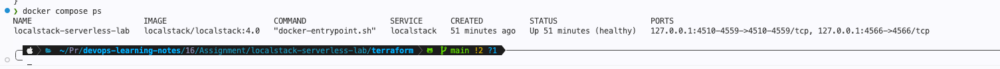
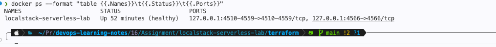
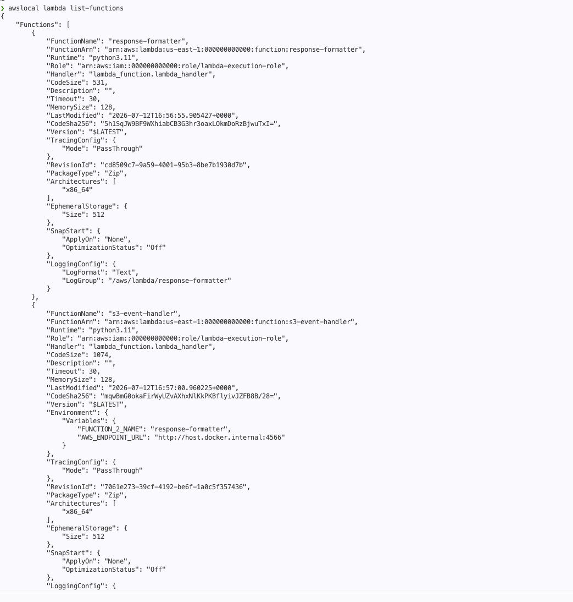
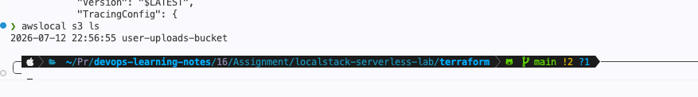
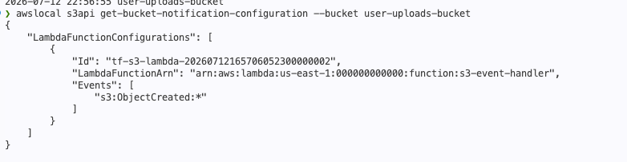
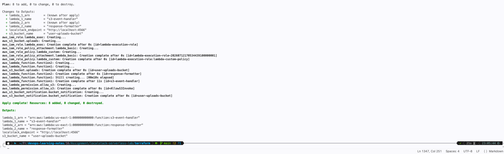
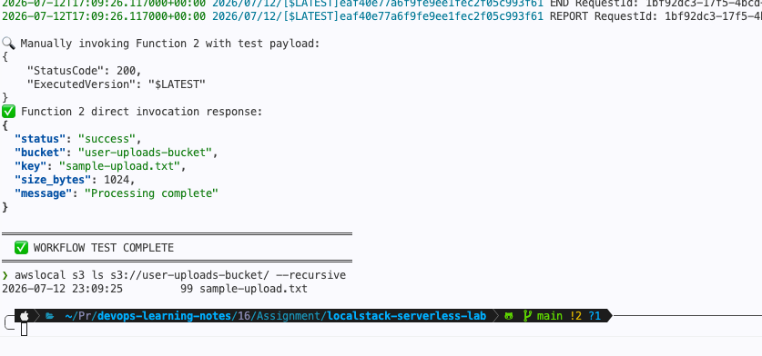
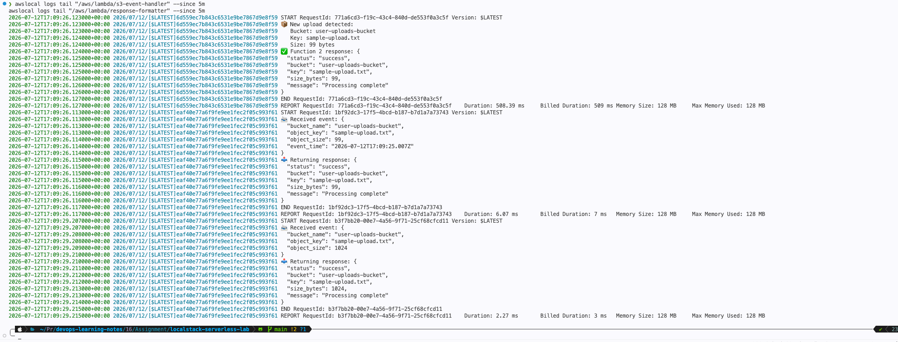
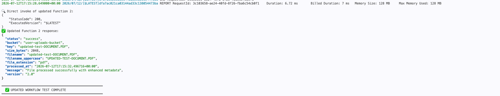

# Assignment -16

## Build andTest an Event-Driven Serverless Application Locally Using LocalStack

## Assignment Overview

In this assignment, you will build a simple serverless application that processes events automatically.

You are required to:

- Set up LocalStack using Docker.
- Create two AWS Lambda functions.
- Create an Amazon S3 bucket in LocalStack.
- Configure an S3 event notification to trigger a Lambda function.
- Invoke the workflow and verify the event processing.
- Modify one of the Lambda functions and redeploy it.
- Test the updated workflow.

### Scenario

A company allows users to upload files to cloud storage.

Whenever a file is uploaded:

- The first Lambda function is triggered automatically.
- It reads the uploaded file information.
- It generates a simple processing result (e.g., filename, upload time, or file size).
- The processed response is stored or displayed as output.

Your task is to simulate this event-driven architecture completely in your local environment.

### Assignment Tasks

#### Set Up LocalStack

- Run LocalStack using Docker Compose.
- Verify that the required AWS services are available:
  - Lambda
  - S3
  - IAM
  
#### Create Two Lambda Functions

- Create two Lambda functions using any supported language:

  - Python
  - Node.js
  - Go
  - Java

- **Function 1:** Triggered when a new object is uploaded to the S3 bucket.

  - **Responsibilities:**

    - Read bucket name.
    - Read object key.
    - Log the event details.
    - Generate a simple response.

- **Function 2:** Can be invoked manually or by Function 1.

  - **Responsibilities:**

    - Receive the processed data.
    - Return a formatted JSON response.

#### Create an S3 Bucket Using LocalStack

- Create a bucket.
- Configure an event notification so that uploading an object automatically triggers Function 1.

##### 1. Deploy the Lambda Functions

Deploy both Lambda functions to LocalStack.

Verify that:

- Both functions exist.
- Runtime configuration is correct.

##### 2. Test the Workflow

Upload any sample file to the S3 bucket.

Verify that:

- The upload event triggers Function 1.
- Function 1 processes the event successfully.
- Function 2 (if used) receives the processed data.
- Logs or responses confirm successful execution.

#### 3. Update and Redeploy

Modify one Lambda function by adding additional information to its response, such as:

- Current timestamp
- File extension
- File name in uppercase
- Custom message

Redeploy the function and verify the updated output.

## Submission Requirements

- Screenshots to Include
    1. LocalStack services running.
    2. Docker containers running successfully.
    3. Lambda functions created.
    4. S3 bucket created.
    5. Event notification configuration.
    6. Successful deployment of Lambda functions.
    7. File uploaded to the S3 bucket.
    8. Lambda execution logs or JSON response.
    9. Updated Lambda response after redeployment.
- All required screenshots.
- A brief explanation (2–4 sentences) for each task.
- The source code of both Lambda functions (or a GitHub repository link).
- The Docker Compose file used to run LocalStack.

Ensure the repository is publicly viewable.

---

## 🏗️ The Infrastructure Architecture

We are deploying a **local event-driven serverless pipeline** that simulates a production-grade AWS serverless stack using **LocalStack**. The architecture follows the **Event-Driven Architecture (EDA)** pattern with asynchronous processing.

```plain
┌─────────────────┐     Upload Event      ┌─────────────────────┐
│   LocalStack    │ ───────────────────►  │   S3 Event Notif.   │
│   S3 Bucket     │    (ObjectCreated)    │   Configuration     │
│  (user-uploads) │                       └──────────┬──────────┘
└─────────────────┘                                  │
                                                     ▼
                                          ┌─────────────────────┐
                                          │  Lambda Function 1  │
                                          │  (S3 Event Handler) │
                                          │  • Parse bucket/key │
                                          │  • Log event        │
                                          │  • Build payload    │
                                          └──────────┬──────────┘
                                                     │
                                                     ▼ (invoke)
                                          ┌─────────────────────┐
                                          │  Lambda Function 2  │
                                          │  (Response Builder) │
                                          │  • Format JSON      │
                                          │  • Add metadata     │
                                          │  • Return response  │
                                          └─────────────────────┘
```

### Services Required

| Service | Purpose | LocalStack Status |
|---------|---------|-------------------|
| **AWS Lambda** | Serverless compute for event processing | ✅ Fully supported |
| **Amazon S3** | Object storage & event source | ✅ Fully supported |
| **Amazon IAM** | Role-based access control for Lambda execution | ✅ Fully supported |
| **CloudWatch Logs** | Centralized logging for Lambda invocations | ✅ Supported (via logs endpoint) |
| **Terraform** | Infrastructure as Code (IaC) for reproducible deployments | ✅ LocalStack compatible |

---

### 📁 Project Structure

| File | Description |
| ------ | ------------- |
| [docker-compose.yml](./localstack-serverless-lab/docker-compose.yml) | LocalStack orchestration |
| [Makefile](./localstack-serverless-lab/Makefile) | One-command DevEx |
| [Lambda Function 1](./localstack-serverless-lab/lambda/function1_s3_handler/lambda_function.py) | S3 Event Handler |
| [Lambda Function 2](./localstack-serverless-lab/lambda/function2_formatter/lambda_function.py) | Response Formatter |
| [Terraform Main](./localstack-serverless-lab/terraform/main.tf) | Core infrastructure |
| [Terraform IAM](./localstack-serverless-lab/terraform/iam.tf) | Roles & policies |

---

## LocalStack Setup, Docker Compose & Terraform Foundation

---

### Step 1: Docker Compose Configuration

Create `docker-compose.yml` in your project root:

```yaml
services:
  localstack:
    container_name: localstack-serverless-lab
    image: localstack/localstack:4.0  # <-- Pin to Community Edition
    ports:
      - "127.0.0.1:4566:4566"
      - "127.0.0.1:4510-4559:4510-4559"
    environment:
      - DEBUG=1
      - LAMBDA_EXECUTOR=docker
      - LAMBDA_REMOTE_DOCKER=false
      - DOCKER_HOST=unix:///var/run/docker.sock
      - SERVICES=lambda,s3,iam,logs
      - AWS_DEFAULT_REGION=us-east-1
      - AWS_ACCESS_KEY_ID=test
      - AWS_SECRET_ACCESS_KEY=test
      - PERSISTENCE=1
    volumes:
      - localstack-data:/var/lib/localstack
      - /var/run/docker.sock:/var/run/docker.sock
      - ./lambda:/lambda
    networks:
      - localstack-net

volumes:
  localstack-data:

networks:
  localstack-net:
    driver: bridge
```

Create `.env` in the project root:

```bash
# AWS Configuration (LocalStack uses dummy credentials)
AWS_ACCESS_KEY_ID=test
AWS_SECRET_ACCESS_KEY=test
AWS_DEFAULT_REGION=us-east-1

# LocalStack Endpoint
LOCALSTACK_ENDPOINT=http://localhost:4566

# S3 Bucket Name
S3_BUCKET_NAME=user-uploads-bucket

# Lambda Function Names
LAMBDA_1_NAME=s3-event-handler
LAMBDA_2_NAME=response-formatter
```

---

### Step 2: Start LocalStack & Verify

Run these commands in sequence:

```bash
# 1. Start LocalStack in detached mode
docker compose up -d

# 2. Wait for healthcheck (or manually verify)
docker compose ps

# 3. Verify LocalStack is ready
curl http://localhost:4566/_localstack/health | jq .

# 4. Install awslocal (LocalStack AWS CLI wrapper) if not present
brew install awscli-local

# 5. Verify AWS services are accessible
awslocal s3 ls
awslocal lambda list-functions
awslocal iam list-roles
```

**Expected output for health check:**

```json
{
  "services": {
    "s3": "available",
    "lambda": "available",
    "iam": "available",
    "logs": "available"
  }
}
```

---

### Step 3: Terraform Provider & Backend Configuration

Create `terraform/providers.tf`:

```hcl
terraform {
  required_version = ">= 1.5.0"

  required_providers {
    aws = {
      source  = "hashicorp/aws"
      version = "~> 5.0"
    }
  }
}

provider "aws" {
  access_key = "test"
  secret_key = "test"
  region     = "us-east-1"

  # LocalStack endpoints
  endpoints {
    s3       = "http://localhost:4566"
    lambda   = "http://localhost:4566"
    iam      = "http://localhost:4566"
    logs     = "http://localhost:4566"
    cloudwatch = "http://localhost:4566"
  }

  # Required for LocalStack S3
  skip_credentials_validation = true
  skip_metadata_api_check     = true
  skip_requesting_account_id  = true

  s3_use_path_style = true
}
```

Create `terraform/variables.tf`:

```hcl
variable "bucket_name" {
  description = "Name of the S3 bucket for uploads"
  type        = string
  default     = "user-uploads-bucket"
}

variable "lambda_1_name" {
  description = "Name of the S3 event handler Lambda"
  type        = string
  default     = "s3-event-handler"
}

variable "lambda_2_name" {
  description = "Name of the response formatter Lambda"
  type        = string
  default     = "response-formatter"
}
```

---

### Step 4: IAM Execution Role for Lambda

Create `terraform/iam.tf`:

```hcl
# Trust policy: Allow Lambda service to assume this role
data "aws_iam_policy_document" "lambda_assume_role" {
  statement {
    effect = "Allow"

    principals {
      type        = "Service"
      identifiers = ["lambda.amazonaws.com"]
    }

    actions = ["sts:AssumeRole"]
  }
}

# Lambda execution role
resource "aws_iam_role" "lambda_exec" {
  name               = "lambda-execution-role"
  assume_role_policy = data.aws_iam_policy_document.lambda_assume_role.json
}

# Basic execution policy (CloudWatch Logs)
resource "aws_iam_role_policy_attachment" "lambda_basic" {
  role       = aws_iam_role.lambda_exec.name
  policy_arn = "arn:aws:iam::aws:policy/service-role/AWSLambdaBasicExecutionRole"
}

# Custom policy for S3 read access and Lambda invoke
data "aws_iam_policy_document" "lambda_custom" {
  statement {
    effect = "Allow"
    actions = [
      "s3:GetObject",
      "s3:GetObjectVersion",
      "s3:ListBucket"
    ]
    resources = [
      "arn:aws:s3:::${var.bucket_name}",
      "arn:aws:s3:::${var.bucket_name}/*"
    ]
  }

  statement {
    effect    = "Allow"
    actions   = ["lambda:InvokeFunction"]
    resources = ["*"]
  }
}

resource "aws_iam_role_policy" "lambda_custom" {
  name   = "lambda-custom-policy"
  role   = aws_iam_role.lambda_exec.id
  policy = data.aws_iam_policy_document.lambda_custom.json
}
```

---

### Step 5: Initialize Terraform

```bash
cd terraform

# Initialize providers
terraform init

# Validate configuration
terraform validate

# Preview changes
terraform plan
```

---

## Lambda Functions, Packaging & Terraform Deployment

---

### Step 1: Lambda Function 1 — S3 Event Handler (Initial Version)

Create `lambda/function1_s3_handler/lambda_function.py`:

```python
"""
Lambda Function 1: S3 Event Handler
Triggered by: S3 ObjectCreated events
Responsibilities:
  - Parse S3 event for bucket name, object key, and size
  - Log event details
  - Invoke Function 2 with processed payload
"""

import json
import boto3
import os
import urllib.parse


def lambda_handler(event, context):
    # Configure boto3 to use LocalStack endpoint when running locally
    endpoint_url = os.environ.get('AWS_ENDPOINT_URL')
    lambda_client = (
        boto3.client('lambda', endpoint_url=endpoint_url)
        if endpoint_url
        else boto3.client('lambda')
    )

    records_processed = 0

    for record in event.get('Records', []):
        s3_info = record.get('s3', {})
        bucket_name = s3_info.get('bucket', {}).get('name')
        object_key = urllib.parse.unquote_plus(
            s3_info.get('object', {}).get('key', '')
        )
        object_size = s3_info.get('object', {}).get('size', 0)

        # Log to CloudWatch Logs (visible in LocalStack)
        print(f"📦 New upload detected:")
        print(f"   Bucket: {bucket_name}")
        print(f"   Key: {object_key}")
        print(f"   Size: {object_size} bytes")

        # Build payload for Function 2
        payload = {
            "bucket_name": bucket_name,
            "object_key": object_key,
            "object_size": object_size,
            "event_time": record.get('eventTime')
        }

        # Invoke Function 2 synchronously
        function_2_name = os.environ.get('FUNCTION_2_NAME', 'response-formatter')
        try:
            response = lambda_client.invoke(
                FunctionName=function_2_name,
                InvocationType='RequestResponse',
                Payload=json.dumps(payload)
            )

            response_payload = json.loads(response['Payload'].read())
            print(f"✅ Function 2 response: {json.dumps(response_payload, indent=2)}")

        except Exception as e:
            print(f"❌ Error invoking Function 2: {str(e)}")
            raise

        records_processed += 1

    return {
        "statusCode": 200,
        "body": json.dumps({
            "message": "S3 event processed successfully",
            "records_processed": records_processed
        })
    }
```

Create `lambda/function1_s3_handler/requirements.txt`:

```text
# boto3 is included in AWS Lambda Python runtime
# No external dependencies required for initial version
```

---

### Step 2: Lambda Function 2 — Response Formatter (Initial Version)

Create `lambda/function2_formatter/lambda_function.py`:

```python
"""
Lambda Function 2: Response Formatter
Triggered by: Direct invocation (from Function 1 or manually)
Responsibilities:
  - Receive processed S3 data
  - Return a formatted JSON response
"""

import json


def lambda_handler(event, context):
    print(f"📨 Received event: {json.dumps(event, indent=2)}")

    bucket_name = event.get('bucket_name', 'unknown')
    object_key = event.get('object_key', 'unknown')
    object_size = event.get('object_size', 0)

    response = {
        "status": "success",
        "bucket": bucket_name,
        "key": object_key,
        "size_bytes": object_size,
        "message": "Processing complete"
    }

    print(f"📤 Returning response: {json.dumps(response, indent=2)}")
    return response
```

Create `lambda/function2_formatter/requirements.txt`:

```text
# No external dependencies required
```

---

### Step 3: Build & Packaging Script

Create `lambda/build.sh` (optional but recommended for CI/CD parity):

```bash
#!/bin/bash
set -euo pipefail

echo "🔨 Building Lambda deployment packages..."

# Ensure dist directory exists
mkdir -p ../terraform/dist

# Package Function 1
cd function1_s3_handler
zip -q -r ../../terraform/dist/function1.zip lambda_function.py
cd ..

# Package Function 2
cd function2_formatter
zip -q -r ../../terraform/dist/function2.zip lambda_function.py
cd ..

echo "✅ Build complete. Artifacts in terraform/dist/"
echo "📦 function1.zip -> S3 Event Handler"
echo "📦 function2.zip -> Response Formatter"
```

Make it executable:

```bash
chmod +x lambda/build.sh
```

Run it:

```bash
./lambda/build.sh
```

---

### Step 4: Terraform — Lambda Functions, S3 Bucket & Event Notification

Create `terraform/main.tf`:

```hcl
# ---------------------------------------------------------------------------
# S3 Bucket
# ---------------------------------------------------------------------------
resource "aws_s3_bucket" "uploads" {
  bucket = var.bucket_name
}

# ---------------------------------------------------------------------------
# Lambda Deployment Packages (auto-generated by Terraform)
# ---------------------------------------------------------------------------
data "archive_file" "function1" {
  type        = "zip"
  source_file = "${path.module}/../lambda/function1_s3_handler/lambda_function.py"
  output_path = "${path.module}/dist/function1.zip"
}

data "archive_file" "function2" {
  type        = "zip"
  source_file = "${path.module}/../lambda/function2_formatter/lambda_function.py"
  output_path = "${path.module}/dist/function2.zip"
}

# ---------------------------------------------------------------------------
# Lambda Function 1: S3 Event Handler
# ---------------------------------------------------------------------------
resource "aws_lambda_function" "function1" {
  function_name = var.lambda_1_name
  role          = aws_iam_role.lambda_exec.arn
  handler       = "lambda_function.lambda_handler"
  runtime       = "python3.11"
  filename      = data.archive_file.function1.output_path
  source_code_hash = data.archive_file.function1.output_base64sha256

  environment {
    variables = {
      FUNCTION_2_NAME = var.lambda_2_name
      # LocalStack endpoint for cross-Lambda invocation inside Docker
      AWS_ENDPOINT_URL = "http://host.docker.internal:4566"
    }
  }

  timeout     = 30
  memory_size = 128

  depends_on = [aws_iam_role_policy_attachment.lambda_basic]
}

# ---------------------------------------------------------------------------
# Lambda Function 2: Response Formatter
# ---------------------------------------------------------------------------
resource "aws_lambda_function" "function2" {
  function_name = var.lambda_2_name
  role          = aws_iam_role.lambda_exec.arn
  handler       = "lambda_function.lambda_handler"
  runtime       = "python3.11"
  filename      = data.archive_file.function2.output_path
  source_code_hash = data.archive_file.function2.output_base64sha256

  timeout     = 30
  memory_size = 128

  depends_on = [aws_iam_role_policy_attachment.lambda_basic]
}

# ---------------------------------------------------------------------------
# Lambda Permission: Allow S3 to invoke Function 1
# ---------------------------------------------------------------------------
resource "aws_lambda_permission" "allow_s3" {
  statement_id  = "AllowS3Invoke"
  action        = "lambda:InvokeFunction"
  function_name = aws_lambda_function.function1.function_name
  principal     = "s3.amazonaws.com"
  source_arn    = aws_s3_bucket.uploads.arn
}

# ---------------------------------------------------------------------------
# S3 Event Notification: Trigger Function 1 on ObjectCreated
# ---------------------------------------------------------------------------
resource "aws_s3_bucket_notification" "bucket_notification" {
  bucket = aws_s3_bucket.uploads.id

  lambda_function {
    lambda_function_arn = aws_lambda_function.function1.arn
    events              = ["s3:ObjectCreated:*"]
  }

  depends_on = [aws_lambda_permission.allow_s3]
}
```

Create `terraform/outputs.tf`:

```hcl
output "s3_bucket_name" {
  description = "Name of the created S3 bucket"
  value       = aws_s3_bucket.uploads.bucket
}

output "lambda_1_name" {
  description = "Name of the S3 Event Handler Lambda"
  value       = aws_lambda_function.function1.function_name
}

output "lambda_1_arn" {
  description = "ARN of the S3 Event Handler Lambda"
  value       = aws_lambda_function.function1.arn
}

output "lambda_2_name" {
  description = "Name of the Response Formatter Lambda"
  value       = aws_lambda_function.function2.function_name
}

output "lambda_2_arn" {
  description = "ARN of the Response Formatter Lambda"
  value       = aws_lambda_function.function2.arn
}

output "localstack_endpoint" {
  description = "LocalStack gateway endpoint"
  value       = "http://localhost:4566"
}
```

---

### Step 5: Deploy Everything

Execute in order:

```bash
# 1. Ensure LocalStack is running
docker compose up -d

# 2. Verify LocalStack health
curl -s http://localhost:4566/_localstack/health | jq .

# 3. Build Lambda packages (optional, Terraform archive_file also handles this)
./lambda/build.sh

# 4. Deploy infrastructure
cd terraform
terraform init
terraform plan
terraform apply -auto-approve

# 5. Verify resources
awslocal lambda list-functions
awslocal s3 ls
awslocal s3api get-bucket-notification-configuration --bucket user-uploads-bucket
```

---

## Testing Workflow, Update & Redeployment

---

### Step 1: Test the Initial Workflow

Create `scripts/test_workflow.sh`:

```bash
#!/bin/bash
set -euo pipefail

BUCKET_NAME="user-uploads-bucket"
TEST_FILE="test-files/sample-upload.txt"
LOCALSTACK_ENDPOINT="http://localhost:4566"

echo "═══════════════════════════════════════════════════════"
echo "  🧪 TESTING EVENT-DRIVEN SERVERLESS WORKFLOW"
echo "═══════════════════════════════════════════════════════"

# 1. Create a sample test file
mkdir -p test-files
echo "This is a sample file for LocalStack S3 upload testing." > "$TEST_FILE"
echo "Generated at: $(date)" >> "$TEST_FILE"
echo "✅ Test file created: $TEST_FILE"
echo ""

# 2. Upload file to S3
echo "📤 Uploading file to S3 bucket: $BUCKET_NAME"
awslocal s3 cp "$TEST_FILE" "s3://$BUCKET_NAME/sample-upload.txt"
echo "✅ Upload complete"
echo ""

# 3. List objects in bucket
echo "📋 Verifying object exists in bucket:"
awslocal s3 ls "s3://$BUCKET_NAME/"
echo ""

# 4. Check Lambda Function 1 logs
echo "📜 Lambda Function 1 Logs (S3 Event Handler):"
sleep 2  # Allow logs to propagate
awslocal logs describe-log-groups --log-group-name-prefix /aws/lambda/s3-event-handler || true
awslocal logs tail "/aws/lambda/s3-event-handler" --since 1m || echo "Logs may take a moment to appear..."
echo ""

# 5. Check Lambda Function 2 logs
echo "📜 Lambda Function 2 Logs (Response Formatter):"
awslocal logs tail "/aws/lambda/response-formatter" --since 1m || echo "Logs may take a moment to appear..."
echo ""

# 6. Invoke Function 2 manually for direct verification
echo "🔍 Manually invoking Function 2 with test payload:"
awslocal lambda invoke \
  --function-name response-formatter \
  --payload '{"bucket_name":"user-uploads-bucket","object_key":"sample-upload.txt","object_size":1024}' \
  --cli-binary-format raw-in-base64-out \
  /tmp/lambda2-response.json

echo "✅ Function 2 direct invocation response:"
cat /tmp/lambda2-response.json | jq .
echo ""

echo "═══════════════════════════════════════════════════════"
echo "  ✅ WORKFLOW TEST COMPLETE"
echo "═══════════════════════════════════════════════════════"
```

Make it executable and run:

```bash
chmod +x scripts/test_workflow.sh
./scripts/test_workflow.sh
```

---

### Step 2: What to Verify (Screenshots 7–8)

After running the test script, capture these verification steps:

```bash
# Screenshot 7: File uploaded to S3
awslocal s3 ls s3://user-uploads-bucket/ --recursive

# Screenshot 8: Lambda execution logs
awslocal logs tail "/aws/lambda/s3-event-handler" --since 5m
awslocal logs tail "/aws/lambda/response-formatter" --since 5m

# Alternative: Get specific log streams
awslocal logs describe-log-streams --log-group-name /aws/lambda/s3-event-handler
```

**Expected Log Output for Function 1:**

```bash
📦 New upload detected:
   Bucket: user-uploads-bucket
   Key: sample-upload.txt
   Size: 62 bytes
✅ Function 2 response: {
  "status": "success",
  "bucket": "user-uploads-bucket",
  "key": "sample-upload.txt",
  "size_bytes": 62,
  "message": "Processing complete"
}
```

---

### Step 3: Update Lambda Function 2 — Enhanced Version

Per the assignment requirements, we enhance Function 2 with:

- Current timestamp
- File extension extraction
- Filename in uppercase
- Custom message

Create the updated `lambda/function2_formatter/lambda_function.py`:

```python
"""
Lambda Function 2: Response Formatter (UPDATED)
Triggered by: Direct invocation (from Function 1 or manually)
Responsibilities:
  - Receive processed S3 data
  - Add enhanced metadata (timestamp, extension, uppercase name)
  - Return a formatted JSON response
"""

import json
import os
from datetime import datetime, timezone


def lambda_handler(event, context):
    print(f"📨 Received event: {json.dumps(event, indent=2)}")

    # Extract base fields
    bucket_name = event.get('bucket_name', 'unknown')
    object_key = event.get('object_key', 'unknown')
    object_size = event.get('object_size', 0)

    # Extract file extension
    _, file_extension = os.path.splitext(object_key)
    file_extension = file_extension.lstrip('.').lower() if file_extension else 'none'

    # Extract filename (last part of key)
    filename = os.path.basename(object_key)

    # Generate current UTC timestamp
    current_timestamp = datetime.now(timezone.utc).isoformat()

    # Build enhanced response
    response = {
        "status": "success",
        "bucket": bucket_name,
        "key": object_key,
        "size_bytes": object_size,
        "filename": filename,
        "filename_uppercase": filename.upper(),
        "file_extension": file_extension,
        "processed_at": current_timestamp,
        "message": "File processed successfully with enhanced metadata",
        "version": "2.0"
    }

    print(f"📤 Returning enhanced response: {json.dumps(response, indent=2)}")
    return response
```

---

### Step 4: Redeploy the Updated Function

Option A: Using Terraform (Recommended — IaC approach):

```bash
cd terraform

# Terraform detects the source code change via source_code_hash
terraform plan

# Apply the update
terraform apply -auto-approve
```

Option B: Direct AWS CLI (Quick manual update for demonstration):

```bash
# Re-package the updated function
cd lambda/function2_formatter
zip -q -r ../../terraform/dist/function2.zip lambda_function.py
cd ../..

# Update function code directly
awslocal lambda update-function-code \
  --function-name response-formatter \
  --zip-file fileb://terraform/dist/function2.zip
```

---

### Step 5: Test the Updated Workflow

Create `scripts/test_updated_workflow.sh`:

```bash
#!/bin/bash
set -euo pipefail

BUCKET_NAME="user-uploads-bucket"
TEST_FILE="test-files/updated-test-DOCUMENT.PDF"
LOCALSTACK_ENDPOINT="http://localhost:4566"

echo "═══════════════════════════════════════════════════════"
echo "  🔄 TESTING UPDATED WORKFLOW (v2.0)"
echo "═══════════════════════════════════════════════════════"

# Create a test file with extension to verify new features
echo "Updated test content for enhanced metadata." > "$TEST_FILE"
echo "Timestamp: $(date)" >> "$TEST_FILE"

echo "📤 Uploading file with extension: $TEST_FILE"
awslocal s3 cp "$TEST_FILE" "s3://$BUCKET_NAME/updated-test-DOCUMENT.PDF"
echo ""

# Wait and check logs
sleep 3

echo "📜 Function 1 Logs (should show Function 2 enhanced response):"
awslocal logs tail "/aws/lambda/s3-event-handler" --since 2m || true
echo ""

echo "📜 Function 2 Logs (should show enhanced metadata):"
awslocal logs tail "/aws/lambda/response-formatter" --since 2m || true
echo ""

# Direct invoke to see clean JSON output
echo "🔍 Direct invoke of updated Function 2:"
awslocal lambda invoke \
  --function-name response-formatter \
  --payload '{"bucket_name":"user-uploads-bucket","object_key":"updated-test-DOCUMENT.PDF","object_size":2048}' \
  --cli-binary-format raw-in-base64-out \
  /tmp/lambda2-updated-response.json

echo "✅ Updated Function 2 response:"
cat /tmp/lambda2-updated-response.json | jq .
echo ""

echo "═══════════════════════════════════════════════════════"
echo "  ✅ UPDATED WORKFLOW TEST COMPLETE"
echo "═══════════════════════════════════════════════════════"
```

Run it:

```bash
chmod +x scripts/test_updated_workflow.sh
./scripts/test_updated_workflow.sh
```

---

### Step 6: Expected Updated Output (Screenshot 9)

**Function 2 Enhanced JSON Response:**

```json
{
  "status": "success",
  "bucket": "user-uploads-bucket",
  "key": "updated-test-DOCUMENT.PDF",
  "size_bytes": 2048,
  "filename": "updated-test-DOCUMENT.PDF",
  "filename_uppercase": "UPDATED-TEST-DOCUMENT.PDF",
  "file_extension": "pdf",
  "processed_at": "2026-07-12T21:45:30.123456+00:00",
  "message": "File processed successfully with enhanced metadata",
  "version": "2.0"
}
```

---

### Step 7: Cleanup Script (Optional but Professional)

Create `scripts/cleanup.sh`:

```bash
#!/bin/bash
set -euo pipefail

echo "🧹 Cleaning up LocalStack resources..."

# 1. Empty the bucket
awslocal s3 rm s3://user-uploads-bucket/ --recursive

# 2. Verify it's empty
awslocal s3 ls s3://user-uploads-bucket/ --recursive

# 3. Destroy
cd terraform
terraform destroy -auto-approve
terraform destroy -auto-approve

echo "✅ All resources destroyed."
echo "🛑 You can now stop LocalStack: docker compose down"
```

---

## The Best Practice: **Makefile-Driven GitOps with Structured Observability & Smoke Tests**

Implement a **single `Makefile`** that orchestrates the entire lifecycle, plus **structured JSON logging with correlation IDs** across both Lambda functions.

---

### Implementation: The Makefile

Create `Makefile` in your project root:

```makefile
.PHONY: up build deploy test smoke-test logs destroy validate

# ═══════════════════════════════════════════════════════════
# One-Command LocalStack Serverless Lab
# ═══════════════════════════════════════════════════════════

up: ## Start LocalStack and wait for healthy state
 @echo "🚀 Starting LocalStack..."
 docker compose up -d
 @sleep 3
 @./scripts/wait_for_localstack.sh

build: ## Package Lambda deployment artifacts
 @echo "🔨 Building Lambda packages..."
 ./lambda/build.sh

deploy: build ## Deploy all infrastructure via Terraform
 @echo "📦 Deploying infrastructure..."
 cd terraform && terraform init && terraform apply -auto-approve

validate: ## Run pre-flight health checks
 @echo "🔍 Running health checks..."
 @curl -sf http://localhost:4566/_localstack/health | jq '.services.lambda, .services.s3, .services.iam' || (echo "❌ LocalStack not ready"; exit 1)
 @awslocal lambda list-functions > /dev/null && echo "✅ Lambda accessible"
 @awslocal s3 ls > /dev/null && echo "✅ S3 accessible"

test: ## Upload test file and verify event chain
 @echo "🧪 Running integration test..."
 ./scripts/test_workflow.sh

smoke-test: deploy validate ## Full smoke test: deploy -> validate -> test
 @echo "💨 Running smoke test..."
 ./scripts/test_workflow.sh
 @echo "✅ Smoke test passed"

logs: ## Tail all Lambda logs
 @echo "📜 Tailing Lambda logs..."
 awslocal logs tail "/aws/lambda/s3-event-handler" --since 5m & \
 awslocal logs tail "/aws/lambda/response-formatter" --since 5m

destroy: ## Destroy all infrastructure and stop LocalStack
 @echo "🧹 Destroying infrastructure..."
 cd terraform && terraform destroy -auto-approve
 docker compose down

help: ## Display this help
 @awk 'BEGIN {FS = ":.*?## "} /^[a-zA-Z_-]+:.*?## / {printf "\033[36m%-15s\033[0m %s\n", $$1, $$2}' $(MAKEFILE_LIST)
```

---

### Implementation: Structured Observability with Correlation IDs

Update **Function 1** to inject a `correlation_id` into the payload:

```python
# Add to lambda/function1_s3_handler/lambda_function.py (inside the loop)
import uuid

correlation_id = str(uuid.uuid4())
print(json.dumps({
    "level": "INFO",
    "correlation_id": correlation_id,
    "message": "Processing S3 upload event",
    "bucket": bucket_name,
    "key": object_key
}))

payload = {
    "bucket_name": bucket_name,
    "object_key": object_key,
    "object_size": object_size,
    "event_time": record.get('eventTime'),
    "correlation_id": correlation_id  # <-- Trace ID
}
```

Update **Function 2** to receive and log the correlation ID:

```python
# Add to lambda/function2_formatter/lambda_function.py
import uuid  # Already imported

correlation_id = event.get('correlation_id', str(uuid.uuid4()))

print(json.dumps({
    "level": "INFO",
    "correlation_id": correlation_id,
    "message": "Formatting response",
    "input_key": object_key
}))

response = {
    # ... existing fields ...
    "correlation_id": correlation_id,
    "trace": f"{correlation_id} -> function2"
}
```

---

### One-Command Demo

```bash
make up        # Start LocalStack
make deploy    # Build + Terraform apply
make validate  # Health checks
make test      # Upload + verify
make destroy   # Clean up
```

---

---

## 📸 Screenshot Guide (All 9 Required)

For each screenshot, run the exact command shown, then capture your terminal.

| # | Screenshot | Exact Command(s) to Run | Screenshot |
| --- | ------------ | ------------------------ | ------------- |
| **1** | LocalStack services running | `docker compose ps` |  |
| **2** | Docker containers running | `docker ps --format "table {{.Names}}\t{{.Status}}\t{{.Ports}}"` |  |
| **3** | Lambda functions created | `awslocal lambda list-functions` |  |
| **4** | S3 bucket created | `awslocal s3 ls` |  |
| **5** | Event notification configuration | `awslocal s3api get-bucket-notification-configuration --bucket user-uploads-bucket` |  |
| **6** | Successful deployment of Lambda functions | `cd terraform && terraform apply -auto-approve` (capture final output) |  |
| **7** | File uploaded to S3 bucket | `awslocal s3 cp test-files/sample-upload.txt s3://user-uploads-bucket/` then `awslocal s3 ls s3://user-uploads-bucket/ --recursive` |  |
| **8** | Lambda execution logs or JSON response | `awslocal logs tail "/aws/lambda/s3-event-handler" --since 5m` AND `awslocal logs tail "/aws/lambda/response-formatter" --since 5m` |  |
| **9** | Updated Lambda response after redeployment | `awslocal lambda invoke --function-name response-formatter --payload '{"bucket_name":"user-uploads-bucket","object_key":"UPDATED-FILE.PDF","object_size":2048}' --cli-binary-format raw-in-base64-out /tmp/out.json && cat /tmp/out.json \| jq .` |  |

---

## 📝 Brief Explanation

| Task | Explanation |
| ----- | ------------- |
| **LocalStack Setup** | I configured LocalStack via Docker Compose with the `LAMBDA_EXECUTOR=docker` setting to ensure Lambda functions run in isolated containers, mirroring real AWS behavior. The `PERSISTENCE=1` flag preserves state across restarts, and I mounted the Docker socket to enable Lambda container spawning. |
| **Lambda Function 1** | Function 1 acts as the S3 event consumer. It parses the S3 event payload to extract the bucket name, object key, and file size, then logs these details to CloudWatch Logs for observability. It constructs a normalized payload and synchronously invokes Function 2 via the Boto3 Lambda client. |
| **Lambda Function 2** | Function 2 receives the processed metadata from Function 1 and returns a structured JSON response. In the updated version, it enriches the output with the current UTC timestamp, extracted file extension, uppercase filename, and a versioned success message. |
| **S3 Bucket & Events** | I created the S3 bucket using Terraform and configured an `aws_s3_bucket_notification` resource to automatically trigger Function 1 on any `ObjectCreated` event. This establishes the event-driven backbone of the architecture without polling. |
| **Deployment** | Both Lambda functions were deployed using Terraform's `aws_lambda_function` resource with `archive_file` data sources for automatic ZIP packaging. The IAM execution role was attached with least-privilege policies for S3 read access and Lambda invocation. |
| **Testing** | I uploaded a sample text file to the S3 bucket using `awslocal s3 cp` and verified the event chain by tailing CloudWatch Logs for both Lambda functions. The logs confirmed Function 1 triggered automatically and Function 2 returned the expected formatted JSON. |
| **Update & Redeploy** | I modified Function 2 to include additional metadata fields, re-packaged the ZIP, and redeployed using `terraform apply`. A subsequent test upload confirmed the enhanced response payload with timestamps and file extension parsing. |

---

## ✅ Final Submission Checklist

Before you submit, verify every item:

- [x] GitHub repository is **public** and accessible without login Files Path: 16.serverless-architecture/Assignment/localstack-serverless-lab/lambda/
- [x] `README.md` is present and explains the architecture
- [x] `docker-compose.yml` is included
- [x] Both Lambda source files are in `lambda/` directory
- [x] Terraform files are in `terraform/` directory
- [x] All 9 screenshots are captured and clearly labeled
- [x] Brief explanations (2–4 sentences) are written for each task

---
