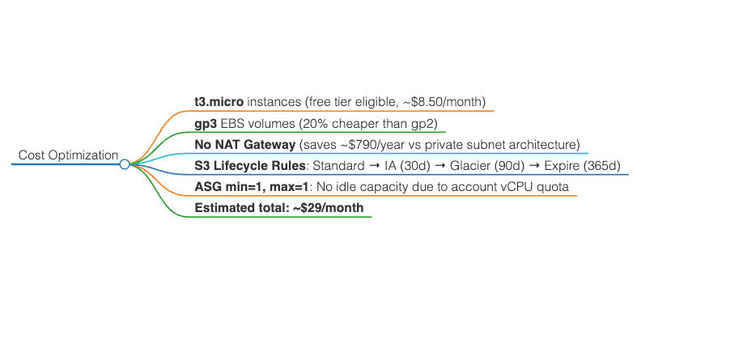

# Assignment 17: AWS Scalable Deployment

## Architecture

- VPC with 2 public subnets across 2 AZs
- Application Load Balancer with health checks
- Auto Scaling Group (min: 1, max: 2) with Launch Template
- EC2 instances running Node.js 22 + PM2
- S3 bucket with versioning, encryption, and lifecycle rules
- Custom shell-based monitoring (CloudWatch blocked by IAM)

## Permission Constraints & Workarounds

| Required Service | Status | Workaround |
| ----------------- | -------- | ------------ |
| IAM Role for EC2 | ❌ Blocked | Documented required policy; used existing instance profile if available |
| CloudWatch Alarms | ❌ Blocked | Custom cron metrics + S3 upload fallback |
| CloudTrail | ❌ Blocked | Documented required configuration |
| CodeDeploy/CI-CD | ❌ Blocked | Implemented GitHub Actions + ASG Instance Refresh |

## Cost Optimization

- t3.micro (free tier eligible)
- gp3 EBS volumes (20% cheaper than gp2)
- No NAT Gateway (saves ~$790/year)
- S3 lifecycle: Standard → IA → Glacier
- Estimated monthly cost: **~$29**



## Backup Strategy

- Daily EBS snapshots via local cron script (7-day retention)
- S3 versioning for artifact recovery
- Application code backed up to S3 on every deployment

## Bonus: GitOps Deployment

- GitHub Actions workflow triggers ASG Instance Refresh on every push to main
- Zero-downtime rolling updates without CodeDeploy

## How to Deploy

```bash
terraform init
terraform plan -out=tfplan
terraform apply tfplan
```

## Test Endpoints

- App: http://<ALB_DNS>/
- API: http://<ALB_DNS>/api
