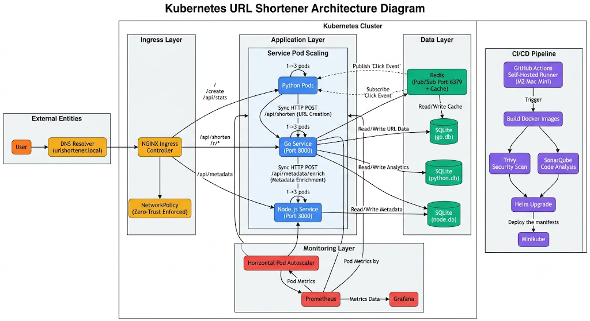
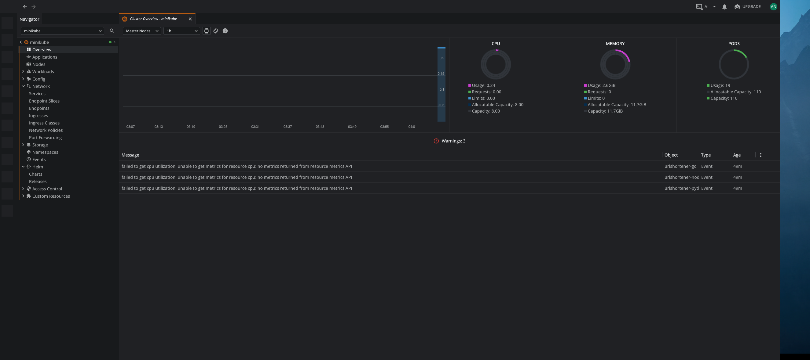
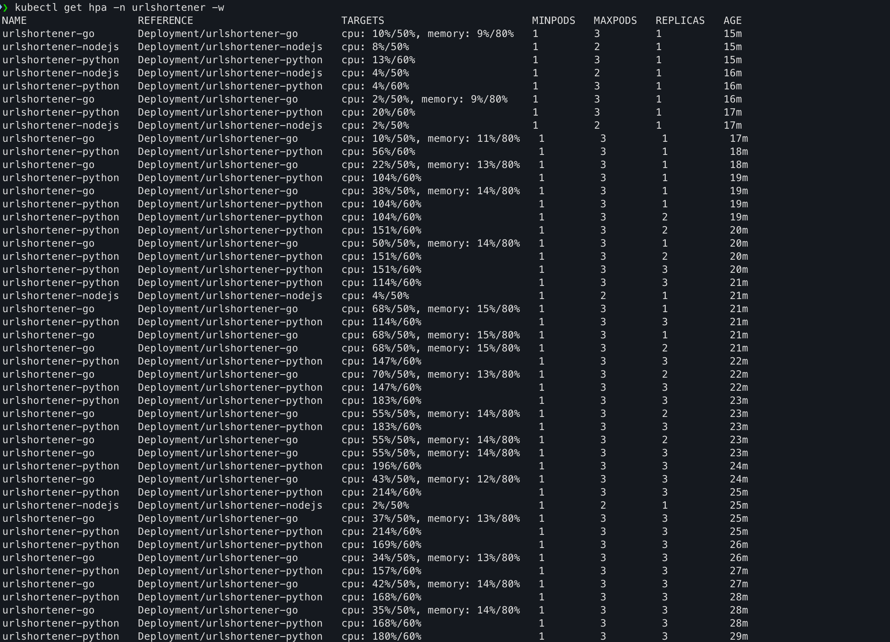
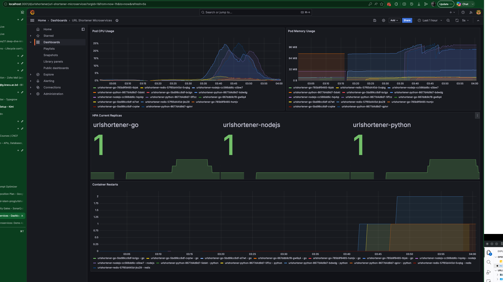
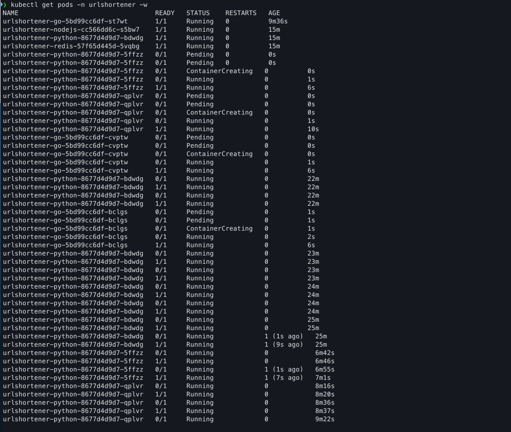
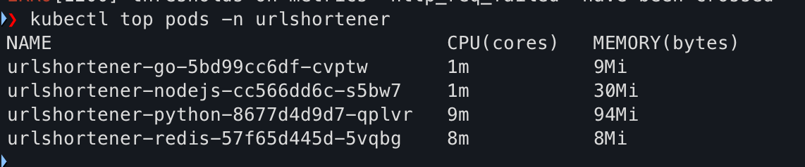
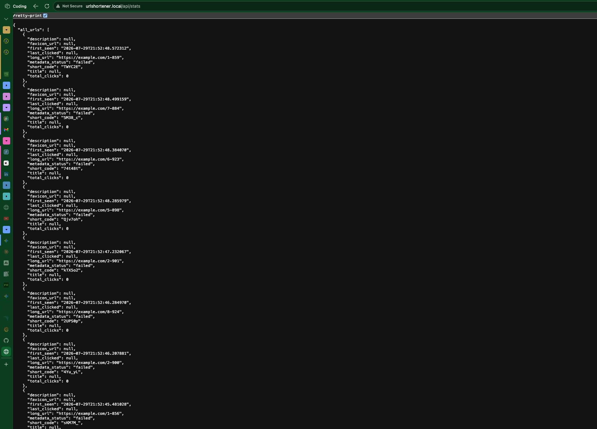
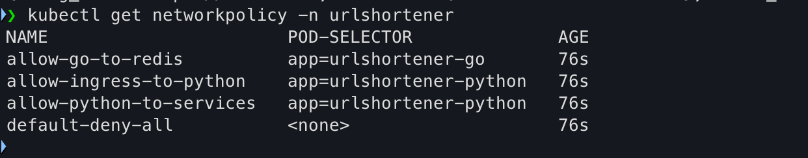

# Capstone Project

## Assignment: Deployment of a Multi-Service URL Shortener Application Using Kubernetes & CI/CD

## Project Overview

Gadgetaloy Tech Solutions is developing a URL Shortener Microservices Platform for its internal analytics team.

The application is available on GitHub: Repository: **[Repo_link](https://github.com/xaadu/urlshortner-microservices)**

The system consists of three independent microservices:

- Python Service
- Go Service
- Node.js Service

The Chief Technology Officer (CTO) requires the system to be deployed in a scalable, production-ready Kubernetes environment, ensuring high availability, scalability, monitoring, and full CI/CD automation.

Each service must:

- Run independently
- Communicate internally within the cluster
- Be containerized properly
- Follow DevOps best practices

## Deployment Requirements

Students must select one Kubernetes platform:

- AWS EKS
- Google GKE
- Azure AKS
- DigitalOcean Kubernetes
- Minikube / K3s (for local testing only) {As I don't have access to cloud k8s i will be using minikube }

Each Microservice Must Include:

- Docker containerization
- Kubernetes Deployment
- Kubernetes Service (ClusterIP or LoadBalancer)
- ConfigMaps
- Secrets
- Horizontal Pod Autoscaler (HPA)

## Traffic Spike Requirement

Gadgetaloy experiences a traffic spike daily at 12:00 PM, when employees actively use the platform.

The system must:

- Automatically scale during peak traffic
- Handle sudden load increases
- Use HPA based on CPU and/or Memory metrics
- Use LoadBalancer or Ingress Controller (NGINX) for external traffic routing

Optional (Bonus):

- Implement Redis caching for improved performance

## CI/CD Requirements

The DevOps team requires full automation using GitHub Actions. Students must create a CI/CD pipeline that:

Pipeline Responsibilities:

- Build Docker images
- Run application tests (if available)
- Push images to Docker Hub
- Perform SonarQube code analysis
- Deploy automatically to Kubernetes using:

  - kubectl or Helm

## SonarQube Requirements

The pipeline must fail if:

- Code smells exceed threshold
- Duplicate code percentage is too high
- Test coverage is below acceptable level

Students may use:

- Local SonarQube (Docker)
- SonarCloud
- Self-hosted SonarQube on Kubernetes (Bonus)

## Monitoring Requirements

To ensure system observability and peak traffic monitoring, students must implement:

- Prometheus (Metrics collection)
- Grafana (Dashboards & visualization)
- HPA metrics integration
- Pod health monitoring
- Resource utilization tracking

## Deliverables

Students must submit the following:

### Architecture Diagram

The diagram must clearly show:

- All microservices
- Kubernetes objects
- Traffic flow
- CI/CD pipeline flow
- Monitoring stack
- External and internal communication

### Deployment Files

Provide:

Dockerfiles for each service

Kubernetes YAML files for:

- Deployment
- Service
- Ingress
- HPA
- ConfigMaps
- Secrets

### CI/CD Configuration

Include:

- .github/workflows/deploy.yml
- SonarQube configuration file
- DockerHub repository link

### Load Testing Report

Use one of the following tools:

- k6 (Using this one as I have installed it and used it in prev assignment)
- JMeter
- Locust

The report must demonstrate:

- Traffic simulation (peak at 12:00 PM scenario)
- Pod auto-scaling behavior
- Response time comparison
- System bottlenecks
- Performance improvements

### Screenshots

Include screenshots of:

- Kubernetes Dashboard / Lens
- HPA scaling in action
- SonarQube analysis report
- Grafana dashboards
- Pod status and metrics

## Evaluation Criteria

Students will be evaluated based on:

- Proper microservices architecture
- Kubernetes best practices
- Auto-scaling implementation
- CI/CD automation quality
- Code quality enforcement via SonarQube
- Monitoring and observability setup
- Load testing evidence
- Documentation quality
- System reliability under traffic spike

## Submission Guidelines

- All source code must be uploaded to GitHub [🐙 GitHub](https://github.com/anisul-islam-prog/urlshortner-ms-devops-capstone)
- Repository must be clean and well-documented
- Include README with deployment instructions [📚 Deployment.md](https://github.com/anisul-islam-prog/urlshortner-ms-devops-capstone/blob/main/DEPLOYMENT.md)
- Provide architecture diagram in PDF or image format
- Ensure all configurations are reproducible

---

## 🚀 DevOps Capstone Execution Plan

**Project:** URL Shortener Microservices on Minikube  
**Standard:** 2026 Industry Best Practices  
**Platform:** Minikube (Local) + GitHub Actions (CI/CD) + Docker + Helm

---

## 1. Infrastructure Architecture Blueprint

### What We Are Building

A **production-hardened, single-node Kubernetes cluster** (Minikube) running four core workloads across isolated namespaces. The architecture follows the **12-Factor App** methodology and implements **GitOps-style continuous deployment** via Helm.

### Architecture Diagram (Textual Representation)

```plain
                ┌─────────────────────────────────────────────────────────────────────────────┐
                │                              EXTERNAL TRAFFIC                               │
                │                         (Simulated via Ingress/NIP)                         │
                └─────────────────────────────────────────────────────────────────────────────┘
                                                     │
                                            ┌────────▼────────┐
                                            │  NGINX Ingress  │
                                            │   Controller    │
                                            │  (LoadBalancer) │
                                            └────────┬────────┘
                                                     │
                                    ┌────────────────┼──────────────────┐
                                    │                │                  │
                            ┌───────▼──────┐  ┌───────▼──────┐  ┌───────▼──────┐
                            │  Python SVC  │  │   Go SVC     │  │  Node.js SVC │
                            │   (Port 80)  │  │  (Port 80)   │  │   (Port 80)  │
                            │  Dashboard   │  │  Redirects   │  │   Metadata   │
                            │   /create    │  │   /{code}    │  │   Enrichment │
                            └───────┬──────┘  └───────┬──────┘  └───────┬──────┘
                                    │                 │                 │
                                    └─────────────────┼─────────────────┘
                                                      │
                                              ┌───────▼────────┐
                                              │  Redis Cluster │
                                              │ Pub/Sub + Cache│
                                              │   (ClusterIP)  │
                                              └────────────────┘

                ┌─────────────────────────────────────────────────────────────────────────────┐
                │                         MONITORING & OBSERVABILITY                          │
                │  ┌──────────────┐    ┌──────────────┐    ┌──────────────┐                   │
                │  │ Prometheus   │◄───│ Metrics      │◄───│  HPA         │                   │
                │  │ (TSDB)       │    │ Server       │    │  Controller  │                   │
                │  └──────┬───────┘    └──────────────┘    └──────────────┘                   │
                │         │                                                                   │
                │  ┌──────▼───────┐                                                           │
                │  │   Grafana    │◄──── ServiceMonitor / PodMonitor                          │
                │  │ (Dashboards) │                                                           │
                │  └──────────────┘                                                           │
                └─────────────────────────────────────────────────────────────────────────────┘

                ┌─────────────────────────────────────────────────────────────────────────────┐
                │                              CI/CD PIPELINE                                 │
                │  GitHub Actions ──► SonarQube ──► Trivy Scan ──► DockerHub ──► Helm Upgrade │
                │       │                                                              │      │
                │       └──────────────────── Self-Hosted Runner ──────────────────────┘      │
                │                     (Runs on Minikube host for kubectl access)              │
                └─────────────────────────────────────────────────────────────────────────────┘
```

### Architecture Diagram (Visual Representation)



### Services Required

| Layer | Service | Purpose | K8s Resource |
|-------|---------|---------|--------------|
| **Ingress** | NGINX Ingress Controller | External traffic routing, TLS termination | Helm Chart (ingress-nginx) |
| **App** | Python Service | Dashboard, Analytics, Orchestration | Deployment + ClusterIP Service + HPA |
| **App** | Go Service | URL Shortening & Redirects | Deployment + ClusterIP Service + HPA |
| **App** | Node.js Service | Metadata Enrichment | Deployment + ClusterIP Service + HPA |
| **Data** | Redis | Pub/Sub messaging & URL lookup cache | Deployment/StatefulSet + ClusterIP Service |
| **Storage** | SQLite (per-pod) | Ephemeral service-local DB | EmptyDir (per pod) |
| **Observability** | Prometheus | Metrics collection | Deployment + PVC + ClusterIP |
| **Observability** | Grafana | Visualization | Deployment + PVC + ClusterIP |
| **Observability** | Metrics Server | HPA CPU/Memory feed | Minikube Addon |
| **CI/CD** | GitHub Actions Runner | Self-hosted for cluster access | Bare-metal/VM on Minikube host |

## 2. 🏆 Best Practice

**Best Practice to Implement: *Zero-Trust Microsegmentation + Shift-Left Security***

### A. Trivy Container Scanning in CI/CD

Integrate [Trivy](https://github.com/aquasecurity/trivy-action) into GitHub Actions. The pipeline will:

- Scan every built image for **CRITICAL** and **HIGH** vulnerabilities.
- **Fail the build** if any CRITICAL CVEs are found.
- Generate a SARIF report uploaded to GitHub Security tab.

### B. Kubernetes NetworkPolicies

After proving the app works, apply `NetworkPolicy` manifests that enforce:

- **Python** can only talk to **Go** (port 8000) and **Node.js** (port 3000).
- **Go** can only publish to **Redis** (port 6379).
- **Node.js** is isolated; only Python can reach it.
- **Redis** accepts traffic only from Python and Go.
- **Deny-all** default policy for the namespace.

> **Why this wins:** It demonstrates that "working" is not enough—**secure**. In 2026, zero-trust networking is table stakes for production.

---

## 3. Phase 0: Environment Setup & Minikube Bootstrap & Local Testing

### 3.1 Prerequisites Installation

```bash
# Install homebrew
/bin/bash -c "$(curl -fsSL https://raw.githubusercontent.com/Homebrew/install/HEAD/install.sh)"
# Add it to your shell
echo 'eval "$(/opt/homebrew/bin/brew shellenv)"' >> ~/.zprofile
eval "$(/opt/homebrew/bin/brew shellenv)"

# Kubernetes toolchain
brew install kubectl
brew install minikube
brew install helm

# Load testing
brew install k6

# GitHub CLI (for setting up self-hosted runner later)
brew install gh

# Security scanner (for the "One-Man Army" Trivy bonus)
brew install aquasecurity/trivy/trivy

# Utilities
brew install jq
brew install git

# SonarScanner CLI (for local SonarQube integration testing)
brew install sonar-scanner

# Install Docker Desktop via Homebrew Cask
brew install --cask docker
```

### 3.2 Start Minikube (Production-Mode Flags)

```bash
# Start with sufficient resources for 3 apps + Redis + Monitoring
minikube start \
  --driver=docker \
  --cpus=3 \
  --memory=8g \
  --disk-size=20g \
  --kubernetes-version=v1.35.1 \
  --addons=metrics-server,ingress,ingress-dns \
  --extra-config=kubelet.housekeeping-interval=10s

# Verify
kubectl get nodes
kubectl top nodes        # Should show CPU/Memory percentages
minikube status
```

### 3.3 Enable Local Ingress Access (macOS Specific)

Unlike Linux, Minikube on macOS cannot bind directly to port 80. Use minikube tunnel in a separate terminal:

```bash
# Terminal 2 — keep this running
minikube tunnel
```

This creates a network route so `http://urlshortener.local` (or any Ingress host) resolves to your cluster via `127.0.0.1`.
Add to `/etc/hosts`:

```bash
sudo sh -c 'echo "127.0.0.1 urlshortener.local" >> /etc/hosts'
```

### 3.4 Local SonarQube (Docker-Based)

Since you have no cloud IAM access, run SonarQube locally via Docker:

```bash
#### Create a dedicated Docker network
docker network create sonarqube-net

# Run SonarQube Community Edition (ARM64 compatible)
docker run -d \
  --name sonarqube \
  --network sonarqube-net \
  -p 9000:9000 \
  -v sonarqube_data:/opt/sonarqube/data \
  -v sonarqube_logs:/opt/sonarqube/logs \
  -v sonarqube_extensions:/opt/sonarqube/extensions \
  -e SONAR_ES_BOOTSTRAP_CHECKS_DISABLE=true \
  sonarqube:10.5-community

# Default login: admin / admin
```

Access at: `http://localhost:9000`

>>Note: First boot takes 1-2 minutes. If it fails on 8GB RAM, increase Docker Desktop memory to 6GB or stop Minikube temporarily while generating the SonarQube report.

### 3.5 Self-Hosted GitHub Actions Runner (macOS ARM64)

Since everything is local, your GitHub Actions pipeline needs a self-hosted runner on this Mac to execute helm upgrade and kubectl commands against your local Minikube.

```bash
# GitHub Settings > Actions > Runners

./# Create a folder
mkdir actions-runner && cd actions-runner

# Download the latest runner package
curl -o actions-runner-osx-x64-2.336.0.tar.gz -L https://github.com/actions/runner/releases/download/v2.336.0/actions-runner-osx-x64-2.336.0.tar.gz

# Optional: Validate the hash
echo "f79c43232761ca495fc18df550bb2865aa99984b37c173c0aa1f8c09d0d548fe  actions-runner-osx-x64-2.336.0.tar.gz" | shasum -a 256 -c

# Extract the installer
tar xzf ./actions-runner-osx-x64-2.336.0.tar.gz

# Configure (replace TOKEN and REPO_URL from GitHub Settings > Actions > Runners)
./config.sh \ 
    --url https://github.com/anisul-islam-prog/urlshortner-ms-devops-capstone --token YOUR_TOKEN \
    --name m2-mac-mini-runner \
    --labels self-hosted,m2,local \
    --work _work

# Run the listener (keep this terminal open, or use launchd to daemonize)
./run.sh

# Using your self-hosted runner
# Use this YAML in your workflow file for each job
runs-on: self-hosted
```

>>Important: The runner process must have access to your local `kubectl` context. Since Minikube stores config in `~/.kube/config`, the runner will inherit this automatically if run under your user.

### 3.6 Project Repository Structure

Organize your forked repo like a production platform team:

```plain
urlshortner-ms-devops-capstone/
├── .github/
│   └── workflows/
│       └── deploy.yml          # CI/CD pipeline
├── helm/
│   └── urlshortener/           # Parent Helm chart
│       ├── Chart.yaml
│       ├── values.yaml
│       └── templates/
│           ├── _helpers.tpl
│           ├── namespace.yaml
│           ├── configmap.yaml
│           ├── secret.yaml
│           ├── redis/
│           │   ├── deployment.yaml
│           │   └── service.yaml
│           ├── go-service/
│           │   ├── deployment.yaml
│           │   ├── service.yaml
│           │   └── hpa.yaml
│           ├── python-service/
│           │   ├── deployment.yaml
│           │   ├── service.yaml
│           │   └── hpa.yaml
│           ├── nodejs-service/
│           │   ├── deployment.yaml
│           │   ├── service.yaml
│           │   └── hpa.yaml
│           ├── ingress.yaml
│           └── networkpolicy.yaml  # BONUS
├── monitoring/
│   ├── prometheus-values.yaml
│   └── grafana-dashboards/
├── k6/
│   └── load-test.js
├── docker/
│   ├── go.Dockerfile
│   ├── python.Dockerfile
│   └── nodejs.Dockerfile
├── sonar-project.properties
└── README.md
```

### 🖥️ 3.5: Local Development (macOS M2)

Run the stack natively first to verify the apps work before containerizing.

#### 1. Start Redis (Local port 6380, per repo convention)

```bash
brew install redis
brew services start redis
# Edit config to use port 6380 if you want to match repo exactly, or just use default 6379
# The repo assumes localhost:6380 for local dev
redis-server --port 6380
```

#### 2. Terminal 1 — Go Service

```bash
cd go-service

# Ensure dependencies are present
go mod tidy

# Run with local Redis
REDIS_HOST=localhost \
REDIS_PORT=6380 \
go run main.go
```

Verify: `curl http://localhost:8000/api/shorten -X POST -H "Content-Type: application/json" -d '{"long_url":"https://github.com"}'`

#### 3. Terminal 2 — Node.js Service

```bash
cd node-service
npm install
PORT=3000 node server.js
```

Verify: `curl http://localhost:3000/health`

#### 4. Terminal 3 — Python Service

```bash
cd python-service

# Create venv (use python3.11 or 3.12 since 3.14 is not generally available)
python3.12 -m venv venv
source venv/bin/activate
pip install -r requirements.txt

# Run with local service URLs
REDIS_HOST=localhost \
REDIS_PORT=6380 \
GO_SERVICE_URL=http://localhost:8000 \
NODEJS_SERVICE_URL=http://localhost:3000 \
python app.py
```

Verify: Open `http://localhost:5000` and create a short URL.

Run:

```bash
docker-compose up --build
```

Test at `http://localhost:5000`. Once this works, proceed to next steps.

---

## 4. Phase 1: Production-Grade Containerization

The existing Dockerfiles likely use root users and lack multi-stage builds. Replace them with these hardened versions.

### 4.1 Go Service Dockerfile (`docker/go.Dockerfile`)

```dockerfile
# ─── Build Stage ───
FROM golang:1.24-alpine AS builder
WORKDIR /build

# Install CGO toolchain for SQLite
RUN apk add --no-cache gcc musl-dev sqlite-dev

COPY go-service/go.mod go-service/go.sum ./
RUN go mod download

COPY go-service/ .
ENV CGO_ENABLED=1
RUN go build -tags "libsqlite3" -o urlshortener main.go

# ─── Runtime Stage ───
FROM alpine:3.19
WORKDIR /app

# SQLite runtime library + CA certs for outbound HTTPS
RUN apk add --no-cache sqlite-libs ca-certificates && \
    addgroup -g 1000 -S appgroup && \
    adduser -u 1000 -S appuser -G appgroup

COPY --from=builder /build/urlshortener .
RUN chown -R appuser:appgroup /app

USER appuser
ENV GIN_MODE=release
EXPOSE 8000

ENTRYPOINT ["./urlshortener"]
```

### 4.2 Python Service Dockerfile (`docker/python.Dockerfile`)

```dockerfile
# ─── Build Stage ───
FROM python:3.12-slim AS builder
WORKDIR /build

RUN apt-get update && apt-get install -y --no-install-recommends gcc && \
    rm -rf /var/lib/apt/lists/*

COPY python-service/requirements.txt .
RUN pip install --no-cache-dir --user -r requirements.txt
RUN pip install --no-cache-dir --user gunicorn

# ─── Runtime Stage ───
FROM python:3.12-slim
WORKDIR /app

# Create user WITH home directory (-m flag)
RUN groupadd -r appgroup && useradd -m -r -g appgroup appuser

COPY --from=builder /root/.local /home/appuser/.local
COPY python-service/ .

RUN chown -R appuser:appgroup /app /home/appuser
USER appuser

ENV PATH=/home/appuser/.local/bin:$PATH
ENV HOME=/home/appuser
ENV PYTHONDONTWRITEBYTECODE=1
ENV PYTHONUNBUFFERED=1
ENV FLASK_APP=app.py
EXPOSE 5000

CMD ["gunicorn", "--bind", "0.0.0.0:5000", "--workers", "2", "--threads", "2", "app:app"]
```

### 4.3 Node.js Service Dockerfile (`docker/nodejs.Dockerfile`)

```dockerfile
# ─── Build Stage ───
FROM node:24.11-alpine AS builder
WORKDIR /build

RUN apk add --no-cache python3 make g++ py3-setuptools sqlite-dev

COPY node-service/package*.json ./
RUN npm ci --only=production && npm cache clean --force

# ─── Runtime Stage ───
FROM node:24.11-alpine
WORKDIR /app

RUN apk add --no-cache sqlite-libs && \
    addgroup -g 1001 -S nodejs && \
    adduser -S nodejs -u 1001

# Copy node_modules from builder (correct ARM64 binary)
COPY --from=builder /build/node_modules ./node_modules

# Copy app files explicitly — avoid wildcards
COPY node-service/ .

RUN chown -R nodejs:nodejs /app
USER nodejs

ENV NODE_ENV=production
ENV PORT=3000
EXPOSE 3000
CMD ["node", "server.js"]
```

### 4.4 Build & Test Locally

```bash
# Point Docker to Minikube's internal registry
eval $(minikube -p minikube docker-env)

# Test
docker build -t urlshortener-go:latest -f docker/go.Dockerfile .
docker build -t urlshortener-python:latest -f docker/python.Dockerfile .
docker build -t urlshortener-nodejs:latest -f docker/nodejs.Dockerfile .

# Verify
minikube ssh -- docker images | grep urlshortener
```

---

## 5. Phase 2: Helm Chart Architecture

Helm allows templating and single-command deployments. We create a **umbrella chart** with subcharts for each service.

### 5.1 `helm/urlshortener/Chart.yaml`

```yaml
apiVersion: v2
name: urlshortener
description: Production-grade URL Shortener Microservices
type: application
version: 1.0.0
appVersion: "1.0.0"
dependencies: []  # Inline templates for simplicity
```

### 5.2 `helm/urlshortener/values.yaml`

```yaml
global:
  namespace: urlshortener
  imagePullPolicy: Never   # ← Critical: uses locally-built images
  imagePullSecrets: []

redis:
  enabled: true
  image: redis:7-alpine
  replicas: 1
  service:
    type: ClusterIP
    port: 6379
  resources:
    requests:
      memory: "64Mi"
      cpu: "50m"
    limits:
      memory: "128Mi"
      cpu: "100m"

goService:
  image:
    repository: urlshortener-go      # ← No DockerHub prefix
    tag: latest
  replicas: 1
  service:
    type: ClusterIP
    port: 8000
  resources:
    requests:
      memory: "64Mi"
      cpu: "50m"
    limits:
      memory: "128Mi"
      cpu: "200m"
  hpa:
    enabled: true
    minReplicas: 1
    maxReplicas: 3
    targetCPUUtilizationPercentage: 50
    targetMemoryUtilizationPercentage: 80

pythonService:
  image:
    repository: urlshortener-python   # ← No DockerHub prefix
    tag: latest
  replicas: 1
  service:
    type: ClusterIP
    port: 5000
  resources:
    requests:
      memory: "128Mi"
      cpu: "100m"
    limits:
      memory: "256Mi"
      cpu: "300m"
  hpa:
    enabled: true
    minReplicas: 1
    maxReplicas: 3
    targetCPUUtilizationPercentage: 60

nodeService:
  image:
    repository: urlshortener-nodejs   # ← No DockerHub prefix
    tag: latest
  replicas: 1
  service:
    type: ClusterIP
    port: 3000
  resources:
    requests:
      memory: "64Mi"
      cpu: "50m"
    limits:
      memory: "128Mi"
      cpu: "100m"
  hpa:
    enabled: true
    minReplicas: 1
    maxReplicas: 2
    targetCPUUtilizationPercentage: 50

ingress:
  enabled: true
  className: nginx
  annotations:
    nginx.ingress.kubernetes.io/rewrite-target: /
  hosts:
    - host: urlshortener.local
      paths:
        - path: /
          pathType: Prefix
          service: python-service
          port: 5000
        - path: /api/shorten
          pathType: Prefix
          service: go-service
          port: 8000
        - path: /r
          pathType: Prefix
          service: go-service
          port: 8000
        - path: /api/metadata
          pathType: Prefix
          service: nodejs-service
          port: 3000
```

### 5.3 `helm/urlshortener/templates/_helpers.tpl`

```yaml
{{/* Expand the name of the chart */}}
{{- define "urlshortener.name" -}}
{{- default .Chart.Name .Values.nameOverride | trunc 63 | trimSuffix "-" }}
{{- end }}

{{/* Create a default fully qualified app name */}}
{{- define "urlshortener.fullname" -}}
{{- if .Values.fullnameOverride }}
{{- .Values.fullnameOverride | trunc 63 | trimSuffix "-" }}
{{- else }}
{{- $name := default .Chart.Name .Values.nameOverride }}
{{- if contains $name .Release.Name }}
{{- .Release.Name | trunc 63 | trimSuffix "-" }}
{{- else }}
{{- printf "%s-%s" .Release.Name $name | trunc 63 | trimSuffix "-" }}
{{- end }}
{{- end }}
{{- end }}

{{/* Chart label */}}
{{- define "urlshortener.chart" -}}
{{- printf "%s-%s" .Chart.Name .Chart.Version | replace "+" "_" | trunc 63 | trimSuffix "-" }}
{{- end }}

{{/* Common labels */}}
{{- define "urlshortener.labels" -}}
helm.sh/chart: {{ include "urlshortener.chart" . }}
{{ include "urlshortener.selectorLabels" . }}
{{- if .Chart.AppVersion }}
app.kubernetes.io/version: {{ .Chart.AppVersion | quote }}
{{- end }}
app.kubernetes.io/managed-by: {{ .Release.Service }}
{{- end }}

{{/* Selector labels */}}
{{- define "urlshortener.selectorLabels" -}}
app.kubernetes.io/name: {{ include "urlshortener.name" . }}
app.kubernetes.io/instance: {{ .Release.Name }}
{{- end }}
```

### 5.4 `helm/urlshortener/templates/configmap.yaml`

```yaml
apiVersion: v1
kind: ConfigMap
metadata:
  name: {{ include "urlshortener.fullname" . }}-config
  namespace: {{ .Values.global.namespace }}
data:
  REDIS_HOST: "{{ include "urlshortener.fullname" . }}-redis"
  REDIS_PORT: "6379"
  GIN_MODE: "release"
  NODE_ENV: "production"
  PYTHONUNBUFFERED: "1"
  BASE_URL: "http://urlshortener.local/r"
```

### 5.5 `helm/urlshortener/templates/secret.yaml`

```yaml
apiVersion: v1
kind: Secret
metadata:
  name: {{ include "urlshortener.fullname" . }}-secrets
  namespace: {{ .Values.global.namespace }}
type: Opaque
stringData:
  DUMMY_SECRET: "capstone-local-only"
```

### 5.6 `helm/urlshortener/templates/ingress.yaml`

```yaml
{{- if .Values.ingress.enabled }}
apiVersion: networking.k8s.io/v1
kind: Ingress
metadata:
  name: {{ include "urlshortener.fullname" . }}
  namespace: {{ .Values.global.namespace }}
  annotations:
    nginx.ingress.kubernetes.io/ssl-redirect: "false"
    # REMOVED: rewrite-target annotation was breaking all paths
spec:
  ingressClassName: {{ .Values.ingress.className }}
  rules:
    - host: urlshortener.local
      http:
        paths:
          - path: /
            pathType: Prefix
            backend:
              service:
                name: {{ include "urlshortener.fullname" . }}-python
                port:
                  number: 5000
          - path: /create
            pathType: Prefix
            backend:
              service:
                name: {{ include "urlshortener.fullname" . }}-python
                port:
                  number: 5000
          - path: /api/stats
            pathType: Prefix
            backend:
              service:
                name: {{ include "urlshortener.fullname" . }}-python
                port:
                  number: 5000
          - path: /api/shorten
            pathType: Prefix
            backend:
              service:
                name: {{ include "urlshortener.fullname" . }}-go
                port:
                  number: 8000
          - path: /r
            pathType: Prefix
            backend:
              service:
                name: {{ include "urlshortener.fullname" . }}-go
                port:
                  number: 8000
          - path: /api/metadata
            pathType: Prefix
            backend:
              service:
                name: {{ include "urlshortener.fullname" . }}-nodejs
                port:
                  number: 3000
{{- end }}
```

### 5.7 Python Deployment (`templates/python-service/deployment.yaml`)

```yaml
apiVersion: apps/v1
kind: Deployment
metadata:
  name: {{ include "urlshortener.fullname" . }}-python
  labels:
    app.kubernetes.io/component: python
    {{- include "urlshortener.labels" . | nindent 4 }}
spec:
  replicas: {{ .Values.pythonService.replicas }}
  selector:
    matchLabels:
      app.kubernetes.io/component: python
      {{- include "urlshortener.selectorLabels" . | nindent 6 }}
  template:
    metadata:
      labels:
        app.kubernetes.io/component: python
        {{- include "urlshortener.selectorLabels" . | nindent 8 }}
    spec:
      containers:
        - name: python
          image: "{{ .Values.pythonService.image.repository }}:{{ .Values.pythonService.image.tag }}"
          imagePullPolicy: {{ .Values.global.imagePullPolicy }}
          ports:
            - containerPort: 5000
              protocol: TCP
          envFrom:
            - configMapRef:
                name: {{ include "urlshortener.fullname" . }}-config
          env:
            - name: GO_SERVICE_URL
              value: "http://{{ include "urlshortener.fullname" . }}-go:8000"
            - name: NODEJS_SERVICE_URL
              value: "http://{{ include "urlshortener.fullname" . }}-nodejs:3000"
          resources:
            {{- toYaml .Values.pythonService.resources | nindent 12 }}
          livenessProbe:
            httpGet:
              path: /api/stats
              port: 5000
            initialDelaySeconds: 30
            periodSeconds: 10
          readinessProbe:
            httpGet:
              path: /api/stats
              port: 5000
            initialDelaySeconds: 5
            periodSeconds: 5
```

### 5.8 HPA Template (`templates/python-service/hpa.yaml`)

```yaml
{{- if .Values.pythonService.hpa.enabled }}
apiVersion: autoscaling/v2
kind: HorizontalPodAutoscaler
metadata:
  name: {{ include "urlshortener.fullname" . }}-python
  namespace: {{ .Values.global.namespace }}
spec:
  scaleTargetRef:
    apiVersion: apps/v1
    kind: Deployment
    name: {{ include "urlshortener.fullname" . }}-python
  minReplicas: {{ .Values.pythonService.hpa.minReplicas }}
  maxReplicas: {{ .Values.pythonService.hpa.maxReplicas }}
  metrics:
    - type: Resource
      resource:
        name: cpu
        target:
          type: Utilization
          averageUtilization: {{ .Values.pythonService.hpa.targetCPUUtilizationPercentage }}
  behavior:
    scaleUp:
      stabilizationWindowSeconds: 30
      policies:
        - type: Percent
          value: 100
          periodSeconds: 15
    scaleDown:
      stabilizationWindowSeconds: 300
      policies:
        - type: Percent
          value: 10
          periodSeconds: 60
{{- end }}
```

### 5.9 HPA Template (`templates/python-service/service.yaml`)

```yaml
apiVersion: v1
kind: Service
metadata:
  name: {{ include "urlshortener.fullname" . }}-go
  labels:
    app.kubernetes.io/component: go
    {{- include "urlshortener.labels" . | nindent 4 }}
spec:
  type: {{ .Values.goService.service.type }}
  ports:
    - port: {{ .Values.goService.service.port }}
      targetPort: 8000
      protocol: TCP
  selector:
    app.kubernetes.io/component: go
    {{- include "urlshortener.selectorLabels" . | nindent 4 }}
```

### 5.10 `helm/urlshortener/templates/go-service/deployment.yaml`

```yaml
apiVersion: apps/v1
kind: Deployment
metadata:
  name: {{ include "urlshortener.fullname" . }}-go
  labels:
    app.kubernetes.io/component: go
    {{- include "urlshortener.labels" . | nindent 4 }}
spec:
  replicas: {{ .Values.goService.replicas }}
  selector:
    matchLabels:
      app.kubernetes.io/component: go
      {{- include "urlshortener.selectorLabels" . | nindent 6 }}
  template:
    metadata:
      labels:
        app.kubernetes.io/component: go
        {{- include "urlshortener.selectorLabels" . | nindent 8 }}
    spec:
      containers:
        - name: go
          image: "{{ .Values.goService.image.repository }}:{{ .Values.goService.image.tag }}"
          imagePullPolicy: {{ .Values.global.imagePullPolicy }}
          ports:
            - containerPort: 8000
              protocol: TCP
          envFrom:
            - configMapRef:
                name: {{ include "urlshortener.fullname" . }}-config
          resources:
            {{- toYaml .Values.goService.resources | nindent 12 }}
          livenessProbe:
            httpGet:
              path: /health
              port: 8000
            initialDelaySeconds: 5
            periodSeconds: 10
          readinessProbe:
            httpGet:
              path: /health
              port: 8000
            initialDelaySeconds: 3
            periodSeconds: 5
```

### 5.11 `helm/urlshortener/templates/go-service/hpa.yaml`

```yaml
{{- if .Values.goService.hpa.enabled }}
apiVersion: autoscaling/v2
kind: HorizontalPodAutoscaler
metadata:
  name: {{ include "urlshortener.fullname" . }}-go
  namespace: {{ .Values.global.namespace }}
spec:
  scaleTargetRef:
    apiVersion: apps/v1
    kind: Deployment
    name: {{ include "urlshortener.fullname" . }}-go
  minReplicas: {{ .Values.goService.hpa.minReplicas }}
  maxReplicas: {{ .Values.goService.hpa.maxReplicas }}
  metrics:
    - type: Resource
      resource:
        name: cpu
        target:
          type: Utilization
          averageUtilization: {{ .Values.goService.hpa.targetCPUUtilizationPercentage }}
    - type: Resource
      resource:
        name: memory
        target:
          type: Utilization
          averageUtilization: {{ .Values.goService.hpa.targetMemoryUtilizationPercentage }}
  behavior:
    scaleUp:
      stabilizationWindowSeconds: 30
      policies:
        - type: Percent
          value: 100
          periodSeconds: 15
    scaleDown:
      stabilizationWindowSeconds: 300
      policies:
        - type: Percent
          value: 10
          periodSeconds: 60
{{- end }}
```

### 5.12 `helm/urlshortener/templates/go-service/service.yaml`

```yaml
apiVersion: v1
kind: Service
metadata:
  name: {{ include "urlshortener.fullname" . }}-go
  labels:
    app.kubernetes.io/component: go
    {{- include "urlshortener.labels" . | nindent 4 }}
spec:
  type: {{ .Values.goService.service.type }}
  ports:
    - port: {{ .Values.goService.service.port }}
      targetPort: 8000
      protocol: TCP
  selector:
    app.kubernetes.io/component: go
    {{- include "urlshortener.selectorLabels" . | nindent 4 }}
```

### 5.13 `helm/urlshortener/templates/node-service/deployment.yaml`

```yaml
apiVersion: apps/v1
kind: Deployment
metadata:
  name: {{ include "urlshortener.fullname" . }}-nodejs
  labels:
    app.kubernetes.io/component: nodejs
    {{- include "urlshortener.labels" . | nindent 4 }}
spec:
  replicas: {{ .Values.nodeService.replicas }}
  selector:
    matchLabels:
      app.kubernetes.io/component: nodejs
      {{- include "urlshortener.selectorLabels" . | nindent 6 }}
  template:
    metadata:
      labels:
        app.kubernetes.io/component: nodejs
        {{- include "urlshortener.selectorLabels" . | nindent 8 }}
    spec:
      containers:
        - name: nodejs
          image: "{{ .Values.nodeService.image.repository }}:{{ .Values.nodeService.image.tag }}"
          imagePullPolicy: {{ .Values.global.imagePullPolicy }}
          ports:
            - containerPort: 3000
              protocol: TCP
          envFrom:
            - configMapRef:
                name: {{ include "urlshortener.fullname" . }}-config
          resources:
            {{- toYaml .Values.nodeService.resources | nindent 12 }}
          livenessProbe:
            httpGet:
              path: /health
              port: 3000
            initialDelaySeconds: 10
            periodSeconds: 10
          readinessProbe:
            httpGet:
              path: /health
              port: 3000
            initialDelaySeconds: 5
            periodSeconds: 5
```

### 5.14 `helm/urlshortener/templates/node-service/hpa.yaml`

```yaml
{{- if .Values.nodeService.hpa.enabled }}
apiVersion: autoscaling/v2
kind: HorizontalPodAutoscaler
metadata:
  name: {{ include "urlshortener.fullname" . }}-nodejs
  namespace: {{ .Values.global.namespace }}
spec:
  scaleTargetRef:
    apiVersion: apps/v1
    kind: Deployment
    name: {{ include "urlshortener.fullname" . }}-nodejs
  minReplicas: {{ .Values.nodeService.hpa.minReplicas }}
  maxReplicas: {{ .Values.nodeService.hpa.maxReplicas }}
  metrics:
    - type: Resource
      resource:
        name: cpu
        target:
          type: Utilization
          averageUtilization: {{ .Values.nodeService.hpa.targetCPUUtilizationPercentage }}
  behavior:
    scaleUp:
      stabilizationWindowSeconds: 30
      policies:
        - type: Percent
          value: 100
          periodSeconds: 15
    scaleDown:
      stabilizationWindowSeconds: 300
      policies:
        - type: Percent
          value: 10
          periodSeconds: 60
{{- end }}
```

### 5.15 `helm/urlshortener/templates/node-service/service.yaml`

```yaml
apiVersion: v1
kind: Service
metadata:
  name: {{ include "urlshortener.fullname" . }}-nodejs
  labels:
    app.kubernetes.io/component: nodejs
    {{- include "urlshortener.labels" . | nindent 4 }}
spec:
  type: {{ .Values.nodeService.service.type }}
  ports:
    - port: {{ .Values.nodeService.service.port }}
      targetPort: 3000
      protocol: TCP
  selector:
    app.kubernetes.io/component: nodejs
    {{- include "urlshortener.selectorLabels" . | nindent 4 }}
```

### 5.16 `helm/urlshortener/templates/redis/deployment.yaml`

```yaml
apiVersion: apps/v1
kind: Deployment
metadata:
  name: {{ include "urlshortener.fullname" . }}-redis
  labels:
    app.kubernetes.io/component: redis
    {{- include "urlshortener.labels" . | nindent 4 }}
spec:
  replicas: {{ .Values.redis.replicas }}
  selector:
    matchLabels:
      app.kubernetes.io/component: redis
      {{- include "urlshortener.selectorLabels" . | nindent 6 }}
  template:
    metadata:
      labels:
        app.kubernetes.io/component: redis
        {{- include "urlshortener.selectorLabels" . | nindent 8 }}
    spec:
      containers:
        - name: redis
          image: "{{ .Values.redis.image }}"
          imagePullPolicy: IfNotPresent
          ports:
            - containerPort: 6379
          resources:
            {{- toYaml .Values.redis.resources | nindent 12 }}
          volumeMounts:
            - name: redis-data
              mountPath: /data
      volumes:
        - name: redis-data
          emptyDir: {}
```

### 5.17 `helm/urlshortener/templates/redis/service.yaml`

```yaml
apiVersion: v1
kind: Service
metadata:
  name: {{ include "urlshortener.fullname" . }}-redis
  labels:
    app.kubernetes.io/component: redis
    {{- include "urlshortener.labels" . | nindent 4 }}
spec:
  type: {{ .Values.redis.service.type }}
  ports:
    - port: {{ .Values.redis.service.port }}
      targetPort: 6379
      protocol: TCP
  selector:
    app.kubernetes.io/component: redis
    {{- include "urlshortener.selectorLabels" . | nindent 4 }}
```

### 5.10 `helm/urlshortener/templates/go-service/service.yaml`

```yaml
apiVersion: v1
kind: Service
metadata:
  name: {{ include "urlshortener.fullname" . }}-go
  labels:
    app.kubernetes.io/component: go
    {{- include "urlshortener.labels" . | nindent 4 }}
spec:
  type: {{ .Values.goService.service.type }}
  ports:
    - port: {{ .Values.goService.service.port }}
      targetPort: 8000
      protocol: TCP
  selector:
    app.kubernetes.io/component: go
    {{- include "urlshortener.selectorLabels" . | nindent 4 }}
```

### 5.16 Deploy to Minikube

```bash
# 1. Point Docker to Minikube
eval $(minikube -p minikube docker-env)
# Build with a unique tag
TAG=$(git rev-parse --short HEAD)

# 2. Build images directly into Minikube
docker build --no-cache -t urlshortener-go:$TAG -f docker/go.Dockerfile .
docker build --no-cache -t urlshortener-python:$TAG -f docker/python.Dockerfile .
docker build --no-cache -t urlshortener-nodejs:$TAG -f docker/nodejs.Dockerfile .

# 3. Verify they're in Minikube (not your local Docker Desktop)
minikube ssh -- docker images | grep urlshortener

# 4. Deploy with the new tag
helm upgrade --install urlshortener ./helm/urlshortener \
  --namespace urlshortener \
  --set global.imagePullPolicy=Never \
  --set goService.image.tag=$TAG \
  --set pythonService.image.tag=$TAG \
  --set nodeService.image.tag=$TAG

# 5. Verify
kubectl get pods -n urlshortener
kubectl get svc -n urlshortener
kubectl get hpa -n urlshortener
```

## 6. Phase 3: GitHub Actions CI/CD (Self-Hosted, Local-Only)

### 6.1 `.github/workflows/deploy.yml`

```yaml
name: Local CI/CD - Build, Scan, Analyze, Deploy

on:
  push:
    branches: [main, master]
  pull_request:
    branches: [main, master]

jobs:
  build-scan-deploy:
    runs-on: [self-hosted, m2, local]
    
    steps:
      - name: Checkout Code
        uses: actions/checkout@v4
        with:
          fetch-depth: 0

      - name: Verify Toolchain
        run: |
          minikube status
          kubectl cluster-info
          docker --version
          helm version

      - name: Build Images into Minikube
        run: |
          eval $(minikube docker-env)
          docker build -t urlshortener-go:latest ./go-service
          docker build -t urlshortener-python:latest ./python-service
          docker build -t urlshortener-nodejs:latest ./node-service

      - name: Trivy Vulnerability Scan
        run: |
          trivy image --severity HIGH,CRITICAL --exit-code 1 \
            --format table urlshortener-go:latest
          trivy image --severity HIGH,CRITICAL --exit-code 1 \
            --format table urlshortener-python:latest
          trivy image --severity HIGH,CRITICAL --exit-code 1 \
            --format table urlshortener-nodejs:latest

      - name: SonarQube Scan
        env:
          SONAR_TOKEN: ${{ secrets.SONAR_TOKEN }}
        run: |
          sonar-scanner \
            -Dsonar.projectKey=urlshortener-capstone \
            -Dsonar.projectName="URL Shortener Capstone" \
            -Dsonar.sources=go-service,python-service,node-service \
            -Dsonar.exclusions=**/node_modules/**,**/venv/**,**/*.db,**/templates/** \
            -Dsonar.host.url=http://localhost:9000 \
            -Dsonar.login=$SONAR_TOKEN \
            -Dsonar.qualitygate.wait=true

      - name: Check SonarQube Quality Gate
        if: always()
        env:
          SONAR_TOKEN: ${{ secrets.SONAR_TOKEN }}
        run: |
          sleep 15
          PROJECT_KEY="urlshortener-capstone"
          QG_STATUS=$(curl -s -u "$SONAR_TOKEN:" \
            "http://localhost:9000/api/qualitygates/project_status?projectKey=$PROJECT_KEY" \
            | jq -r '.projectStatus.status')
          echo "Quality Gate Status: $QG_STATUS"
          if [ "$QG_STATUS" != "OK" ]; then
            echo "::error::SonarQube Quality Gate failed!"
            exit 1
          fi

      - name: Deploy to Minikube via Helm
        run: |
          helm upgrade --install urlshortener ./helm/urlshortener \
            --namespace urlshortener \
            --create-namespace \
            --set global.imagePullPolicy=Never \
            --wait --timeout 5m

      - name: Verify Deployment
        run: |
          echo "=== Pods ==="
          kubectl get pods -n urlshortener
          echo "=== Services ==="
          kubectl get svc -n urlshortener
          echo "=== HPA ==="
          kubectl get hpa -n urlshortener
          echo "=== Ingress ==="
          kubectl get ingress -n urlshortener

      - name: Wait for Rollout
        run: |
          kubectl rollout status deployment/urlshortener-go -n urlshortener --timeout=120s
          kubectl rollout status deployment/urlshortener-python -n urlshortener --timeout=120s
          kubectl rollout status deployment/urlshortener-nodejs -n urlshortener --timeout=120s
```

### 6.2 Required GitHub Secrets (Local-Only)

| Secret | How to Get It |
| -------- | --------------- |
| `SONAR_TOKEN` | SonarQube UI → Administration → Security → Users → Your User → Tokens → Generate |

---

## 7. Phase 4: SonarQube Configuration (Local Docker)

You already have SonarQube running. The pipeline just needs to talk to it.

### 7.1 Create Project in SonarQube

1. Open `http://localhost:9000`
2. Login: `admin` / `admin` (change password if first time)
3. **Projects → Create Project → Manual**
   - Project Key: `urlshortener-capstone`
   - Display Name: `URL Shortener Capstone`
4. **Set Up → Locally → Generate Token** → Copy the token
5. Add that token to GitHub Secrets as `SONAR_TOKEN`

### 7.2 Configure Quality Gate (Assignment Requirement)

1. **Quality Gates → Create**
   - Name: `Capstone-Gate`
   - Add Conditions:
     - Coverage < 60% → FAIL
     - Duplicated Lines (%) > 5% → FAIL
     - Code Smells > 50 → FAIL
     - Critical Issues > 0 → FAIL
2. **Set as Default** or assign to `urlshortener-capstone` project

### 7.3 `sonar-project.properties` (Optional Fallback)

If you prefer file-based config over CLI flags:

```properties
sonar.projectKey=urlshortener-capstone
sonar.projectName=URL Shortener Capstone
sonar.host.url=http://localhost:9000
sonar.sources=go-service,python-service,node-service
sonar.exclusions=**/node_modules/**,**/venv/**,**/*.db,**/templates/**
sonar.qualitygate.wait=true
```

> **Note:** `sonar.qualitygate.wait=true` requires the SonarQube server to reach the scanner. For local runs on the same machine, this works fine.
---

## 9. Phase 6: Monitoring Stack (Prometheus + Grafana)

Deploy into `monitoring` namespace:

```bash
helm repo add prometheus-community https://prometheus-community.github.io/helm-charts
helm repo update

helm upgrade --install kube-prometheus-stack prometheus-community/kube-prometheus-stack \
  --namespace monitoring \
  --create-namespace \
  --set prometheus.prometheusSpec.retention=2d \
  --set grafana.enabled=true \
  --set grafana.service.type=ClusterIP
```

Access Grafana:

```bash
kubectl port-forward svc/kube-prometheus-stack-grafana 3001:80 -n monitoring
# Get admin user password
kubectl --namespace monitoring get secrets kube-prometheus-stack-grafana -o jsonpath="{.data.admin-password}" | base64 -d ; echo
# http://localhost:3001 | admin / prom-operator
```

---

## 10. Phase 7: Ingress (macOS)

Ensure `minikube tunnel` is running in a separate terminal, then:

```bash
kubectl get ingress -n urlshortener
# Should show urlshortener.local
```

Test:

```bash
curl http://urlshortener.local/api/stats
```

---

## 11. Phase 8: HPA Verification

```bash
# Watch HPA metrics populate (takes 30-60s after pods are Ready)
kubectl get hpa -n urlshortener -w

# Verify metrics-server is feeding data
kubectl top pods -n urlshortener
```

If `kubectl top pods` works, HPA will scale.

---

## 12. Phase 9: NetworkPolicy Bonus

Apply after your app is healthy:

```yaml
# helm/urlshortener/templates/networkpolicy.yaml
apiVersion: networking.k8s.io/v1
kind: NetworkPolicy
metadata:
  name: default-deny-all
  namespace: {{ .Values.global.namespace }}
spec:
  podSelector: {}
  policyTypes:
    - Ingress
---
apiVersion: networking.k8s.io/v1
kind: NetworkPolicy
metadata:
  name: allow-ingress-to-python
  namespace: {{ .Values.global.namespace }}
spec:
  podSelector:
    matchLabels:
      app.kubernetes.io/component: python
  policyTypes:
    - Ingress
  ingress:
    - from:
        - namespaceSelector: {}
      ports:
        - protocol: TCP
          port: 5000
---
apiVersion: networking.k8s.io/v1
kind: NetworkPolicy
metadata:
  name: allow-python-to-services
  namespace: {{ .Values.global.namespace }}
spec:
  podSelector:
    matchLabels:
      app.kubernetes.io/component: python
  policyTypes:
    - Egress
  egress:
    - to:
        - podSelector:
            matchLabels:
              app.kubernetes.io/component: go
      ports:
        - protocol: TCP
          port: 8000
    - to:
        - podSelector:
            matchLabels:
              app.kubernetes.io/component: nodejs
      ports:
        - protocol: TCP
          port: 3000
    - to:
        - podSelector:
            matchLabels:
              app.kubernetes.io/component: redis
      ports:
        - protocol: TCP
          port: 6379
---
apiVersion: networking.k8s.io/v1
kind: NetworkPolicy
metadata:
  name: allow-go-to-redis
  namespace: {{ .Values.global.namespace }}
spec:
  podSelector:
    matchLabels:
      app.kubernetes.io/component: go
  policyTypes:
    - Egress
  egress:
    - to:
        - podSelector:
            matchLabels:
              app.kubernetes.io/component: redis
      ports:
        - protocol: TCP
          port: 6379
```

## `allow-python-to-services` NetworkPolicy

**Purpose:** Restricts the Python service's outbound traffic so it can only communicate with the specific microservices it needs to orchestrate.

**What it does:**

- **Applies to:** Pods labeled `app: urlshortener-python`
- **Policy type:** Egress (outbound traffic)
- **Allowed destinations:**
  1. **Go service** (`app: urlshortener-go`) on port `8000` — for URL shortening API calls
  2. **Node.js service** (`app: urlshortener-nodejs`) on port `3000` — for metadata enrichment
  3. **Redis** (`app: urlshortener-redis`) on port `6379` — for Pub/Sub click events

**Security principle demonstrated:**
This implements **Zero-Trust microsegmentation**. Even if the Python pod is compromised, it cannot:

- Access the internet
- Scan other namespaces
- Talk to any pod except Go, Node.js, and Redis on their specific ports

**Verification command:**

```bash
kubectl describe networkpolicy allow-python-to-services -n urlshortener
```

**Expected output:**

```text
Namespace:    urlshortener
Created on:   2026-07-30 04:16:02 +0600 +06
Labels:       <none>
Annotations:  <none>
Spec:
  PodSelector:     app=urlshortener-python
  Not affecting ingress traffic
  Allowing egress traffic:
    To Port: 8000/TCP
    To:
      PodSelector: app=urlshortener-go
    ----------
    To Port: 3000/TCP
    To:
      PodSelector: app=urlshortener-nodejs
    ----------
    To Port: 6379/TCP
    To:
      PodSelector: app=urlshortener-redis
  Policy Types: Egress
```

---

## 13. Phase 10: k6 Load Testing — 12:00 PM Traffic Spike Simulation

Create `k6/load-test.js` in your repo:

```javascript
import http from 'k6/http';
import { check, sleep } from 'k6';

export const options = {
  stages: [
    { duration: '2m', target: 10 },   // Baseline
    { duration: '3m', target: 30 },   // Pre-spike ramp
    { duration: '5m', target: 50 },   // Peak (M2-safe)
    { duration: '5m', target: 50 },   // Sustained peak
    { duration: '3m', target: 10 },   // Cooldown
    { duration: '2m', target: 5 },    // Back to baseline
  ],
  thresholds: {
    http_req_duration: ['p(95)<3000'],
    http_req_failed: ['rate<0.3'],
  },
};

const BASE = 'http://urlshortener.local';

export default function () {
  // 1. Python: Read stats (lightweight, read-only)
  const stats = http.get(`${BASE}/api/stats`, { tags: { name: 'stats' } });
  check(stats, { 'stats_200': (r) => r.status === 200 });

  // 2. Python: Create URL via form POST
  // This internally orchestrates Python → Go + Node.js + SQLite writes
  const createRes = http.post(`${BASE}/create`, {
    long_url: `https://example.com/${__VU}-${__ITER}`,
  }, {
    headers: { 'Content-Type': 'application/x-www-form-urlencoded' },
    tags: { name: 'create' },
  });
  check(createRes, { 'create_200': (r) => r.status === 200 });

  // 3. Go: Test redirect endpoint with GET
  // redirects: 0 means we don't follow to external site (facebook/google etc)
  // We accept 301/302 (successful redirect) or 404 (short code doesn't exist — still proves Go is reachable)
  const redirectRes = http.get(`${BASE}/r/test123`, { redirects: 0, tags: { name: 'redirect' } });
  check(redirectRes, {
    'redirect_30x_or_404': (r) => r.status === 301 || r.status === 302 || r.status === 404,
  });

  sleep(1);
}
```

### Run the Load Test

```bash
# Terminal 1: Watch HPA in real-time
kubectl get hpa -n urlshortener -w

# Terminal 2: Watch pods scale
kubectl get pods -n urlshortener -w

# Terminal 3: Run k6
k6 run --out json=k6-results.json k6/load-test.js
```

---

## 14. Phase 11: Load Testing Report [Link](https://github.com/anisul-islam-prog/urlshortner-ms-devops-capstone/blob/main/k6/LOAD_TEST_REPORT.md)

---

## 15. Phase 12: Screenshot Checklist for Submission

You need visual evidence. Capture these:

| # | Screenshot | Screenshot |
| --- | ----------- | ---------------------- |
| 1 | **Kubernetes Dashboard / Lens** | |
| 2 | **HPA Scaling in Action** | |
| 3 | **SonarQube Analysis** | `http://localhost:9000` → Projects → urlshortener-capstone → Screenshot Quality Gate (Green PASS) |
| 4 | **Grafana Dashboard** | |
| 5 | **Pod Status & Metrics** |   |
| 6 | **Ingress Working** | |
| 7 | **NetworkPolicy Applied** |  |
| 8 | **GitHub Actions Pipeline** | Repo → Actions tab → Screenshot successful workflow run |

---

## ✅ Final Checklist Before Submission

- [x] All pods `1/1 Running` in `urlshortener` namespace
- [x] `curl http://urlshortener.local/api/stats` returns JSON
- [x] HPA shows metrics (not `<unknown>`)
- [x] k6 test completed with report
- [x] Grafana dashboard shows pod metrics
- [ ] SonarQube Quality Gate is **PASSED** (green)
- [ ] GitHub Actions workflow shows green checkmark
- [x] NetworkPolicy exists in namespace
- [x] [DEPLOYMENT.md](https://github.com/anisul-islam-prog/urlshortner-ms-devops-capstone/blob/main/DEPLOYMENT.md) is complete
- [x] Architecture diagram exported as PDF/PNG
- [x] All code pushed to `https://github.com/anisul-islam-prog/urlshortner-ms-devops-capstone`
